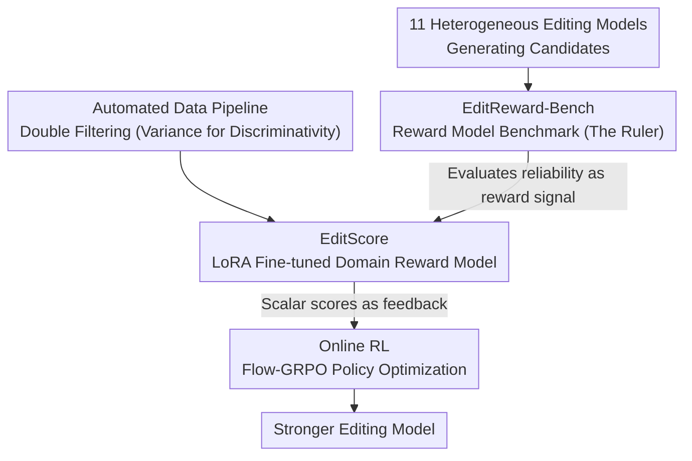

# EditScore: Unlocking Online RL for Image Editing via High-Fidelity Reward Modeling

**Conference**: ICLR 2026  
**arXiv**: [2509.23909](https://arxiv.org/abs/2509.23909)  
**Code**: [GitHub](https://github.com/VectorSpaceLab/EditScore)  
**Area**: Diffusion Models / Image Editing  
**Keywords**: reward model, Reinforcement Learning, image editing, Online RL, Flow-GRPO

## TL;DR
The authors propose the first systematic "benchmark evaluation → reward model → reinforcement learning training" pipeline for image editing: constructing the EditReward-Bench benchmark, training the EditScore series of reward models (7B-72B, outperforming GPT-5), and successfully applying it to Online RL training to significantly enhance the performance of image editing models.

## Background & Motivation
**Background**: Reinforcement Learning (RL) has demonstrated immense value in LLM and T2I domains (e.g., FlowGRPO), yet its application in image editing remains virtually unexplored. Theoretically, RL allows for the discovery of editing strategies that transcend static datasets through a trial-and-error feedback process.

**Limitations of Prior Work**: The core bottleneck for Online RL is the lack of high-fidelity, efficient, and scalable reward signals. Large VLMs like GPT-5 are too costly for large-scale queries, while open-source VLMs (even Qwen2.5-VL-72B) are insufficiently accurate to serve as reward signals, leading to training instability or policy collapse.

**Key Challenge**: Parameter scale cannot substitute for domain-aligned accuracy. General VLMs perform poorly when evaluating fine-grained editing quality (consistency judgments are sometimes worse than random), particularly in the Consistency dimension.

**Goal**: Construct a high-fidelity, domain-specific reward model to unlock online RL for image editing.

**Key Insight**: A full-stack system approach—benchmark-driven reward model development, and reward model-driven RL training.

**Core Idea**: High-fidelity, domain-specific reward models are the key to unlocking online RL for image editing.

## Method

### Overall Architecture
The system addresses a critical blockage: online RL for image editing is stalled by the lack of reliable reward signals—GPT-5 is too expensive, and open-source VLMs are inaccurate. The authors' breakthrough strategy involves first solidifying the reward model itself before using it to train the editing policy. The pipeline follows a sequence of "creating the ruler → building data → training the reward model → feeding RL." EditReward-Bench serves as the ruler to measure reward model quality; an automated data pipeline uses "variance-for-discriminativity" filtering to extract training samples; the EditScore series is fine-tuned to produce domain-specific reward models verified to be both accurate and fast; finally, the Online RL pipeline uses EditScore’s scalar scores as feedback for Flow-GRPO to optimize the editing model. A consistent judgment throughout the work is that general large VLMs cannot provide reliable rewards; a domain-aligned reward model is necessary for online RL to succeed.

### Key Designs

**1. EditReward-Bench: Establishing a ruler for reward models**

The fundamental reason online RL fails is the uncertainty regarding which VLM serves as a reliable reward signal. Thus, the first step is not training but building a benchmark focused on evaluating reward models. It encompasses 13 tasks across four categories: Subject, Appearance, Scene, and Advanced. Eleven heterogeneous editing models, including GPT-4o-Image and Gemini-2.5, generate candidates to create a quality gradient. Evaluation is decomposed into three orthogonal dimensions: Prompt Following, Consistency, and Overall Quality, with scoring via pairwise accuracy across 3,072 preference pairs (PF 944, C 890, O 1238). Instead of independent labeling, two AI experts engaged in real-time discussion to align on disputed cases, pushing the agreement rate above 97%. In the difficult Consistency dimension, this discussion-based annotation improved consistency by 12.12%, addressing the weakest link for general VLMs.

**2. Data Construction: Trading variance for discriminativity via double filtering**

For a reward model to be accurate, its training data must clearly differentiate quality. The data pipeline is automated: Qwen2.5-VL-72B generates instructions with K-center greedy sampling for diversity; five editing models generate candidates; and GPT-4.1 provides SC/PQ scores and reasoning. Raw samples are not used directly; dual-dimension filtering is applied—maximum score filtering removes "unachievable" edits where no candidate succeeds, and standard deviation filtering removes low-information samples where all candidates are similar. This results in 70K samples for reward modeling and 60K for RL. A counter-intuitive choice was retaining high-variance data: GPT-4.1 annotations had higher variance (3.309) than GPT-5 (2.942); the more dispersed scores provided stronger contrast signals for policy learning, leading to better RL results.

**3. EditScore: Modeling rewards as fine-tunable, self-ensembled generation tasks**

With the ruler and data established, the authors used LoRA to fine-tune Qwen2.5-VL into the EditScore series (7B to 72B). Scoring is reframed as conditional text generation: given an instruction, original image, and result, the model outputs reasoning and a scalar score. Scoring follows the VIEScore approach, splitting into semantic consistency $S_{SC}$ and perceptual quality $S_{PQ}$, synthesized via the geometric mean $S_{final}=\sqrt{S_{SC}\cdot S_{PQ}}$. This ensures that a failure in either dimension drags down the final score. Crucially, an inference-time self-ensemble strategy is employed: $K$ stochastic forward passes are performed for each sample, and the scores are averaged $S_{final}(\mathbf{z})=\frac{1}{K}\sum_{i=1}^{K}s_i$. This treats $K$ reasoning paths as different perspectives to reduce noise. Experiments show that "scaling the number of reasoning paths" is more cost-effective than "scaling parameters"—EditScore-7B with $K=4$ outperforms a single pass of EditScore-32B, and with shared KV-cache prefilling, latency grows sub-linearly.

### Loss & Training
Reward models are fine-tuned using a standard autoregressive objective with LoRA, with the score range expanded to $[0,25]$ (found empirically to be superior to $[0,10]$ or $[0,30]$). A reasoning-before-scoring format is used, which improves accuracy by 0.038 compared to direct scoring. Flow-GRPO is used for RL, with sampling steps $T=20$, group size $G=12$, noise level $\sigma=0.9$, and KL weight $\beta=0.04$, using EditScore's scalar scores to drive policy updates based on relative advantage.

## Key Experimental Results

### Reward Model Evaluation (EditReward-Bench Overall Accuracy)

| Model | PF | C | O |
|------|-----|-----|-----|
| GPT-4.1 | 0.673 | 0.602 | 0.705 |
| GPT-5 | 0.777 | 0.669 | 0.755 |
| Qwen2.5-VL-72B | 0.540 | 0.435 | 0.621 |
| EditScore-7B (Avg@4) | 0.722 | 0.720 | 0.727 |
| EditScore-72B (Avg@4) | **0.755** | **0.735** | **0.763** |

*EditScore-7B outperforms the 10x larger Qwen2.5-VL-72B; EditScore-72B (Avg@4) surpasses GPT-5.*

### RL Training Results (OmniGen2 Base)

| Reward Signal | GEdit SC | GEdit PQ | GEdit O | ImgEdit O |
|----------|---------|---------|---------|-----------|
| No RL | 6.72 | 7.20 | 6.28 | 3.40 |
| Qwen2.5-VL-72B | 6.89 | 7.21 | 6.42 | 3.60 |
| GPT-4.1 | 7.24 | 7.41 | 6.73 | 3.66 |
| **EditScore-7B (Avg@4)** | **7.20** | **7.46** | **6.68** | **3.63** |

*EditScore-7B matches the performance of GPT-4.1 as a reward signal, while Qwen2.5-VL-72B fails to provide effective guidance.*

### Key Findings
- General open-source VLMs, even at 72B parameters, are ineffective reward signals for stable training. Parameter scale $\neq$ domain accuracy.
- Inference-time self-ensembling is more efficient than parameter scaling: EditScore-7B (K=4) > EditScore-32B (K=1), with sub-linear latency growth.
- A score range of [0,25] is optimal; reasoning combined with scoring improves accuracy by 0.038.
- Reward models trained on GPT-4.1 annotations outperform those trained on GPT-5 in RL tasks because GPT-4.1 data exhibits higher variance (3.309 vs 2.942), providing stronger discriminativity for policy learning.
- TempFlow-GRPO (time-aware loss weights) combined with EditScore further improves Overall performance to 7.21.

## Highlights & Insights
- **Full-stack Contribution**: Provides a complete pipeline from benchmark to reward model and RL training, filling a significant void in the field.
- **Counter-intuitive Insight**: Higher annotation variance in reward modeling leads to better RL outcomes, identifying a new dimension in reward model design.
- **Efficient Inference Scaling**: Utilizing shared KV-cache prefilling ensures that self-ensemble latency remains sub-linear.
- **Cross-model/Algorithm Generalization**: EditScore is effective across models (OmniGen2, FLUX-Kontext-dev) and algorithms (Flow-GRPO, TempFlow-GRPO).
- **Dual-expert Discussion**: Significantly enhances annotation consistency, raising the agreement rate in the Consistency dimension by 12.12%.

## Limitations & Future Work
- Data construction depends on GPT-4.1 annotations, which are costly and potentially biased.
- EditScore is fine-tuned on Qwen2.5-VL; periodic updates are required as base VLMs evolve (Qwen3-VL-8B has already shown improvements).
- Tasks requiring OCR (e.g., Text Change) might not be fully evaluated.
- Computational overhead for RL training (multiple samplings and reward evaluations) limits deployment scale.
- Only Flow-GRPO and its variants were tested; other algorithms like PPO/DPO remain unexplored.

## Related Work & Insights
- **FlowGRPO / DanceGRPO**: Successful RL cases in T2I; EditScore extends this to image editing.
- **VIEScore**: An editing evaluation framework; EditScore builds on it with reasoning and optimized score ranges.
- **Adjoint Matching**: A model training method via reward alignment; EditScore focuses on inference-time reward modeling.
- **Insight**: In RL applications, **domain-specific reward models** are more valuable than general-purpose large models—a finding that likely applies to other visual generation tasks.

## Rating
- **Novelty**: ⭐⭐⭐⭐ — First full-stack pipeline, though components follow standard designs.
- **Experimental Thoroughness**: ⭐⭐⭐⭐⭐ — Rigorous benchmark, detailed ablations, and cross-model/algorithm validation.
- **Writing Quality**: ⭐⭐⭐⭐ — Clearly structured, though complex with many tables.
- **Value**: ⭐⭐⭐⭐⭐ — Sets the stage for RL training in image editing; open-sources code, models, and data.

<!-- RELATED:START -->

## Related Papers

- [\[ICML 2026\] SpatialReward: Bridging the Perception Gap in Online RL for Image Editing via Explicit Spatial Reasoning](../../ICML2026/image_generation/spatialreward_bridging_the_perception_gap_in_online_rl_for_image_editing_via_exp.md)
- [\[ICLR 2026\] EditReward: A Human-Aligned Reward Model for Instruction-Guided Image Editing](editreward_a_human-aligned_reward_model_for_instruction-guided_image_editing.md)
- [\[CVPR 2026\] UniGen-1.5: Enhancing Image Generation and Editing through Reward Unification in RL](../../CVPR2026/image_generation/unigen-15_enhancing_image_generation_and_editing_through_reward_unification_in_r.md)
- [\[ICLR 2026\] Visual Autoregressive Modeling for Instruction-Guided Image Editing](visual_autoregressive_modeling_for_instruction-guided_image_editing.md)
- [\[CVPR 2025\] Trust Your Critic: Robust Reward Modeling and Reinforcement Learning for Faithful Image Editing and Generation](../../CVPR2025/image_generation/trust_your_critic_robust_reward_modeling_and_reinforcement_learning_for_faithful.md)

<!-- RELATED:END -->
