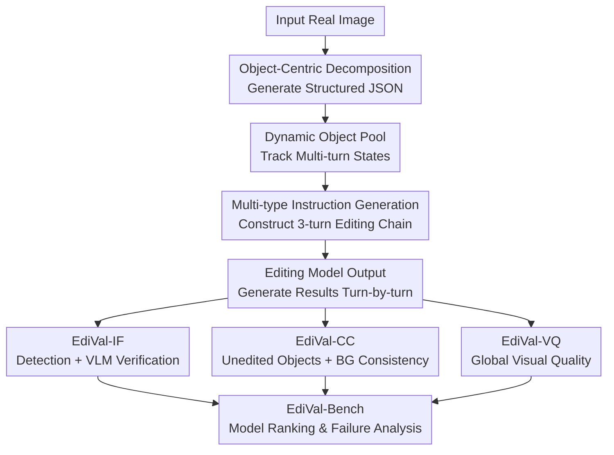

# EdiVal-Agent: An Object-Centric Framework for Automated, Fine-Grained Evaluation of Multi-Turn Editing

**Conference**: ICLR 2026  
**OpenReview**: [https://openreview.net/forum?id=YkV0fnXgJA](https://openreview.net/forum?id=YkV0fnXgJA)  
**Code**: https://github.com/TianyuCodings/EdiVal  
**Area**: Image Generation / Image Editing Evaluation  
**Keywords**: Multi-turn image editing, automated evaluation, object-centric evaluation, instruction following, content consistency

## TL;DR
EdiVal-Agent decomposes multi-turn image editing evaluation into object decomposition, object state tracking, instruction generation, and tool-assisted scoring. It utilizes three metrics—EdiVal-IF, EdiVal-CC, and EdiVal-VQ—to provide a fine-grained assessment of whether the model correctly edits targets, preserves unedited content, and maintains visual quality.

## Background & Motivation
**Background**: Instructional image editing has evolved from single-turn tasks to multi-turn interactions: users might ask a model to add text, then replace a subject, and finally modify colors or backgrounds. A new generation of models, including GPT-Image-1/1.5, Nano Banana, Seedream, FLUX Kontext, and Qwen-Image-Edit, has become increasingly powerful. However, evaluation methods mostly remain categorized into two approaches: comparing model outputs with a reference edited image for similarity, or using a VLM to answer "whether it follows instructions" for the entire image.

**Limitations of Prior Work**: The issue with reference-based evaluation is that "correct editing" is often not a unique answer. For example, "replacing a horse with a deer" can involve many valid compositions, and a single reference image only covers one. If the reference itself is synthesized by older models, it introduces biases. While VLM-only evaluation is flexible, it is unstable regarding object existence, spatial relationships, counting, local attribute changes, and generation artifacts; it may overlook small regional changes or hallucinate non-existent objects.

**Key Challenge**: The success of image editing is fundamentally driven by two competing goals: precisely changing what should be changed while maintaining consistency in what should not. A single global similarity metric punishes reasonable variations, while a single VLM judgment lacks verifiable local evidence. Especially in multi-turn editing, the status of which objects have been modified and which should remain unchanged evolves dynamically with each turn.

**Goal**: The authors aim to establish an automated, interpretable, and fine-grained evaluation framework that can both generate multi-turn editing tasks and evaluate modern editing models across three dimensions: instruction following, content consistency, and visual quality. Specifically, it seeks to determine: if the target object of the current turn is edited correctly, if historically untouched objects and the background remain stable, and if the final image remains natural and aesthetically pleasing.

**Key Insight**: The paper chooses "object-centric" as the pivot for evaluation. The reason is direct: most editing instructions revolve around objects, attributes, text, quantities, spatial relations, or backgrounds. By parsing an image into a structured object pool and updating object states after each turn, vague whole-image judgments can be transformed into more auditable local detection, semantic verification, and similarity calculations.

**Core Idea**: Use a dynamic object pool to explicitly record "what to change / what to keep" during multi-turn editing. By combining open-vocabulary detectors, VLMs, DINO features, and human preference models, a more reliable automated evaluation pipeline than reference-based or VLM-only methods is constructed.

## Method

### Overall Architecture
The input to EdiVal-Agent is a real image, and its output is not just an edited image but a set of multi-turn editing instructions and corresponding automated evaluation results. It first uses a VLM to decompose the image into an object-level JSON, then samples editable objects and types from the pool to generate a chain of three-turn instructions. Finally, it calculates instruction following, content consistency, and visual quality for the outputs of various editing models.

The key to the process is the dynamic object pool: all encountered objects, currently editable objects, and unedited objects are updated with each instruction. This allows the system, at the third turn, to verify consistency based on the pool rather than guessing which areas should remain unchanged.

### Key Designs
**1. Object-Centric Decomposition: Grounding subjective judgment to traceable objects**

Traditional VLMs looking at the "original image, edited image, and instruction" often merge local evidence into an uninterpretable judgment. EdiVal-Agent first has a VLM perform a structured decomposition of the input image, extracting clearly visible foreground objects and their attributes, including fields like object, color, material, text, count, and foreground. Objects are organized using names like `{material} {color} {object}`, such as `metal yellow sign`. This JSON serves as a state table for subsequent instruction generation and metric calculation.

To prevent the VLM from introducing non-existent or undetectable objects into the benchmark, the authors use Grounding-DINO for validation, retaining only reliably detected objects and their bounding boxes. This step provides "anchors" for evaluation: whether judging object removal, color changes, or unedited object similarity, all are centered around these anchors.

**2. Dynamic Object Pool: Adapting "editable" and "preserved" objects as states change**

The hardest part of multi-turn evaluation is that states change. After changing a "brown pole" to a "gray pole" in turn one, treating it as a "brown pole" in turn two would be an error. EdiVal-Agent maintains three pools: $P^{all}_t$ (all objects encountered until turn $t$), $P^{avail}_t$ (currently editable objects), and $P^{unch}_t$ (objects not yet edited that should remain consistent).

In each turn, the system selects an unused editing type from nine categories, picks an object from $P^{avail}_t$, generates an instruction, and updates the pools based on the semantics. For example, "subject replace" removes the source object from the available pool and adds the target to all/available; "color alter" updates attributes; "background change" disables background consistency scores from that turn onwards.

**3. EdiVal-IF: Handling verifiable editing with symbolic detection and semantic editing with local VLM**

EdiVal-IF handles instruction following by triaging instructions based on verifiability. For symbolically verifiable tasks like subject add, remove, replace, position change, and count change, the system uses an open-vocabulary detector to generate target boxes and applies rules. For instance, position change checks if the target center moves relative to a reference, e.g., $center_x(B_A^t) < center_x(B_B^t)$.

For semantic tasks like color/material alter, text change, and background change, the system uses a VLM. However, instead of a global judgment, the detector locates the relevant area, and the cropped local evidence is analyzed by the VLM. This approach assigns weak areas for VLMs (spatial, counting) to detection/rules, while leaving semantic items (color, texture) to the VLM.

**4. EdiVal-CC & EdiVal-VQ: Separating "what should not change" from "aesthetic quality"**

Content consistency is not a simple comparison between images because the target object *should* change. EdiVal-CC identifies areas from $P^{all}_t$ in both images, excludes them from the total area $\Omega$ to get the background region $\Omega^t_{bg}$, and calculates semantic similarity for crops of objects in $P^{unch}_t$. The final score is the mean of background similarity and unedited object similarity:

$$
EdiVal\text{-}CC(I_t, I_0, P^{1:t}) = \frac{1}{2}\left(s^t_{bg} + \frac{1}{|P^{unch}_t|}\sum_{o\in P^{unch}_t}s^t_o\right)
$$

The authors use DINOv3 feature similarity rather than L1. Visual quality EdiVal-VQ is reported separately using HPSv3. Models like GPT-Image-1 may "beautify" images, raising HPS but potentially damaging fidelity; thus, quality is treated as an independent dimension.

### Loss & Training
This paper constructs an evaluation agent and benchmark rather than training a new model. The "optimization goal" is reflected in the metric aggregation. EdiVal-O aggregates IF and CC:

$$
EdiVal\text{-}O = \sqrt{EdiVal\text{-}IF \cdot EdiVal\text{-}CC}
$$

The use of geometric mean punishes models that specialize in only one area; a model that follows instructions perfectly but destroys the original background will receive a low overall score.

## Key Experimental Results

### Main Results
EdiVal-Bench evaluated 16 models using 1,716 instructions (3 turns over 572 images). Proprietary models generally lead, while Qwen-Image-Edit leads among open-source models but suffers from multi-turn degradation.

| Model | Type | Latency(s/img) | EdiVal-IF T1/T2/T3 | EdiVal-CC T1/T2/T3 | EdiVal-O T1/T2/T3 | Rank |
|------|------|-------------|--------------------|--------------------|-------------------|------|
| Seedream 4.0 | Closed | 14.55 | 75.93 / 55.58 / 41.59 | 92.51 / 88.03 / 85.86 | 83.81 / 69.95 / 59.76 | 1 |
| GPT-Image-1.5 | Closed in-context | 35.55 | 75.19 / 55.92 / 40.08 | 94.49 / 91.20 / 88.49 | 84.29 / 71.41 / 59.55 | 2 |
| Qwen-Image-Edit | Open flow matching | 115.08 | 72.90 / 44.06 / 22.55 | 84.22 / 80.52 / 77.98 | 78.36 / 59.56 / 41.93 | 9 |
| FLUX.1-Kontext-dev | Open flow matching | 29.21 | 59.97 / 32.69 / 16.61 | 95.32 / 92.24 / 90.22 | 75.61 / 54.91 / 38.71 | 11 |

Human alignment experiments show EdiVal-IF significantly outperforms VLM-only and CLIP directional baselines, particularly in spatial, removal, and counting tasks.

| Evaluation Method | Human Alignment Accuracy | Note |
|----------|------------------|------|
| EdiVal-IF | 81.3% | Hybrid of Detector + Rules + Local VLM |
| Qwen2-VL / VLM-only | 75.2% | Direct VLM judgment; weaker in spatial/existence |
| Thresholded CLIP dir | 65.4% | Requires task-specific thresholds |

### Ablation Study
Ablations focus on the tool stack. Key conclusion: changing VLMs or detection thresholds shifts absolute scores, but the primary model ranking remains stable. Replacing Grounding-DINO with the weaker OWL-ViT significantly reduces human alignment.

| Configuration | Key Metric | Note |
|------|----------|------|
| Qwen2.5-7B-VL replaces default VLM | Pearson 0.9544, Spearman 0.9298 | Ranking remains stable |
| Grounding-DINO → OWL-ViT | Pearson 0.8157, Spearman 0.7929 | Lower absolute success rate and alignment |
| DINOv3 → DINOv2 | Pearson 0.9987, Spearman 1.0000 | CC values shift, but ranking is identical |

### Key Findings
- Seedream 4.0 ranks first overall, balancing IF, CC, and lower latency.
- Qwen-Image-Edit perform well in turn 1, but its EdiVal-O score drops sharply (78.36 to 41.93), indicating exposure bias when processing its own previous outputs.
- Nano Banana is stable in attribute editing but weak in spatial and numerical constraints.
- Multi-turn editing and single-shot complex editing have different trade-offs; models without exposure bias benefit from step-by-step editing, while others may perform better by compressing instructions into one shot.

## Highlights & Insights
- The object pool is the crucial abstraction. It transforms "multi-turn history" into a data structure, ensuring content consistency evaluation does not rely on static masks.
- The triage in EdiVal-IF is practical: detectors handle existence/spatial/count, while VLMs handle color/material/text.
- Separating visual quality from the overall score is a sound decision. Aesthetic "beauty" and "fidelity" often conflict, and high HPS might indicate over-beautification rather than faithful editing.
- EdiVal-Bench provides diagnostic value, identifying failure modes like Qwen's multi-turn degradation or GPT-Image-1's stylistic drift.

## Limitations & Future Work
- Instruction types are primarily object-centric and do not currently cover style transfer, narrative editing, or abstract aesthetic requests.
- The framework relies on open-vocabulary detectors; detector errors (FP/FN) directly impact EdiVal-IF.
- Multi-turn editing is limited to three turns. As sessions lengthen, object pool drift and output degradation will worsen.
- Future work could focus on using EdiVal scores as feedback signals for RL/post-training or inference-side selection.

## Related Work & Insights
- **vs MagicBrush / UltraEdit**: These rely on reference images, which might contain biases from older models. EdiVal-Bench checks goals and preservation directly.
- **vs GEdit-Bench / ImgEdit-Bench**: These rely on global VLM judgments, which struggle with spatial and counting tasks.
- **vs CLIP directional score**: EdiVal-IF achieves 81.3% human alignment, significantly higher than the 65.4% of CLIP dir.
- **Future Impact**: High-quality evaluation for generative models increasingly requires a combination of "structured state + expert tools + VLM semantic judgment" rather than a single black-box VLM.

## Rating
- Novelty: ⭐⭐⭐⭐☆ The combination of object-centric state pools and hybrid tool evaluation effectively addresses pain points in editing evaluation.
- Experimental Thoroughness: ⭐⭐⭐⭐⭐ Comprehensive coverage across 16 models, 9 instruction types, multi-turn analysis, and human alignment.
- Writing Quality: ⭐⭐⭐⭐☆ Clear logic and rich visualization, though some VLM descriptions could be more synchronized.
- Value: ⭐⭐⭐⭐⭐ Highly valuable for researchers as an automated leaderboard and diagnostic infrastructure.

<!-- RELATED:START -->

## Related Papers

- [\[ICLR 2026\] LaTo: Landmark-tokenized Diffusion Transformer for Fine-grained Human Face Editing](lato_landmark-tokenized_diffusion_transformer_for_fine-grained_human_face_editin.md)
- [\[CVPR 2026\] FreqEdit: Preserving High-Frequency Features for Robust Multi-Turn Image Editing](../../CVPR2026/image_generation/freqedit_preserving_high-frequency_features_for_robust_multi-turn_image_editing.md)
- [\[CVPR 2026\] DiffGraph: An Automated Agent-driven Model Merging Framework for In-the-Wild Text-to-Image Generation](../../CVPR2026/image_generation/diffgraph_an_automated_agent-driven_model_merging_framework_for_in-the-wild_text.md)
- [\[ICLR 2026\] Improved Object-Centric Diffusion Learning with Registers and Contrastive Alignment (CODA)](improved_object-centric_diffusion_learning_with_registers_and_contrastive_alignm.md)
- [\[ICLR 2026\] JointDiff: Bridging Continuous and Discrete in Multi-Agent Trajectory Generation](jointdiff_bridging_continuous_and_discrete_in_multi-agent_trajectory_generation.md)

<!-- RELATED:END -->
