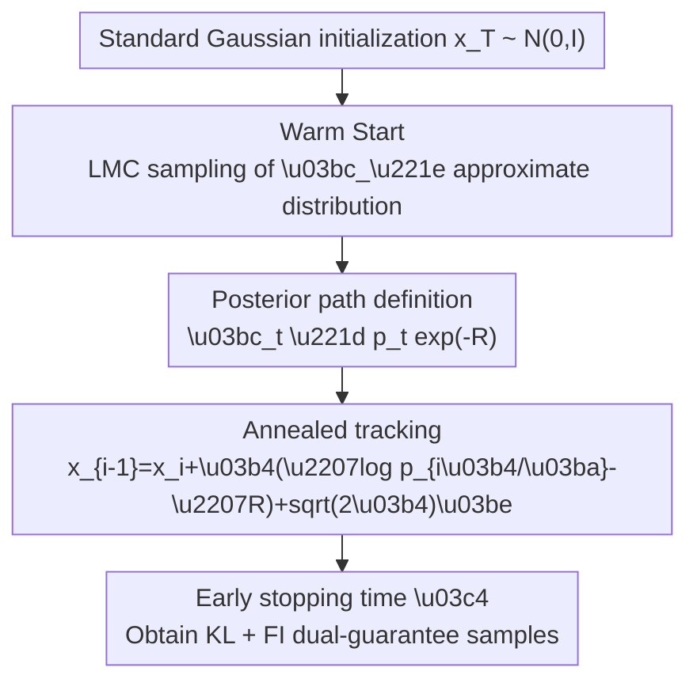

# Efficient Approximate Posterior Sampling with Annealed Langevin Monte Carlo

**Conference**: ICLR2026  
**OpenReview**: [https://openreview.net/forum?id=7GrUROKDyW](https://openreview.net/forum?id=7GrUROKDyW)  
**Code**: Not yet open-source (subject to updates on the OpenReview page)  
**Area**: image_generation  
**Keywords**: posterior sampling, diffusion models, Annealed Langevin, KL-FI dual guarantee, inverse problems  

## TL;DR
This work proposes a provable version of Annealed Langevin Monte Carlo (ALMC): starting with a warm start on a strongly convex objective that considers only "measurement consistency," it then anneals along the "posterior path of the noisy prior." This achieves both "KL proximity to the noisy posterior" and "Fisher proximity to the true posterior" within polynomial time.

## Background & Motivation
**Background**: Diffusion models and score-based generative models can stably learn complex priors $p(x)$ and serve as "prior constraints" for tasks such as super-resolution, inpainting, MRI reconstruction, and stylization. A common problem during inference is how to sample from the posterior $p(x\mid y)$ given a measurement $y$ (e.g., $y=A(x)+\eta$) without retraining the model.

**Limitations of Prior Work**: Empirical algorithms (such as various posterior guidance and split-Gibbs variants) are effective in visual tasks but usually only provide asymptotic conclusions or hold only in very restricted settings. More importantly, recent complexity lower-bound results show that "exact posterior sampling (in the KL sense)" can be reduced to hard problems in the worst case, implying that "global KL exact approximation of the true posterior" can no longer be treated as a universally attainable goal.

**Key Challenge**: Posterior sampling essentially needs to satisfy two constraints: first, "resembling the prior data distribution" (constrained by $p$), and second, "consistent with the observed measurement" (constrained by $R_y$ or the likelihood). In multimodal scenarios, these two constraints conflict regarding mode weights and mode reachability, making local sampling easy but global stitching difficult.

**Goal**: Instead of pursuing "global KL exact sampling of the true posterior $\mu_0$," the authors seek a more computable yet statistically meaningful goal: constructing a distribution that is close to the "posterior corresponding to the noisy prior" in KL divergence, while being close to the "true posterior" in Fisher divergence.

**Key Insight**: The core observation is that the "posterior path can also be annealed." Define $\mu_t \propto p_t e^{-R}$, where $p_t$ is the distribution after adding noise to the prior. In high-noise stages, the posterior is smoother and easier to mix; in low-noise stages, it is closer to the true posterior but harder to sample. By starting near the high-noise posterior and then slowly annealing, it becomes possible to bypass the computational barriers of directly attacking the hardest posterior.

**Core Idea**: Use a two-phase ALMC to perform approximate tracking on a "controllable path" and decompose the theoretical guarantees into "KL responsible for global mode weight stability + FI responsible for local geometric correctness," thereby providing an approximate posterior sampling framework that holds in polynomial time.

## Method
The paper formulates the target posterior as
$$
\mu_0(x) \propto p_0(x)\,e^{-R(x)},
$$
and introduces a family of posteriors corresponding to the noisy priors $p_t$:
$$
\mu_t(x) \propto p_t(x)\,e^{-R(x)}.
$$
The algorithm does not "jump" directly to $\mu_0$ but instead uses a warm start to reach an approximation of $\mu_{\infty}$ (the posterior corresponding to the high-noise prior) and then anneals along $\{\mu_t\}$ toward low noise.

### Overall Architecture
ALMC can be summarized as a two-stage sampling process of "measurement consistency first, then prior refinement": the first stage mixes quickly on a strongly convex target to obtain a reliable initialization; the second stage uses this initialization as a starting point for annealed LMC to track the posterior path until an early stopping time $\tau$. This "early stopping" is not just an engineering trick but part of the theoretical conclusion: continuing to track the KL to $t=0$ is not guaranteed to be tractable in general.

### Key Designs
**1. Warm Start on $\gamma e^{-R}$: Obtaining a "globally feasible" initial distribution on a strongly convex target**

The difficulty of sampling directly from a complex posterior lies in the strong coupling between mode structures and measurement conflicts. The authors first ignore prior details, retaining only the measurement potential $R$, and run LMC on $\gamma e^{-R}$. Since the combination of a Gaussian prior and a convex $R$ possesses good geometric properties, LMC can pull the initial distribution close to $\mu_{\infty}$ in polynomial time.

The value of this step is to "solve the solvable parts first": push samples into regions consistent with the measurement, and then gradually introduce data prior structures in the next stage. Compared to immediate aggressive drifting toward the true posterior, the warm start significantly reduces the risk of instability during the initial phases of subsequent annealing.

**2. Path tracking rather than hard endpoint approximation: Controlling path evolvability via speed parameter $\kappa$**

The second stage uses discrete updates:
$$
x_{i-1}=x_i+\delta\big(\nabla \log p_{i\delta/\kappa}(x_i)-\nabla R(x_i)\big)+\sqrt{2\delta}\,\xi_i,
$$
where $\kappa$ controls the "speed along the path." Intuitively, the larger $\kappa$ is, the slower the path is traversed, making it easier for the sampler to keep up with each intermediate target $\mu_t$, though at a higher computational cost.

This is equivalent to decomposing a "hard sampling problem" into a sequence of "neighboring, slightly easier" subproblems. By controlling the path action, derivative changes, and regularity conditions, the authors provide a feasible KL tracking bound within the early stopping interval.

**3. KL + FI dual indicators: Global mode weights via KL, local geometric correctness via FI**

Relying solely on FI convergence carries the risk of mode collapse: in multimodal distributions, each local mode can be fitted well, but the mode weights might be wrong. The authors use a dual-Gaussian example to show that FI is insensitive to mixing weights and is thus insufficient to guarantee a "globally correct posterior" alone.

The strategy of Ours is: at the early stopping time, provide a KL guarantee for $\mu_\tau$ to ensure global quality (including mode weights); simultaneously, provide an FI guarantee for the true posterior $\mu_0$ to ensure local first-order geometric consistency. This combination of "global + local" is a key theoretical innovation compared to traditional single-metric analyses.

### A Complete Example
Consider a 2D multimodal prior (several vertical bars) and a measurement model that "only observes the y-coordinate." The true posterior suppresses the weights of modes inconsistent with the observation, but before the low-noise stage, many modes look "feasible" locally.

If sampling is performed directly on $\mu_0$, the chain might fall into a single mode prematurely. If only FI is optimized, even if each mode is fitted well internally, incorrect mixing weights may persist. The behavior of ALMC is:

1. Warm start pushes samples near the "observation-consistent band";
2. The annealing phase gradually restores prior details, filtering out inconsistent modes;
3. At the early stopping point, a distribution is obtained: small KL relative to $\mu_\tau$ (reasonable global weights) and small FI relative to $\mu_0$ (local shape alignment).

This explains why the authors emphasize "approximate posterior sampling that is computable and statistically meaningful" rather than "exact posterior sampling."

### Loss & Training
The focus of this paper is not on training new diffusion models but on "inference-time sampling theory given existing prior scores." Thus, the training side can be summarized as: assuming access to high-quality prior scores $\nabla\log p_t$ (the paper primarily analyzes the ideal score case), and using the gradient of the measurement potential $\nabla R$ during sampling.

Key assumptions for theoretical analysis include:
- The prior $p_0$ is sub-Gaussian and the score is Lipschitz;
- $R(x)$ is smooth, convex, and has a controlled lower bound;
- The discrete step size $\delta$ and rate $\kappa$ are chosen according to a specified relation (e.g., analyzed at the scale of $\delta=\kappa^{-1/4}$).

Under these conditions, the algorithm complexity is polynomial with respect to dimension and precision parameters, providing a "provably executable" path.

## Key Experimental Results

### Main Results
The paper consists of two lines: main theoretical results and 2D visualization experiments. The former verifies that "early stopping achieves dual KL+FI guarantees," while the latter demonstrates that ALMC balances mode coverage and measurement consistency in multimodal posteriors. The table below summarizes the core result types in the paper (as it is not a benchmark-leaderboard-styled paper).

| Experimental Setting | Comparison Target | Metrics | Observed Phenomenon | Conclusion |
|---|---|---|---|---|
| Posterior Path Tracking | Direct KL pursuit of $\mu_0$ | Polynomial time guarantee | Not universally guaranteed | Requires early-stopped approximate target |
| ALMC Early-stopped vs $\mu_\tau$ | KL / TV | Global distribution proximity | Polynomial bound provided | Global mode weights are controllable |
| ALMC Early-stopped vs $\mu_0$ | Fisher divergence | Local geometric consistency | Polynomial bound provided | Local posterior structure is controllable |
| Multimodal Example | FI-only guided sampling | Mode weight correctness | Prone to weight distortion | FI alone is insufficient for global correctness |

### Ablation Study
The authors perform "theoretical component ablations" rather than standard deep network "module removal": identifying which guarantee is lost if a certain analysis or algorithmic step is removed.

| Configuration | Key Property | Result Trend | Description |
|---|---|---|---|
| Complete ALMC (Warm Start + Annealing + Early Stopping) | KL($\mu_\tau$) + FI($\mu_0$) | Simultaneously holds | Main conclusion of the paper |
| Remove Warm Start | Initial distribution controllability | Significantly worse | Potential early deviation from measurement-consistent regions |
| No Slow Annealing (Small $\kappa$) | Path tracking error | Increases | Neighboring targets change too fast to track |
| Forced KL pursuit to $t=0$ | Global KL provability | Does not hold | Triggers theoretically intractable regions |
| FI Convergence Only | Global mode weights | Not guaranteed | Local alignment achieved but mode collapse possible |

### Key Findings
- The most critical finding of Ours is not "yet another stronger sampler," but "redefining the provable goal of posterior sampling into a computable range."
- In multimodal scenarios, the responsibilities of KL and FI are separable: KL acts as a global quality controller, while FI acts as a local geometric controller.
- Early stopping is not a compromise but a theoretically necessary boundary choice: it clarifies "up to where guarantees can be provided."
- For inverse problem practitioners, this is more valuable than simple empirical effectiveness because it provides failure boundaries and directions for parameter tuning (especially for $\kappa$ and the annealing schedule).

## Highlights & Insights
- **Highlight 1**: The problem restatement is highly effective. Instead of obsessing over "exact posterior sampling," the authors propose "provable and usable" approximate standards, bridging theory and practice.
- **Highlight 2**: The division of labor between KL and FI guarantees explains many empirical phenomena. In the past, some methods appeared to have "good image quality but statistical instability"; essentially, they may have only achieved local geometric benefits without global weight constraints.
- **Highlight 3**: The algorithmic structure is minimalist. The two-stage LMC (warm start + anneal) itself is not complex, but when paired with path regularity analysis, it forms a complete and explanatory framework.
- **Insight 1**: In posterior sampling, "path design" is as important as the "endpoint target"; many difficulties arise from a path that is too steep rather than the endpoint itself.
- **Insight 2**: For visual inverse problems, conflicts between priors and observations are the norm rather than the exception. Providing provable approximations in conflict regions is often more practical than pursuing unconditional exactness.
- **Transferable Ideas**: This analytical paradigm can be transferred to conditional sampling in split-Gibbs, SMC, or rectified flow, especially for designing "provable early-stopping strategies."

## Limitations & Future Work
- **Limitation 1**: Current conclusions are built on a convex and smooth measurement potential $R$. Perceptual losses, discrete constraints, and text-alignment losses common in real visual tasks do not always satisfy these conditions.
- **Limitation 2**: The theory is mostly based on ideal scores or controlled error settings; how actual large-scale model score errors propagate into the dual KL/FI guarantees still requires finer bounds.
- **Limitation 3**: Results emphasize the "existence of a good distribution near the early stopping point," but how to adaptively find the optimal early stopping time without an oracle remains an open engineering question.
- **Limitation 4**: The paper leans toward theory and mechanism verification, lacking systematic quantitative comparisons with mainstream posterior sampling methods on large-scale standard datasets.
- **Future Work 1**: Combine "provable early stopping" with learnable schedulers to form data-dependent annealing speed control.
- **Future Work 2**: Extend to non-convex or piecewise convex measurement models to enhance applicability in real-world reconstruction and editing tasks.
- **Future Work 3**: Generalize dual-metric guarantees to statistical distances closer to perceptual quality (e.g., task-aware divergence).

## Related Work & Insights
- **vs. DPS / Posterior Score Estimation**: DPS-like methods focus on constructing or approximating the posterior score, which is powerful in practice but difficult to guarantee under rigorous constraints. Ours bypasses the "availability of exact posterior scores" and instead tracks the posterior path approximately, offering a more complete theoretical loop.
- **vs. Split-Gibbs / Alternating Consistency**: Split-Gibbs emphasizes alternately satisfying prior and measurement constraints but often suffers from biased stationary distributions. Ours provides a "continuous path annealing" perspective and suggests that this perspective could be transferred to split-Gibbs analysis.
- **vs. Classic LMC Non-log-concave Sampling Theory**: Classic results provide fast convergence in the sense of FI first-order stationary points but are insensitive to global weights in multimodality. Ours explicitly fills this gap with KL($\mu_\tau$), forming a complementary approach.
- **Personal Insights**: When working on conditional generation or inverse problems, objectives should be split into "global correctness" and "local geometric correctness" rather than looking at a single metric or a few visualizations.

## Rating
- **Novelty**: ⭐⭐⭐⭐☆ Reconstructs the posterior sampling problem through dual provable targets (KL+FI); clear and distinctive.  
- **Experimental Thoroughness**: ⭐⭐⭐☆☆ Theory and visualization examples are solid, but large-scale task comparisons and engineering statistics are still sparse.  
- **Writing Quality**: ⭐⭐⭐⭐☆ Mathematical narrative is complete; core difficulties and boundaries are well-explained.  
- **Value**: ⭐⭐⭐⭐☆ Crucial research for "provable approximate posteriors" in diffusion inverse problems; capable of guiding future algorithm design.

<!-- RELATED:START -->

## Related Papers

- [\[ICLR 2026\] One Step Further with Monte-Carlo Sampler to Guide Diffusion Better](one_step_further_with_monte-carlo_sampler_to_guide_diffusion_better.md)
- [\[ICCV 2025\] FlowDPS: Flow-Driven Posterior Sampling for Inverse Problems](../../ICCV2025/image_generation/flowdps_flow-driven_posterior_sampling_for_inverse_problems.md)
- [\[ICLR 2026\] Quasi-Monte Carlo Methods Enable Extremely Low-Dimensional Deep Generative Models](quasi-monte_carlo_methods_enable_extremely_low-dimensional_deep_generative_model.md)
- [\[ICML 2026\] Simple Approximation and Derivative Free Inference-Time Scaling for Diffusion Models via Sequential Monte Carlo on Path Measures](../../ICML2026/image_generation/simple_approximation_and_derivative_free_inference-time_scaling_for_diffusion_mo.md)
- [\[ICLR 2026\] Error as Signal: Stiffness-Aware Diffusion Sampling via Embedded Runge-Kutta Guidance](error_as_signal_stiffness-aware_diffusion_sampling_via_embedded_runge-kutta_guid.md)

<!-- RELATED:END -->
