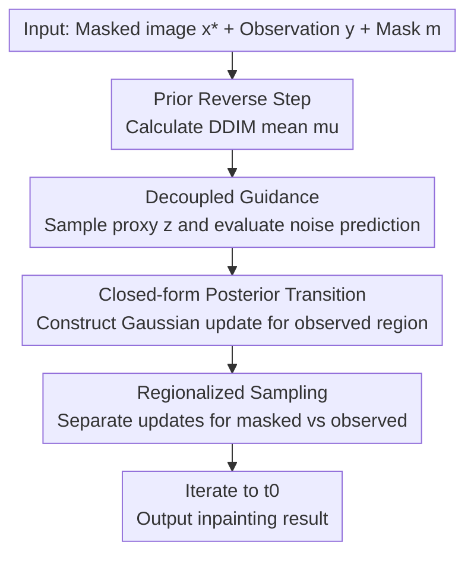

# Efficient Zero-shot Inpainting with Decoupled Diffusion Guidance

**Conference**: ICLR 2026  
**OpenReview**: [https://openreview.net/forum?id=5F93RfQ12T](https://openreview.net/forum?id=5F93RfQ12T)  
**Code**: https://github.com/YazidJanati/ding (Available)  
**Area**: image generation / diffusion inpainting  
**Keywords**: zero-shot inpainting, diffusion models, posterior sampling, decoupled guidance, low-NFE inference  

## TL;DR
This paper proposes DING (Decoupled INpainting Guidance), which decouples denoiser inputs from state variables in likelihood guidance to construct precisely samplable Gaussian posterior transitions, achieving faster, memory-efficient, and higher-quality zero-shot image inpainting without any task-specific fine-tuning.

## Background & Motivation
**Background**: Diffusion models have become the mainstream solution for image inpainting, generally following two paths: training task-specific conditional diffusion models that take masks, prompts, and reference pixels as inputs, or utilizing zero-shot posterior sampling where a pre-trained diffusion model acts as a prior guided by observation likelihood during inference.

**Limitations of Prior Work**: The advantage of zero-shot approaches is that they do not require retraining for each task. however, current state-of-the-art methods rely on gradient guidance from surrogate likelihoods. This requires backpropagation or vector-Jacobian products (VJP) through the denoiser at every reverse step, leading to high memory and time overheads, particularly in high-resolution latent inpainting.

**Key Challenge**: Zero-shot methods offer low training costs but incur high gradient costs during inference; conversely, fine-tuned models are cheaper to run but require extremely high pre-training costs and lack flexibility for task transfer. The community lacks a middle ground that "retains zero-shot flexibility while minimizing inference complexity."

**Goal**: The authors aim to maintain the dual objectives of "observational consistency + perceptual quality" within the Bayesian posterior sampling framework while completely eliminating per-step VJP to enable deployment in low-NFE (Number of Function Evaluations) scenarios.

**Key Insight**: Instead of adding complexity to score approximations, the authors return to the posterior reverse transition itself. By modifying the likelihood approximation form, they restore the transition distribution to an analytical, directly samplable structure.

**Core Idea**: The essence of Decoupled Guidance is to replace the coupled relation in standard guidance—where the denoiser is fed the current state $x_s$—with an independent proxy variable $z_s$. This rewrites the difficult-to-compute coupled posterior transition as a Gaussian mixture that can be precisely sampled in two stages.

## Method

### Overall Architecture
DING operates within the DDIM reverse sampling framework, taking a masked reference image and text prompts as input to produce an infilled image satisfying observational consistency. Unlike traditional zero-shot guidance, it no longer performs gradient backpropagation through the denoiser. Instead, it evaluates the denoiser at proxy samples drawn from the prior reverse transition, resulting in a closed-form posterior approximation.

Specifically, at each time step, the pre-trained model provides the DDIM transition mean. The masked and observed regions are updated separately:缺失 areas follow standard stochastic sampling, while observed areas use a Gaussian closed-form update involving "DDIM mean + observation constraints + noise term," ensuring semantic alignment and contextual consistency.

### Key Designs
**1. Decoupled Likelihood Approximation: Converting High-Cost VJP into Samplable Mixtures**

Traditional methods usually employ $\hat{\ell}_s^\theta(y|x_s)=\ell_0(y|\hat{x}_0^\theta(x_s,s))$, where the denoiser input is tethered to the current state, requiring gradients with respect to the network input. DING modifies this to $\hat{\ell}_s^\theta(y|x_s,z_s)$, fixing the current state $x_s$ while evaluating the denoiser at an independent proxy point $z_s$. This "decoupling" effectively severs the expensive gradient chain.

The posterior approximate transition is then rewritten as a mixture expectation over $z_s \sim p_{s|t}^\theta(\cdot|x_t)$. The sampling process becomes "sample $z_s$, then sample $x_s$ from a conditional Gaussian." The core contribution is proving that under the inpainting observation model, the second step is Gaussian in closed-form, eliminating the need for approximation backpropagation or numerically unstable estimators.

**2. Closed-form Observation Update: Balancing Fidelity and Freedom**

Under the assumption of Gaussian observations, the update for the observed region in DING is:
$$
x_s[m] \leftarrow (1-\gamma)\mu[m] + \gamma(\alpha_s y + \sigma_s\hat{x}_1^\theta(z_s,s)[m]) + \alpha_s\sigma_y\sqrt{\gamma}\,\epsilon,
$$
where $\gamma=\frac{\eta_s^2}{\eta_s^2+\alpha_s^2\sigma_y^2}$. The intuition is straightforward: $\mu$ preserves the prior generation trajectory, $y$ ensures adherence to observations, $\hat{x}_1^\theta$ provides semantic completion, and the noise term ensures sampling diversity.

Unlike "replacement" methods, this is not a hard replacement of pixels but a "soft consistency" constraint through weight fusion. This better maintains boundary continuity and global texture naturalness, avoiding artifacts like rigid observed regions or contextual drift.

**3. Low-NFE Oriented Noise Schedule: Practical Inference via Faster Stochastic Decay**

The authors default to $\eta_t=\sigma_t(1-\alpha_t)$. This choice is motivated by engineering requirements: in limited NFE scenarios, maintaining high early stochasticity allows for exploring valid inpainting solutions, while faster late-stage decay ensures convergence to observation-consistent results. Ablations show that small-noise near-deterministic strategies degrade performance, whereas the default strategy provides a stable trade-off between FID/pFID and consistency across various mask configurations.

### Loss & Training
DING is a pure inference-time guidance method that requires neither additional training losses nor fine-tuning. It relies entirely on the pre-trained base diffusion model (the main experiments use Stable Diffusion 3.5 Medium).

Key implementation details:
1. The algorithm runs in latent space; pixel masks are downsampled to the latent grid via pooling before broadcasting.
2. Each diffusion step requires two forward passes (one for the main state, one for the proxy), meaning 50 NFE corresponds to 25 reverse steps.
3. Most experiments set $\sigma_y=0.01$ to emphasize strict observational consistency.

## Key Experimental Results

### Main Results
The paper compares DING against 10 zero-shot baselines on FFHQ, DIV2K, and PIE-Bench (standardized to 50 NFE), reporting FID, pFID, cPSNR, LPIPS, and CLIP scores for PIE-Bench.

| Dataset/Setting | Method | FID | pFID | cPSNR | LPIPS | Conclusion |
|---|---:|---:|---:|---:|---:|---|
| FFHQ 768 Half | DING | 9.6 | 6.6 | 31.03 | 0.33 | Best FID/pFID; balances fidelity and naturalness |
| FFHQ 768 Half | FLOWCHEF | 20.2 | 16.5 | 30.41 | 0.36 | Significantly lags behind DING |
| DIV2K 768 Half | DING | 39.2 | 13.0 | 25.90 | 0.35 | Superior FID/LPIPS; competitive cPSNR |
| DIV2K 768 Half | DIFFPIR | 41.1 | 12.9 | 26.09 | 0.37 | Similar pFID; lower overall quality |
| PIE-Bench | DING | 61.4 | 24.7 | 27.03 | 0.30 | Best across multiple metrics; strong edit consistency |
| PIE-Bench | DDNM | 61.4 | 26.9 | 27.29 | 0.31 | Slightly higher cPSNR; lower perceptual quality |

Compared to the SD3 inpainting fine-tuned model under the same time budget (~2.2s), DING (56 NFE) achieves FID 63.6 / pFID 24.6 / cPSNR 26.98 on PIE-Bench, outperformed SD3 Inpaint (28 NFE) which scored 68.7 / 30.5 / 18.85.

### Ablation Study
The authors focused on two types of ablations: the necessity of the "dual forward pass (2 NFE per step)" and different $\eta_t$ schedules.

| Ablation | Setting | FFHQ Half (FID/pFID/cPSNR/LPIPS) | Observation |
|---|---|---|---|
| Dual Forward | Delayed DING | 7.4 / 9.1 / 29.21 / 0.33 | FID can be decent, but cPSNR drops consistently |
| Dual Forward | DING | 6.6 / 9.6 / 31.03 / 0.33 | More stable overall, especially for consistency |
| DDIM Schedule | (B) Near-deterministic | 21.5 / 18.7 / 26.06 / 0.41 | Total degradation; insufficient stochasticity |
| DDIM Schedule | Default $\sigma_t(1-\alpha_t)$ | 9.6 / 6.6 / 31.03 / 0.33 | Optimal balance |

### Key Findings
- Decoupled guidance shifts the zero-shot inpainting bottleneck from "gradient backpropagation" to "forward sampling," making throughput and memory consumption much more favorable.
- On H100 benchmarks, DING averages ~2.9s and 22.09GB, outperforming VJP-based methods in speed and memory without sacrificing performance.
- In low-NFE scenarios, sufficient early stochasticity is critical; premature determinism significantly damages perceptual quality and consistency.

## Highlights & Insights
- The true highlight of this work is "structural complexity reduction" rather than "adding more tricks." It transforms a problem requiring high-order automatic differentiation into an analytical sampling problem, greatly improving implementation feasibility.
- DING outperforms dedicated fine-tuned inpainting models in a "zero-shot" setting, suggesting that correctly modeling posterior constraints during inference can be more critical than additional supervised data.
- The construction of the latent-space mask is highly practical: pooling the pixel mask by the encoder's downsampling ratio before thresholding avoids performance fluctuations caused by mask misalignment.

## Limitations & Future Work
- The authors note that performance does not increase monotonically with higher computational budgets; there are diminishing returns, suggesting the current schedule and guidance may have room for improvement in long-chain sampling.
- The method is primarily tailored for inpainting where the observation operator is easily constructed in latent space. Extending to general inverse problems (e.g., non-linear imaging or complex blur kernels) would require re-designing analytical posterior transitions.
- Each step requires two forward passes, which is still heavier than single-forward methods. Future work could explore distillation or adaptive step sizes for mobile or ultra-low latency applications.

## Related Work & Insights
- **vs RePaint / Replacement**: These methods often use hard replacement in observed regions, which is simple but can cause tension between naturalness and fidelity. DING provides smoother trade-offs via closed-form fusion updates.
- **vs DPS / REDDIFF / PSLD**: These rely on explicit gradients or related approximations. While theoretically flexible, they suffer from high inference costs. DING's advantage lies in removing the backpropagation path.
- **Inspiration**: The decoupling idea could be transferred to text-guided editing, localized video editing, or cross-modal conditional generation. The key is identifying whether "must-have gradient coupling" can be replaced by proxy variables while maintaining quality.

## Rating
- Novelty: ⭐⭐⭐⭐☆ The combination of decoupled likelihood approximation and closed-form posterior sampling is elegant and brings both theoretical and engineering value.  
- Experimental Thoroughness: ⭐⭐⭐⭐⭐ Comprehensive evaluation across three datasets, multiple masks, 10+ baselines, speed/memory metrics, and thorough ablations.  
- Writing Quality: ⭐⭐⭐⭐☆ Method derivation is clear; however, the notation might be dense for readers unfamiliar with diffusion theory.  
- Value: ⭐⭐⭐⭐⭐ Highly significant for practical zero-shot inpainting, especially in high-quality editing scenarios with constrained budgets.

<!-- RELATED:START -->

- **[DPS]** Diffusion Posterior Sampling for General Inventory Problems, ICLR 2023.
- **[DDNM]** Zero-Shot Image Restoration via Iterative Latent Variable Refinement, ICLR 2023.

<!-- RELATED:END -->

## Related Papers

- [\[ICML 2025\] Zero-Shot Adaptation of Parameter-Efficient Fine-Tuning in Diffusion Models](../../ICML2025/image_generation/zero-shot_adaptation_of_parameter-efficient_fine-tuning_in_diffusion_models.md)
- [\[ICML 2026\] Stage-wise Distortion-Perception Traversal in Zero-shot Inverse Problems with Diffusion Models](../../ICML2026/image_generation/stage-wise_distortion-perception_traversal_in_zero-shot_inverse_problems_with_di.md)
- [\[CVPR 2026\] LaRP: Efficient Multi-View Inpainting with Latent Reprojection Priors](../../CVPR2026/image_generation/larp_efficient_multi-view_inpainting_with_latent_reprojection_priors.md)
- [\[ICLR 2026\] Improving Classifier-Free Guidance in Masked Diffusion: Low-Dim Theoretical Insights with High-Dim Impact](improving_classifier-free_guidance_in_masked_diffusion_low-dim_theoretical_insig.md)
- [\[ICLR 2026\] Guidance Watermarking for Diffusion Models](guidance_watermarking_for_diffusion_models.md)

<!-- RELATED:END -->
