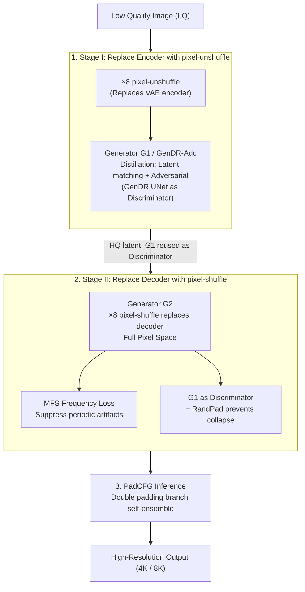

# Eliminating VAE for Fast and High-Resolution Generative Detail Restoration

**Conference**: ICLR 2026  
**arXiv**: [2602.10630](https://arxiv.org/abs/2602.10630)  
**Code**: None (Based on GenDR)  
**Area**: Image Generation  
**Keywords**: VAE elimination, Super-resolution, Pixel-space diffusion, Adversarial distillation, pixel-shuffle

## TL;DR

By replacing the VAE encoder and decoder with ×8 pixel-(un)shuffle, this work converts Latent Diffusion Super-Resolution (GenDR) into Pixel-space Super-Resolution (GenDR-Pix). Combined with multi-stage adversarial distillation and a PadCFG inference strategy, it achieves a 2.8× speedup and 60% VRAM savings while maintaining negligible visual degradation, enabling 4K image restoration in under 1 second with only 6GB of VRAM.

## Background & Motivation

**Background**: Diffusion models have achieved breakthroughs in Real-World Super-Resolution (SR), but face bottlenecks in **inference speed** and **VRAM consumption**. Existing acceleration schemes (e.g., step distillation) reduce diffusion steps to 1, but **VRAM boundaries still limit the maximum processing size**, necessitating tile-by-tile processing for high-resolution images.

**Key Insight: VAE is the bottleneck**. Profiling analysis reveals:
- For 1024² input, VAE time is 2.6× that of the UNet (191ms vs 73ms).
- VAE VRAM is 1.3× that of the UNet (3.5GB vs 2.7GB).
- For 2880² input, VAE time is 1.89× that of the UNet (3228ms vs 1710ms).
- At 4096², VAE triggers Out-of-Memory (OOM).

**Limitations of Prior Work**: Even the reconstruction PSNR of a 16-channel VAE is below 35dB, as lossy compression loses high-frequency details. Existing solutions (like AdcSR) simplify the VAE but still operate in the latent space; they cannot fundamentally resolve the conflict between generation and reconstruction (e.g., removing decoder attention leads to texture loss).

**Core Idea**: Pixel-(un)shuffle performs spatial scale transformations similar to a VAE and can be used to replace it entirely, shifting latent diffusion back to the pixel space. However, ×8 pixel-shuffle introduces checkerboard or repeating pattern artifacts and lacks a suitable discriminator.

## Method

### Overall Architecture

The core observation is that ×8 pixel-(un)shuffle performs spatial scale transformations similar to a VAE. Consequently, the latent diffusion SR (GenDR) pipeline can be reversed back into the pixel space. GenDR-Pix removes the VAE step-by-step through "two-stage adversarial distillation": Stage I first replaces the encoder with pixel-unshuffle to distill a generator $\mathcal{G}_1$ (GenDR-Adc) from low-quality pixels to high-quality latents; Stage II then replaces the decoder with pixel-shuffle to move the entire pipeline into the pixel space, reusing $\mathcal{G}_1$ from the previous stage as a discriminator while employing frequency domain loss and random padding to suppress artifacts from ×8 upsampling. Finally, a pixel-space-specific PadCFG is used during inference.

### Key Designs

**1. Stage I: Replacing Encoder with pixel-unshuffle**

The VAE encoder at the input side is replaced with a parameter-free ×8 pixel-unshuffle layer, which folds the low-quality pixel image into a tensor of the same scale as the original latent. A generator $\mathcal{G}_1$ (GenDR-Adc) is distilled to map "low-quality pixels to high-quality latents." The distillation follows an adversarial framework, using the original GenDR UNet as a feature extractor for the discriminator. The generator loss is defined as $\mathcal{L}_{\mathcal{G}_1} = \|z_{\text{tea}} - z_{\text{stu}}\|_1 + \lambda_1 \cdot \text{softplus}(-\mathcal{D}(z_{\text{stu}}))$. This step eliminates the encoder's computational overhead and provides a $\mathcal{G}_1$ with a pixel-unshuffle input interface for Stage II.

**2. Stage II: Replacing Decoder with pixel-shuffle**

Replacing the decoder with a ×8 pixel-shuffle layer moves the entire pipeline into the pixel space. This introduces three challenges addressed by specific mechanisms. First, **repeating pattern artifacts**: Improper weights in the tail layer can replicate identical checkerboards across all 8×8 patches. This is addressed using Masked Fourier Space (MFS) loss, which penalizes abnormal amplitudes: $\mathcal{L}_{\mathcal{F}} = \|\mathcal{M} \cdot (|\mathcal{F}\{y_{\text{stu}}\}| - |\mathcal{F}\{y_{\text{tea}}\}|)\|_1$, where mask $\mathcal{M}$ targets these specific frequency bands. Second, **lack of a suitable discriminator**: Latent-space discriminators cannot process pixel-shuffled features. The authors reuse $\mathcal{G}_1$ from Stage I as the discriminator. Third, **discriminator collapse**: Fixed pixel-unshuffle patterns can lead the discriminator to rely on discrete patch representations. Random Padding (RandPad) is introduced, where $p_h, p_w \in \{0,...,7\}$ are sampled to pad the images as $\text{randpad}(y) = \text{pad}(y, [p_h, 8-p_h, p_w, 8-p_w])$, forcing the discriminator to learn continuous representations.

**3. PadCFG: Pixel-space Classifier-Free Guidance**

Applying standard CFG in pixel space can amplify artifacts. The authors incorporate self-ensemble logic into CFG, using different padding for positive and negative branches: $\bar{y} = \omega \times \mathcal{G}_2(\text{pad}(x,[4,4,4,4]), c_{\text{pos}}) + (1-\omega) \times \mathcal{G}_2(\text{pad}(x,[3,5,3,5]), c_{\text{neg}})$. This maintains the computational cost of two forward passes while achieving ensemble smoothing to suppress artifacts.

### Loss & Training

The total loss for the Stage II generator is: $$\mathcal{L}_{\mathcal{G}_2} = \|y_{\text{tea}} - y_{\text{stu}}\|_1 + \lambda_1 \cdot \text{softplus}(-\mathcal{G}_1(y_{\text{stu}})) + \lambda_2 \mathcal{L}_{\mathcal{P}} + \lambda_3 \mathcal{L}_{\mathcal{F}}$$ which includes pixel reconstruction, adversarial loss using $\mathcal{G}_1$ as the discriminator, perceptual loss $\mathcal{L}_{\mathcal{P}}$, and frequency loss $\mathcal{L}_{\mathcal{F}}$, with weights $\lambda_{1,2,3} = 0.05, 1, 0.1$. Training uses AdamW, learning rate 1e-5, BFloat16, and DeepSpeed ZeRO2 on 8×A100 GPUs.

## Key Experimental Results

### Main Results

**ImageNet-Test Quantitative Comparison (×4 SR, 512² input)**:

| Method | Parameters | MACs | PSNR↑ | SSIM↑ | CLIPIQA↑ | MUSIQ↑ |
|------|-------|------|-------|-------|----------|--------|
| StableSR-50 | 1410M | 79940G | 26.00 | 0.7317 | 0.5768 | 64.54 |
| DiffBIR-50 | 1717M | 24234G | 25.45 | 0.6651 | 0.7486 | 73.04 |
| OSEDiff-1 | 1775M | 2265G | 24.82 | 0.7017 | 0.6778 | 71.74 |
| GenDR-1 | 933M | 1637G | 24.14 | 0.6878 | 0.7395 | 74.68 |
| **Ours** | **866M** | **344/744G** | **25.49** | **0.7286** | 0.7168 | 72.85 |

**Efficiency Comparison (4K Output, A100)**:

| Model | VAE Status | Time | VRAM | MUSIQ |
|------|---------|------|------|-------|
| GenDR | Full VAE | 4.92s | 20.75GB | 70.96 |
| GenDR-Adc | Removed Encoder | 2.69s (-45%) | 17.75GB (-14%) | 70.44 |
| **Ours** | **Removed VAE** | **1.75s (-64%)** | **8.01GB (-61%)** | 70.23 |
| Ours⋆ | No CFG | 0.87s (-82%) | 5.03GB (-76%) | 68.64 |

### Ablation Study

**Discriminator Design**:

| Discriminator | RandPad | MUSIQ | CLIPIQA |
|-------|---------|-------|---------|
| None | - | 60.95 | 0.4924 |
| GenDR | - | 61.07 | 0.5457 |
| GenDR-Adc | ✗ | 63.87 | 0.5764 |
| GenDR-Adc | ✓ | **63.89** | **0.5937** |

**MFS Loss**: Removing MFS loss caused NIQE to rise from 4.11 to 4.84 and LIQE to drop from 3.21 to 2.91.

**PadCFG**: PadCFG(4,4)+(3,5) increased MUSIQ by 0.45 and CLIPIQA by 0.0061 compared to vanilla CFG while maintaining similar latency.

### Key Findings

- VAE removal provides speedups far exceeding architecture pruning.
- Artifacts from ×8 pixel-shuffle are effectively resolved via frequency domain loss and random padding.
- GenDR-Pix is the only model supporting direct 8K SR without tiling.
- User studies indicate GenDR-Pix achieves perceptual quality comparable to the original GenDR.

## Highlights & Insights

- The discovery that **VAE is a dual bottleneck for efficiency and fidelity** in one-step diffusion SR is highly significant.
- The analogy between pixel-(un)shuffle and VAE is elegant and motivates a new acceleration path.
- The design of "reusing the previous stage model as the next stage discriminator" in multi-stage distillation is clever.
- RandPad is a simple, effective solution to discriminator collapse, inspired by E-LPIPS.
- Performance of 4K in 1 second with 6GB VRAM holds substantial industrial value.

## Limitations & Future Work

- Currently only validated on GenDR (SD2.1 UNet); not yet extended to SDXL, Flux, or newer architectures.
- Only supports ×4 SR; other scales require adjusting pixel-shuffle parameters.
- Selection of PadCFG padding parameters is empirical and lacks theoretical guidance.
- Stage II training requires the Stage I model as a discriminator, leading to a complex workflow.
- In cases of extreme degradation, the gap with GenDR might widen.

## Related Work & Insights

- **AdcSR**: Only replaces the encoder with ×2 pixel-unshuffle; this work extends it to ×8 to replace the full VAE.
- **PixelFlow**: Exploration of pixel-space diffusion.
- **GenDR / SiD / VSD**: Foundations of one-step diffusion SR.
- **E-LPIPS**: Uses random transformations to enhance perceptual loss, which inspired RandPad.
- Insight: Other diffusion applications using VAEs (e.g., editing, inpainting) could consider similar VAE elimination strategies.

## Rating

- Novelty: ⭐⭐⭐⭐ Replacing the VAE entirely is novel, though pixel-shuffle substitution is intuitive; the contribution lies in solving the engineering challenges.
- Experimental Thoroughness: ⭐⭐⭐⭐⭐ Comprehensive coverage across datasets, metrics, ablations, user studies, and efficiency analysis.
- Writing Quality: ⭐⭐⭐⭐ The roadmap presentation is clear, though formula density is high.
- Value: ⭐⭐⭐⭐⭐ Significant practical acceleration (2.8× speedup / 60% VRAM reduction); 1-second 4K SR is of high industrial value.

<!-- RELATED:START -->

## Related Papers

- [\[ICLR 2026\] GenDR: Lighten Generative Detail Restoration](gendr_lighten_generative_detail_restoration.md)
- [\[ICLR 2026\] LVTINO: LAtent Video consisTency INverse sOlver for High Definition Video Restoration](lvtino_latent_video_consistency_inverse_solver_for_high_definition_video_restora.md)
- [\[CVPR 2026\] DA-VAE: Plug-in Latent Compression for Diffusion via Detail Alignment](../../CVPR2026/image_generation/da-vae_plug-in_latent_compression_for_diffusion_via_detail_alignment.md)
- [\[ICLR 2026\] Latent Wavelet Diffusion for Ultra-High-Resolution Image Synthesis](latent_wavelet_diffusion_for_ultra_high-resolution_image_synthesis.md)
- [\[ICLR 2026\] Massive Activations are the Key to Local Detail Synthesis in Diffusion Transformers](massive_activations_are_the_key_to_local_detail_synthesis_in_diffusion_transform.md)

<!-- RELATED:END -->
