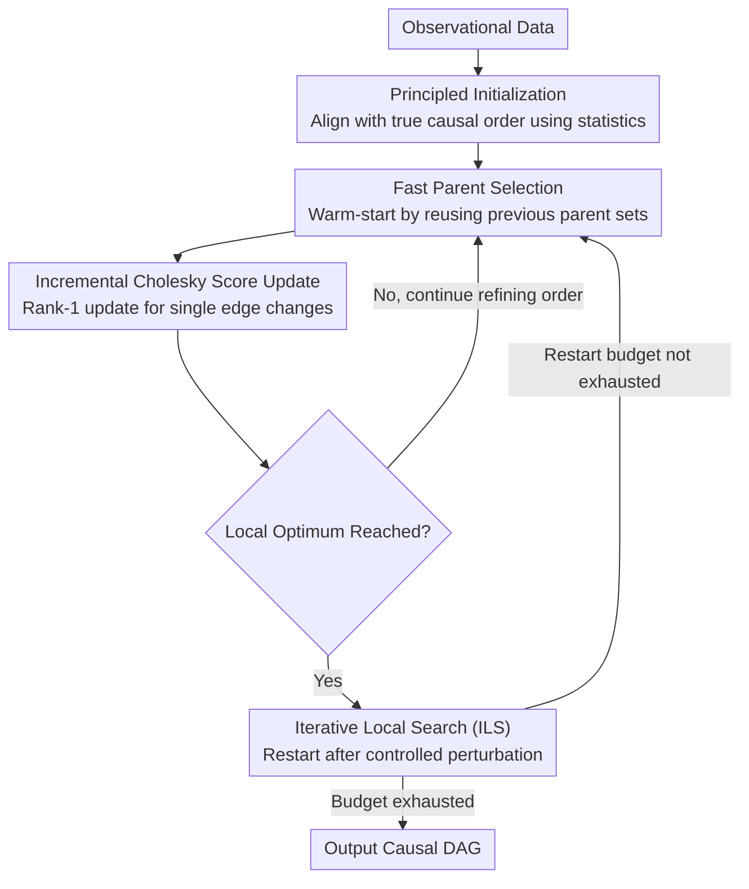

# Embracing Discrete Search: A Reasonable Approach to Causal Structure Learning

**Conference**: ICLR 2026  
**arXiv**: [2510.04970](https://arxiv.org/abs/2510.04970)  
**Code**: [https://github.com/CausalDisco/flopsearch](https://github.com/CausalDisco/flopsearch)  
**Area**: Image Generation  
**Keywords**: Causal Structure Learning, Discrete Search, Score Optimization, DAG Learning, Linear Models

## TL;DR

Ours proposes FLOP (Fast Learning of Order and Parents), a score-based causal discovery algorithm for linear models. By employing fast parent selection and iterative Cholesky score updates, it significantly reduces runtime, making Iterative Local Search (ILS) feasible. It achieves near-perfect graph recovery on standard causal discovery benchmarks, re-establishing the validity of discrete search in causal discovery.

## Background & Motivation

The core task of causal structure learning is to learn a Directed Acyclic Graph (DAG) representing relationships between variables from observational data. Score-based methods assign a penalized likelihood score to each DAG and seek the score-optimal graph.

**The Landscape of Existing Methods**:

**Exact Algorithms**: Guarantee finding the score-optimal graph but have exponential runtime, limiting applicability to approximately 30 variables.

**Local Search** (e.g., GES, BOSS): Perform hill-climbing by evaluating neighboring graphs but are prone to trapping in local optima.

**Continuous Optimization Methods** (e.g., NOTEARS): Encode acyclicity as a smooth constraint for continuous optimization, but face empirical and theoretical skepticism, convergence issues, and difficulties in edge threshold setting.

Key Insight: The NP-hard results often cited to dismiss discrete search **do not apply** to common causal discovery settings—standard hard constructions rely on unobservable variables, whereas discrete search can recover the target graph in polynomial time when the distribution is representable by a sparse DAG.

**Core Motivation**: In finite sample settings, imprecise scores leading to local optima is the core practical problem. FLOP accelerates computation to enable "fully embracing discrete search"—using sufficient computational budget for more thorough exploration to escape local optima.

## Method

### Overall Architecture

FLOP follows an order-based DAG search route: it first determines a causal order of variables, سپس greedily selects the optimal parent set for each node given that order to obtain a candidate DAG, and finally uses local search to refine the order and climb toward higher BIC scores. Its Mechanism is not to invent cleverer search criteria, but to execute each search step fast enough—allowing more thorough searching under the same time budget or repeated restarts to escape local optima. Specifically, the method starts from a **Principled Initialization** to provide a clean starting point, enters local search with **Fast Parent Selection** for warm-starting, uses **Incremental Cholesky Score Updates** to reduce each scoring step to a rank-1 update, and employs **Iterative Local Search (ILS)** to impose perturbations and restart upon reaching local optima. These four components overturn the old impression that "discrete search is infeasible due to slowness."

### Key Designs

**1. Principled Initialization: Starting search closer to the true causal order**

Under random initialization, ancestor-descendant pairs with long distances or weak dependencies are particularly prone to being misidentified during parent selection in finite samples. Such poor starting points drag subsequent local searches into sub-optimal local optima. FLOP utilizes an initialization based on data statistics, ensuring the initial order is better aligned with the true causal order, thereby significantly reducing mismatches in distant weak dependencies and providing a clean start for local search.

**2. Fast Parent Selection: Using warm-starts to avoid re-selecting parents for every order change**

Since orders are refined repeatedly during local search, traditional approaches re-select parents for all nodes from scratch whenever the order changes, which accounts for the majority of the computational overhead. FLOP observes that a local shift in order usually affects the optimal parent sets of only a few variables. Consequently, it uses parent sets learned from the previous order as a warm-start for the next round, recalculating only for the affected variables. This saves significant regression computation and memory without degrading search quality, as optimal parent sets for most variables remain invariant between adjacent orders.

**3. Incremental Cholesky Score Update: Reducing edge change cost from full decomposition to rank-1 updates**

The BIC score for linear Gaussian models relies on regression residuals, which essentially involves solving normal equations. Performing Cholesky decomposition repeatedly is expensive. FLOP leverages the incremental nature of Cholesky factors: when a local move changes only one edge, the corresponding system matrix changes only by a rank-1 term. Thus, the existing Cholesky factor can be updated via a rank-1 operation instead of full re-decomposition. This amortizes the cost of score updates across a sequence of local moves. The numerical core is implemented in Rust for maximum efficiency and released via the `flopsearch` Python package.

**4. Iterative Local Search (ILS): Escaping local optima with controlled perturbations and using compute budget as a tunable knob**

Local search methods like BOSS stop immediately upon reaching a local optimum. However, since scores are imprecise in finite samples, local optima often do not represent the true graph. FLOP applies a controlled perturbation upon reaching a local optimum and restarts the search. Executing $k$ restarts is denoted as $\text{FLOP}_k$, where $k$ serves directly as a computational budget hyperparameter. The previous three designs make each search step fast enough that the "repeated restart" strategy of ILS becomes temporally feasible—establishing an explicit link between runtime and finite-sample accuracy: more restarts increase the probability of finding structures with higher scores that are closer to the true graph.

### Loss & Training

The score function utilizes the standard BIC (Bayesian Information Criterion):

$$\text{BIC}(G) = -2 \log L(G \mid \mathcal{D}) + k \log n,$$

where $L$ is the likelihood, $k$ is the number of parameters, and $n$ is the sample size. Under linear Gaussian models, this score is consistent: as the sample size approaches infinity, the score-optimal graph recovers the true causal graph (or its equivalence class, the CPDAG). This provides the justification for FLOP's focus on faster and more thorough optimization of the BIC rather than defining new objectives.

## Key Experimental Results

### Main Results

Experiments were conducted on data generated from Linear Additive Noise Models (ANM), considering Erdős-Rényi (ER) and Scale-Free (SF) graph types.

| Method | ER-50-deg8 SHD ↓ | ER-50-deg8 Exact Recovery Rate | Runtime |
|------|-------------------|---------------------|---------|
| PC | ~350 | 0% | ~50s |
| GES | ~250 | 0% | ~200s |
| DAGMA | ~200 | 0% | ~300s |
| BOSS (FLOP_0) | ~50 | 40% | ~30s |
| FLOP_20 | ~20 | 60% | ~100s |
| FLOP_100 | ~10 | 60% | ~400s |

On ER graphs with 50 nodes, average degree 8, and 1000 samples, FLOP significantly outperforms all baselines.

### Ablation Study

| Configuration | Effect Description |
|------|---------|
| FLOP_0 (No ILS restarts) | Accuracy comparable to BOSS (40% exact recovery) but runs faster. |
| FLOP_20 (20 restarts) | Exact recovery rate increases to 60%; SHD drops significantly. |
| FLOP_100 (100 restarts) | Exact recovery rate comparable to FLOP_20, but lower SHD on hard instances. |
| Random vs. Principled Init | Principled initialization significantly reduces errors in distant weak dependencies. |
| No Cholesky Acceleration | Runtime increases multiple times, making ILS infeasible. |

### Key Findings

1.  **Validity of Discrete Search**: Under standard causal discovery settings, discrete search can nearly perfectly recover causal graph structures, challenging the common perception of "infeasibility due to NP-hardness."
2.  **Trade-off between Computation and Accuracy**: The $k$ parameter in $\text{FLOP}_k$ establishes a clear **runtime-accuracy trade-off**, allowing users to adjust based on computational budgets.
3.  **No Advantage for Continuous Optimization**: Continuous methods like DAGMA are inferior to discrete search under the same computational budget and introduce additional issues like thresholding and convergence.
4.  **Finite Samples as the Core Challenge**: Even with asymptotic guarantees, search may find graphs with higher scores than the true graph in finite samples—ILS is an effective strategy to address this.
5.  **Rust Implementation Enables Large-scale Feasibility**: Efficient implementation makes full discrete search for 50+ nodes practically feasible.

## Highlights & Insights

1.  **Significant Epistemological Contribution**: Not just an algorithmic improvement, but a re-evaluation of the causal discovery methodology. The NP-hard argument is carefully deconstructed—standard hard constructions depend on unobservable variables and do not apply to common settings.
2.  **Integration of Engineering and Theory**: Incremental Cholesky updates represent a clever application of classic numerical linear algebra in causal discovery. The Rust implementation provides a practically usable tool.
3.  **Introduction of ILS Metaheuristic**: Brings a classic optimization paradigm from operations research into causal discovery, establishing an explicit link between computation and accuracy.
4.  **Simplicity and Elegance**: The entire method is built on mature statistical foundations (BIC score, Cholesky decomposition) without introducing neural networks or complex optimization, returning to an "interpretable and simple" path.

## Limitations & Future Work

1.  **Limited to Linear Models**: FLOP's Cholesky acceleration relies on linear Gaussian assumptions; nonlinear causal scenarios require new score functions and search strategies.
2.  **Causal Sufficiency Assumption**: Assumes no unobserved confounders, an assumption frequently violated in practical applications.
3.  **Scaling to Very Large Graphs**: While performing well at 50 nodes, scalability for applications like gene regulatory networks with hundreds or thousands of variables remains to be enhanced.
4.  **Observational Data Only**: Does not utilize interventional data, which can provide more information in causal discovery.
5.  **Manual Setting of ILS Restarts**: Although a runtime-accuracy link is established, theoretical guidance for determining the optimal number of restarts is lacking.

## Related Work & Insights

-   **BOSS** (Andrews et al., 2023): The strongest order-based local search baseline; FLOP accelerates it and introduces ILS.
-   **GES** (Chickering, 2002): Classic equivalence-class-based search, asymptotically optimal but performs poorly with finite samples.
-   **NOTEARS / DAGMA**: Representatives of continuous optimization; ours' experiments show they are inferior to discrete search.
-   **Partition MCMC / Order MCMC** (Kuipers et al., 2022): Bayesian methods using simulated annealing to escape local optima, but with higher computational overhead.

Insight for the causal discovery field: Improvement in computational efficiency can fundamentally change the feasibility of algorithmic paradigms. When discrete search becomes fast enough, its theoretical advantages (no thresholding, no continuous relaxation, direct BIC optimization) can be fully realized.

## Rating
- Novelty: ⭐⭐⭐⭐
- Experimental Thoroughness: ⭐⭐⭐⭐
- Writing Quality: ⭐⭐⭐⭐⭐
- Value: ⭐⭐⭐⭐

<!-- RELATED:START -->

## Related Papers

- [\[ICLR 2026\] Discrete Variational Autoencoding via Policy Search](discrete_variational_autoencoding_via_policy_search.md)
- [\[ICLR 2026\] Forward-Learned Discrete Diffusion: Learning how to noise to denoise faster](forward-learned_discrete_diffusion_learning_how_to_noise_to_denoise_faster.md)
- [\[ICLR 2026\] What Matters for Representation Alignment: Global Information or Spatial Structure?](what_matters_for_representation_alignment_global_information_or_spatial_structur.md)
- [\[ICLR 2026\] Inference-Time Scaling of Diffusion Models Through Classical Search](inference-time_scaling_of_diffusion_models_through_classical_search.md)
- [\[ICLR 2026\] Discrete Adjoint Matching](discrete_adjoint_matching.md)

<!-- RELATED:END -->
