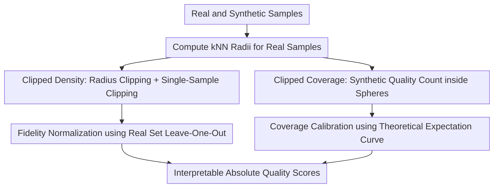

# Enhanced Generative Model Evaluation with Clipped Density and Coverage

**Conference**: ICLR2026  
**OpenReview**: [https://openreview.net/forum?id=cwOSdyuNh6](https://openreview.net/forum?id=cwOSdyuNh6)  
**Code**: https://github.com/nicolassalvy/ClippedDensityCoverage  
**Area**: Generative Model Evaluation / Image Generation  
**Keywords**: Generative model evaluation, Fidelity, Coverage, Outlier robustness, Absolute interpretable metrics

## TL;DR
This paper proposes Clipped Density and Clipped Coverage metrics for evaluating generative models. By clipping single-sample contributions, limiting the radius of outlier nearest-neighbor spheres, and performing linear calibration, fidelity and coverage scores are made robust against outliers and interpretable as the "equivalent proportion of good samples."

## Background & Motivation
**Background**: Generative models have advanced rapidly across domains such as images, medical imaging, and music. However, model quality evaluation still frequently relies on single composite scores like FID and FD-DINOv2. While composite scores are suitable for ranking, they struggle to inform researchers whether issues stem from poor sample realism or insufficient mode coverage. Consequently, recent approaches typically split quality into two dimensions: fidelity, which measures how well synthetic samples resemble real data, and coverage, which measures the extent to which synthetic samples cover the real data distribution.

**Limitations of Prior Work**: Existing metrics like Precision/Recall, Density/Coverage, and their variants usually employ $k$-nearest neighbor (kNN) spheres in a feature space to approximate the support set or local density of unknown distributions. This approximation is fragile: outlier samples in real data, being far from neighbors, form spheres with massive radii, incorrectly categorizing many synthetic samples as high fidelity. Conversely, poor samples in synthetic data can inflate the synthetic support set, leading coverage metrics to mistakenly believe real data is covered. Furthermore, Density can exceed 1, and Coverage only checks for the existence of a single synthetic sample in a sphere, making the absolute values of both difficult to interpret.

**Key Challenge**: Generative model evaluation must simultaneously satisfy "sensitivity to bad samples" and "robustness to outliers." Standard kNN sphere metrics fail here: if spheres are too large, a few outliers will dominate the global score; if only binary coverage is checked, density mismatches are ignored. More importantly, even a top-ranked model on a leaderboard may have poor absolute quality; uncalibrated metrics struggle to answer "how good is this score actually."

**Goal**: The authors aim to construct a pair of fidelity/coverage metrics that satisfy three specific requirements. First, outlier real samples or bad synthetic samples should not significantly distort the average score. Second, if there is a proportion $x$ of bad samples in the synthetic set, the score should decrease linearly as $1-x$. Third, the final scores should be normalized to $[0,1]$, allowing a score of $0.4$ to be naturally interpreted as a quality level "equivalent to 40% good samples and 60% bad samples."

**Key Insight**: Rather than discarding the kNN sphere framework of Density/Coverage, the authors analyze specifically where they fail: errors do not stem from the "kNN sphere" concept itself, but from the fact that a single sample or sphere can contribute an outsized score. Thus, this paper introduces local modifications—clipping contributions, clipping radii, and recalibrating absolute scores—to transform metrics that were primarily for relative comparison into interpretable absolute evaluation tools.

**Core Idea**: Replace the unbounded or uncalibrated aggregation of original Density/Coverage with "a maximum of 1 point contribution per sample + radius clipping for outlier kNN spheres + linear calibration of final curves."

## Method

### Overall Architecture
The paper starts from two sets of samples: a real set $\{x_i^r\}_{i=1}^N$ and a synthetic set $\{x_j^s\}_{j=1}^M$. Local neighborhoods are characterized using $k$-nearest neighbor spheres of real samples in the feature space. The difference is that Clipped Density evaluates the degree to which each synthetic sample falls near the real distribution, while Clipped Coverage evaluates whether each real sample's neighborhood is sufficiently covered by synthetic samples; both clip single-point contributions to 1 and calibrate scores into interpretable proportions.

Regarding the computation flow, both metrics first establish $k$-nearest neighbor spheres around real samples. Clipped Density further constrains the real sphere radii to a robust upper bound and checks how many "clipped real spheres" each synthetic sample falls into. Clipped Coverage retains the fixed quality meaning of real spheres, counts the synthetic samples within each real sphere, and clips the coverage contribution. Finally, Clipped Density is empirically normalized using the self-evaluation score of real data, while Clipped Coverage is transformed into a linear score using an analytical expectation curve.

### Key Designs
**1. Clipped Density: Preventing High-Density Synthetic Points from Masking Bad Samples**

Original Density counts how many real $k$-NN spheres each synthetic sample falls into, divides by $k$, and then averages. This is more detailed than binary Precision but contains a clear flaw: if some synthetic samples are concentrated in real high-density regions, their single-sample scores may exceed 1. These "over-represented" high-score samples can offset bad samples far from the real distribution when averaging. The paper uses a 2D example showing that if one out of three synthetic points is a bad sample while the other two each score $3/2$, the original Density average remains 1, appearing as a perfect model.

The first modification in Clipped Density is to clip the fidelity contribution of each synthetic sample to 1. If a synthetic sample $x_j^s$ falls into several real spheres, the original local score is $\frac{1}{k}\sum_i \mathbf{1}_{x_j^s \in B(x_i^r, \mathrm{NND}_k^r(x_i^r))}$. This is modified to take the $\min(\cdot,1)$ of this local score before averaging over synthetic samples. Thus, an extremely "realistic" sample can only prove itself as a good sample and cannot compensate for other bad samples.

The second modification targets large spheres caused by real outliers. The authors clip each real sample's $k$-NN radius $\mathrm{NND}_k^r(x_i^r)$ to the median of all real $k$-NN radii: $R_k(x_i^r)=\min(\mathrm{NND}_k^r(x_i^r),\mathrm{median}(\{\mathrm{NND}_k^r(x_l^r)\}_{l=1}^N))$. This step is critical because high-dimensional sphere volume scales with $r^d$; a single outlier real point's sphere could cover many irrelevant synthetic points. By using the median radius as a robust upper bound, outlier real points can no longer dominate global fidelity with massive volumes.

**2. Clipped Density Normalization: Transforming Unbounded Density into Readable Proportions**

Even with single-sample clipping, the unnormalized average value of Clipped Density depends on the dataset, feature space, and choice of $k$. The authors do not assume the ideal value is necessarily 1, but use the real data itself for leave-one-out calibration: treating each real sample as an evaluation sample and counting its coverage by the clipped spheres of other real samples, yielding $\mathrm{ClippedDensity}_{real}$.

The final fidelity score is defined as $\mathrm{ClippedDensity}=\min(\mathrm{ClippedDensity}_{unnorm}/\mathrm{ClippedDensity}_{real}, 1)$. This normalization offers two benefits: it sets the "real data evaluating real data" level as a reference upper bound, reducing the impact of dataset scale and $k$ on absolute values; and it preserves the linear interpretation of bad samples, as the unnormalized score is a point-wise average of synthetic samples where a proportion $x$ of bad samples directly lowers the score by approximately $x$.

**3. Clipped Coverage: Moving from Binary Coverage to Fixed-Quality Coverage Degree**

Original Coverage only asks "is there at least one synthetic sample in the real sample's sphere," which reduces the coverage problem to binary support set judgment. Having 1 synthetic sample versus $k$ synthetic samples in a real sphere is equivalent for Coverage; thus, it fails to reflect whether high-density regions are sufficiently filled according to real density. This paper modifies this to count the number of synthetic samples in each real sphere and compares it with the quality of $k$ real neighbors naturally contained in that sphere.

Specifically, the uncalibrated Clipped Coverage is written as $\mathrm{ClippedCoverage}_{unnorm}=\frac{1}{N}\sum_i \min(\frac{1}{k}\sum_j \mathbf{1}_{x_j^s\in B(x_i^r,\mathrm{NND}_k^r(x_i^r))},1)$. Here, the original real $k$-NN radius is used without radius clipping because, from a coverage perspective, each real sphere represents a fixed real quality $k$. The authors want to compare the filling degree of synthetic data within this fixed-quality neighborhood. Clipping the contribution of each real sphere to 1 prevents a few regions filled with many synthetic samples from masking uncovered regions.

**4. Clipped Coverage Calibration: Using Theoretical Expectations for Linear Bad-Sample Proportions**

The difficulty with Clipped Coverage is that unnormalized scores are not naturally linear. Because of finite-sample stochasticity, even if real and synthetic distributions are identical, some real spheres may contain fewer than $k$ synthetic samples while others contain more. After the $\min(\cdot,1)$ operation, the expectation curve bends. The authors derive a finite-sample expectation: when real and synthetic samples come from the same distribution, the expectation of $\mathrm{ClippedCoverage}_{unnorm}$ can be written as a combination involving beta functions.

The calibration logic asks a counterfactual question: if the synthetic set contains only $m=\lfloor M(1-x)\rfloor$ good samples and the rest are bad samples falling completely outside the real spheres, what should be the unnormalized coverage expectation? The authors denote this curve as $f_{expected}(x)$. Finally, they numerically construct an inverse function calibration $g$ such that $g(f_{expected}(x))=1-x$. The resulting $\mathrm{ClippedCoverage}=g(\mathrm{ClippedCoverage}_{unnorm})$ is not just a relative coverage score but a coverage score that can be interpreted linearly according to the proportion of bad samples.

### Loss & Training
This paper does not train a new generative model and thus lacks a conventional loss function or training strategy. Its "optimization objectives" are the metric design goals: robustness, linear degradation, and $[0,1]$ normalization. In the experimental implementation, the authors use $k=5$ by default. For image evaluation, they use DINOv2 ViT-L/14 embeddings as the feature space and implement metrics using nearest neighbor search and sphere radius queries. The appendix notes that implementation based on scikit-learn's `NearestNeighbors` reduces memory pressure from $O(N^2)$ to closer to $O(Nd)$, which is crucial for evaluating 50,000 images with 1024-dimensional DINOv2 features.

## Key Experimental Results

### Main Results
The main experiments are split into two layers. The first layer is a "metric sanity test": introducing bad samples, mode collapse, outliers, and distribution shifts in a controlled manner to check if scores change as expected. The second layer evaluates real generative models on CIFAR-10, ImageNet, LSUN Bedroom, and FFHQ to observe if the new metrics provide a stable and interpretable fidelity/coverage landscape.

| Test Scenario | Desired Behavior | Stable Fidelity Metric | Stable Coverage Metric | Conclusion |
| :--- | :--- | :--- | :--- | :--- |
| Adding bad samples to CIFAR-10 | Score decreases linearly with proportion | Most average fidelity metrics including Clipped Density | Only Clipped Coverage is clearly linear | Coverage calibration is necessary |
| Mode collapse on CIFAR-10 | Fidelity should not mismeasure coverage | Clipped Density passes | N/A | symPrecision and Precision Cover conflate coverage signals |
| Outliers added to real/synthetic simultaneously | Score should remain near maximum | Clipped Density passes | Clipped Coverage passes | New metrics are more robust to matched outlier components |
| Gaussian shift with outliers | Scores should be symmetric and shift-sensitive | Clipped Density passes | Clipped Coverage passes | Original Precision/Recall become asymmetric due to large spheres or bad samples |

In evaluation of real generative models, the authors display a fidelity-coverage plane. A key discovery is that while original Density often exceeds 1 on datasets like CIFAR-10 and ImageNet, Clipped Density remains within an interpretable range. The authors also note that the best models on CIFAR-10 and FFHQ have Clipped Density/Clipped Coverage values around $0.4$, implying that even if these models are strong in relative comparisons, they only reach a quality level equivalent to ~40% good samples under this absolute interpretation.

| Dataset / Scenario | Representative Result | Clipped Density / Coverage Interpretation | Remarks |
| :--- | :--- | :--- | :--- |
| CIFAR-10 / FFHQ | Best models ~0.4 | Equivalent to 40% good samples, 60% bad samples | Reveals absolute quality gap beyond relative leaderboards |
| ImageNet | Reaches near 1.0 | Strong models on large data show coverage/fidelity closer to real set | DiT-XL-2 guided sampling fidelity can exceed unclipped upper bounds |
| LSUN Bedroom | Max ~0.7 | Closer to real distribution than CIFAR-10/FFHQ | Likely related to larger training data size |
| Chest X-Ray Generation | CD 0.06, CC 0.03 | Equivalent to only 6% / 3% good samples | Absolute interpretability is vital in high-risk medical scenarios |

### Ablation Study
The key ablations focus on the step-by-step modification from Density to Clipped Density. Using real generative data, the authors show that high original Density scores often stem from large spheres caused by real outliers; once radius and single-sample clipping are applied, many models that appeared high-fidelity see significant score drops.

| Configuration | Key Metric | Description |
| :--- | :--- | :--- |
| Original Density | CIFAR-10 RESFLOW: 2.47, ACGAN-Mod: 2.28 | Scores > 1, heavily inflated by a few real outliers |
| Radius Clipping only | RESFLOW on CIFAR-10 drops to 0.00 | Shows original high score came from outlier spheres, not real fidelity |
| + Single-sample clipping | Yields $\mathrm{ClippedDensity}_{unnorm}$ | High-density repetitive samples can no longer mask bad samples |
| Full Clipped Density | CIFAR-10 PFGMPP: 0.39, LSGM-ODE: 0.38 | Scores enter interpretable range, facilitating cross-model comparison |

The authors analyze a specific case: RESFLOW-generated CIFAR-10 data has an original Density of 2.47. In the real data, 4 real samples have 5-neighbor spheres each containing over 10,000 synthetic points. These real samples appear to be outlier images (grey ships, camouflaged cats, etc.). After radius clipping, these outlier spheres no longer dominate, and Clipped Density drops to near 0.

### Key Findings
- Clipped Density and Clipped Coverage are the only pair of metrics in the test suite that behave as expected across all major sanity checks. They do not mistake mode dropping for fidelity loss and maintain linear degradation when bad samples are added.
- Density > 1 is not a minor issue but a serious signal that can change model assessment. Original Density for models like RESFLOW and WGAN-GP on CIFAR-10 is significantly inflated by outliers, leading to different evaluations after clipping.
- The theoretical calibration of Clipped Coverage is a key differentiator from simple heuristics. The uncalibrated score does not follow a straight line relative to bad sample proportions; it only achieves the "score = equivalent good sample ratio" interpretation after correction via the beta-binomial expectation curve.
- Good correlation with human evaluation. In the appendix, except for FFHQ, the correlation coefficients between Clipped Density/Coverage and human error rates from Stein et al. mostly exceed 0.8, showing the metrics aren't just effective on synthetic sanity tests.
- Extensions to music, time series, rare mode omission, and wrong correlation structures show it is not just an image-specific metric tuned for CIFAR-10.

## Highlights & Insights
- The strongest aspect of this paper is not the proposal of a complex new model, but the pinpointing of exactly *why* metrics are untrustworthy: single-sample contribution and neighborhood sphere radius. While many metric papers remain at empirical comparison, this paper explains how one bad sample can be masked by two high-score samples.
- The calibration design of Clipped Coverage is elegant. Coverage metrics naturally incur finite-sample bias after clipping; instead of empirical fitting, the authors derive the expectation of synthetic samples in a sphere under same-distribution sampling and apply a numerical inverse transform. This makes "absolute interpretability" more than a slogan.
- Interpreting a "score of $x$ as equivalent to a proportion $x$ of good samples" is highly practical. It provides a reference frame for users, which is especially suitable for domains like medical imaging where relative rankings are insufficient.
- This methodology can be transferred to other evaluation problems. Any metric aggregated from local sample contributions can be checked for "excessive single-point contribution," "excessive outlier radius," and "uncalibrated absolute values."

## Limitations & Future Work
- Metrics still rely on the feature space. While experiments use DINOv2, different embedding models change the nearest neighbor structure. Medical or music domains require reliable domain-specific feature extractors. If an embedding ignores certain artifacts, these metrics will too.
- The paper lacks a full theoretical analysis in the infinite sample limit. Calibration for Clipped Coverage is based on the idealized assumption that bad samples fall completely outside real spheres.
- Fidelity and coverage do not represent the entirety of generative model quality. The authors admit they do not cover memorization, training data leakage, or authenticity certification; a model could have good Clipped Density/Coverage while still copying training data.
- Computational costs are not negligible. Completing all experiments was estimated to take ~120 hours; while the implementation reduces memory needs, high-dimensional feature evaluation for 50,000 samples is still not a lightweight operation.
- Thresholds for absolute scores still need to be defined by application scenarios. A score of 0.4 is interpretable as 40% equivalent good samples, but whether "0.4 is acceptable" depends on downstream risks and user needs.

## Related Work & Insights
- **vs FID / FD-DINOv2**: FID-style metrics provide overall distribution distance for rough ranking but mix realism and diversity. This paper decouples them into fidelity and coverage dimensions with interpretable absolute values.
- **vs Improved Precision / Recall**: These use kNN spheres to approximate support sets, which is intuitive but easily disrupted by outlier-inflated spheres. Ours inherits the framework but solves robustness issues via radius and contribution clipping.
- **vs Density / Coverage**: These are more granular than binary support sets, but Density is unbounded and Coverage is insensitive to density deficiency. Clipped Density/Coverage can be viewed as "robustified + normalized + linearly calibrated" versions.
- **Mechanism**: Metric design should first define "how the score should change under ideal controlled conditions" and then derive the formula, rather than just checking if rankings seem reasonable. This principle is valuable for benchmark design beyond generative models.

## Rating
- **Novelty**: ⭐⭐⭐⭐☆ The modifications themselves aren't complex, but the combination of "clipped contribution + radius clipping + theoretical calibration" precisely solves the core pain point of absolute interpretation.
- **Experimental Thoroughness**: ⭐⭐⭐⭐⭐ Covers synthetic sanity tests, real image generation, human evaluation correlation, medical imaging, music, time series, and various failure modes.
- **Writing Quality**: ⭐⭐⭐⭐☆ Clear narrative; formulas correspond well with failure cases. The appendix is rich, though calibration derivations might have a threshold for readers outside the evaluation field.
- **Value**: ⭐⭐⭐⭐⭐ Highly valuable for generative model evaluation, especially in high-risk applications, as it moves from "which model is better" to "is this absolute quality actually good enough."

<!-- RELATED:START -->

## Related Papers

- [\[ICML 2026\] DiScoFormer: Plug-In Density and Score Estimation with Transformers](../../ICML2026/image_generation/discoformer_plug-in_density_and_score_estimation_with_transformers.md)
- [\[ICLR 2026\] Verification of the Implicit World Model in a Generative Model via Adversarial Sequences](verification_of_the_implicit_world_model_in_a_generative_model_via_adversarial_s.md)
- [\[ICLR 2026\] Continuously Augmented Discrete Diffusion model for Categorical Generative Modeling](continuously_augmented_discrete_diffusion_model_for_categorical_generative_model.md)
- [\[AAAI 2026\] GEWDiff: Geometric Enhanced Wavelet-based Diffusion Model for Hyperspectral Image Super-resolution](../../AAAI2026/image_generation/gewdiff_geometric_enhanced_wavelet-based_diffusion_model_for_hyperspectral_image.md)
- [\[ICLR 2026\] GGBall: Graph Generative Model on Poincaré Ball](ggball_graph_generative_model_on_poincaré_ball.md)

<!-- RELATED:END -->
