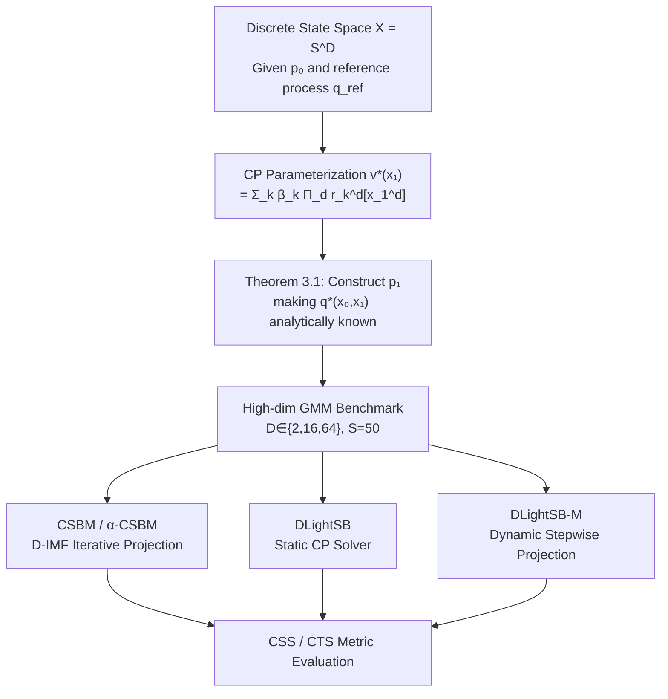

# Entering the Era of Discrete Diffusion Models: A Benchmark for Schrödinger Bridges and Entropic Optimal Transport

**Conference**: ICLR 2026  
**Code**: [gregkseno/catsbench](https://github.com/gregkseno/catsbench)  
**Area**: Discrete Diffusion / Optimal Transport  
**Keywords**: Discrete Schrödinger Bridge, Entropic Optimal Transport, Discrete Diffusion Models, Benchmarking, CP Tensor Decomposition

## TL;DR

The first evaluation benchmark for Schrödinger Bridge (SB) / Entropic Optimal Transport (EOT) in discrete space: it utilizes CP decomposition to construct distribution pairs with analytically known optimal solutions and simultaneously proposes three new algorithms: DLightSB, DLightSB-M, and α-CSBM.

## Background & Motivation

**Background**: Discrete diffusion/flow models (D3PM, DiGress, Discrete Flow Matching, etc.) have developed rapidly in recent years, driving significant progress in downstream tasks such as text generation, molecular graphs, protein sequences, and VQ image representations. The SB/EOT framework, which connects generative modeling with optimal transport theory, has established mature evaluation systems in continuous spaces, but the discrete space version remains completely blank.

**Limitations of Prior Work**: Existing discrete SB methods (DDSBM, CSBM, etc.) rely on proxy metrics like FID and MSE for evaluation—metrics that are strongly interfered with by implementation details like model parameterization and regularization. They fail to directly reflect whether a method truly solves the underlying EOT/SB problem, making performance gaps between methods difficult to attribute.

**Key Challenge**: The number of states in discrete space is $S^D$. Constructing distribution pairs with known optimal solutions in high dimensions is extremely difficult to handle (tractability), as previous approaches could not bypass the bottleneck of exhausting the entire state space.

**Goal**: Establish the first discrete space SB/EOT benchmark by providing distribution pairs with analytically known optimal conditional distributions $q^*(x_1|x_0)$, enabling direct quantitative evaluation of solvers.

**Key Insight**: Utilize CANDECOMP/PARAFAC (CP) tensor decomposition to parameterize the optimal score function $v^*(x_1)$ as a low-rank structure $v^*(x_1) = \sum_k \beta_k \prod_d r_k^d[x_1^d]$. This bypasses the enumeration of the full state space, turning benchmark construction and solver training into feasible stochastic optimization problems.

## Method

### Overall Architecture

The paper's contributions are divided into two layers: **Benchmark Construction** (given $p_0$, construct $p_1$ and the known optimal $q^*$ via CP parameterization) and **Solvers** (evaluation of CSBM, α-CSBM, DLightSB, and DLightSB-M on the benchmark). The two layers are tightly coupled through the same CP parameterization—DLightSB is derived directly from the benchmark construction and serves as a good approximation of the oracle method.

### Key Designs

**1. Benchmark Construction Theorem (Main Theorem): From CP Decomposition to Known Optimal Solutions**

The optimal process for the discrete dynamic SB problem given a reference process $q_\text{ref}$ satisfies:

$$q^*(x_0, x_1) \propto p_0(x_0) \cdot q_\text{ref}^{N+1}(x_1|x_0) \cdot v^*(x_1)$$

where $v^*$ is a "score function" over $p_1$. The key insight is: **if $v^*$ is chosen first and $p_1$ is سپس derived from it, $q^*$ becomes analytically known**. The problem reduces to making the normalization constant of $p_1(x_1) = \sum_{x_0} p_0(x_0) q_\text{ref}^{N+1}(x_1|x_0) v^*(x_1)$ computable. CP decomposition represents $v^*$ as a sum of $K$ rank-1 terms, each dimension independent, reducing the normalization constant calculation from $O(S^D)$ to $O(K \cdot D \cdot S)$. In high dimensions ($D=64, S=50$), this drops from $50^{64} \approx 10^{108}$ to a few hundred operations, making benchmark construction practically feasible for the first time.

**2. DLightSB: A Static Solver Derived Directly from Benchmark Parameterization**

DLightSB parameterizes the learned conditional distribution $q_\theta(x_1|x_0)$ with the same CP structure as the benchmark, then minimizes $\text{KL}(q^* \| q_\theta)$. Proposition 4.1 provides a feasible objective that does not require knowing $q^*$ itself:

$$\mathcal{L}(\theta) = \mathbb{E}_{p_0}[\log c_\theta(x_0)] - \mathbb{E}_{p_1}[\log v_\theta(x_1)]$$

where $c_\theta(x_0)$ is the normalization constant obtained using the matrix product of the reference process transition matrix and CP core vectors ($O(K \cdot D \cdot S)$ computation). Training only requires sampling from $p_0$ and $p_1$ without paired data, and the objective is optimizable via SGD. Since DLightSB shares the inductive bias of the benchmark, its performance is close to the oracle on its own benchmark, a potential bias corrected using an "Inverse Benchmark" (Appendix D.1).

**3. DLightSB-M: Dynamic Extension and Stepwise Optimal Projection**

DLightSB-M extends the static solver to a dynamic path space. Proposition 4.2 shows that projecting any reciprocal process $r \in \mathcal{R}_\text{ref}$ directly onto the set of all SBs $\mathcal{S}$ yields the SB $q^*$ between $p_0$ and $p_1$ (generalizing the conclusion of Gushchin et al. 2024a from Gaussian to arbitrary Markov reference processes). Using the closed-form transition distribution of CP parameterization:

$$q^*(x_{t_n}|x_{t_{n-1}}) \propto q_\text{ref}(x_{t_n}|x_{t_{n-1}}) \sum_k \beta_k \prod_d u_{k,t_n}^d[x_{t_n}^d]$$

where $u_{k,t_n}^d[x] = \sum_{x_1} q_\text{ref}^{N+1-n}(x_1|x) r_k^d[x_1]$ is precomputed via backward matrix power iteration ($O(N \cdot K \cdot D \cdot S^2)$). This expresses the entire optimal path using finite matrix operations, supporting ancestral sampling.

**4. α-CSBM: Online Update Strategy to Reduce CSBM Computational Overhead**

CSBM (Ksenofontov & Korotin, 2025) solves SB through Discrete-time Iterative Markov Fitting (D-IMF), alternating projections between the reciprocal set $\mathcal{R}_\text{ref}$ and the Markov set $\mathcal{M}$. However, each round requires full training of two neural networks in both directions to convergence, doubling the cost. α-CSBM adopts α-IMF (De Bortoli et al., 2024) from continuous space, replacing exact projections with single-step online updates. The bidirectional models are optimized simultaneously using a joint objective:

$$\mathcal{L}(\theta) = \frac{1}{2}\left[\text{KL}(\overrightarrow{r}_\text{sg} \| \overleftarrow{q}_\theta) + \text{KL}(\overleftarrow{r}_\text{sg} \| \overrightarrow{q}_\theta)\right]$$

where $r_\text{sg} = \text{proj}_{\mathcal{R}_\text{ref}}(q_\theta)$ applies a stop-gradient to prevent bidirectional gradient interference. Experiments confirm that α-CSBM achieves performance comparable to CSBM with roughly half the computation.

## Key Experimental Results

### Main Results

High-dimensional Gaussian Mixture Model (GMM) benchmark ($D \in \{2, 16, 64\}$, $S=50$, $K=4$ mixture components, Gaussian reference process with $\gamma=0.02$). Metrics: Conditional Shape Score (CSS, ↑) and Conditional Trend Score (CTS, ↑), range $[0, 1]$.

| Method | D=2 CSS | D=16 CSS | D=64 CSS | D=2 CTS | D=16 CTS | D=64 CTS |
|------|---------|----------|----------|---------|----------|----------|
| DLightSB | **0.95** | **0.93** | **0.93** | **0.91** | **0.85** | **0.85** |
| DLightSB-M (KL) | 0.86 | 0.92 | 0.85 | 0.84 | 0.59 | 0.73 |
| CSBM (KL) | 0.72 | 0.87 | 0.88 | 0.59 | 0.69 | 0.84 |
| α-CSBM (KL) | 0.66 | 0.89 | 0.90 | 0.64 | 0.72 | 0.79 |
| Reference (baseline) | Low | Low | Low | Low | Low | Low |

### Ablation Study

| Configuration | Metric Trend | Description |
|------|----------|------|
| KL Loss vs MSE Loss | KL > MSE | MSE minimizes pointwise error, causing over-smoothing of modes and loss of sharp structures. |
| N=16 vs N=32 vs N=64 | Increased N improves metrics | More intermediate steps make the Markovian approximation more accurate. |
| γ=0.02 vs γ=0.05 | Varying sensitivity to γ | Small γ (low stochasticity) concentrates $q^*$, making it harder to approximate. |
| Uniform vs Gaussian Ref | Uniform ref is harder | Uniform reference lacks ordinal relationships between categories, providing less information. |

### Key Findings

- DLightSB achieves the best CSS/CTS in almost all settings, though its performance partially stems from sharing the CP inductive bias with the benchmark ("oracle bias").
- α-CSBM achieves performance comparable to CSBM with half the computational cost, making it an efficient practical alternative.
- KL loss consistently outperforms MSE across all methods and dimensions; MSE causes significant mode blurring, especially in low-stochasticity settings.
- As dimension $D$ increases, the performance of all methods tends to decrease, indicating that high-dimensional discrete spaces remain a major unsolved challenge.
- The benchmark clarifies the systematic failure of three proxy baselines (Reference, Independent, Feature-wise SB), proving the benchmark design has strong discriminative power.

## Highlights & Insights

- CP decomposition plays a "dual role" in discrete SB benchmark construction: it makes benchmark construction feasible (construction side) and naturally leads to the efficient static solver DLightSB (solver side), a rare example of theory and algorithm mutually reinforcing each other.
- The paper explicitly distinguishes the core difference between "benchmarks" and "proxy metrics": FID/MSE only measure endpoint distribution quality, while CSS/CTS measure the deviation of the conditional distribution $q(x_1|x_0)$ from the known optimal $q^*$, directly reflecting whether the SB problem is correctly solved.
- The continuous space LightSB (Korotin et al., 2024) and LightSB-M (Gushchin et al., 2024a) are systematically migrated to discrete space, with key theorems (optimal projection theorem of Proposition 4.2) generalized from Gaussian to arbitrary Markov references.

## Limitations & Future Work

- DLightSB(-M) faces severe memory bottlenecks in high dimensions: $u_{k,t_n}^d$ in the CP parameterization requires precomputing $N \times K \times D \times S^2$ matrix multiplications, approaching feasibility limits at $D=64, S=50$.
- The benchmark is currently limited to abstract high-dimensional GMMs and has not been validated end-to-end on real data (text, molecules, VQ images).
- The dimension-independent factorization approximation in CSBM/α-CSBM ($q_\theta(x_{t_n}|x_{t_{n-1}}) = \prod_d$) introduces systematic approximation errors, which may become a bottleneck on highly correlated data.
- The benchmark currently only covers distribution pairs satisfying CP structures; evaluating more general discrete distributions (e.g., real text corpora) requires new construction methods.

## Related Work & Insights

- **vs DDSBM (Kim et al., 2024)**: Continuous-time version of IMF applied to discrete SB. Equivalent to CSBM in discrete time; this paper compares directly with CSBM.
- **vs CSBM (Ksenofontov & Korotin, 2025)**: Ours (α-CSBM) builds directly on CSBM, introducing online updates to its bidirectional training framework to achieve comparable quality at half cost.
- **vs Continuous SB Benchmark (Gushchin et al., 2023b)**: This is the discrete counterpart, sharing construction principles but using CP decomposition to solve computability in discrete space.
- **vs LightSB (Korotin et al., 2024) / LightSB-M (Gushchin et al., 2024a)**: DLightSB/DLightSB-M are their discrete counterparts; the proofs are discrete generalizations.

## Rating

- Novelty: ⭐⭐⭐⭐ First discrete SB/EOT benchmark, filling a gap in the field. Creative use of CP decomposition as a dual tool.
- Experimental Thoroughness: ⭐⭐⭐ Comprehensive comparison across dimensions, references, and methods, though limited to synthetic data.
- Writing Quality: ⭐⭐⭐⭐ Rigorous theoretical derivation, clear notation, and good division between main text and appendix.
- Value: ⭐⭐⭐⭐ Provides a reliable evaluation tool for the fast-growing discrete diffusion generation field; DLightSB(-M) and α-CSBM have direct practical utility.

<!-- RELATED:START -->

## Related Papers

- [\[ICLR 2026\] Diffusion & Adversarial Schrödinger Bridges via Iterative Proportional Markovian Fitting](diffusion_adversarial_schrödinger_bridges_via_iterative_proportional_markovian_f.md)
- [\[ICLR 2026\] Branched Schrödinger Bridge Matching](branched_schrödinger_bridge_matching.md)
- [\[ICML 2026\] Geometry-based Schrödinger Bridges for Trustworthy Multimodal Fusion](../../ICML2026/image_generation/geometry-based_schrödinger_bridges_for_trustworthy_multimodal_fusion.md)
- [\[ICLR 2026\] AlignFlow: Improving Flow-based Generative Models with Semi-Discrete Optimal Transport](alignflow_improving_flow-based_generative_models_with_semi-discrete_optimal_tran.md)
- [\[NeurIPS 2025\] Grasp2Grasp: Vision-Based Dexterous Grasp Translation via Schrödinger Bridges](../../NeurIPS2025/image_generation/grasp2grasp_vision-based_dexterous_grasp_translation_via_schrödinger_bridges.md)

<!-- RELATED:END -->
