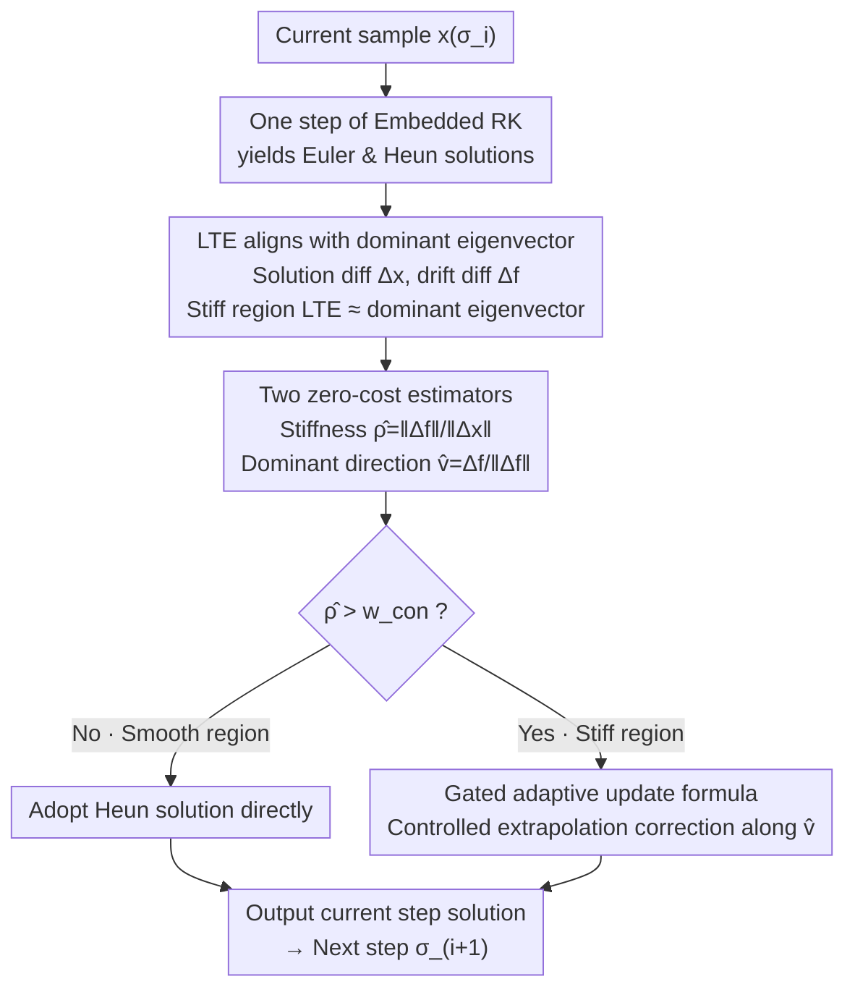

# Error as Signal: Stiffness-Aware Diffusion Sampling via Embedded Runge-Kutta Guidance

**Conference**: ICLR2026  
**arXiv**: [2603.03692](https://arxiv.org/abs/2603.03692)  
**Code**: [mlvlab/ERK-Guid](https://github.com/mlvlab/ERK-Guid)  
**Area**: Image Generation  
**Keywords**: diffusion sampling, stiffness, local truncation error, embedded Runge-Kutta, guidance  

## TL;DR

ERK-Guid is proposed to utilize the step difference error of embedded Runge-Kutta solvers as a guidance signal to adaptively correct local truncation error (LTE) in stiff regions, enhancing diffusion model sampling quality without requiring additional network evaluations.

## Background & Motivation

- Diffusion model sampling is essentially solving an ODE/SDE, where sampling quality depends on both model accuracy and numerical solver precision.
- Methods like Classifier-Free Guidance (CFG) and Autoguidance (AG) focus on **model error** (differences between conditional/unconditional predictions) but completely ignore **solver error** (LTE).
- In the **stiff regions** of the ODE, where the drift direction changes abruptly, the LTE of numerical solvers significantly degrades sampling quality.
- Key Insight: In stiff regions, LTE is highly aligned with the dominant eigenvector of the drift Jacobian, implying that this directional information can be leveraged to correct errors.

## Core Problem

Existing guidance methods (CFG, AG, etc.) only utilize model-level signals to guide sampling, while the LTE generated by solvers in stiff regions remains unaddressed. How can solver error information be used as a guidance signal to reduce LTE without increasing the number of function evaluations (NFEs)?

## Method

### Overall Architecture

ERK-Guid converts neglected solver errors in diffusion sampling into a guidance signal. When solving with Heun (an embedded second-order Runge-Kutta method) at each step, both the Euler first-order solution and the Heun second-order solution are obtained. The difference between the two carries information regarding the direction and magnitude of the local truncation error (LTE). Based on this, it estimates whether the current state is in a stiff region and identifies the dominant error direction online, performing a zero-cost correction along that direction only in stiff regions. The entire process introduces no additional network forward passes. The sampling pipeline proceeds as shown below:

### Key Designs

**1. LTE Alignment with Dominant Eigenvector: Locking the Correctable Direction Theoretically**

To use "error" as a signal, the error must be structured and predictable. For the Heun method, both an Euler first-order solution and a Heun second-order solution are produced in the same step, forming an embedded Runge-Kutta (ERK) pair. This defines the solution difference $\Delta^{\mathbf{x}} = \mathbf{x}^{\text{Heun}} - \mathbf{x}^{\text{Euler}}$ and the drift difference $\Delta^{\mathbf{f}} = f(\mathbf{x}^{\text{Heun}};\sigma) - f(\mathbf{x}^{\text{Euler}};\sigma)$. Under local linearization assumptions, both the true LTE and the ERK solution difference can be decomposed into the eigenbasis of the drift Jacobian. The amplification of each component is determined by $z_k = h\lambda_k$. When $|z_k|$ is large (i.e., in stiff regions), the component corresponding to the dominant eigenvector dominates the error. This means that LTE in stiff regions is nearly collinear with the Jacobian's dominant eigenvector. Thus, estimating this single direction allows for correcting the majority of the truncation error without solving the full Jacobian.

**2. Two Zero-Cost Estimators: Reusing Intermediate Solver Quantities for Stiffness and Error Direction**

Based on the alignment mentioned above, the method uses existing quantities from the ERK pair to estimate stiffness intensity and error direction simultaneously. Stiffness is approximated by the ratio of the norms of the drift difference and solution difference, reflecting the maximum eigenvalue of the Jacobian: $\hat{\rho}_{\text{stiff}} = \|\Delta^{\mathbf{f}}\|_2 / \|\Delta^{\mathbf{x}}\|_2$. A higher ratio indicates more drastic drift changes and higher stiffness. The dominant eigenvector is estimated using the normalized drift difference $\hat{\mathbf{v}}_{\text{stiff}} = \Delta^{\mathbf{f}} / \|\Delta^{\mathbf{f}}\|_2$. Since $\Delta^{\mathbf{f}}$ approximately equals the Jacobian acting on the solution difference, it functions like a single-step JVP power iteration, naturally amplifying and aligning with the dominant eigen-direction. Both $\Delta^{\mathbf{x}}$ and $\Delta^{\mathbf{f}}$ are already calculated during Heun integration, so the estimation involves **no additional network evaluations**, hence the "zero-cost" nature.

**3. Gated Adaptive Update Formula: Controlled Extrapolation in Stiff Regions**

The final correction is formulated as a directional extrapolation of the Heun solution:

$$\hat{\mathbf{x}}^{\text{Heun}}_{\sigma_{i+1}} = \mathbf{x}^{\text{Heun}}_{\sigma_{i+1}} - h \cdot \beta \cdot z^2 \cdot \langle f^{\text{Heun}}_{\sigma_i}, \hat{\mathbf{v}}_{\sigma_i} \rangle \cdot \hat{\mathbf{v}}_{\sigma_i}$$

The decision to correct and the magnitude of correction are adaptively controlled by stiffness. A confidence gate $\beta = \mathbf{1}_{\{\hat{\rho} > w_{\text{con}}\}}$ activates guidance only when stiffness exceeds the threshold $w_{\text{con}}$, preventing unnecessary corrections in smooth regions. Adaptive scaling $z = w_{\text{stiff}}\cdot h \cdot \hat{\rho}$ ensures the correction magnitude grows with step size and stiffness, with $w_{\text{stiff}}$ controlling overall intensity. Notably, $z^2$ is used instead of the theoretical $\alpha(z)$ to suppress over-amplification and ensure numerical stability when estimates are imprecise. Structurally, it performs extrapolation along the difference of two drift evaluations, resembling CFG/Autoguidance, but since the signal originates from solver error rather than model variance, it can be orthogonally combined with the latter.

## Key Experimental Results

### ImageNet 512×512 (EDM2 + Heun sampler)

| Steps | Method | FD-DINOv2↓ | FID↓ |
|------|------|-----------|------|
| 32 | No guidance | 90.1 | 2.58 |
| 32 | ERK-Guid ($w_{\text{stiff}}$=2.0) | **82.8** | 2.74 |
| 16 | No guidance | 97.4 | 2.79 |
| 16 | ERK-Guid ($w_{\text{stiff}}$=0.75) | **88.9** | **2.68** |
| 8 | No guidance | 161.2 | 7.06 |
| 8 | ERK-Guid ($w_{\text{stiff}}$=0.5) | **136.9** | **4.91** |

### Combination with CFG/Autoguidance (32 steps)

| Baseline Method | FD-DINOv2↓ | +ERK-Guid FD-DINOv2↓ |
|----------|-----------|---------------------|
| CFG | 88.5 | **83.9** |
| Autoguidance | 50.4 | **47.6** |

### Cross-Solver Adaptation (ImageNet 64×64, 6 NFEs)

| Solver | FID↓ | +ERK-Guid FID↓ |
|--------|------|---------------|
| Heun | 89.63 | **85.19** |
| DPM-Solver | 44.83 | **31.59** |
| DEIS | 12.57 | **9.56** |

Improvements are particularly significant in low-step scenarios (e.g., FID reduced from 7.06 to 4.91 at 8 steps), consistent with the expectation that LTE dominates error at small step counts.

## Highlights & Insights

1.  **Novel Perspective**: This is the first work to treat the truncation error of ODE solvers as a guidance signal, forming an orthogonal complement to CFG/AG based on model error.
2.  **Zero Computational Overhead**: All estimators are derived from quantities already produced in Heun updates, requiring no extra network forward passes.
3.  **Plug-and-Play**: It can be combined with any Runge-Kutta solver (Heun, DPM-Solver, DEIS, etc.) and is compatible with CFG and Autoguidance.
4.  **Solid Theory**: The theoretical basis for the alignment between LTE and the dominant eigenvector is derived from ODE numerical analysis and verified through 2D toy and ImageNet experiments.
5.  **Low-Step Advantage**: As the number of steps decreases, LTE accounts for a larger portion of the total error, making the improvements of ERK-Guid more pronounced.

## Limitations & Future Work

1.  Requires solvers that produce embedded pairs (e.g., Heun); not directly applicable to pure first-order solvers like Euler or DDIM.
2.  Hyperparameters $w_{\text{stiff}}$ and $w_{\text{con}}$ require tuning based on the model and step count; while robust in experiments, they add to the tuning burden.
3.  Theoretical analysis relies on the local linearization assumption, which may be less accurate in highly non-linear regions.
4.  Currently discussed for deterministic ODE sampling only; SDE sampler scenarios remain unexplored.
5.  Main experiments were conducted on the EDM2 framework; although PixArt-α (DiT) was tested, verification on other mainstream architectures (SD3, FLUX) is limited.

## Related Work & Insights

| Method | Signal Source | Extra Overhead | Complementarity |
|------|---------|---------|--------|
| CFG | Cond/Uncond model difference | 2× NFE | Complementary |
| Autoguidance | Strong/Weak model difference | Extra network | Complementary |
| PCG | Predictor-corrector interpretation of CFG | Same as CFG | Theoretically related |
| DPM-Solver | High-order numerical solver | None | Stackable |
| ERK-Guid (Ours) | Solver step difference error | None | Orthogonal to model guidance |

## Related Work & Insights

- Examining diffusion sampling from a numerical analysis perspective is a promising direction: further exploration into stiffness-aware adaptive step size scheduling is possible.
- Extending the "error as signal" concept to flow matching sampling or SDE solvers is worth exploring.
- In high-dimensional scenarios like video generation, the impact of LTE may be greater, giving ERK-Guid significant potential value.
- Integration with distillation methods (e.g., consistency models): in few-step distilled models, the error at each step becomes even more critical.

## Rating
- Novelty: ⭐⭐⭐⭐⭐ (Unique perspective using solver error as a guidance signal)
- Experimental Thoroughness: ⭐⭐⭐⭐ (Validated on ImageNet/FFHQ/PixArt and multiple solvers, but could include more architectures)
- Writing Quality: ⭐⭐⭐⭐⭐ (Clear theoretical derivation, logical progression from 2D toy to real data)
- Value: ⭐⭐⭐⭐ (Practical zero-cost plug-and-play method, high value for low-step scenarios)

<!-- RELATED:START -->

## Related Papers

- [\[CVPR 2026\] GeoRK2: Geometry-Guided Runge-Kutta Integration for Diffusion Transformer Acceleration](../../CVPR2026/image_generation/geork2_geometry-guided_runge-kutta_integration_for_diffusion_transformer_acceler.md)
- [\[ICLR 2026\] Efficient Approximate Posterior Sampling with Annealed Langevin Monte Carlo](efficient_approximate_posterior_sampling_with_annealed_langevin_monte_carlo.md)
- [\[ICLR 2026\] Stochastic Self-Guidance for Training-Free Enhancement of Diffusion Models](stochastic_self-guidance_for_training-free_enhancement_of_diffusion_models.md)
- [\[ICLR 2026\] A Noise is Worth Diffusion Guidance](a_noise_is_worth_diffusion_guidance.md)
- [\[ICML 2026\] Quantifying Error Propagation and Model Collapse in Diffusion Models](../../ICML2026/image_generation/quantifying_error_propagation_and_model_collapse_in_diffusion_models.md)

<!-- RELATED:END -->
