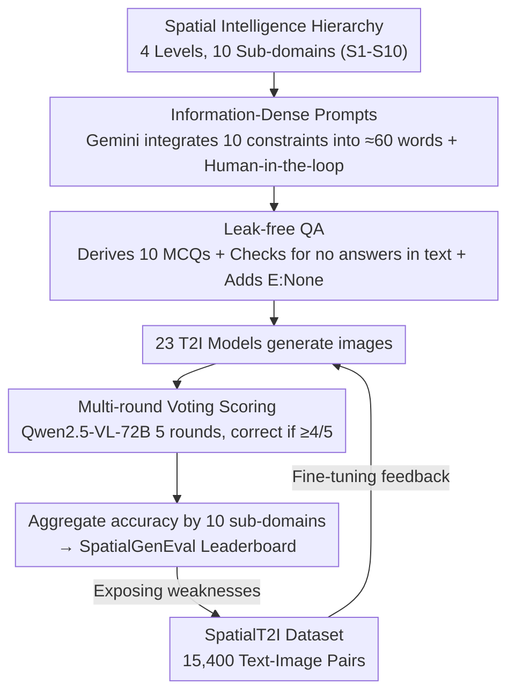

# Everything in Its Place: Benchmarking Spatial Intelligence of Text-to-Image Models

**Conference**: ICLR 2026  
**arXiv**: [2601.20354](https://arxiv.org/abs/2601.20354)  
**Code**: Available ([GitHub](https://github.com/AMAP-ML/SpatialGenEval))  
**Area**: Image Generation  
**Keywords**: Spatial Intelligence, Text-to-Image Generation, Benchmark Evaluation, Information-Dense Prompts, Data-Centric Paradigm

## TL;DR

SpatialGenEval is proposed as a benchmark covering 10 spatial sub-domains through 1,230 long, information-dense prompts. It systematically evaluates 23 SOTA T2I models, revealing that spatial reasoning is the primary bottleneck. Additionally, the SpatialT2I dataset is constructed to achieve data-centric improvements in spatial intelligence.

## Background & Motivation

Current T2I models excel at generating high-fidelity images and accurately rendering "what" is in a scene, but they frequently fail in precisely depicting spatial relationships, such as "where" objects are, "how" they are arranged, and "why" they interact. Even SOTA models like GPT-Image-1 and Qwen-Image suffer from object misalignment, incorrect orientations, failed numerical comparisons, or unsuccessful rendering of causal interactions.

Limitations of existing benchmarks:

**Sparse Prompt Information**: Benchmarks like T2I-CompBench and GenEval use short prompts that only verify object existence and simple attributes.

**Coarse Evaluation Granularity**: Most employ classification or Yes/No question-answering, which fails to capture high-order spatial capabilities.

**Lack of Systematic Spatial Intelligence Hierarchy**: They do not distinguish between different levels of spatial competence, such as perception, reasoning, and interaction.

## Method

### Overall Architecture

SpatialGenEval aims to address a question ignored by existing T2I benchmarks: models should not only draw "what" correctly but also "where" objects are, how they are arranged, and why they interact. The framework first decomposes spatial intelligence into 4 levels and 10 sub-domains. It then executes an evaluation pipeline: given one of 25 real-world scenes and definitions of the 10 sub-domains, Gemini 2.5 Pro seamlessly integrates all 10 spatial constraints into a single information-dense prompt of approximately 60 words. After human-in-the-loop auditing, each prompt automatically derives 10 multiple-choice questions covering all sub-domains (the prompt used for image generation is never disclosed to the evaluator to prevent answer leakage; each question includes an "E: None" option). Twenty-three T2I models generate images based on these prompts, which are then scored via 5-round voting by Qwen2.5-VL-72B. Final accuracy is aggregated across the 10 sub-domains to produce the SpatialGenEval leaderboard. High-quality text-image pairs from this pipeline are recycled into the SpatialT2I dataset to fine-tune models, creating an "Evaluation → Data → Model" closed loop.

### Key Designs

**1. Spatial Intelligence Hierarchy: Decomposing vague "spatial ability" into 10 measurable sub-domains**

Addressing the pain point of coarse granularity in existing benchmarks, SpatialGenEval categorizes spatial intelligence from the bottom up into 4 levels and 10 sub-domains: from basic object completeness and attribute binding to the perception level (position/direction/layout), the reasoning level (comparison/proximity/occlusion), and finally the interaction level (motion and causality). This progressive structure serves as the backbone of the benchmark—guiding constraint insertion, QA derivation, and final aggregation. It allows model failures to be accurately localized to specific levels rather than producing a generic total score. Experiments confirm that the "Reasoning Level" is a universal bottleneck.

Spatial Foundations (S1/S2):

| Sub-domain | Evaluation Content |
|------------|--------------------|
| S1 Object Categories | Compositional Integrity—whether all mentioned objects are generated |
| S2 Object Attributes | Attribute Binding—whether colors/shapes/materials are correctly linked |

Spatial Perception (S3/S4/S5):

| Sub-domain | Evaluation Content |
|------------|--------------------|
| S3 Spatial Position | Absolute and relative positioning |
| S4 Spatial Orientation | Rotational alignment (e.g., facing left, inverted) |
| S5 Spatial Layout | Multi-object arrangements (linear sequences, circles, etc.) |

Spatial Reasoning (S6/S7/S8):

| Sub-domain | Evaluation Content |
|------------|--------------------|
| S6 Spatial Comparison | Relative quantitative attributes (e.g., three times larger) |
| S7 Spatial Proximity | Fine-grained physical distance (touching, nearest, furthest) |
| S8 Spatial Occlusion | 3D depth and object layering |

Spatial Interaction (S9/S10):

| Sub-domain | Evaluation Content |
|------------|--------------------|
| S9 Motion Interaction | Dynamic states or moments in motion |
| S10 Causal Interaction | Causal physical relationships |

**2. Information-Dense Prompts and Human-in-the-Loop Audit: Revealing differences hidden by simple prompts**

Existing benchmarks use short, sparse prompts that only verify object existence, failing to distinguish high-order spatial capabilities. SpatialGenEval tasks Gemini 2.5 Pro with merging 10 spatial constraints into a single ~60-word long prompt for a given real-world scene. The 60-word length is deliberate: it maximizes information density without exceeding the ~77 token effective limit of CLIP encoders. Since pure machine-generated prompts can be awkward, human-in-the-loop auditing is introduced to merge fragmented sentences (e.g., changing "There is a robot. It is rusty." to "A rusty robot"), fix logically contradictory constraints (e.g., impossible circular layouts), and replace obscure terms with common ones (e.g., vermilion → bright red), resulting in 1,230 dense yet natural prompts.

**3. Leak-free QA and Multi-round Voting: Minimizing evaluator unreliability**

Reliable scoring is essential once images are generated. Ten MCQs are automatically derived for each prompt (one per sub-domain, totaling 12,300 questions) with two safeguards: manual inspection ensures question texts contain no explicit answers to prevent "clue-based" solving by evaluators; an "E: None" option is programmatically added to all questions, allowing evaluators to reject all options if they do not match the image, rather than forcing a random choice. The primary evaluator is the open-source Qwen2.5-VL-72B (ensuring reproducibility without relying on closed APIs). Instead of a single judgment, a 5-round voting mechanism is used—a question is considered correct only if the MLLM selects the right answer in at least 4 out of 5 rounds, reducing stochastic noise. Each model's final score per sub-domain is its accuracy rate.

**4. SpatialT2I Dataset: Turning evaluation byproducts into training data**

A benchmark's value is limited to "diagnosis" if no solution is provided for identified weaknesses. This work constructs 1,100 additional prompts using the same principles. Images are generated by 14 top-tier open-source models that achieved >50% accuracy on SpatialGenEval. These are filtered by Qwen2.5-VL-72B and prompts are rewritten by Gemini 2.5 Pro to ensure image-text alignment, resulting in 15,400 high-quality pairs. Fine-tuning SDXL, UniWorld-V1, and OmniGen2 on this data directly addresses the weaknesses exposed by the evaluation, completing the Evaluation → Data → Model loop.

## Key Experimental Results

### Main Results

**Table 2: SpatialGenEval Leaderboard (23 Models)**

| Model | Size | Overall | Foundations (S1/S2) | Perception (S3-S5) | Reasoning (S6-S8) | Interaction (S9/S10) |
|-------|------|---------|---------------------|--------------------|-------------------|----------------------|
| SD-1.5 | 0.86B | 28.5 | 8.5/33.7 | 19.5/29.2/38.2 | 12.8/37.7/15.6 | 42.0/47.6 |
| FLUX.1-dev | 12B | 56.5 | 51.7/73.8 | 50.0/55.5/66.7 | 28.2/62.9/28.9 | 73.1/73.8 |
| Qwen-Image | 20B | 60.6 | 61.0/77.2 | 55.6/56.7/69.7 | 28.6/67.7/30.8 | 78.1/80.2 |
| GPT-Image-1 | - | 60.5 | 56.3/74.1 | 53.3/58.9/70.4 | 31.4/66.8/30.2 | 80.9/82.2 |
| **Seed Dream 4.0** | - | **62.7** | 59.9/80.2 | 57.2/58.9/70.1 | 32.1/68.3/33.8 | 83.0/83.8 |

**Table 6: SpatialT2I Fine-tuning Performance**

| Model | Overall (Pre-tune) | Overall (Post-tune) | Gain |
|-------|--------------------|---------------------|------|
| SD-XL | 41.2 | 45.4 | +4.2% |
| UniWorld-V1 | 54.2 | 59.9 | +5.7% |
| OmniGen2 | 56.4 | 60.8 | +4.4% |

### Ablation Study

**Evaluator Consistency**: Model rankings provided by GPT-4o and Qwen2.5-VL-72B are perfectly consistent, validating the robustness of the evaluation.

**Human Alignment Study**: Gemini-2.5-Pro achieves 84.2% balanced accuracy, while Qwen2.5-VL-72B reaches 80.4%.

### Key Findings

1. **Spatial reasoning is the primary bottleneck**: Scores for Comparison (S6) and Occlusion (S8) are often below 30%, close to the random choice baseline of 20%.
2. **Open-source models are catching up to closed-source**: Qwen-Image (60.6%) vs. Seed Dream 4.0 (62.7%).
3. **Text encoders are critical**: Models using LLM-based encoders (e.g., Qwen-Image) significantly outperform those relying solely on CLIP.
4. **Unified architectures are more parameter-efficient**: The 7B Bagel (57.0%) performs close to the 12B FLUX.1-krea (58.5%).
5. **Data-centric paradigm is effective**: SpatialT2I fine-tuning consistently yields a 4-6 percentage point improvement.

## Highlights & Insights

1. **Information-Dense Prompt Design**: Integrating 10 spatial constraints into a single 60-word prompt prevents models from hiding deficiencies behind simple prompts.
2. **Hierarchical Spatial Intelligence Definition**: The progression from foundational → perceptual → reasoning → interaction is clear and extensible.
3. **"E: None" Option Engineering**: Avoids forced choices and significantly enhances evaluation accuracy.
4. **SpatialT2I Data Flywheel**: Evaluating the benchmark directly identifies data that can improve the models, creating a virtuous cycle.

## Limitations & Future Work

1. The highest score is only ~63%, indicating that the task remains extremely challenging.
2. The 60-word prompts may exceed the effective processing length of certain CLIP encoders (77 tokens).
3. While covering 25 scene categories, the benchmark could expand to more complex interaction scenarios.
4. Reliance on MLLMs for evaluation may introduce the evaluators' own inherent biases.
5. The quality of the SpatialT2I dataset is constrained by the current capabilities of existing generation models.

## Related Work & Insights

- **T2I-CompBench**: Uses short prompts and Yes/No evaluation, leading to insufficient coverage.
- **DPG-Bench**: Uses long prompts but relies on scoring methods with limited discriminative power.
- **TIIF-Bench**: Combines long and short prompts but uses Yes/No evaluation.
- **Insight**: The paradigm of information-dense prompts combined with multi-dimensional evaluation can be generalized to spatial intelligence assessments in video and 3D generation.

## Rating

- Novelty: ⭐⭐⭐⭐ — First systematic spatial intelligence benchmark for T2I.
- Technical Contribution: ⭐⭐⭐⭐⭐ — Integrated benchmark design, dataset construction, and large-scale evaluation.
- Experimental Thoroughness: ⭐⭐⭐⭐⭐ — 23 models, multi-evaluator validation, and human alignment.
- Writing Quality: ⭐⭐⭐⭐ — Clear structure, though data-heavy.
- Overall Recommendation: ⭐⭐⭐⭐⭐ — A comprehensive perspective on T2I spatial capabilities; high-impact work.

<!-- RELATED:START -->

## Related Papers

- [\[CVPR 2026\] Exploring Spatial Intelligence from a Generative Perspective](../../CVPR2026/image_generation/exploring_spatial_intelligence_from_a_generative_perspective.md)
- [\[CVPR 2025\] Six-CD: Benchmarking Concept Removals for Text-to-Image Diffusion Models](../../CVPR2025/image_generation/six-cd_benchmarking_concept_removals_for_text-to-image_diffusion_models.md)
- [\[ICCV 2025\] CoMPaSS: Enhancing Spatial Understanding in Text-to-Image Diffusion Models](../../ICCV2025/image_generation/compass_enhancing_spatial_understanding_in_text-to-image_diffusion_models.md)
- [\[ICLR 2026\] Diverse Text-to-Image Generation via Contrastive Noise Optimization](diverse_text-to-image_generation_via_contrastive_noise_optimization.md)
- [\[ICLR 2026\] Asynchronous Denoising Diffusion Models for Aligning Text-to-Image Generation](asynchronous_denoising_diffusion_models_for_aligning_text-to-image_generation.md)

<!-- RELATED:END -->
