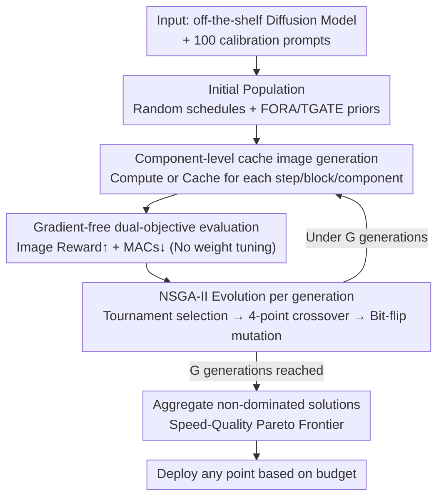

# Evolutionary Caching to Accelerate Your Off-the-Shelf Diffusion Model

**Conference**: ICLR 2026  
**arXiv**: [2506.15682](https://arxiv.org/abs/2506.15682)  
**Code**: Yes ([Project Page](https://research.aniaggarwal.com/ecad))  
**Area**: Image Generation  
**Keywords**: Diffusion Model Acceleration, Cache Scheduling, Genetic Algorithm, Pareto Optimization, Training-free

## TL;DR

Ours proposes ECAD (Evolutionary Caching to Accelerate Diffusion models), which utilizes genetic algorithms to automatically search for optimal cache scheduling strategies on the speed-quality Pareto frontier. Without modifying model parameters and using only 100 calibration prompts, it achieves 2-3x inference acceleration for diffusion models while maintaining or even improving generation quality.

## Background & Motivation

Diffusion models dominate the image generation field but require 20-50 iterative denoising steps, resulting in significant computational overhead. Existing acceleration methods are primarily divided into two categories:

**Training-based methods** (distillation, pruning, etc.): Require high training costs and may suffer from quality loss.

**Training-free caching methods**: Reuse intermediate features to reduce computation but rely heavily on manual heuristics.

Limitations of Prior Work:
- **FORA**: Only provides discrete acceleration levels (e.g., 2x, 3x), lacking intermediate flexibility.
- **ToCa**: Requires manual parameter tuning for each model; parameters tuned for PixArt-α do not transfer to PixArt-Σ.
- **TaylorSeer**: High memory overhead, reducing batch size by 66%.
- All these methods rely on human-designed heuristics and extensive hyperparameter tuning.

## Method

### Overall Architecture

The starting point for ECAD is that cache scheduling in diffusion models is essentially a trade-off between "computational savings" and "quality loss," whereas previous methods relied on fixed manual rules. ECAD reformulates this as a **multi-objective Pareto optimization problem**—simultaneously minimizing computational cost $C(S)$ (measured in MACs) and quality loss $Q(S)$ (measured by Image Reward):

$$\min_S (C(S), Q(S))$$

Here, the schedule $S$ is a binary tensor $S \in \{0,1\}^{N \times B \times C}$, where the three dimensions represent the number of diffusion steps $N$, the number of transformer blocks $B$, and the number of cacheable components per block $C$. A value of 1 at a position indicates using the cache for that component/block/step, while 0 indicates recomputation. The system comprises four replaceable components: a **binary cache tensor** determining search granularity, **100 calibration prompts** for evaluation (from the Image Reward Benchmark), dual **quality/speed metrics** (Image Reward + MACs), and an **initial population**—which can start randomly or incorporate existing schedules like FORA/TGATE as priors. The mechanism follows an evolutionary loop: starting from the initial population, each generation generates images using component-level cache tensors, evaluates dual objectives without gradients, and then applies NSGA-II selection-crossover-mutation to produce the next generation. After $G$ generations, the non-dominated solutions across all generations are summarized into a Pareto frontier, allowing users to select points based on their budget.

### Key Designs

**1. Component-level Caching: Granular decisions for each sub-module**

Previous caching methods either skipped entire steps or entire blocks, which was too coarse, leading to insufficient savings or severe quality drops. ECAD pushes decisions down to the functional component level of each DiT transformer block: in PixArt-α/Σ (28 blocks), one can independently choose to cache self-attention $f_{\text{SA}}$, cross-attention $f_{\text{CA}}$, or the feed-forward network $f_{\text{FFN}}$. In FLUX.1-dev (19 full blocks + 38 single blocks), it covers attention, feed-forward, and MLP components. For any component $f_{\text{comp}}$, whether block $b$ at step $t$ computes or uses the cache is determined entirely by the scheduling tensor:

$$f_{\text{comp}}^b(z'_t, t, c) = \begin{cases} \text{compute}(z'_t, c, t) & \text{Recompute} \\ \text{cache}[f_{\text{comp}}^b, t+1] & \text{Use Cache} \end{cases}$$

Finer granularity increases the search space but allows for more precise trade-offs on the Pareto frontier—the foundation for ECAD's superior performance over discrete methods.

**2. NSGA-II Genetic Algorithm: Searching Pareto frontiers in massive binary spaces**

The scheduling tensor is discrete and binary, providing no gradients, and requires simultaneous optimization of conflicting quality and speed objectives. ECAD employs the mature multi-objective genetic algorithm NSGA-II: in each generation, each candidate schedule generates images and calculates Image Reward and MACs as dual fitness scores. Tournament selection combined with non-dominated sorting identifies superior individuals, 4-point crossover recombines two scheduling strategies, and bit-flip mutation randomly toggles "cache/recompute" decisions.

| Operation | Implementation |
|-----------|----------------|
| Selection | Tournament Selection + Non-dominated Sorting |
| Crossover | 4-point Crossover: Recombining two scheduling strategies |
| Mutation  | Bit-flip Mutation: Randomly toggling cache/recompute decisions |
| Fitness   | Dual Objectives: Image Reward↑ + MACs↓ |

Unlike manual methods that fix a set of hyperparameters, evolutionary search naturally yields an entire frontier, allowing point selection per budget.

**3. Gradient-free, No Weight Modification: Minimizing resource barriers**

Since optimization is driven solely by "generate image $\rightarrow$ read metric," ECAD requires no backpropagation. No gradient computation means no activation memory overhead, allowing execution on small, single GPUs. It modifies no weights, preserving original parameters and making it plug-and-play for any off-the-shelf diffusion model. Evaluated schedules are independent and can be processed in parallel; without the memory pressure of distillation, batch sizes are not restricted—addressing the pain point of methods like TaylorSeer which cut batch sizes by 66% due to memory usage.

### Loss & Training

ECAD involves no training loss. The optimization goal is Pareto frontier discovery:

- **Quality Metric**: Image Reward (single reference metric, 100 prompts $\times$ 10 seeds)
- **Speed Metric**: MACs (Multiply-Accumulate operations, hardware-agnostic)
- **PixArt-α**: 550 generations $\times$ 72 candidates/gen $\times$ 1000 images/candidate
- **FLUX.1-dev**: 250 generations $\times$ 24 candidates/gen

## Key Experimental Results

### Main Results

**Table 1: Main Results on PixArt-α 256×256**

| Method | Acceleration | Image Reward↑ | COCO FID↓ | MJHQ FID↓ |
|--------|--------------|---------------|-----------|-----------|
| No Caching | 1.00x | 0.97 | 24.84 | 9.75 |
| FORA (N=3) | 2.01x | 0.83 | 24.50 | 11.11 |
| ToCa (N=3,R=90%) | 2.35x | 0.68 | 24.01 | 11.80 |
| **ECAD fast** | **1.97x** | **0.99** | **20.58** | **8.02** |
| **ECAD fastest** | **2.58x** | 0.77 | **19.54** | **8.67** |

ECAD's "fastest" achieves an FID of 19.54 at 2.58x speedup, which is 4.47 lower than ToCa's FID (24.01) at a lower 2.35x speedup.

**Table 2: Main Results on FLUX.1-dev 256×256**

| Method | Acceleration | Image Reward↑ | COCO FID↓ |
|--------|--------------|---------------|-----------|
| No Caching | 1.00x | 1.04 | 25.76 |
| FORA (N=3) | 2.44x | 0.93 | 23.51 |
| TaylorSeer (N=5,O=2) | 2.55x | 0.54 | 29.66 |
| **ECAD fast** | **2.58x** | **1.04** | **21.61** |
| **ECAD fastest** | **3.37x** | 0.89 | 26.66 |

### Ablation Study

**Evolutionary Scalability (Table 3)**:

| Generations | Acceleration | Image Reward↑ | MJHQ FID↓ |
|-------------|--------------|---------------|-----------|
| 1 | 1.14x | 1.00 | 9.40 |
| 50 | 1.79x | 0.98 | 7.97 |
| 150 | 1.90x | 1.00 | 8.11 |
| 500 | 2.17x | 0.96 | 8.49 |

With only 50 generations, it surpasses the baseline without acceleration, and continuous optimization yields steady improvements.

**Acceleration Strategy Ablation**:
- Reducing population size (72 $\rightarrow$ 24): Equivalent to reducing generations.
- Reducing images per prompt (10 $\rightarrow$ 3): Minimal impact.
- Reducing prompt count (100 $\rightarrow$ 33): Significantly harms quality.

### Key Findings

1. **Pareto Frontier Thinking**: Provides a continuous adjustable speed-quality trade-off rather than discrete steps.
2. **Cross-model Transfer**: PixArt-α schedules can transfer to PixArt-Σ; only 50 generations of fine-tuning are needed to surpass from-scratch optimization.
3. **Cross-resolution Transfer**: Schedules optimized at 256×256 remain competitive when applied directly to 1024×1024.
4. **Surpassing Baseline Quality**: ECAD "fast" achieves 2x speedup while yielding a better FID than the no-caching baseline.

## Highlights & Insights

1. **Paradigm Shift**: Moves from "manually designed heuristics" to "automatically searching for optimal caching," fundamentally changing the methodology for diffusion caching.
2. **Minimal Resource Requirements**: 100 text prompts + single GPU + gradient-free computation = runnable in extremely constrained environments.
3. **Framework Generality**: Both the search space (cache tensor shape) and fitness (quality/speed metrics) are customizable.
4. **Counter-intuitive Finding**: FID actually decreases after cache acceleration—suggesting that some recomputation steps are effectively "noise," and skipping them is beneficial.
5. **Video Scalability**: The framework is modality-agnostic and naturally extends to text-to-video generation.

## Limitations & Future Work

1. Optimization relies on automated metrics (Image Reward); results might differ if replaced with human evaluation.
2. Computational overhead for the genetic algorithm (550 gen $\times$ 72 candidates $\times$ 1000 images) remains substantial.
3. Combination with training-based methods (e.g., distillation) has not been explored.
4. Validated only on DiT architectures; U-Net architectures remain untested.
5. Domain bias in calibration prompts may affect performance in specific application scenarios.

## Related Work & Insights

- **FORA**: The first DiT caching method; ECAD can use its schedules to initialize populations.
- **ToCa**: Fine-grained caching requiring manual tuning, which ECAD automates.
- **DiCache**: Allows the diffusion model to decide the cache strategy but still relies on heuristics.
- **TaylorSeer**: Uses Taylor expansion to predict features but has high memory overhead.
- Insight: The logic of applying genetic algorithms to Neural Architecture Search (NAS) is equally effective in the field of inference acceleration.

## Rating

- Novelty: ⭐⭐⭐⭐⭐ — Paradigm-level innovation by redefining caching as Pareto optimization.
- Technological Contribution: ⭐⭐⭐⭐ — Method is concise and effective, though the core tech (NSGA-II) is not new.
- Experimental Thoroughness: ⭐⭐⭐⭐⭐ — Three models $\times$ multiple datasets $\times$ multiple metrics $\times$ transfer experiments.
- Writing Quality: ⭐⭐⭐⭐ — Clear reasoning with extensive tables and figures.
- Overall Recommendation: ⭐⭐⭐⭐⭐ — A highly practical method that changes the practice of diffusion acceleration.

<!-- RELATED:START -->

## Related Papers

- [\[ICLR 2026\] Learn to Guide Your Diffusion Model](learn_to_guide_your_diffusion_model.md)
- [\[CVPR 2026\] SenCache: Accelerating Diffusion Model Inference via Sensitivity-Aware Caching](../../CVPR2026/image_generation/sencache_accelerating_diffusion_model_inference_via_sensitivity-aware_caching.md)
- [\[ICLR 2026\] AC-Sampler: Accelerate and Correct Diffusion Sampling with Metropolis-Hastings Algorithm](ac-sampler_accelerate_and_correct_diffusion_sampling_with_metropolis-hastings_al.md)
- [\[CVPR 2026\] ResCa: Residual Caching for Diffusion Transformers Acceleration](../../CVPR2026/image_generation/resca_residual_caching_for_diffusion_transformers_acceleration.md)
- [\[ICLR 2026\] Follow-Your-Shape: Shape-Aware Image Editing via Trajectory-Guided Region Control](follow-your-shape_shape-aware_image_editing_via_trajectory-guided_region_control.md)

<!-- RELATED:END -->
