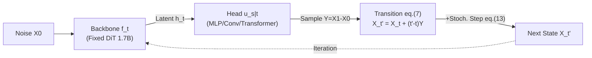

# Exploring the Design Space of Transition Matching

**Conference**: ICLR 2026  
**OpenReview**: [https://openreview.net/forum?id=jR8HV4uTcf](https://openreview.net/forum?id=jR8HV4uTcf)  
**Code**: TBD  
**Area**: Image Generation / Generative Models  
**Keywords**: Transition Matching, Text-to-Image Generation, Flow Matching, backbone-head architecture, stochastic sampler  

## TL;DR
This paper conducts a large-scale systematic ablation (56 models of 1.7B params, 549 evaluations) on the "head" module in Transition Matching (TM), which has long been treated as a fixed attachment. It proposes a zero-overhead stochastic sampler and derives the optimal recipe, DTM++ (MLP head + log-normal time weighting + high-frequency stochastic sampling), achieving SOTA across aggregated metric rankings.

## Background & Motivation
**Background**: Diffusion models, Flow Matching (FM), and continuous-state autoregressive models essentially "transform noise into data step-by-step." Transition Matching (Shaul et al., 2025) unifies them—the key difference being that TM uses an "internal" generative model to implement each transition kernel $p^\theta_{t'|t}(\cdot|X_t)$. Thus, the transition is significantly more expressive than the coordinate-independent Gaussian kernels $\mathcal{N}(\cdot|\mu_t(x),\sigma_t^2 I)$ used in diffusion. To make this expensive setting computable, TM adopts a backbone-head paradigm: a large backbone (usually a transformer) encodes the current state into a latent representation $h_t$, while a small head translates $h_t$ into the next state.

**Limitations of Prior Work**: While backbone architectures (e.g., DiT) have been extensively researched, the head has been glossed over by almost all works as simply "an MLP or lightweight mapping." No study has systematically investigated its architecture, scale, parameterization, or time-weighting strategies.

**Key Challenge**: The small size and computational cheapness of the head imply it has scaling space independent of the backbone—tuning it could potentially leverage improvements in generation quality, training efficiency, and inference efficiency with almost no increase in total cost. However, this design space is largely unexplored; the industry relies on intuition to use MLPs without knowing which choices are effective or futile.

**Goal**: Using text-to-image generation via continuous-time bidirectional TM as a testbed, this paper aims to thoroughly quantify the training and inference design space of the head, providing a feasible optimal recipe and a "negative list" of directions to avoid.

**Core Idea**: **Treating the head as a first-class citizen for systematic ablation**. By fixing the backbone, data, and most hyperparameters, the authors vary only head-related variables (architecture type, scale, sequence scaling, parameterization $Y$, head batch size, and time weighting) and inference strategies (efficiency-quality trade-offs, stochastic samplers). Models are fairly compared using a unified "single ranking aggregated from 4 datasets and 25 metrics."

## Method

### Overall Architecture
TM learns transition kernels by regressing a user-defined supervisory process $q$. The process uses a standard linear path $X_t=(1-t)X_0+tX_1$ ($X_0\sim\mathcal{N}(0,I)$ noise, $X_1\sim p_1$ data). Instead of directly predicting the next state $X_{t'}$ (which would introduce an extra time variable $t'$), the head predicts a posterior quantity $Y$, from which $X_{t'}$ is analytically derived using $Y$ and $X_t$. Shaul et al. selected the difference between noise and data $Y=X_1-X_0$ (termed D-TM), since $X_{t'}=X_t+(t'-t)(X_1-X_0)$ under linear paths. The head itself uses Flow Matching to sample $Y$: during training, it minimizes $L_{TM}=\mathbb{E}\|u^\phi_s(Y_s|h_t)-(Y_1-Y_0)\|^2$; during inference, it solves an ODE $\frac{d}{ds}Y_s=u^\phi_{s|t}(Y_s|h_t)$ from $Y_0\sim\mathcal{N}(0,I)$ to $s=1$. This work systematically adjusts every design knob of the head on this fixed skeleton.

### Key Designs

**1. Head Architecture and Scale: Large heads are wasteful; MLP suffices.** The authors compared three heads: MLP (per-token independent processing $u_{s|t}(y_i|h_t^i)\in\mathbb{R}^d$), 3×3 Convolution (cross-token), and Transformer (attention between tokens, with $16{\times}16{\times}16\to 8{\times}8{\times}64$ reshaping for efficiency). They swept latent dimensions $d_h\in\{768,...,2048\}$ from x-small to x-large. The counter-intuitive conclusion: having a head significantly improves ranking over no head (pure FM), but increasing head size yields diminishing returns. Even making the head nearly as large as the backbone (>1 relative scale) is useless, while linearly increasing cost. Thus, a small head is the "sweet spot" for quality and cost.

**2. Parameterization of $Y$: Predicting the difference is superior to predicting endpoints.** Given the linear path equations for $X_t$ and $X_{t'}$, predicting any independent quantity allows solving for $X_{t'}$. The authors tested $Y\in\{X_1-X_0,\,X_1,\,X_0\}$. Difference parameterization ($Y=X_1-X_0$) clearly outperformed denoising ($Y=X_1$), which in turn performed better than noise prediction ($Y=X_0$) (MLP head rankings: 0.36 vs 0.19 vs 0.10). This aligns with target selection in FM, suggesting the "velocity direction" inductive bias is optimal.

**3. Sequence Scaling: Only effective for Transformer heads.** Three learnable linear layers $L_{in,y},L_{in,h},L_{out,y}$ expand each input token into $l$ tokens before feeding them to the head ($L_{out,y}\,u_{s|t}(L_{in,y}y\,|\,L_{in,h}h_t)$), sweeping $l\in\{1,2^2,...,6^2\}$. Transformer head rankings rose significantly with sequence expansion (as attention shares information across expanded tokens), whereas MLP heads showed no gain due to per-token independence. While sequence scaling has limited impact on inference speed, it significantly slows down training—leading the authors to limit the optimal Transformer recipe to $l=4$ ($l=36$ is needed to match the best MLP model, which is too expensive to train).

**4. Head Batch Size and Time Weighting: Cheap gain knobs.** For a single $(t,X_t)$, the head can use multiple i.i.d. $s$/noise samples (called time-per-token, TPT, for MLP), with batch size $k_h\in\{1,4,16,64\}$. Larger batches improve results, but Transformer heads saturate around $k_h\approx16$, and training slows significantly beyond that. For time weighting, borrowing from FM non-uniform sampling: using log-normal $\pi_{ln}(0,1)$ (biased toward the middle) for backbone time $t$ is best, while either Beta or log-normal works for head time $s$. This is a zero-cost quality source.

**5. Stochastic Sampler: Quality for zero extra compute.** The core observation is that if a new supervisory process $\tilde q$ has the same marginal distribution as the training process $q$, and $\tilde q_{t'|t,Y}$ is efficiently sampleable, the trained model can be used for sampling under $\tilde q$. For Gaussian noise sources, given three consecutive times $t<t'<t''$ and $X_{t''}$, an earlier state $X_{t'}$ can be inferred via $X_{t'}=\frac{1}{t''}(t'X_{t''}+Z),\ Z\sim\mathcal{N}(0,(t''-t')(t'+t''-2t't'')I)$. The intuition: use D-TM predicted $Y$ to jump to a future $X_{t''}$, then inject appropriate independent noise to step back to $X_{t'}$, introducing randomness without increasing NFE. Hyperparameters include scale $c\in[0,1]$ ($t''=t'+c(1-t')$) and frequency $\tau$ (how often to add a stochastic step). MLP heads jumped from 0.51 to 0.66 ranking with high-frequency sampling—the highest score in the paper.

## Key Experimental Results

Setup: Backbone fixed as a 24-layer, 2048-dim DiT (1.7B). Data: 350M text-image pairs. Images encoded via SDXL-VAE and 2×2 patched into $16{\times}16{\times}16$ latents. 500k training steps. Evaluations across MS-COCO / PartiPrompts / GenEval / T2ICompBench (25 metrics). All 549 models are ranked per metric, then normalized to a single average Rank in $[0,1]$.

### Main Results

| Model | Head Type | Seq Scale | Batch | Time Weighting | Sampler | Aesthetic↑ (COCO) | ImageReward↑ (Parti) | Rank↑ |
|---|---|---|---|---|---|---|---|---|
| DTM (baseline) | MLP | 1 | 4 | $U\times U$ | linear | 5.64 | 0.51 | 0.36 |
| DTM | MLP | 1 | 16 | $\pi_{ln}\times\pi_{ln}$ | linear | 5.69 | 0.63 | 0.51 |
| **DTM++ (Ours)** | MLP | 1 | 16 | $\pi_{ln}\times\pi_{ln}$ | $c{=}0.2,\tau{=}1$ | 5.78 | 0.70 | **0.66** |
| DTM | Convolution | 1 | 4 | $U\times U$ | linear | 5.76 | 0.51 | 0.40 |
| DTM | Transformer | 1 | 4 | $U\times U$ | linear | 5.76 | 0.51 | 0.43 |
| **DTM+ (Runner-up)** | Transformer | 4 | 16 | $\pi_{ln}\times\pi_{ln}$ | $c{=}0.8,\tau{=}1$ | High | — | 2nd best, best aesthetics |

DTM++ takes the top spot with a 0.66 Rank. DTM+ (Transformer + seq scaling + low-freq stochastic sampling) performs best on aesthetic metrics but ranks second overall due to smaller gains from the stochastic sampler. Baselines include FM, AR/MAR (continuous tokens), and discrete AR/MAR.

### Ablation Study

| Design Knob | Key Comparison | Conclusion |
|---|---|---|
| Head Scale | x-small → x-large (incl. dense) | No strong correlation with performance; large heads only increase cost |
| Param. $Y$ | $X_1{-}X_0$ vs $X_1$ vs $X_0$ | 0.36 / 0.19 / 0.10 (MLP); Difference parameterization is optimal |
| Seq Scaling $l$ | Transformer vs MLP | Only Transformer benefits; MLP is unaffected. $l{=}4$ is the training sweet spot |
| Head Batch $k_h$ | 1/4/16/64 | Larger is generally better; Transformer saturates at 16, >16 slows training |
| Stoch. Sampling $(c,\tau)$ | MLP vs Transformer | MLP +0.15 (high freq), Transformer +0.06 (low freq) |

### Key Findings
- D-TM (MLP/Transformer/Conv) is simultaneously faster and better on the efficiency-quality Pareto front: FM peaks at 32 midpoint samplings (64 NFE, ~4s), while D-TM-MLP achieves higher ranking in 0.8s—approx. **5× wall-clock speedup**.
- The value of the head lies in its "existence" rather than its "size"—adding a head significantly boosts scores, but expanding it yields negligible gains.
- Stochastic sampling is a free lunch: under the same compute budget, the MLP head gains +0.15 in rank, remaining stable and reproducible in the high-frequency regime.

## Highlights & Insights
- **Turning "Ignored Modules" into Large-scale Empirical Science**: With 56 independent 1.7B training runs and 549 evaluations, it shifts head design from alchemy to data-driven engineering. It identifies "sweet spots" (small MLP head + difference parameterization + log-normal weighting + high-frequency stochastic sampling) and "negative lists" (don't stack head scale, don't use seq scaling for MLPs).
- **Mathematical Elegance and Practicality of Stochastic Sampler**: By exploiting the freedom that "any process with the same marginals works for sampling," it maximizes quality without extra NFE.
- **Unified Aggregated Ranking**: Compressing 25 metrics from 4 datasets into a single Rank is essential for making such a massive ablation study comparable and credible.

## Limitations & Future Work
- **Scope Limitations**: Restricted to continuous-time bidirectional TM for text-to-image at 256×256 with a fixed 1.7B backbone. Generalization to video, higher resolutions, or different backbone sizes remains to be verified.
- **Training Cost of Sequence Scaling**: Transformer heads need $l=36$ to match the best MLP, but the training cost is prohibitive. Efficient implementations of sequence scaling are an open problem.
- **Gaussian Noise Assumption for Sampler**: The derivation relies on $p_0=\mathcal{N}(0,I)$; stochastic samplers for non-Gaussian sources need further design.
- **Weak Causal Explanation**: Many observations (e.g., why MLPs don't benefit from seq scaling) rely on intuition rather than deep theoretical characterization.

## Related Work & Insights
TM was introduced by Shaul et al. (2025), unifying Diffusion (Sohl-Dickstein/Ho/Song), Flow Matching (Lipman/Liu/Albergo), and continuous-state AR image generation (Li et al. 2024). This work directly engages with the "dense" variants of Zhang et al. (2025) and time-weighting in FM (Esser et al., 2024), while the stochastic sampler is inspired by Xu et al. (2023b). **Key Insight for Practitioners**: In backbone-head generative paradigms, **configure the small head first (MLP, difference parameterization, log-normal weighting, high-frequency stochastic sampling) before adding parameters**—this is usually the most cost-effective path to improvement.

## Rating
- **Novelty**: ⭐⭐⭐⭐ — Not for a new paradigm, but for being the first to systematically quantify the TM head design space and contributing a zero-cost stochastic sampler.
- **Experimental Thoroughness**: ⭐⭐⭐⭐⭐ — 56 training runs and 549 evals with aggregated rankings; the scale and rigor are top-tier for this topic.
- **Writing Quality**: ⭐⭐⭐⭐ — Clear structure, thorough ablations, and high information-density charts; includes full formulas and pseudo-code.
- **Value**: ⭐⭐⭐⭐ — Provides a "copy-pasteable" optimal recipe and a "do-not-try" list, offering strong practical guidance for generative model engineering.

<!-- RELATED:START -->

## Related Papers

- [\[ICML 2026\] Exploring and Exploiting Stability in Latent Flow Matching](../../ICML2026/image_generation/exploring_and_exploiting_stability_in_latent_flow_matching.md)
- [\[CVPR 2026\] Elucidating the Design Space of Arbitrary-Noise-Based Diffusion Models](../../CVPR2026/image_generation/eda_arbitrary_noise_diffusion_design_space.md)
- [\[ICLR 2026\] Generalization of Diffusion Models Arises with a Balanced Representation Space](generalization_of_diffusion_models_arises_with_a_balanced_representation_space.md)
- [\[ICLR 2026\] Terminal Velocity Matching](terminal_velocity_matching.md)
- [\[ICLR 2026\] Delay Flow Matching](delay_flow_matching.md)

<!-- RELATED:END -->
