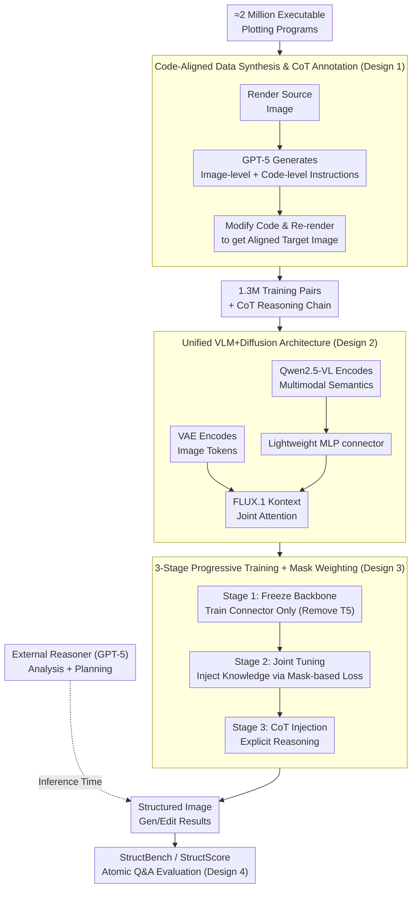

# Factuality Matters: When Image Generation and Editing Meet Structured Visuals

**Conference**: ICLR2026  
**arXiv**: [2510.05091](https://arxiv.org/abs/2510.05091)  
**Code**: [structvisuals.github.io](https://structvisuals.github.io)  
**Area**: Image Generation  
**Keywords**: structured image generation, image editing, chain-of-thought reasoning, benchmark, diffusion transformer

## TL;DR
The first systematic study on structured visual content (charts, math formulas, diagrams, etc.) generation and editing. This work constructs a 1.3 million code-aligned training dataset (including CoT reasoning annotations), a unified VLM+Diffusion architecture, and a StructBench benchmark containing 1700+ samples, revealing that reasoning capability is the key bottleneck for current models handling structured visuals.

## Background & Motivation
- **Limitations of Prior Work**: Existing visual generation models (e.g., GPT-Image, FLUX, Bagel) excel at natural image generation but perform poorly on **structured visual content** (charts, math figures, diagrams, tables, etc.) generation and editing.
- **Key Challenge**: Structured images differ fundamentally from natural images; they require **composition planning**, **precise text rendering**, and **multimodal reasoning** to ensure factual fidelity.
- **Data Gap**: Existing datasets focus on natural image aesthetics or instruction following, lacking large-scale, high-quality training data for structured visuals.
- **Evaluation Gap**: Existing metrics (e.g., CLIP score, aesthetic score, naive VLM-as-a-judge) are unsuitable for fine-grained factuality evaluation of structured images.

## Core Problem
How to systematically improve model capabilities in generating and editing structured images? This involves three sub-problems:
1. **Data**: How to construct a large-scale, high-quality, and precisely annotated structured image dataset?
2. **Model**: How to train a unified generation/editing model applicable to both natural and structured images?
3. **Evaluation**: How to reliably evaluate the fine-grained factuality of structured images?

## Method

### Overall Architecture

This work addresses the "structured image challenge" through three integrated components: data, model, and evaluation. First, it synthesizes 1.3 million code-aligned training pairs with CoT reasoning annotations using approximately 2 million executable plotting programs. Second, it utilizes a Qwen2.5-VL multimodal encoder preceding a FLUX.1 Kontext diffusion backbone, connected via a lightweight MLP connector to inject high-level semantics into the diffusion process. Third, it employs a three-stage progressive training strategy to inject alignment, structured domain knowledge, and explicit reasoning, while allowing for an external reasoner for planning during inference. Finally, an atomic Q&A protocol via StructBench/StructScore is used for fine-grained factuality evaluation. The core mechanism is using "code" both as a precise anchor for training supervision and as a semantic bridge during reasoning.

### Key Designs

**1. Code-Aligned Data Synthesis & CoT Annotation: Transforming "Executability" into Verifiable Supervision**

Traditional synthetic editing pairs rely on model generation and only achieve "approximate alignment," leading to noisy supervision. This work leverages the "code-renderable" nature of structured images by collecting ~2M Python/LaTeX plotting programs across six categories (Math, Chart, Puzzle, Science, Graph, Table). The process renders the source image from source code, then uses GPT-5 to analyze salient features and produce both image-level and code-level editing instructions. Modifying the code and re-rendering yields a target image strictly aligned with the source, eliminating alignment noise. After filtering for rendering failures and low info-density, T2I samples are paired with dense captions, and editing samples are paired with a three-step reasoning chain (Input Analysis → Instruction Interpretation → Target Prediction), providing higher semantic density than simple commands like "add tree right."

**2. Unified VLM + Diffusion Architecture & Lightweight Connector: Supplementing VAE's Understanding with High-Level Semantics**

Structured editing requires high-level semantic reasoning (e.g., converting a bar chart to a pie chart requires understanding proportions), which diffusion model VAEs lack as they provide only low-level features. Ours retains FLUX.1 Kontext as the diffusion backbone for unified generation/editing: source and target images are VAE-encoded and concatenated as a sequence for joint attention. Simultaneously, Qwen2.5-VL encodes multimodal features, which are aligned via a lightweight MLP connector and injected into the diffusion process. Compared to transformer projectors with learnable queries (e.g., MetaQuery), the MLP connector offers lower training overhead and more stable optimization without sacrificing performance.

**3. Three-Stage Progressive Training & Mask-based Loss Weighting: Injecting Alignment, Knowledge, and Reasoning**

To avoid catastrophic forgetting or misalignment, difficulty is increased progressively. Stage 1 (Unified Alignment) freezes the backbone and trains only the MLP connector while removing T5 features to force the connector to handle alignment. Stage 2 (Hybrid Visual Learning) jointly fine-tunes the backbone and connector to inject structured domain knowledge while mixing natural images to preserve general capabilities. It introduces a mask-based strategy to adaptively reduce loss weights for background and unchanged areas, focusing gradients on edited regions. Stage 3 (Reasoning Enhancement) injects explicit reasoning by using CoT annotations as long-context input for Qwen-VL. During inference, the model can utilize an external reasoner (GPT-5) to analyze image-text pairs and plan target content, achieving inference-time compute scaling.

**4. StructBench & StructScore: Reliable Factuality Assessment via Atomic Q&A**

Traditional metrics like CLIP or naive VLM-as-a-judge are insensitive to fine-grained factuality and prone to hallucination in structured visuals. This work builds StructBench (1,714 samples, 32,031 Q&A pairs for editing, 37,941 pairs for generation). StructScore operates by: (1) generating fine-grained atomic Q&A pairs from ground truth images covering all salient elements; (2) having the model answer questions based on the generated image; and (3) comparing [Question, Prediction, Ground Truth] triplets. For editing, it decouples visual consistency ($0.1 \times$) and instruction following ($0.9 \times$). By using GPT-5 to refine failed Q&A pairs, the ground truth reliability exceeds 95%, achieving a Pearson correlation $r > 0.9$ with human Elo rankings.

## Key Experimental Results
- **Editing Benchmark (StructEditBench)**: Ours **ranks first** with 55.98% overall accuracy, surpassing Nano Banana (51.57%), GPT-Image (52.20%), and Seedream 4.0 (52.85%). Nano Banana 2.0 achieves the highest at 67.05%.
- **Generation Benchmark (StructT2IBench)**: GPT-Image leads among closed-source models (49.58%); Ours achieves 28.80% (T2I is harder due to fine-grained synthesis from scratch). Nano Banana 2.0 leads all models with 92.00%.
- **Chart Editing Breakdown**: Models approach 50% accuracy on color modification but drop significantly when converting chart types (requiring quantitative reasoning), identifying reasoning as the core bottleneck.
- **Reasoning Enhancement**: Adding explicit reasoning trajectories to Bagel improved accuracy from 28.87% to 38.44%, exceeding its native reasoning variant Bagel-Think (33.34%), proving that reasoning quality matters more than format.
- **Human Alignment**: StructScore shows a Pearson correlation $r > 0.9$ with human Elo rankings, significantly higher than traditional metrics like PSNR.
- **Comprehensive Evaluation**: Comparison of 15 models, including 3 closed-source and 12 open-source systems.

## Highlights
- **Systematic Contribution**: First holistic work covering data, models, and evaluation for structured visuals.
- **Code-Aligned Data**: Leverages executable code to build precise, verifiable editing pairs, proving more reliable than traditional synthetic methods.
- **Sophisticated StructScore**: Atomic Q&A combined with dimensional decoupling and refinement processes effectively minimizes VLM hallucinations.
- **Verification of Reasoning Importance**: Experiments demonstrate that inference-time reasoning consistently improves structured image tasks regardless of architecture.
- **Mask-based Training Strategy**: Adaptive loss weighting tailored to the pixel statistics of structured visuals (large uniform backgrounds, localized edits).

## Limitations & Future Work
- T2I generation performance remains significantly lower than state-of-the-art closed-source models (28.80% vs 49.58%).
- Reliance on GPT-5 as an external reasoner incurs high inference costs; lightweight alternatives are not yet explored.
- Data construction depends heavily on GPT-5 for annotation and filtering, raising concerns about cost and reproducibility.
- Current coverage is limited to six categories; molecular formulas, sheet music, and educational videos are not yet addressed.
- Diversity may be constrained by the existing code repositories used for the 1.3M training samples.
- Risk of circular dependency as StructScore relies on VLMs (GPT-5) as evaluators.
- Dynamic resolution sampling is currently restricted around 512×512, which may be insufficient for ultra-high-resolution structured visuals.

## Related Work & Insights

| Dimension | Ours | Traditional T2I/Editing |
|-----------|------|-------------------------|
| Target Domain | Structured Visuals (Charts, Formulas, Diagrams) | Natural Images |
| Data Construction | Code-aligned + Code-level edits → Verifiable | Synthetic Instructions + Model Gen → Approximate |
| Reasoning Label | 3-step CoT reasoning chain + Dense caption | Short instructions (e.g., "add tree right") |
| Evaluation | Atomic Q&A + Decoupled weighting | CLIP/DINO or naive VLM judge |
| Model Design | VLM(Qwen-VL) + Diffusion (FLUX) + MLP Connector | Pure Diffusion or Unified Autoregressive |

The comparison with Bagel-Think is crucial: Ours' external reasoner approach (38.44%) outperforms Bagel's internal thinking mode (33.34%), suggesting that the design and quality of reasoning trajectories are more important than just integrating a thinking pattern. Compared to heavy transformer projectors like MetaQuery, Ours' lightweight MLP connector reduces overhead. Against specialized editing models like Step1X-Edit (34.11%) and Qwen-Edit (38.12%), Ours achieves superior results (55.98%), validating the combined advantage of multimodal reasoning enhancement and domain-specific data.

## Rating
- Novelty: 8/10 — First systematic study with accurate problem definition and novel code-aligned data synthesis.
- Experimental Thoroughness: 9/10 — 15-model comparison, human alignment study, and comprehensive ablation.
- Writing Quality: 8/10 — Clear structure, rich visualization, and well-motivated.
- Value: 8/10 — Strong contribution to the community through open-source data, models, and benchmarks.

<!-- RELATED:START -->

## Related Papers

- [\[CVPR 2025\] AutoPresent: Designing Structured Visuals from Scratch](../../CVPR2025/image_generation/autopresent_designing_structured_visuals_from_scratch.md)
- [\[CVPR 2025\] From Words to Structured Visuals: A Benchmark and Framework for Text-to-Diagram Generation and Editing](../../CVPR2025/image_generation/from_words_to_structured_visuals_a_benchmark_and_framework_for_text-to-diagram_g.md)
- [\[ICLR 2026\] TempFlow-GRPO: When Timing Matters for GRPO in Flow Models](tempflow-grpo_when_timing_matters_for_grpo_in_flow_models.md)
- [\[ICLR 2026\] Condition Matters in Full-head 3D GANs](condition_matters_in_full-head_3d_gans.md)
- [\[ICLR 2026\] Guidance Matters: Rethinking the Evaluation Pitfall for Text-to-Image Generation](guidance_matters_rethinking_the_evaluation_pitfall_for_text-to-image_generation.md)

<!-- RELATED:END -->
