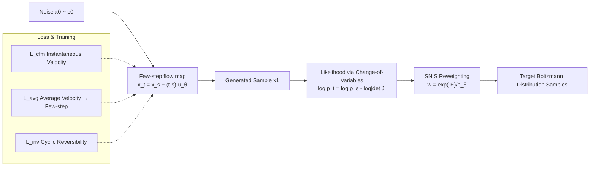

# FALCON: Few-step Accurate Likelihoods for Continuous Flows

**Conference**: ICLR 2026  
**OpenReview**: [https://openreview.net/forum?id=FbssShlI4N](https://openreview.net/forum?id=FbssShlI4N)  
**Code**: [https://github.com/danyalrehman/FALCON](https://github.com/danyalrehman/FALCON)  
**Area**: Generative Models / Flow Models / Boltzmann Generators / Molecular Sampling  
**Keywords**: Flow Map, Boltzmann Generator, Few-step Generation, Reversibility, Importance Sampling, Likelihood Estimation

## TL;DR
FALCON introduces a "cyclic reversibility" regularization to few-step flow maps, enabling both fast sampling and low-cost accurate likelihood estimation within 4–16 steps. This reduces the inference cost of continuous flow Boltzmann Generators by two orders of magnitude and outperforms current state-of-the-art discrete normalizing flows.

## Background & Motivation
**Background**: Sampling molecular conformations from a Boltzmann distribution $p(x) \propto \exp(-E(x))$ is a core challenge in statistical physics. Due to high-dimensional, non-smooth energy landscapes with multiple local minima, traditional Molecular Dynamics (MD) and Markov Chain Monte Carlo (MCMC) methods easily get trapped and exhibit slow mixing, producing highly correlated samples. Boltzmann Generators (BG) aim to train a generative model $p_\theta(x)$ to approximate the target distribution and then use Self-Normalized Importance Sampling (SNIS) to reweight samples to the exact $p(x)$, thereby amortizing sampling costs while ensuring statistical consistency.

**Limitations of Prior Work**: A critical prerequisite for SNIS is the efficient calculation of $p_\theta(x)$ for each sample. Current mainstream BGs use Continuous Normalizing Flows (CNF) trained with flow matching, which offer strong expressivity and stable training but suffer from **prohibitively expensive likelihood estimation**. This requires solving a $d{+}1$ dimensional ODE, often involving thousands of Function Evaluations (NFE) per sample: first, because approximate trace estimators (e.g., Hutchinson) lack sufficient precision, forcing exact Jacobian computation; and second, because many steps are needed to suppress discretization errors. Conversely, recent few-step flow map models (Consistency Models, MeanFlow, Shortcut, etc.) offer fast sampling and architectural freedom but **lack efficient likelihood estimation** as they only learn an average velocity field $u_\theta$. Without guaranteed reversibility before convergence, the change-of-variables formula cannot be applied.

**Key Challenge**: There is a divide where CNFs provide likelihoods but lack speed, while flow maps provide speed but lack likelihoods. BGs specifically require both: fast sampling and precise likelihoods for SNIS.

**Goal**: Design a generative model that possesses the "training efficiency and architectural freedom of flow matching" alongside the "fast sampling and fast likelihood estimation of discrete reversible models."

**Core Idea**: The authors point out that for a flow map to serve as a valid BG, it **does not need** to approximate the specific reversible mapping of a CNF; it only needs to be **reversible itself**—a significantly weaker condition. By adding a lightweight cyclic reversibility loss to the training objective, accurate likelihoods can be unlocked in the few-step regime. **[Weakened reversibility requirement + hybrid training objective]** is the key insight of this work.

## Method

### Overall Architecture
FALCON learns a discrete flow map $X_u(x_s,s,t)=x_s+(t-s)u_\theta(x_s,s,t)$ that pushes noise $p_0$ to the target distribution $p_1$ in a few steps. Training utilizes a mixture of three losses: the flow matching term $\mathcal{L}_{cfm}$ for correct instantaneous velocity, the average velocity term $\mathcal{L}_{avg}$ for few-step generation, and the reversibility term $\mathcal{L}_{inv}$ to force reversibility before convergence. During sampling, one proceeds in a few steps using any temporal discretization $x_{t_i}=x_{t_{i-1}}+(t_i-t_{i-1})u_\theta$. For likelihood estimation, the change-of-variables formula $\log p_t = \log p_s - \log|\det J_{X_u}|$ is used directly due to the reversible mapping. The Jacobian requires only $d$ evaluations, and the $O(d^3)$ determinant calculation is negligible compared to high NFE.

### Key Designs

**1. Cyclic Reversibility Loss: Legal likelihoods via the weakest constraint.** The change-of-variables formula for flow maps strictly holds only at the optimal solution where the discrete map equals the continuous map $X_u=X_v$, a condition nearly impossible to satisfy in practice. Proposition 2 provides a crucial relaxation: as long as $X_u$ itself is reversible, the likelihood change-of-variables holds everywhere, without requiring it to reproduce the specific CNF flow. Accordingly, the regularization term is introduced:

$$\mathcal{L}_{inv}(\theta)=\mathbb{E}_{s,t,x_s}\big\|\,x_s - X_u\big(X_u(x_s,s,t),\,t,\,s\big)\big\|^2,$$

representing "moving forward one step and backward should return to the origin." This transforms reversibility from a "byproduct of convergence" into a "directly optimized objective," allowing the model to safely calculate likelihoods even in the low-NFE few-step regime. The final loss is $\mathcal{L}=\mathcal{L}_{cfm}+\lambda_{avg}\mathcal{L}_{avg}+\lambda_r\mathcal{L}_{inv}$.

**2. Average Velocity Objective and Single-pass JVP Implementation.** Few-step capability comes from learning the average velocity $u(x_s,s,t)=\frac{1}{t-s}\int_s^t v(x_\tau,\tau)d\tau$. FALCON employs an objective equivalent to MeanFlow:

$$\mathcal{L}_{avg}\triangleq\mathbb{E}_{s,t,x_s}\big\|u_\theta - \mathrm{sg}\big(v(x_s,s)-(t-s)(v\,\partial_{x_s}u_\theta+\partial_s u_\theta)\big)\big\|^2,$$

where $\mathrm{sg}$ denotes a stop-gradient. Since $x_s=sx_1+(1-s)x_0$, one can set $v(x_s,s)=x_1-x_0$ without solving an ODE. A key engineering point is that this entire term can be calculated using a **single Jacobian-Vector Product (JVP)** from forward automatic differentiation: `u_θ, du_θ/ds = jvp(u_θ, (x_s,s,t), (v_s,1,0))`. Furthermore, by implementing instantaneous velocity as $v(x_s,s)=u_\theta(x_s,s,s)$, $\mathcal{L}_{cfm}$ and $\mathcal{L}_{avg}$ can be unified into a single objective.

**3. Signed Parameterization for Directional Discontinuity.** FALCON is the first method requiring both forward and backward flow maps simultaneously. However, average velocity exhibits a directional discontinuity at $s=t$: as $t\to s^+$, $u_\theta=v$, and as $t\to s^-$, $u_\theta=-v$. Without handling this, backward calls would use the wrong sign, causing likelihood failure. The solution parameterizes the network as $u_\theta(x_s,s,t)=\mathrm{sign}(t-s)\,h_\theta(x_s,s,t)$, using an explicit sign term to absorb the jump and allowing forward/backward paths to share the same continuous network $h_\theta$.

**4. Soft-Equivariant DiT Architecture.** Previous molecular BGs were restricted to small, strictly equivariant networks due to expensive inference. With inference reduced to a few steps, FALCON can afford stronger backbones—specifically a Diffusion Transformer (DiT) with an additional time embedding head. Soft SO(3) rotational equivariance is applied via data augmentation, and translational invariance is enforced by subtracting the center of mass. This "soft equivariance" significantly outperforms existing strictly equivariant flow architectures in terms of scalability.

## Key Experimental Results

### Main Results: Alanine Dipeptide (ALDP)

| Algorithm | ESS ↑ | E-W2 ↓ | T-W2 ↓ |
|---|---|---|---|
| ECNF++ (Prev. SOTA CNF) | 0.275 | 0.914 | 0.189 |
| SBG IS (SOTA Discrete NF) | 0.030 | 0.873 | 0.439 |
| FALCON-A (Ours) | 0.097 | 0.512 | 0.180 |
| FALCON (Ours) | 0.067 | 0.225 | 0.402 |

### Larger Peptides (Evaluation of $2\times10^5$ samples)

| Algorithm | AL3 ESS↑ | AL3 E-W2↓ | AL4 ESS↑ | AL4 E-W2↓ | AL6 ESS↑ | AL6 E-W2↓ |
|---|---|---|---|---|---|---|
| ECNF++ | 0.003 | 2.206 | 0.006 | 5.638 | — | 10.668 |
| SBG IS | 0.052 | 0.758 | 0.046 | 1.068 | 0.034 | 1.021 |
| FALCON | 0.077 | 0.544 | 0.055 | 0.686 | 0.060 | 0.892 |

### Total Training + Inference Time (GPU Hours, L40S)

| System | ECNF++ | SBG | DiT-CNF | FALCON |
|---|---|---|---|---|
| Alanine Dipeptide | 12.52 | 16.83 | 9.56 | **7.65** |
| Hexapeptide (AL6) | 137.4 | 57.50 | 82.10 | **25.76** |

### Key Findings
- **Two orders of magnitude faster than equivalent CNFs**: To reach comparable T-W2 levels, traditional CNF inference takes approximately 100x longer than FALCON (Fig. 2).
- **Outperforms discrete NFs even with fewer samples**: A 4-step FALCON achieves better E-W2 than SBG provided with $5\times10^6$ samples (250x more) (Fig. 4).
- **A Posteriori Step Trade-off**: While high-NFE adaptive solvers (FALCON-Dopri5, ~200–265 NFE) offer higher precision, FALCON with 4–16 steps still outperforms all baselines using two orders of magnitude fewer evaluations (Table 5).
- **Indispensable Regularization**: Without $\mathcal{L}_{inv}$, the model loses numerical reversibility in the few-step regime, causing likelihood estimation to fail (Fig. 6).

## Highlights & Insights
- **Conceptual Relaxation as Leverage**: The most elegant part of the paper is the realization that a BG doesn't need the flow map to reproduce a CNF; it only needs self-reversibility. Proposition 2 relaxes a perceived strong condition ($X_u=X_v$) into a weak one ($X_u$ is reversible), solvable via a cycle-consistency term.
- **Repricing Likelihood Costs**: Once the mapping is reversible, calculating likelihoods shifts from "thousands of ODE steps + trace estimation" to "a few steps + a single $d$-dimensional Jacobian," bypassing the most fatal bottleneck of CNFs.
- **Compute Redistribution**: Few-step inference liberates the computational budget for the backbone network, enabling powerful architectures like DiT that were previously too expensive for BGs, creating a virtuous cycle between performance and efficiency.

## Limitations & Future Work
- **Likelihood remains an estimate**: FALCON's reversibility is numerical/approximate; the propositions guarantee the existence of an inverse rather than an explicit form. Extreme precision requirements still depend on the convergence quality of the regularization.
- **Directional discontinuity is somewhat heuristic**: The $\mathrm{sign}(t-s)$ parameterization handles the jump at $s=t$, but numerical stability near this point and its robustness under more complex dynamics require further investigation.
- **Limited System Scale**: Experiments are limited to small molecules (up to hexapeptides); scalability to proteins, large systems, or explicit solvents remains to be verified.
- **Soft vs. Strict Equivariance**: Relying on data augmentation for soft equivariance improves scalability but may lack the fidelity of strictly equivariant architectures in symmetry-critical tasks.

## Related Work & Insights
- **Boltzmann Generator Lineage**: From the original BG by Noé et al. to continuous flows like ECNF/ECNF++ (Klein, Tan et al.) and discrete flows like SBG (based on TARFlow), FALCON sits at the intersection of discrete flow speed and continuous flow training stability.
- **Few-step Flow Map Family**: Consistency Models, MeanFlow, Shortcut, and Split-MeanFlow all address fast sampling but ignore likelihoods. FALCON is the first to bridge this gap for scientific sampling scenarios where exact likelihoods are required.
- **Insight**: When a strong constraint (exact reproduction of a mapping) hinders deployment, asking "what is the weakest property actually required by the task" can unlock new design spaces—here, "only reversibility" makes impossible likelihood calculations cheap. Reversibility as a trainable regularization also holds potential value for other density-based generative tasks like anomaly detection.

## Rating
- **Novelty**: ⭐⭐⭐⭐⭐ Introducing "weakened reversibility + cycle-consistency" to few-step flow maps to enable accurate likelihoods is a genuine conceptual innovation.
- **Experimental Thoroughness**: ⭐⭐⭐⭐ Covers peptides ranging from di- to hexa-peptides, compares against strong discrete and continuous baselines, and includes ablations on efficiency and steps. Limited to small molecules.
- **Writing Quality**: ⭐⭐⭐⭐ Clear chain from motivation to proposition to loss to implementation. Technical details like directional discontinuity are well-explained.
- **Value**: ⭐⭐⭐⭐⭐ Reducing the inference cost of continuous flow BGs by two orders of magnitude directly addresses the scalability bottleneck in molecular Boltzmann sampling, significant for computational physics and drug discovery.

<!-- RELATED:START -->

## Related Papers

- [\[ICLR 2026\] Generalised Flow Maps for Few-Step Generative Modelling on Riemannian Manifolds](generalised_flow_maps_for_few-step_generative_modelling_on_riemannian_manifolds.md)
- [\[ICLR 2026\] Large Scale Diffusion Distillation via Score-Regularized Continuous-Time Consistency](large_scale_diffusion_distillation_via_score-regularized_continuous-time_consist.md)
- [\[ICLR 2026\] On the Design of One-Step Diffusion via Shortcutting Flow Paths](on_the_design_of_one-step_diffusion_via_shortcutting_flow_paths.md)
- [\[ICLR 2026\] DistillKac: Few-Step Image Generation via Damped Wave Equations](distillkac_few-step_image_generation_via_damped_wave_equations.md)
- [\[ICLR 2026\] TwinFlow: Realizing One-step Generation on Large Models with Self-adversarial Flows](twinflow_realizing_one-step_generation_on_large_models_with_self-adversarial_flo.md)

<!-- RELATED:END -->
