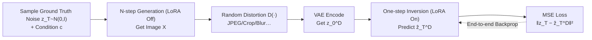

# FARI: Robust One-Step Inversion for Watermarking in Diffusion Models

**Conference**: ICLR 2026  
**OpenReview**: [https://openreview.net/forum?id=YiGdNowqj6](https://openreview.net/forum?id=YiGdNowqj6)  
**Code**: Available in supplementary materials (Reproducibility Statement promises open source)  
**Area**: Image Generation / Diffusion Model Watermarking  
**Keywords**: Diffusion model watermarking, DDIM inversion, one-step inversion, trajectory distillation, adversarial training, LoRA, robustness  

## TL;DR
FARI identifies a geometric asymmetry where the "curvature of the inversion trajectory is significantly lower than that of the generation trajectory." Based on this, it distills multi-step DDIM inversion into a single step and employs lightweight adversarial LoRA fine-tuning to specifically enhance watermark extraction robustness. With just 20 minutes of fine-tuning on a single A6000, one-step inversion surpasses 50-step DDIM in watermark verification robustness.

## Background & Motivation
**Background**: Inversion-based watermarking is a mainstream approach for authenticating images generated by diffusion models. It involves embedding a watermark into the initial noise $z_T$, such that the watermark is deeply coupled with image semantics during generation (becoming nearly invisible), and then using DDIM inversion to revert the image $z_0$ back to noise for decoding. Representative methods include Tree-Ring (frequency domain) and Gaussian Shading (spatial domain).

**Limitations of Prior Work**: The inversion step is the bottleneck of the entire pipeline—it is both slow and inaccurate. Existing inversion methods (EDICT, BELM, ExactDPM, ReNoise, Null-Text Inversion, etc.) primarily focus on **internal truncation errors** (discretization truncation + CFG irreversibility), attempting to approach the error bound through iteration, optimization, or analytical control. However, these methods are designed for **image editing**, where the goal is precise reconstruction from clean images.

**Key Challenge**: The error bottleneck in watermarking scenarios is fundamentally different. Before extraction, images often undergo external distortions such as JPEG compression, blurring, or cropping. These perturbations **rapidly amplify and dominate the error** along the inversion trajectory, completely drowning out internal truncation errors. The problem is that internal truncation error is proportional to step size, forcing traditional methods to stay in the high NFE (number of function evaluations) regime, failing to satisfy both "speed" and "robustness." Furthermore, direct **adversarial training** for robustness is computationally infeasible due to the memory explosion caused by backpropagating through lengthy multi-step inversion chains.

**Goal**: To design an inverter tailored for watermark extraction that is both **fast and robust**.

**Core Idea**: The authors present two key observations—**(1) Geometric Asymmetry**: The curvature of the inversion trajectory is significantly lower than that of the generation trajectory, making it highly compressible and suitable for low-NFE or even one-step approximation; **(2) Trade-off Shift**: The trade-off between speed and truncation error isn't critical for watermark verification, as external distortions dominate. Combined, these mean that **compressing inversion to a single step not only improves speed but also unlocks end-to-end adversarial training**, directly targeting the true goal of robustness.

## Method

### Overall Architecture
FARI (Fast Asymmetric Robust Inversion) integrates "one-step distillation" and "adversarial training" into a **single, end-to-end, LoRA-based fine-tuning** process, where both share the same optimization objective and converge extremely fast. During training, a LoRA adapter is injected into the denoiser: the **LoRA is turned off during the generation phase** (maintaining original generation quality) and **turned on during the inversion phase** for one-step inversion. Similarly, during inference, LoRA is off for denoising and on for watermark extraction, requiring no second full denoiser and remaining memory-efficient.

### Key Designs

**1. Discovery of Geometric Asymmetry: Inversion trajectories are "low-curvature," making one step sufficient.** This is the physical starting point of the paper. DDIM inversion requires solving $z_t$ from $z_{t-1}$, but $\epsilon_\theta(z_t,t)$ cannot be calculated explicitly on the right side of the equation. Conventional methods use a piecewise linear assumption $\epsilon_\theta(z_t,t)\approx\epsilon_\theta(z_{t-1},t)$, which requires small step sizes and is the primary source of error on clean images. The authors point out that under the superposition of directional and positional shifts, the **curvature** of the trajectory shows profound asymmetry—the inversion curvature is significantly lower than the denoising curvature. The intuition is that generation trajectories have high curvature near the noise end ($t\to T$) because different images diffuse to the same noise point, causing trajectories to cross and requiring constant correction. In contrast, accumulated errors during inversion **retain low-frequency information of the source image** (image outlines are visible in noise reconstruction errors). This residual semantic information helps the inversion determine the direction more accurately near the noise end, thereby suppressing curvature. Since curvature is strongly correlated with numerical truncation error, a single step suffices when curvature approaches zero.

**2. Inverse One-Step Distillation: Learning a direct mapping from "Generated Image → Ground Truth Noise" instead of mimicking 50-step DDIM.** This is a key departure from standard generation distillation. FARI does **not** take a real image and mimic the output of a 50-step DDIM inversion (which would be capped by the inherent error of DDIM). Instead, it **samples ground truth Gaussian noise $z_T$, performs a full generation to get an image, and learns a one-step mapping from that generated image directly back to the original $z_T$**. The one-step inversion formula (unconditional, guidance scale=1, null prompt) is:

$$\hat z_T^D = \sqrt{\bar\alpha_T}\, z_0^D + \sqrt{1-\bar\alpha_T}\,\epsilon_\theta(z_0^D, 0, \varnothing; \psi)$$

where $\psi$ denotes LoRA parameters. A counter-intuitive detail: the time step used is $t=0$ rather than $t=T$. Since the linear assumption fails in a single-step scenario, using a small value like $t\approx0$ better matches the latent $z_0^D$, reduces initial error, and improves convergence. This "ground-truth noise supervision" is naturally suited for watermarking (since watermarks are embedded in $z_T$) and bypasses the accuracy ceiling of DDIM inversion.

**3. The One-Step Dividend: End-to-end adversarial training for direct robustness.** One-step inversion collapses the computational graph from a long multi-step chain to a single step, making end-to-end adversarial training—previously impossible due to memory limits—feasible. In each training loop: sample $z_T$ and condition $c$ to generate image $X$ (LoRA Off) $\to$ randomly apply distortion $D(\cdot)$ from 9 types to get $X_D$ $\to$ VAE encode to $z_0^D$ $\to$ perform one-step inversion with LoRA On to reconstruct noise $\to$ optimize via:

$$\min_\psi\ \mathbb{E}_{z_T,c\in C,D\in T}\big[\,\|z_T-\hat z_T^D\|_2^2\,\big]$$

The authors emphasize that a computationally cheaper "decomposed objective" (step-by-step supervision like diffusion pre-training) fails to learn the **global** robustness required for complex adversarial distortions; end-to-end training is essential.

**4. LoRA as a Plug-and-Play Robustness Module with zero loss in generation quality.** Robustness knowledge is stored in external LoRA parameters ($W_0+BA$, rank $r=8$, injected only into attention modules). Disabling the LoRA branch during generation ensures the original model's quality remains unchanged, avoiding the need for a second full denoiser. LoRA acts as a modular enhancement; even if removed, DDIM can still perform inversion, albeit with significant error.

## Key Experimental Results

Setup: SD v1.5 / v2.1; Watermarks: Tree-Ring (TR, measured by TPR at FPR=$10^{-3}$) and Gaussian Shading (GS, measured by Bit Accuracy); Training: 1000 steps using 1000 MS-COCO prompts, batch=4, lr=1e-4, approx. 20 mins on one A6000; Evaluation: SDP dataset with 1000 prompts under various distortions.

### Main Results (SD v1.5 Excerpt, higher is better)

**Gaussian Shading Bit Accuracy**

| Method | NFE | Clean | Adv. | JPEG | R.Crop | R.Drop | G.Noise | S&P |
|------|-----|-------|------|------|--------|--------|---------|-----|
| DDIM | 50 | 1.000 | 0.978 | 0.989 | 0.978 | 0.974 | 0.961 | 0.935 |
| DDIM | 1 | 1.000 | 0.938 | 0.970 | 0.886 | 0.881 | 0.940 | 0.911 |
| EDICT | 50 | 1.000 | 0.964 | 0.979 | 0.966 | 0.957 | 0.939 | 0.912 |
| DMD2 | 1 | 0.999 | 0.929 | 0.976 | 0.845 | 0.824 | 0.925 | 0.901 |
| **Ours** | **1** | **1.000** | **0.983** | **0.994** | **0.978** | **0.976** | **0.984** | **0.965** |

**Tree-Ring TPR@1e-3**

| Method | NFE | Adv. | JPEG | R.Crop | G.Noise | S&P |
|------|-----|------|------|--------|---------|-----|
| DDIM | 50 | 0.949 | 0.989 | 1.000 | 0.636 | 0.946 |
| DDIM | 1 | 0.863 | 0.905 | 0.602 | 0.891 | 0.990 |
| BELM | 50 | 0.592 | 0.768 | 0.032 | 0.384 | 0.852 |
| **Ours** | **1** | **0.997** | **1.000** | **1.000** | **0.980** | **1.000** |

Key Point: FARI achieves the **most robust results with the lowest NFE (1)**. On TR, Adv. improves from 0.949 (50-step DDIM) to 0.997; Gaussian Noise, the hardest distortion, improves from 0.636 to 0.980. EDICT/BELM, designed for editing, perform poorly on noise reconstruction (BELM's multi-step error accumulation makes it sensitive to guidance scale mismatch, with R.Crop at only 0.032). ExactDPM uses gradient descent to optimize trajectories but is extremely slow (NFE>150) and fails on "missing content" distortions like cropping, where it attempts to complete the image, causing trajectory drift.

### Ablation Study

| Ablation Item | Setting | Conclusion |
|--------|------|------|
| LoRA Rank | 1 / 2 / 4 / 8 / 16 / 32 / 64 | Rank=1 is already quite good; increases yield marginal gains. Low rank is sufficient. |
| Training NFE | 1 vs >1 | Multi-step training **decreases performance**: one step is enough to approximate low-curvature trajectories; multi-step forward passes accumulate error. |
| Unseen Distortion | No Noise / Blind to Noise / All Noise | Significantly more robust to distortions **not seen** during training; good generalization. |
| Accelerator Comparison | AMED / LCM-LoRA / DMD2 | All inferior to FARI: AMED only predicts a single median step (space is too narrow); distillation for structural image prediction is fundamentally different from noise prediction. |

### Key Findings
- **Inversion $\neq$ Generation**: Directly applying generation acceleration/distillation methods for one-step inversion fails because predicting reverse ODE directions from structured images is a different problem than predicting from pure noise.
- **Generalization and Intensity**: The greater the distortion intensity, the more pronounced FARI's advantage over DDIM; performance stays stable across a wide guidance scale range (2.5–12.5).
- **One-Step is Optimal, Not a Compromise**: Increasing training or inversion steps sacrifices both speed and performance, confirming one-step inversion as the optimal choice.

## Highlights & Insights
- **Problem Redefinition is More Valuable than the Method**: The sharpest point of the paper is Identifying that the error bottleneck in watermarking is external distortion rather than internal truncation error. This invalidates the default premise that "inversion must be high NFE"—an insight more valuable than the network design itself.
- **Geometric Asymmetry is a Physical Discovery**: The low curvature of the inversion trajectory is supported by verifiable curvature curves and NFE tolerance experiments, with a mechanistic explanation (residual semantics help orientation).
- **"Slow" is the Cause of "Fragility," Not Just a Parallel Flaw**: The authors link speed and robustness in a causal chain: only after one-step simplification does end-to-end adversarial training become feasible.
- **Engineering Simplicity**: 20-minute single-GPU fine-tuning and plug-and-play LoRA with zero loss to generation quality make for a very low deployment bar.

## Limitations & Future Work
- **Sacrifice of Clean Image Precision**: One-step inversion loses precision on distortion-free images, making it **unsuitable for image editing** tasks requiring high-fidelity reconstruction.
- **Tied to ODE Sampling**: Like all inversion-based watermarking, it depends on ODE samplers and will fail if switched to SDE samplers.
- **Double-Edged Sword**: The authors note that one-step inversion significantly shrinks the computational graph, which may make originally resource-intensive **adversarial watermark removal attacks** (which require backpropagating through inversion steps) easier to execute.
- Experiments focused on SD v1.5/v2.1; transferability to newer architectures like SDXL or Flow Matching is not fully verified.

## Related Work & Insights
- **Three Schools of Inversion Watermarking**: Fourier domain (Tree-Ring), Spatial domain (Gaussian Shading), and Dual-domain fusion (GaussMarker). FARI is an orthogonal "inverter" layer improvement.
- **Inversion Methods**: EDICT/BELM/BDIA modify sampling for reversibility; AIDI/ExactDPM/ReNoise rely on iteration; NTI/NPI optimize null-text. These are training-free and designed for editing, often degrading under adversarial extraction.
- **Diffusion Acceleration**: Solvers (DPM-Solver) and distillation (Consistency Models). FARI borrows distillation ideas but applies them to the **inversion** trajectory, which is cost-effective due to low curvature.

## Rating
- **Novelty**: ⭐⭐⭐⭐⭐ Geometric asymmetry discovery + problem redefinition creates a clean causal chain—true perspective innovation.
- **Experimental Thoroughness**: ⭐⭐⭐⭐ Covers two models, two watermarks, over ten distortions, intensity scans, and unseen generalization. Slight deduction for lacking SDXL/Flow Matching validation.
- **Writing Quality**: ⭐⭐⭐⭐⭐ Motivations are presented with extreme clarity. Figures 1 and 3 provide excellent visualization of curvature and error.
- **Value**: ⭐⭐⭐⭐⭐ Transitions inversion watermarking from a high-NFE lab setting to a deployable state: 20-minute fine-tuning, one-step extraction, and superior robustness.

<!-- RELATED:START -->

## Related Papers

- [\[ICLR 2026\] Guidance Watermarking for Diffusion Models](guidance_watermarking_for_diffusion_models.md)
- [\[CVPR 2026\] InverFill: One-Step Inversion for Enhanced Few-Step Diffusion Inpainting](../../CVPR2026/image_generation/inverfill_one-step_inversion_for_enhanced_few-step_diffusion_inpainting.md)
- [\[CVPR 2026\] SPDMark: Selective Parameter Displacement for Robust Video Watermarking](../../CVPR2026/image_generation/spdmark_selective_parameter_displacement_for_robust_video_watermarking.md)
- [\[ICLR 2026\] SERUM: Simple, Efficient, Robust, and Unifying Marking for Diffusion-based Image Generation](serum_simple_efficient_robust_and_unifying_marking_for_diffusion-based_image_gen.md)
- [\[ICLR 2026\] On the Design of One-Step Diffusion via Shortcutting Flow Paths](on_the_design_of_one-step_diffusion_via_shortcutting_flow_paths.md)

<!-- RELATED:END -->
