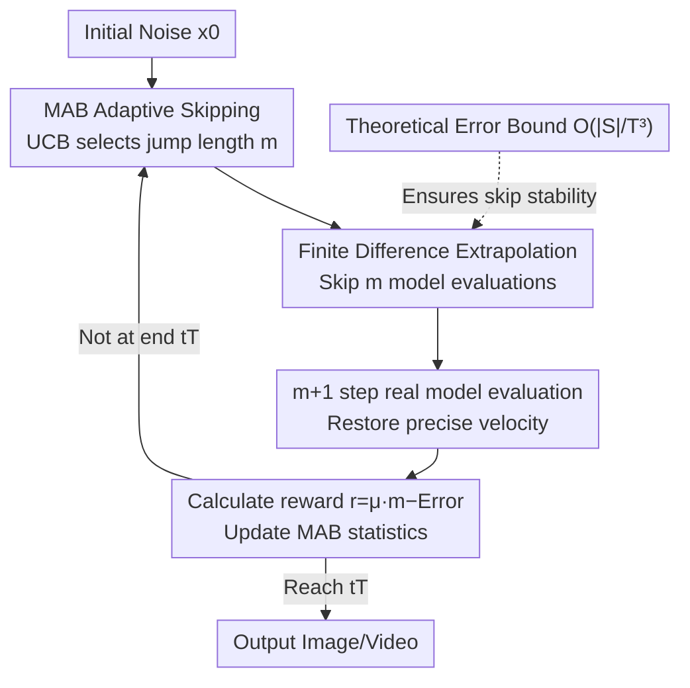

# FastFlow: Accelerating The Generative Flow Matching Models with Bandit Inference

**Conference**: ICLR2026  
**OpenReview**: [https://openreview.net/forum?id=wWkyL8D9xd](https://openreview.net/forum?id=wWkyL8D9xd)  
**Code**: https://github.com/Div290/FastFlow  
**Area**: Diffusion/Flow Matching Generation · Inference Acceleration  
**Keywords**: Flow Matching, Inference Acceleration, Multi-Armed Bandit, Finite Difference Extrapolation, Training-free

## TL;DR
FastFlow is a training-free, plug-and-play inference acceleration framework for flow matching (FM). It approximates redundant denoising steps that are "nearly linear" at zero cost using finite difference extrapolation, and employs a Multi-Armed Bandit (MAB) to online decide the safe jump length at each step. It achieves over 2.6× acceleration on image/video generation and editing tasks with minimal quality degradation.

## Background & Motivation
**Background**: Flow matching (FM) models achieve SOTA fidelity in image and video generation by learning a continuous velocity field that transports a simple distribution to the data distribution. While FM converges faster and requires fewer sampling steps than diffusion models, inference still requires discretizing the ODE into dozens of steps and solving them **sequentially** using the forward Euler method. Each step necessitates a full network evaluation for velocity prediction, leading to unacceptable latency as models scale in size, resolution, or video duration.

**Limitations of Prior Work**: Existing acceleration solutions—such as distillation, trajectory truncation, consistency training, and caching methods like TeaCache—share common drawbacks: (1) they require additional training phases, rely on large-scale data, or introduce non-trivial overhead; (2) they use a **uniform** inference schedule for all inputs, ignoring the fact that some samples converge quickly while others require longer trajectories; (3) caching methods like TeaCache rely on **manually designed** relative L1 distance thresholds to decide cache reuse. Once a target acceleration ratio is fixed (e.g., 2×), they degenerate into a fixed schedule that skips the same timesteps for all prompts, often requiring task-specific polynomial fitting.

**Key Challenge**: Skipping steps saves computation, but each skipped step introduces approximation errors that accumulate along the trajectory, leading to distortion. The optimal decision for "how many steps to skip" **varies with sample complexity** and is not a constant that can be hard-coded. A one-size-fits-all static schedule cannot simultaneously achieve aggressive computation saving and per-sample fidelity.

**Goal**: Without retraining or adding auxiliary networks, identify truly redundant denoising steps in each sampling trajectory and approximate them at zero cost, while making the decision of "when to approximate and when to evaluate the real model" an **adaptive, per-sample, per-timestep** online process.

**Key Insight**: The authors observe that since the FM training objective is to fit linear paths, the denoising trajectories are **approximately linear**. However, upon closer inspection, even smooth segments contain subtle but systematic velocity corrections; ignoring these leads to cumulative bias (a blind spot for methods like TeaCache that only use "velocity from the previous step").

**Core Idea**: Use the velocities of the past few steps for **finite difference extrapolation** to approximate future velocities (zero extra forward passes), and model the decision of "how many steps to skip before the next real model evaluation" as a **Multi-Armed Bandit** problem to learn the optimal policy online.

## Method

### Overall Architecture
FastFlow wraps around a standard Euler flow matching sampler without modifying weights or adding networks. Sampling starts from an initial noise $x_0$. Instead of evaluating the velocity model $M$ at every step of $T$, FastFlow inserts a Multi-Armed Bandit $B_{t_k}$ at each "decision moment." Using a UCB strategy, the MAB selects a jump length $m$. The next $m$ steps are advanced entirely via **finite difference extrapolation** without touching the large network. A real model evaluation $M$ is performed only at step $m+1$. This evaluation pulls the trajectory back to an accurate value and provides feedback: the error between the extrapolated and real velocity, combined with the jump length, forms a reward to update the MAB statistics. This cycle continues until $t_T$. The mechanism is sample-adaptive—skipping aggressively on flat trajectories and reverting to precise computation at high-curvature or unstable segments.

### Key Designs

**1. Finite Difference Velocity Extrapolation: Zero-cost approximation of redundant steps**

The challenge is that skipping steps requires knowing the velocity at those steps for the Euler update. The simplest approach assumes $\frac{dv(x_t,t)}{dt}\to 0$ and reuses the most recent velocity (similar to TeaCache), but the authors found that even in smooth segments, velocities undergo subtle adjustments. Treating them as constants leads to visible cumulative errors. FastFlow applies a first-order Taylor expansion to $x_{t+\Delta t}$ and takes the time derivative to get $v(x_{t+\Delta t}, t+\Delta t)=v(x_t,t)+\Delta t\cdot\frac{dv(x_t,t)}{dt}$. It then uses the **finite difference of the past two real velocity estimates** to approximate the derivative term ($p<k$):

$$v(x_{k+1}, t_{k+1}) \approx v(x_k, t_k) + \Delta t_k \cdot \frac{v(x_{t_k}, t_k) - v(x_{t_p}, t_p)}{t_k - t_p}.$$

This elevates "previous velocity" to "previous velocity + linear trend of velocity change," capturing subtle corrections missed by zero-order approximation. Crucially, it **only uses subtractions and scaling of already computed historical velocities**, triggering no extra forward passes.

**2. MAB Adaptive Skipping: Online learning of "safe jump lengths"**

With the extrapolation tool ready, the core problem is **how many steps to skip**. FastFlow models this as a Multi-Armed Bandit (MAB) problem. At each timestep $t_k$, an independent bandit instance $B_{t_k}$ is initialized. Each arm $\alpha_{t_k}$ corresponds to a decision: "skip $\alpha$ steps before the next real evaluation." Arms are selected using the UCB (Upper Confidence Bound) strategy $\alpha_{t_k}\leftarrow\arg\max_{\alpha}\big[Q(\alpha)+\gamma\sqrt{\ln n/N(\alpha)}\big]$ (exploration constant $\gamma=2.0$). After each cycle, a reward is calculated based on the real evaluation at step $m+1$:

$$r(\alpha_{t_k}) = \mu \cdot \alpha_{t_k} - \ell\big(\hat{v}(x_{t_k}, t_k),\, v(x_{t_k}, t_k)\big),$$

where $\ell$ measures the difference (e.g., MSE) between extrapolated and real velocity, and $\mu>0$ is a trade-off coefficient. The term $\mu\cdot\alpha$ rewards skipping for speed, while the second term penalizes extrapolation drift for fidelity. The reward directly quantifies the drift. The coefficient $\mu$ is adaptively set as $\mu=\frac{\max_t \mathrm{MSE}(\hat v_t, v_t)}{\text{total steps}}$ estimated from the first generation.

**3. Theoretical Error Bound: Formal guarantee against collapse**

Theorem 3.1 provides a formal guarantee: let $\{x^{\text{true}}_{t_k}\}$ be the trajectory of the exact velocity field with Euler, and $\{x^{\text{approx}}_{t_k}\}$ be the trajectory using extrapolated jumps on subset $S$. Under smoothness assumptions and uniform step size $\Delta t=1/T$, the cumulative terminal error after $T$ steps is:

$$e_T := \|x^{\text{approx}}_{t_T} - x^{\text{true}}_{t_T}\| = O\!\left(\frac{|S|}{T^3}\right).$$

The bound shows that the error **grows linearly with the number of skipped steps $|S|$ but decays cubically with the total steps $T$**. This implies that as the discretization becomes denser, the cost of skipping the same proportion of steps becomes smaller, providing theoretical justification for why the MAB can skip steps aggressively without significant quality loss.

### Loss & Training
FastFlow **requires no training or fine-tuning**. The velocity model $M$ is a frozen pre-trained FM model. The "learning" happens online during inference. The MAB is initialized using the first prompt to ensure every arm is explored once (cold start), then updates statistics $Q$ and $N$ during subsequent sampling. It is "model-agnostic and plug-and-play."

## Key Experimental Results

### Main Results
Covering Text-to-Image (GenEval), Image Editing (GEdit), and Text-to-Video (VBench) across models like BAGEL, Flux-Kontext, PeRFlow, Step-1X-Edit, and HunyuanVideo. Speedup is relative to 50-step generation on a single A100.

GenEval T2I (Excerpted Table 1, ↑ higher is better, Spd. for speedup, Lat. for Latency/s):

| Method | Overall ↑ | CLIPIQA ↑ | Spd. ↑ | Lat. ↓ |
|------|-----------|-----------|--------|--------|
| Full 50 (Upperbound) | 0.78 | 0.85 | 1.00× | 36.2 |
| Full 25 | 0.77 | 0.82 | 2.00× | 19.5 |
| InstaFlow (Distill) | 0.33 | 0.74 | 50.0× | 01.5 |
| PeRFlow | 0.58 | 0.80 | 5.00× | 08.2 |
| TeaCache | 0.76 | 0.80 | 1.85× | 20.6 |
| **FastFlow-50** | **0.78** | **0.83** | **2.65×** | 13.7 |
| **FastFlow-25** | 0.77 | 0.80 | 4.54× | 08.6 |

Under equivalent acceleration levels, FastFlow achieves higher Overall and CLIPIQA scores than TeaCache. FastFlow-50 nearly matches the quality of Full-50 while being 2.65× faster. For video generation (Fig.3) and editing (Fig.2), FastFlow maintains higher quality than baselines at the same speed.

### Ablation Study

| Configuration | Key Observation |
|------|---------|
| Full FastFlow | 2.6×+ speedup with minimal quality loss. |
| Zero-order Approximation | Significant cumulative error (Fig.4). Removing the finite difference term reverts to TeaCache-style assumptions. |
| Fixed Jump Schedule | Degenerates to skipping the same timesteps for all prompts, losing sample adaptivity. |
| Adjusting $\mu$ | Larger $\mu$ favors aggressive skipping; smaller $\mu$ prioritizes fidelity. |

### Key Findings
- **Velocity is not a constant (Fig.4)**: In BAGEL, relative L1 error of adjacent velocities follows a three-stage pattern: establishing coarse flow, mid-stage fine corrections, and end-stage refinement. These mid-stage corrections are small but non-negligible.
- **MAB vs. Manual Thresholds**: While TeaCache uses a fixed schedule for a target ratio, FastFlow adjusts per-sample, saving more computation on simple samples while locking in errors on complex ones.
- **Cross-task Generalization**: The same mechanism works across image/video tasks and different backbones without modification.

## Highlights & Insights
- **Approximation as an Online Learning Problem**: Using MAB for skipping decisions is the most clever aspect—the decision space (discrete jump sizes) and feedback (velocity error) are perfectly suited for MAB with negligible overhead.
- **Upgrading Approximation Order**: Moving from "reuse last velocity" (zero-order) to "velocity + linear trend" (first-order finite difference) significantly reduces error with zero extra cost.
- **Theoretic Buffer**: The $O(|S|/T^3)$ bound provides the theoretical "bottom line" for why skipping is safe, shifting the approach from empirical heuristic to bounded control.

## Limitations & Future Work
- **Reliance on Linear Trajectory Assumption**: Performance depends on FM producing near-linear paths. For models with high curvature, the MAB will automatically compress the jump range, reducing acceleration.
- **Cold Start overhead**: Initializing one MAB per timestep using the first prompt might be non-negligible for single-prompt or very short batch scenarios.
- **Metric Selection**: Using MSE as a proxy for the reward $\ell$ might not strictly align with human perceptual quality.
- **Future Directions**: Replacing the MAB with a contextual bandit (using $x_{t_k}$ features) or allowing the arm set to be learned online could further enhance adaptivity.

## Related Work & Insights
- **vs. Distillation (InstaFlow / PeRFlow)**: Distillation is extremely fast (50x) but suffers significant quality drops (e.g., InstaFlow Overall 0.33). FastFlow is training-free and maintains near-lossless quality.
- **vs. TeaCache**: Both skip steps, but TeaCache uses manual L1 thresholds and degenerates to a fixed schedule. FastFlow uses higher-order approximation and sample-adaptive MAB.
- **vs. High-order Solvers (PNDM etc.)**: High-order solvers apply uniform processing. FastFlow can be viewed as an "adaptively-triggered higher-order update" where the MAB decides when to skip.

## Rating
- Novelty: ⭐⭐⭐⭐☆ Clever combination of MAB for decision and finite difference for extrapolation.
- Experimental Thoroughness: ⭐⭐⭐⭐☆ Covers images/videos and multiple backbones with theoretical analysis.
- Writing Quality: ⭐⭐⭐⭐☆ Clear motivation (Fig.4) and logical derivation of the theoretical bound.
- Value: ⭐⭐⭐⭐☆ Direct engineering value for real-time deployment of generative models.

<!-- RELATED:START -->

## Related Papers

- [\[ICLR 2026\] MeanCache: From Instantaneous to Average Velocity for Accelerating Flow Matching Inference](meancache_from_instantaneous_to_average_velocity_for_accelerating_flow_matching_.md)
- [\[ICLR 2026\] STORK: Accelerating Diffusion and Flow Matching Sampling by Simultaneously Solving Stiffness and Structural Dependency](stork_faster_diffusion_and_flow_matching_sampling_by_resolving_both_stiffness_an.md)
- [\[ICLR 2026\] LapFlow: Laplacian Multi-scale Flow Matching for Generative Modeling](lapflow_laplacian_multi-scale_flow_matching_for_generative_modeling.md)
- [\[ICLR 2026\] Delay Flow Matching](delay_flow_matching.md)
- [\[ICLR 2026\] Source-Guided Flow Matching](source-guided_flow_matching.md)

<!-- RELATED:END -->
