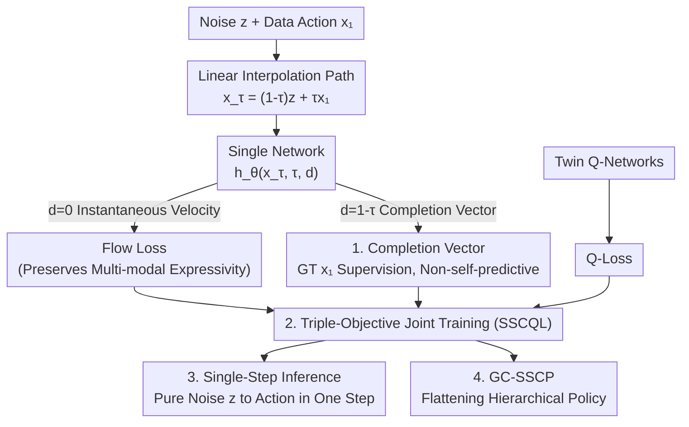

# SSCP: Flow-Based Single-Step Completion for Efficient and Expressive Policy Learning

**Conference**: ICLR 2026  
**arXiv**: [2506.21427](https://arxiv.org/abs/2506.21427)  
**Code**: [GitHub](https://github.com/PrajwalKoirala/SSCP-Single-Step-Completion-Policy)  
**Area**: Image Generation  
**Keywords**: offline RL, flow matching, single-step generation, completion vector, policy learning, D4RL

## TL;DR
The authors propose Single-Step Completion Policy (SSCP), which compresses multi-step generative policies into single-step inference by predicting a "completion vector" (the normalized direction from any intermediate state to the target action) within a flow-matching framework. On D4RL, it performs equitably with multi-step diffusion/flow policies while being 64× faster in training and 4.7× faster in inference, further extending to flatten hierarchical policies in GCRL.

## Background & Motivation
**Background**: Generative policies based on diffusion/flow matching perform exceptionally in offline RL due to their ability to capture multi-modal action distributions (e.g., DQL, CAC). However, they require dozens of iterative sampling steps, leading to high inference latency.

**Limitations of Prior Work**:
   - **Inference Efficiency**: Diffusion policies require 5-50 denoising steps, making them unsuitable for real-time control (DQL ~1.27ms vs. deterministic policies ~0.1ms).
   - **Training Instability**: Backpropagating policy gradients through multi-step sampling chains (BPTT) leads to unstable gradients and time-consuming training (DQL ~8 hours vs. TD3+BC ~30 minutes).
   - **Bootstrap Issues in Shortcut Methods**: The shortcut model proposed by Frans et al. 2024 uses its own predictions as training targets (self-consistency loss), which is unstable in dynamic target scenarios like RL.

**Key Challenge**: How to balance the expressivity of generative policies with inference and training efficiency?

**Core Idea**: At any intermediate time step $\tau$ of flow matching, predict a completion vector that directly reaches the target $x_1$ (instead of a velocity field), supervised by ground-truth data (non-bootstrap) to achieve single-step generation.

## Method

### Overall Architecture
SSCP aims to resolve the contradiction between the high expressivity and slow iterative inference of generative policies. It starts from standard flow matching: a linear interpolation path $x_\tau = (1-\tau)z + \tau x_1$ between noise $z$ and target action $x_1$, where time $\tau$ ranges from 0 to 1. Conventional flow policies learn the instantaneous velocity field at each point, requiring small integration steps during inference.

The key shift in SSCP is that at any intermediate point $x_\tau$ on the path, the model learns not just the velocity, but also a "completion vector"—the direction pointing directly from the current point to the endpoint $x_1$. During training, the model simultaneously fits two quantities: the instantaneous velocity $h_\theta(x_\tau, \tau, d=0)$ (constrained by standard flow loss) and the completion vector $h_\theta(x_\tau, \tau, d=1-\tau)$ (supervised directly by ground-truth $x_1$). During inference, the agent starts from pure noise $z$, sets the remaining span $d=1$, and outputs the action in one step $\pi_\theta(s) = z + h_\theta(z, s, 0, 1)$. This preserves the multi-modal expressivity of flow matching while compressing sampling from dozens of steps to one. The method comprises a dual-output network with triple-objective optimization, single-step inference, and an extension to goal-conditioned RL (GC-SSCP).

### Key Designs

**1. Completion Vector: Jumping from intermediate points to the end via ground-truth supervision**

The slow inference of flow policies stems from knowing only local velocity. The completion vector answers "how to reach $x_1$ from $x_\tau$ in one step." It is the normalized direction to the target; multiplying it by the remaining span $1-\tau$ recovers the endpoint $\hat{x}_1 = x_\tau + h_\theta(x_\tau, \tau, 1-\tau) \cdot (1-\tau)$. The objective is to minimize the distance to the real action:

$$\mathcal{L}_{completion} = \mathbb{E}\big[\|x_\tau + h_\theta(x_\tau, \tau, 1-\tau)(1-\tau) - x_1\|^2\big]$$

The crucial difference lies in the supervision signal: Frans et al. 2024's shortcut models use the model's own predictions (self-consistency/bootstrap), which accumulates error in dynamic RL targets. SSCP uses fixed ground-truth $x_1$ from the dataset, avoiding instability. This regression is feasible because action spaces in RL are low-dimensional ($<20$), unlike high-dimensional image generation.

**2. Triple-Objective Training (SSCQL): Distribution, Step Quality, and Value**

Offline RL requires distribution matching and value optimization. The actor objective combines three terms:

$$\mathcal{L}_\pi = \alpha_1 \mathcal{L}_{flow} + \alpha_2 \mathcal{L}_{completion} + \mathcal{L}_{\pi_Q}$$

$\mathcal{L}_{flow}$ maintains multi-modal fitting capability. $\mathcal{L}_{completion}$ ensures single-step quality and acts as a behavioral constraint (BC regularization). $\mathcal{L}_{\pi_Q}$ is the Q-learning policy gradient for value optimization. The critic uses standard twin Q-learning with target networks.

**3. Single-Step Inference: Deterministic recovery of multi-modality**

At inference, time is set to the start and span to full ($\tau=0, d=1$). The model yields the action in one forward pass: $\pi_\theta(s) = z + h_\theta(z, s, 0, 1)$. This matches the speed of deterministic policies like TD3+BC. While the output is deterministic for a fixed $z$, sampling different $z$ allows the policy to cover multiple modes.

**4. Goal-Conditioned Extension (GC-SSCP): Compressing decision hierarchies**

In Goal-Conditioned RL (GCRL), methods like HIQL use hierarchical (high-level + low-level) policies. GC-SSCP applies the completion idea to train a flat single-layer policy that matches the combined output of the hierarchy, allowing single-step decision making. Just as SSCP collapses generation steps, GC-SSCP collapses decision layers.

### Loss & Training
The actor is optimized via $\alpha_1 \mathcal{L}_{flow} + \alpha_2 \mathcal{L}_{completion} + \mathcal{L}_{\pi_Q}$. The critic uses twin Q-learning with soft target updates. Training uses Adam with a batch size of 256, taking ~16 minutes (compared to ~8 hours for DQL).

## Key Experimental Results

### Main Results (D4RL Offline RL)

| Method | Type | D4RL Avg (9 Tasks) | Training Time | Inference Latency | Denoising Steps |
|------|------|----------------|---------|---------|---------|
| DQL | Diffusion | 87.9 | ~8h | 1.27ms | 5 |
| CAC | Flow | 85.1 | ~5h | 0.85ms | 2 |
| TD3+BC | Deterministic | 85.2 | ~30min | 0.08ms | 1 |
| **SSCQL** | **Single-Step** | **87.9** | **~16min** | **0.27ms** | **1** |

SSCQL matches the SOTA diffusion baseline (DQL) while being **64× faster in training and 4.7× faster in inference**.

### Offline-to-Online Finetuning

| Method | Stability | Note |
|------|--------|------|
| DQL | Frequent Degradation (>10%) | Multi-step sampling causes instability |
| CAC | Frequent Degradation | Same as above |
| Cal-QL | Stable | SOTA designed for O2O |
| **SSCQL** | **Stable Improvement** | Single-step avoids BPTT instability |

### Online RL

| Method | HalfCheetah | Hopper | Walker2d |
|------|-------------|--------|----------|
| DQL | Poor | Poor | Poor |
| CAC | Poor | Poor | Poor |
| **SSCQL** | **Best** | **Best** | **Best** |

### Goal-Conditioned RL (OGBench)
GC-SSCP (flat) outperforms HIQL (hierarchical) on average, demonstrating successful compression of hierarchical structures.

### Key Findings
- Low-dimensional action spaces ($<20$) make direct regression of completion vectors feasible.
- Both flow loss (for expressivity) and completion loss (for single-step quality) are indispensable.
- Multi-step diffusion/flow policies are unstable in O2O and online RL due to BPTT.
- GC-SSCP demonstrates the broader utility of completion models in policy compression beyond generation steps.

## Highlights & Insights
- **Ground-truth supervision instead of bootstrap** is the core innovation. Self-consistency is unreliable in dynamic RL, whereas ground-truth actions provide stable supervision.
- **64× Training & 4.7× Inference Speedup** with equivalent performance makes flow policies viable for real-time control.
- **From Generation Compression to Decision Compression**: The transition from SSCP to GC-SSCP shows completion models can fold complex processes into single predictions.

## Limitations & Future Work
- The balancing coefficients $\alpha_1, \alpha_2$ require tuning per task.
- Completion predictions at early $\tau$ may be inaccurate due to high noise; theoretical analysis is lacking.
- Experiments are restricted to MuJoCo; validation on high-dimensional spaces (robotics, autonomous driving) is needed.
- Direct comparison with distillation methods (e.g., consistency models) is missing.

## Related Work & Insights
- **vs. DQL (Wang et al. 2022)**: DQL uses diffusion + DDPG+BC (5 denoising steps); SSCQL uses a completion policy (1 step), reaching equivalent performance 64× faster.
- **vs. Shortcut Models (Frans et al. 2024)**: Shortcut uses unstable bootstrap; SSCP uses stable ground-truth completion vectors.
- **vs. CAC**: CAC uses flow matching with consistency distillation; SSCP is simpler and avoids the distillation phase.

## Rating
- Novelty: ⭐⭐⭐⭐ Ground-truth supervision vs. bootstrap is a simple but effective insight.
- Experimental Thoroughness: ⭐⭐⭐⭐⭐ Comprehensive coverage (D4RL, O2O, Online, BC, GCRL).
- Writing Quality: ⭐⭐⭐⭐ Clear progressive development.
- Value: ⭐⭐⭐⭐⭐ Makes generative policies practical for real-time control with massive training speedup.

<!-- RELATED:START -->

## Related Papers

- [\[AAAI 2026\] EfficientFlow: Efficient Equivariant Flow Policy Learning for Embodied AI](../../AAAI2026/image_generation/efficientflow_efficient_equivariant_flow_policy_learning_for_embodied_ai.md)
- [\[ICLR 2026\] CMT: Mid-Training for Efficient Learning of Consistency, Mean Flow, and Flow Map Models](cmt_mid-training_for_efficient_learning_of_consistency_mean_flow_and_flow_map_mo.md)
- [\[CVPR 2026\] RenderFlow: Single-Step Neural Rendering via Flow Matching](../../CVPR2026/image_generation/renderflow_single-step_neural_rendering_via_flow_matching.md)
- [\[NeurIPS 2025\] Scaling Offline RL via Efficient and Expressive Shortcut Models](../../NeurIPS2025/image_generation/scaling_offline_rl_via_efficient_and_expressive_shortcut_models.md)
- [\[ICLR 2026\] Flow Matching with Injected Noise for Offline-to-Online Reinforcement Learning](flow_matching_with_injected_noise_for_offline-to-online_reinforcement_learning.md)

<!-- RELATED:END -->
