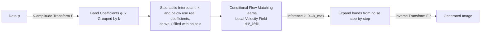

# Flow Along the $K$-Amplitude for Generative Modeling

**Conference**: ICLR 2026  
**OpenReview**: [https://openreview.net/forum?id=O224NIizhz](https://openreview.net/forum?id=O224NIizhz)  
**Code**: To be confirmed  
**Area**: Image Generation / Flow Matching / Frequency Domain Generation  
**Keywords**: K-Flow, Flow Matching, Frequency Domain Generation, Wavelet Transform, Fourier Transform, PCA, Controllable Generation  

## TL;DR
This paper proposes K-Flow, which reinterprets the "time" in flow matching as a **scaling parameter $k$** that organizes frequencies/scales. By allowing generation to unfold along the K-amplitude (frequency bands/coefficients) space from low to high frequencies, the model achieves natural scale-controllable generation (omitting class conditions, frequency editing, training-free restoration) and obtains competitive FIDs in image generation.

## Background & Motivation
- **Background**: Flow Matching (FM) has emerged as a cutting-edge generative paradigm, learning a time-dependent velocity field in pixel or latent space to continuously transport Gaussian noise to the data distribution. Natural data possesses an inherent frequency structure—energy is primarily concentrated in low-frequency bands, and empirically, DDPMs tend to "recover low frequencies first, then supplement high frequencies."
- **Limitations of Prior Work**: The denoising paths of conventional FM do not strictly follow a frequency-progressive order, and their frequency evolution is neither quantifiable nor controllable (see Figure S2 in the paper). Although the model implicitly learns "low-resolution/high-resolution features," the **boundaries between resolutions remain blurred**—one cannot specify which step of the inference process corresponds to which frequency band, making precise frequency intervention (editing, restoration, or scale-based conditioning) impossible.
- **Key Challenge**: Data is naturally hierarchical (multi-scale/multi-frequency), but the generation process flattens this hierarchy onto an uninterpretable time axis, leaving no entry point for controlling specific frequency bands.
- **Goal**: To establish a paradigm capable of fine-grained control in the frequency domain without sacrificing generation quality compared to conventional FM, explicitly encoding the "progressive unfolding of frequencies/scales" into the generation path.
- **Core Idea**: **Replace the flow matching time $t$ with a scaling parameter $k$**. Here, $k$ serves as a unified measure for organizing projection coefficients (frequency bands), and amplitude is the norm of these coefficients. Generation no longer progresses along time but along the K-amplitude, moving monotonically from $k=0$ (pure noise) to $k_{max}$ (full spectrum), naturally resulting in a controllable path where low frequencies emerge first, followed by high frequencies.

## Method

### Overall Architecture
K-Flow consists of two main components: **K-amplitude decomposition** (a family of reversible linear transforms $\mathcal{F}$ that project data from the spatial domain into a frequency band space organized by a scaling parameter $k$, instantiated here as Fourier, Wavelet, or PCA) and **Flow Matching along $k$** (constructing a stochastic interpolant that monotonically unfolds bands as $k$ increases while filling the rest with noise, then learning the velocity field via Conditional Flow Matching). During inference, starting from full noise, $k$ advances from small to large, gradually "growing" coefficients from low to high frequencies out of the noise, finally transformed back to pixels via $\mathcal{F}^{-1}$.

### Key Designs

**1. K-amplitude Decomposition: Organizing all multi-scale transforms with a unified scalar $k$.** Any complete basis $\{e_j\}$ can be partitioned into subsets $\{e_k\}$ according to a scaling parameter $k$. Thus, a signal is written as $\phi = \sum_k \phi_k$, where $\phi_k$ represents the components falling into the $k$-th frequency band, and its norm is the "K-amplitude." Taking 3D Fourier as an example, the authors compress high-dimensional frequency vectors $(k_x, k_y, k_z)$ into a scalar $k = \sqrt{k_x^2 + k_y^2 + k_z^2}$ (the radius of an "expanding sphere" in Fourier space). The elegance of this abstraction lies in the fact that Fourier, Wavelet, and PCA—three fundamentally different transforms—can all fit into the same $\phi = \sum_k \phi_k$ framework, provided $\mathcal{F}$ is linear and reversible.

**2. K-amplitude Stochastic Interpolant: Encoding "progressive band emergence" as a differentiable continuous flow.** In the discrete case, $k$ takes integer values. The authors construct a discrete flow via **noise filling**: $\varphi_k = \mathcal{F}^{-1}\big(\mathbb{I}_{k' \le k} \cdot \mathcal{F}\{\phi\} + (1 - \mathbb{I}_{k' \le k}) \cdot \epsilon\big)$. Coefficients within scale $k$ use ground truth data, while those outside are replaced by noise $\epsilon$, satisfying $\lim_{k \to k_{max}} \varphi_k = \phi$ and $\varphi_0$ as a tractable prior. To enable flow matching (requiring derivatives with respect to $k$), a **collision function** $\mu(t)$ (where $t = k - \lfloor k \rfloor$) is used to linearly transition between adjacent integer bands, ensuring $\Psi_k$ is differentiable everywhere.

**3. Localized Velocity Field: Restricting optimization at each step to a low-dimensional submanifold.** Instead of directly modeling $\Psi_k$, the model learns the conditional gradient field $\frac{d\Psi_k}{dk}$. Deriving from the interpolant formula, the conditional velocity field $\frac{d\Psi_k}{dk}(\phi, \epsilon) = \mathcal{F}^{-1}\big(\mathbb{I}_{k' \in [\lfloor k \rfloor, \lfloor k \rfloor + 1)} \cdot \mu'(t)(\epsilon - \mathcal{F}\{\phi\})\big)$ is obtained. The training objective is Conditional Flow Matching: $\mathcal{L}_{\text{K-Flow}} = \mathbb{E} \int_0^K \|\frac{d\Psi_k}{dk} - v_k(\Psi_k, \theta)\|^2$. A crucial observation is that this velocity field **is naturally non-zero only on the narrow frequency band** $\sqrt{k_x^2 + k_y^2 + k_z^2} \in [\lfloor k \rfloor, \lfloor k \rfloor + 1)$. This means each step of reconstruction only involves a small cluster of coefficients near the current $k$, reducing the dimensionality of the optimization space compared to pixel-space FM.

**4. Three Instantiations of Transforms: From data-agnostic to data-adaptive.** Fourier handles scale-localized global frequencies; Wavelet utilizes multi-resolution analysis (using scaling functions $\omega$ and wavelets $\psi$) to be both scale and space-localized (e.g., db6); PCA provides **data-dependent** decomposition where principal components are ordered by energy as "bands," capturing low-dimensional structures unique to the dataset.

## Key Experimental Results

### Main Results
Unconditional generation on CelebA-HQ 256×256 (sharing the same VAE latent space as LFM, K-Flow uses a MoE version of DiT-L/2 backbone):

| Model | FID↓ | Recall↑ |
|------|------|---------|
| K-Flow, Wave-DiT L/2 (Ours db6) | **4.99** | 0.46 |
| K-Flow, Fourier-DiT L/2 (Ours) | 5.11 | 0.47 |
| K-Flow, PCA-DiT L/2 (Ours) | 5.19 | 0.48 |
| LFM, DiT L/2 | 5.28 | 0.48 |
| LDM | 5.11 | 0.49 |
| WaveDiff | 5.94 | 0.37 |
| FM | 7.34 | - |

Class-conditional generation on ImageNet 256×256:

| Model | FID↓ | Recall↑ |
|------|------|---------|
| K-Flow, Fourier-DiT L/2 + cfg=1.5 | **2.73** | 0.45 |
| K-Flow, PCA-DiT L/2, cfg=1.5 | 4.19 | 0.43 |
| LFM, DiT L/2 + cfg=1.5 | 2.85 | 0.42 |
| LDM-8-G | 7.76 | 0.35 |
| VAR-d16 (cfg=2.0) | 3.30 | 0.51 |

### Ablation Study
Ablations focused on "scale controllability," quantified by CDR (Conditional Discrimination Ratio, where values closer to 1 indicate minimal performance drop when omitting conditions):

| Experimental Setting | Phenomenon / Metric |
|----------|------------|
| Class-condition drop (omit class during last 70% scale steps) | K-Flow CDR ≈ 1.49 (close to 1, minimal degradation); LFM CDR = 3.25 (significant degradation, blurry images) |
| Preserve high freq, modify low freq (fix high-scale noise) | Facial details remain consistent while background/gender/age/hairstyle change—alignment between bands and semantics |
| Image Restoration (SR/Deblurring) | Achieves SOTA PSNR/SSIM on CelebA (training-free, Appendix Table S6) |

### Key Findings
- **Semantics are encoded in low frequencies**: High-level semantics such as category are concentrated in low K-amplitude bands, so omitting class conditions in late inference stages does not affect quality, allowing for efficiency gains.
- **Bands naturally correspond to semantic attributes**: High frequencies lock in facial details while low frequencies govern background and overall appearance, enabling unsupervised controllable editing without fine-tuning.
- **Superior Diversity**: High dimensionality during low-scale stages allows K-Flow to generally outperform standard LFM in Recall.

## Highlights & Insights
- **Conceptual Unity**: Using a single scalar scaling parameter $k$ to unify Fourier, Wavelet, and PCA transforms into one flow matching framework is elegant and transform-agnostic.
- **Reinterpretation of "Time as Scale"**: Replacing the FM time axis with a physically meaningful frequency progression axis turns an implicit phenomenon into an explicit, quantifiable, and intervenable path.
- **Controllability as a Free Byproduct**: Scale decoupling enables class-condition dropping, band editing, and training-free restoration without additional modules, originating from the path design itself.
- **Localization Reduces Complexity**: The velocity field is naturally narrow-banded, updating only on low-dimensional submanifolds at each step, providing a new optimization perspective.

## Limitations & Future Work
- **Validated Only on Images**: Has not yet covered large-scale generation guided by multi-modal or dense captions.
- **Energy Perspective Under-explored**: While six properties are listed (including amplitude's relation to energy), the potential for integration with Energy-Based Models (EBM) is only briefly mentioned.
- **Dependence on Pre-trained VAE**: K-decomposition currently operates on existing VAE latents; using representations more suited for frequency decomposition (e.g., RGB→YCbCr + Sparse DCT) would require retraining the autoencoder.
- **Unified Understanding and Generation**: While low frequencies encode global semantics, the authors suggest connecting pre-trained representations from understanding tasks to generation, but this remains to be implemented.

## Related Work & Insights
- **Flow Matching Variants**: K-Flow is a new instance of the stochastic interpolant framework that organizes interpolation "progress" along frequency bands.
- **Frequency/Multi-scale Generation**: Unlike previous works using wavelets as architectural tricks, K-Flow uses frequency progression as the primary axis of the generation path.
- **Multi-scale Autoregression (VAR, FlowAR)**: Sharing the coarse-to-fine philosophy but using continuous flows, K-Flow naturally supports band-level editing.
- **Insight**: Replacing "time" with any structured monotonic scale (frequency, resolution, energy, or semantic hierarchy) is a transferable design pattern that could unlock new controllable generative paths in other modalities.

## Rating
- **Novelty**: ⭐⭐⭐⭐⭐ The reinterpretation of "time as a scale parameter" and the unified Fourier/Wavelet/PCA framework are refreshing and self-consistent.
- **Experimental Thoroughness**: ⭐⭐⭐⭐ Covers unconditional/conditional generation, controllability ablations, and restoration tasks, though limited to images and lacking larger-scale multi-modal validation.
- **Writing Quality**: ⭐⭐⭐⭐ Concepts are introduced step-by-step; however, some details (e.g., the six properties) are moved to the appendix, occasionally requiring cross-referencing.
- **Value**: ⭐⭐⭐⭐ Provides a general paradigm for frequency-level controllable generation and training-free editing/restoration, offering significant insights for unified vision modeling.

<!-- RELATED:START -->

## Related Papers

- [\[ICLR 2026\] LapFlow: Laplacian Multi-scale Flow Matching for Generative Modeling](lapflow_laplacian_multi-scale_flow_matching_for_generative_modeling.md)
- [\[CVPR 2026\] RecTok: Reconstruction Distillation along Rectified Flow](../../CVPR2026/image_generation/rectok_reconstruction_distillation_along_rectified_flow.md)
- [\[ICLR 2026\] Mirror Flow Matching with Heavy-Tailed Priors for Generative Modeling on Convex Domains](mirror_flow_matching_with_heavy-tailed_priors_for_generative_modeling_on_convex_.md)
- [\[ICLR 2026\] Gauge Flow Matching: Efficient Constrained Generative Modeling over General Convex Set and Beyond](gauge_flow_matching_efficient_constrained_generative_modeling_over_general_conve.md)
- [\[ICLR 2026\] GenCP: Towards Generative Modeling Paradigm of Coupled Physics](gencp_towards_generative_modeling_paradigm_of_coupled_physics.md)

<!-- RELATED:END -->
