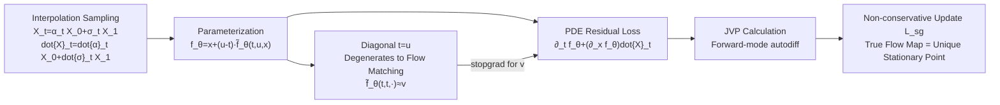

# Flow Map Learning via Non-Gradient Vector Flow

**Conference**: ICLR 2026  
**OpenReview**: [https://openreview.net/forum?id=C1bkDPqvDW](https://openreview.net/forum?id=C1bkDPqvDW)  
**Code**: TBD  
**Area**: Image Generation / Diffusion and Flow Model Acceleration  
**Keywords**: flow map, consistency model, few-step sampling, stop-gradient, non-conservative dynamics, JVP  

## TL;DR
SGFlow utilizes a partial differential equation (PDE) identity containing only Jacobian-vector products (JVP)—without model inversion—to transform flow map learning into a non-conservative dynamics objective with stop-gradients. Training from scratch ensures the true flow map is the unique stationary point, achieving few-step sampling on CIFAR-10 with lower memory usage and superior FID.

## Background & Motivation
**Background**: Diffusion and flow models are trained using simple regression losses, but sampling requires numerical integration of the Probability Flow ODE (PF-ODE). This necessitates a forward pass of the network at every step, leading to slow and costly inference. Consistency models and flow map matching aim to directly learn a mapping $f(t,u,x)$ that maps noise to any point on the trajectory, thereby bypassing integration to achieve adjustable 1-step to multi-step sampling.

**Limitations of Prior Work**: Existing flow map methods have significant drawbacks. Flow map matching (e.g., L-FMM) depends on the "invertible mapping $\leftrightarrow$ ODE" relationship, requiring simultaneous computation of the forward map and its inverse during training, as well as explicit materialization of large derivative matrices, which is complex and memory-intensive. Consistency models either force a 1-step mapping or introduce "re-noising" during multi-step sampling, causing the trajectory to deviate from the PF-ODE—resulting in the anomaly pointed out by Kim et al. where "larger NFE actually degrades sample quality." While MeanFlow saves memory by using stop-gradients to detach all model derivatives, it fails to prove that its loss is minimized or stationary at the true flow map.

**Key Challenge**: No existing method satisfies all the following criteria:
- No constraints on network architecture (no requirement for invertible functions).
- No backpropagation through nested model calls.
- No requirement for pre-trained diffusion/flow models for simulation targets.
- Theoretical proof that the true flow map is the (unique) stationary point of the optimization objective.

**Goal**: Propose a flow map learning method trained from scratch where the true flow map is the unique stationary point of the loss, using only forward-mode automatic differentiation (JVP) without model inversion or nested backpropagation.

**Core Idea**: **[StopGrad Flow]** Square the material derivative PDE $\partial_t f + (\partial_x f)v = 0$ satisfied by the flow map into a loss, then replace the unknown velocity $v$ with the velocity $\tilde f(t,t,\cdot)$ that naturally emerges from the model itself at $t=u$ using a stop-gradient. This yields a "non-conservative" update rule that is not the gradient of any scalar potential—yet the authors prove it shares the same stationary points as the ideal loss.

## Method

### Overall Architecture
SGFlow learns a dual-time mapping $f(t,u,x)$ that pushes interpolated samples $X_t$ at time $t$ to time $u$ along the PF-ODE. Starting from an identity containing only JVP and no inverse, the objective is formulated as a regression loss. The unknown true velocity $v$ in the loss is replaced by the velocity estimate naturally emerging from the model on the diagonal $t=u$, with a stop-gradient applied to this substitution. The resulting update follows non-conservative dynamics, where the unique stationary point is exactly the true flow map.

### Key Designs

**1. Flow Map PDE Identity with Only JVP: Replacing "Inverse Mapping" with "Forward Directional Derivatives".** A flow map $f$ integrating a velocity field over $t \le u$ satisfies the recurrence $f(t,u,x)=x+\int_t^u v(s,f(t,s,x))\,ds$. Taking the material (total) derivative with respect to $t$ yields the first-order PDE characterizing the flow map: $\partial_t f+(\partial_x f)\,v(t,x)=0$, with the boundary condition $f(u,u,x)=x$. The unique solution to this PDE is the true flow map. Crucially, it only involves $\partial_t f$ and the structure "$\partial_x f$ multiplied by a vector," both of which can be computed using Jacobian-vector products (JVP) via forward-mode automatic differentiation. This completely eliminates the need for model inversion or explicit materialization of the Jacobian matrix, removing the overhead found in Lagrange-Flow Map Matching. Since ODE solutions are naturally invertible, minimizing this objective implicitly encourages invertibility without enforcing structural constraints on the network.

**2. Residual Squared Loss + Diagonal Degradation: Extracting the Unknown Velocity.** Squaring the left side of the PDE for the parameterized model $f_\theta$ and taking the expectation over $X_t$ yields $L=\mathbb{E}_{X_t}[\|\partial_t f_\theta+(\partial_x f_\theta)\mathbb{E}[\dot X_t\mid X_t]\|^2]$, where the true flow map is the unique minimum. Using the parameterization $f_\theta=x+(u-t)\tilde f_\theta(t,u,x)$ provides two useful properties: $\partial_t f_\theta(t,t,x)=-\tilde f_\theta(t,t,x)$ and $\partial_x f_\theta(t,t,x)=I$. Evaluating the loss at $t=u$ causes it to degenerate into standard Flow Matching: $L|_{t=u}=\mathbb{E}_{X_t}[\|\tilde f_\theta(t,t,x)-\dot X_t\|^2]$, revealing the critical relationship $-\partial_t f(t,t,\cdot)=\tilde f(t,t,\cdot)=v(t,x)=\mathbb{E}[\dot X_t\mid X_t]$. Thus, the model's output on the diagonal provides a ready-made estimate for the velocity $v$.

**3. Stopgrad Substitution + Non-conservative Dynamics: Ensuring Correct Stationary Points Without a Global Potential.** The unknown $v$ in the loss is replaced with $\mathrm{sg}[\tilde f_\theta(t,t,\cdot)]$, based on the reasoning that "the original $v$ should not provide gradients to $f$, so its approximation shouldn't either." SGFlow is updated via the negative gradient of $L_{sg}=\mathbb{E}[\|(\partial_t f_\theta)+(\partial_x f_\theta)\dot X_t\|^2-\|(\partial_x f_\theta)(\dot X_t-\mathrm{sg}[\tilde f_\theta(t,t,X_t)])\|^2]$. Theorem 1 proves that under a time distribution with positive probability at $t \le u$ and $t=u$, $\tilde f^*$ is a stationary point of $L_{sg}$ if and only if it is a stationary point of the ideal loss $L$—even though $L_{sg}$ never accesses $v$. The intuition is that the diagonal term $\tilde f(t,t,\cdot)$ also appears in terms outside the stop-gradient; if the velocity estimate is inaccurate, the optimization remains away from the stationary point and continues to move. The trade-off is that this update rule is not the gradient of any single scalar potential $J$ (stop-gradient breaks symmetry), making it essentially a trivial two-player game or a non-conservative vector flow—hence the title.

**4. Efficient JVP Implementation: Formulating Losses as Directional Derivatives.** Both loss terms are written as the expected squared norm of a JVP: $\mathrm{JVP}[f,(t,u,x),(a,b,c)]=(\partial_t f)a+(\partial_u f)b+(\partial_x f)c$. The first term uses $(a,b,c)=(1,0,\dot X_t)$, and the second term uses $(0,0,\dot X_t-\mathrm{sg}[\tilde f(t,t,X_t)])$. Forward-mode autodiff calculates these without materializing the Jacobian, saving memory. In practice, a batch can be randomly split to assign one of the two $(a,c)$ pairs to each element, avoiding double JVP computations per sample.

## Key Experimental Results

### Main Results: FID vs. Sampling Steps on CIFAR-10
50,000 EMA samples, 200k training steps, shared U-Net architecture. The "theory" column indicates whether the stationary point is proven to be the true flow map integrating the ODE.

| Method | 10 Steps | 50 Steps | 100 Steps | Theoretical Guarantee |
|------|------:|------:|------:|:---:|
| Flow Matching | 24.87 | 3.53 | 3.05 | Yes |
| Lagrange (L-FMM) | 248.76 | 230.43 | 221.22 | Yes |
| Euler | 77.19 | 66.99 | 38.95 | Yes |
| Progressive | 337.36 | 235.20 | 206.18 | Yes |
| MeanFlow | 37.32 | 4.54 | 4.23 | No |
| **SGFlow** | **12.26** | **2.88** | **2.81** | **Yes** |

SGFlow outperforms MeanFlow at every step count, with a particularly significant lead at 10 steps (12.26 vs. 37.32), while being one of the few methods with theoretical guarantees.

### Memory Comparison: Peak GPU Usage during Backpropagation
Measured peak memory during a single training step backprop with a fixed U-Net architecture and batch size.

| Method | Flow Matching | MeanFlow | SGFlow | Lagrange | Euler | Progressive |
|------|:---:|:---:|:---:|:---:|:---:|:---:|
| Peak Memory | 16.8 GB | 14.2 GB | 43.2 GB | 69.8 GB | 69.8 GB | 54.3 GB |

Lagrange/Euler/Progressive are the most memory-intensive due to backpropping through nested model calls or product rule terms. MeanFlow is the most efficient by detaching the entire JVP. SGFlow represents a middle ground—balancing memory while optimizing all model derivatives and maintaining the true flow map as the global optimum.

### Key Findings
- **Highest Gains in Few-Step Sampling**: At 10 steps, SGFlow reduces FID from MeanFlow's 37.32 to 12.26, showcasing the strength of flow map methods.
- **Theory Meets Performance**: SGFlow is the only method that possesses the "Stationary Point $\iff$ True Flow Map" proof while achieving the best FID across all step counts.
- **Memory vs. Optimization Quality Trade-off**: Unlike MeanFlow, which detaches everything to save memory but abandons derivative optimization, SGFlow allocates more memory to ensure "derivatives participate in optimization + correct stationary point."

## Highlights & Insights
- **Eradicating "Model Inversion" with JVP Identities**: By leveraging the fact that ODE solutions are naturally invertible, invertibility is transformed from an explicit constraint into an emergent property. This removes architectural limitations and avoids the overhead of explicit inverse mappings and large Jacobians.
- **"Continuous Movement" Theory of Stop-gradient**: The paper goes beyond just using stop-gradients by explaining why they don't cause the optimization to get stuck with an incorrect velocity—since the diagonal term appears elsewhere, it provides a directional signal. This elevates stop-gradients from an engineering trick to a design with proven stationary point equivalence.
- **Defining Training as a Non-conservative Game**: The authors explicitly acknowledge that the update is not the gradient of any scalar loss and name the method accordingly, demonstrating theoretical consistency and honesty.

## Limitations & Future Work
- **Small Experimental Scale**: Tested only on CIFAR-10 unconditional generation with a single U-Net architecture. Lacks large-scale validation on ImageNet, high-resolution images, or text-to-image tasks.
- **Memory is Not Minimal**: 43.2 GB is higher than MeanFlow's 14.2 GB, which might become a bottleneck for large models or large batches, necessitating further JVP optimization.
- **No Direct Competition with Distillation**: The paper focuses on training from scratch and does not extensively compare against state-of-the-art few-step solvers distilled from pre-trained diffusion models.
- **Convergence of Non-conservative Dynamics**: While stationary point equivalence is proven, the global convergence speed and stability of this game-like update lack theoretical characterization; whether extra scheduling is needed in practice remains to be studied.

## Related Work & Insights
- **Consistency Models and Flow Map Matching**: Consistency Models (Song et al. 2023), CTM (Kim et al. 2023), L-FMM (Boffi et al. 2024), LSD/ESD/PSD (Boffi et al. 2025), and MeanFlow (Geng et al. 2025) form the comparison set in Table 1. SGFlow positions itself as the method that "checks all boxes": multi-step adjustable, follows PF-ODE, simulation-free, regression loss, no inversion required, optimal point proof, and no nested backprop.
- **Two Paths for Fast Sampling**: Distilling pre-trained models into few-step solvers vs. learning few-step solvers directly. SGFlow belongs to the latter and can be trained from scratch or used for distillation.
- **Inspiration**: When an objective contains an "unknown expectation (e.g., conditional velocity)," one can look for structures where the model itself emerges as that quantity under certain degenerate conditions. Using stop-gradient self-reference combined with stationary point equivalence proofs offers a paradigm that can be generalized to other learning problems involving unknown fields.

## Rating
- **Novelty**: ⭐⭐⭐⭐ The JVP identity to bypass inversion, the stop-grad stationary point theorem, and the non-conservative dynamics framing are highly original, resolving several pain points in consistency/flow map learning.
- **Experimental Thoroughness**: ⭐⭐⭐ Main results and memory comparisons are clear with a comprehensive set of baselines, but the scope is limited to CIFAR-10 unconditional generation, lacking scale and task diversity.
- **Writing Quality**: ⭐⭐⭐⭐ The derivation chain (PDE $\rightarrow$ diagonal degradation $\rightarrow$ stop-grad substitution $\rightarrow$ theorem) is cleanly presented. Table 1's multi-dimensional comparison is excellent.
- **Value**: ⭐⭐⭐⭐ Provides a theoretically grounded and structurally friendly training paradigm for few-step generation. Its FID advantage in the few-step regime is attractive for practical acceleration.

<!-- RELATED:START -->

## Related Papers

- [\[ICLR 2026\] CMT: Mid-Training for Efficient Learning of Consistency, Mean Flow, and Flow Map Models](cmt_mid-training_for_efficient_learning_of_consistency_mean_flow_and_flow_map_mo.md)
- [\[ICLR 2026\] Purrception: Variational Flow Matching for Vector-Quantized Image Generation](purrception_variational_flow_matching_for_vector-quantized_image_generation.md)
- [\[ICLR 2026\] Value Matching: Scalable and Gradient-Free Reward-Guided Flow Adaptation](value_matching_scalable_and_gradient-free_reward-guided_flow_adaptation.md)
- [\[CVPR 2026\] Flow Map Distillation Without Data](../../CVPR2026/image_generation/flow_map_distillation_without_data.md)
- [\[ICLR 2026\] Flow Matching with Injected Noise for Offline-to-Online Reinforcement Learning](flow_matching_with_injected_noise_for_offline-to-online_reinforcement_learning.md)

<!-- RELATED:END -->
