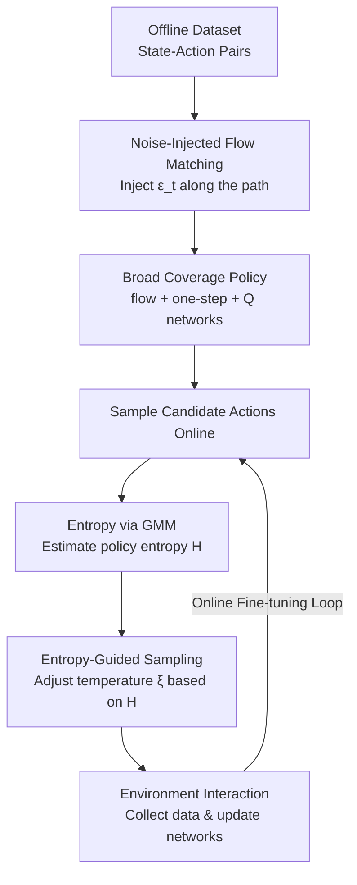

# Flow Matching with Injected Noise for Offline-to-Online Reinforcement Learning

**Conference**: ICLR 2026  
**arXiv**: [2602.18117](https://arxiv.org/abs/2602.18117)  
**Code**: [GitHub](https://github.com/CTID282/FINO)  
**Area**: Flow Matching/Reinforcement Learning  
**Keywords**: Flow Matching, Offline-to-Online RL, Noise Injection, Exploration-Exploitation Balance, Entropy-Guided Sampling

## TL;DR
The paper significantly improves the sample efficiency of offline-to-online RL under limited interaction budgets by injecting controllable noise during flow matching training to expand policy coverage and employing an entropy-guided sampling mechanism to dynamically balance exploration and exploitation during online fine-tuning.

## Background & Motivation

**Background**: Generative models (diffusion/flow matching) perform excellently as policy representations in offline RL due to their ability to model multi-modal distributions. Flow Q-Learning (FQL) has demonstrated the effectiveness of flow matching policies in offline settings.

**Limitations of Prior Work**: Offline pre-trained policies are often overly constrained to the dataset distribution, leading to insufficient exploration capabilities during the online fine-tuning stage. Existing methods (like FQL) treat online fine-tuning simply as a continuation of offline pre-training without specifically designed exploration mechanisms. In the antmaze-giant task, FQL agents almost exclusively follow the upper path existing in the dataset to reach the goal, completely ignoring other viable routes.

**Key Challenge**: Offline RL requires conservative constraints (avoiding out-of-distribution actions), while the online phase requires broad exploration (going beyond data coverage). The requirements for policy distribution in these two stages are essentially contradictory.

**Goal**: How to enable the policy to learn broader action coverage than the dataset during the offline pre-training stage without increasing the dataset size, and effectively utilize this diversity during online fine-tuning?

**Key Insight**: It is observed that the conditional probability path of flow matching collapses the distribution to a single data point when $\sigma_{\min}=0$, limiting coverage. By injecting controlled noise into flow matching, the variance of the conditional probability path can be expanded.

**Core Idea**: Injecting noise into the flow matching objective to expand the policy support set, combined with entropy-guided sampling to adaptively balance exploration and exploitation during the online phase.

## Method

### Overall Architecture
The core problem FINO (Flow matching with Injected Noise for Offline-to-online RL) aims to solve is that flow matching policies pre-trained offline have too narrow coverage, making exploration difficult during online fine-tuning. The approach intervenes at both the "training objective" and "sampling strategy" levels. It maintains the FQL skeleton of dual policies + Q-network (flow policy for multi-modal distribution, one-step policy distilled from flow policy for environment interaction) but introduces two modifications: the offline standard flow matching objective is replaced with a noise-injected version to learn a wider action support set; in the online phase, fixed greedy or fixed temperature sampling is replaced by an adaptive softmax temperature based on policy entropy to dynamically switch between exploration and exploitation. The input is a state-action pair dataset, and the output is a policy that can explore efficiently under limited online interaction budgets.

### Key Designs

**1. Noise-Injected Flow Matching: Integrating Coverage into the Training Objective**

The standard flow matching conditional probability path collapses the distribution to a single data point when $\sigma_{\min}=0$, which is the root cause of narrow FQL coverage. FINO injects time-dependent Gaussian noise $\epsilon_t \sim \mathcal{N}(0, \alpha_t^2 I)$ along the interpolation path, rewriting the training objective as:

$$\mathcal{L}_{\text{FINO}}(\theta) = \mathbb{E}\big[\|v_\theta(t, s, x_t + \epsilon_t) - (x_1 - (1-\eta)x_0)\|^2_2\big]$$

The noise magnitude is determined by $\alpha_t^2 = (\eta^2 - 2\eta)t^2 + 2\eta t$. $\eta \in [0,1]$ is the sole control knob; when $\eta=0$, the objective reverts to standard flow matching. This modification is supported by three theoretical guarantees: Theorem 1 states that the injected noise still forms a valid continuous normalizing flow; Theorem 2 proves that the marginal probability path variance induced by FINO is no less than standard FM, i.e., $\text{Var}(X_t^{\text{FINO}}) \geq \text{Var}(X_t^{\text{FM}})$, meaning the policy covers a broader action space—precisely the diversity needed for online exploration.

**2. Entropy-Guided Sampling: Self-Adaptive Temperature**

Expanding coverage offline is insufficient; one must utilize this diversity during online fine-tuning. During the online phase, FINO samples multiple candidate actions and constructs a softmax sampling distribution based on Q-values:

$$p(i) = \frac{\exp(\xi \cdot Q_\phi(s, a_i))}{\sum_j \exp(\xi \cdot Q_\phi(s, a_j))}$$

Crucially, the temperature $\xi$ is not fixed but updated via policy entropy: $\xi_{\text{new}} = \xi - \alpha_\xi[\mathcal{H} - \bar{\mathcal{H}}]$. A fixed temperature cannot adapt to learning dynamics—early in training, the policy is stochastic, while it converges later. Using entropy as a signal, when policy entropy is high (actions are divergent), the temperature increases to favor exploitation; when entropy is low (actions are concentrated), the temperature decreases to favor exploration. This automatically balances the trade-off without manual tuning.

**3. Entropy Estimation via GMM: Addressing One-step Policy Non-differentiability**

Entropy-guided sampling requires calculating policy entropy. However, FINO uses a one-step policy (obtained via distillation and Q-optimization) for online inference, which has no analytical form. FINO addresses this by sampling multiple actions from the same state, fitting these samples using a Gaussian Mixture Model (GMM), and then estimating the entropy, bypassing the non-differentiability issue. Two engineering constants are fixed here: noise magnitude $\eta=0.1$ (based on action range $[-1,1]$) and the number of candidate actions set to half the action dimension.

### Loss & Training
- **Offline Stage**: Simultaneously train the flow policy (Eq.7), one-step policy (Eq.5), and Q-network (TD loss).
- **Online Stage**: Continue optimizing the three networks, updating temperature $\xi$ every $N_\xi$ steps.
- **Inference**: Deterministically select the action with the highest Q-value.

## Key Experimental Results

### Main Results
Evaluated across 45 tasks in OGBench and D4RL, averaged over 10 random seeds:

| Task Category | Metric | Ours (FINO) | Prev. SOTA (FQL) | Cal-QL | Gain |
|---------|------|------|-----|--------|------|
| OGBench humanoidmaze-medium | Score after Online FT | **Best** | 3±3 | 0±0 | Significant |
| D4RL antmaze (Avg. 6 tasks) | Score after Online FT | **Best** | Second | - | Stable |
| D4RL adroit (Avg. 4 tasks) | Score after Online FT | **Best** | Second | - | Stable |
| OGBench (Avg. 5 tasks) | Score after Online FT | **Best** | Second | - | Significant |

### Ablation Study

| Configuration | Key Performance | Note |
|------|---------|------|
| Full FINO | **Best** | Noise Injection + Entropy-Guided Sampling |
| w/o Noise Injection (η=0) | Significant Drop | Reverts to standard FQL |
| w/o Entropy-Guided | Drop | Fixed temperature cannot adapt |
| Noise Injection Only | Moderate | Lacks exploration-exploitation balance online |

### Key Findings
- In the antmaze-giant task, FINO discovers multiple routes to the goal (including the lower path), whereas FQL only takes the upper path.
- Noise injection causes the policy to cover a visibly wider area around data points in toy experiments while remaining centered on the data.
- Advantages are more pronounced in high-dimensional action space tasks (e.g., humanoidmaze) because the exploration provided by noise injection is more critical in higher dimensions.

## Highlights & Insights
- **Theoretical Guarantees for Noise Injection**: Three theorems rigorously demonstrate the validity of noise injection—maintaining a valid flow (Theorem 1), expanding coverage (Theorem 2), and forming a legitimate distribution (Proposition 1).
- **Offline-for-Online Design Philosophy**: Rather than treating offline training independently, the method prepares for subsequent online fine-tuning from the start (retaining diversity via noise). This proactive design is noteworthy.
- **Self-Adaptive Temperature**: The scheme is simple and elegant, using policy entropy as a closed-loop signal to adjust the exploration-exploitation trade-off without manual parameter tuning.

## Limitations & Future Work
- $\eta$ is globally set to 0.1; the optimal noise magnitude for different tasks or states might vary.
- Entropy estimation depends on GMM fitting; GMM accuracy might decrease in extremely high-dimensional action spaces.
- The heuristic of setting the number of candidate actions to half the action dimension lacks theoretical basis.
- Experiments focused on locomotion and navigation; performance on fine-grained tasks like manipulation remains unverified.

## Related Work & Insights
- **vs FQL**: FQL uses standard flow matching for the policy. FINO injects noise into the training objective to expand coverage. FINO significantly outperforms FQL after online fine-tuning, especially in tasks requiring exploration.
- **vs Cal-QL/RLPD**: These methods do not use generative models as policies. FINO leverages the representational power of flow matching to be more competitive in complex tasks.
- **Transferable Idea**: The concept of noise injection to expand distribution coverage can be transferred to other generative model scenarios, such as diffusion model fine-tuning or diversity enhancement in conditional generation.

## Rating
- **Novelty**: ⭐⭐⭐⭐ The idea of noise-injected flow matching is novel with solid theoretical analysis.
- **Experimental Thoroughness**: ⭐⭐⭐⭐⭐ 45 tasks, 10 seeds, multiple baselines, and detailed ablations.
- **Writing Quality**: ⭐⭐⭐⭐ Clear motivation, complete theoretical derivation, supported by extensive appendices.
- **Value**: ⭐⭐⭐⭐ Provides a practical and theoretically grounded solution for offline-to-online RL.

<!-- RELATED:START -->

## Related Papers

- [\[ICLR 2026\] DiffusionNFT: Online Diffusion Reinforcement with Forward Process](diffusionnft_online_diffusion_reinforcement_with_forward_process.md)
- [\[ICLR 2026\] Delay Flow Matching](delay_flow_matching.md)
- [\[ICLR 2026\] Flow Matching with Semidiscrete Couplings](flow_matching_with_semidiscrete_couplings.md)
- [\[ICML 2026\] Offline Preference Optimization for Rectified Flow with Noise-Tracked Pairs](../../ICML2026/image_generation/offline_preference_optimization_for_rectified_flow_with_noise-tracked_pairs.md)
- [\[ICML 2026\] Offline Multi-agent Reinforcement Learning via Sequential Score Decomposition](../../ICML2026/image_generation/offline_multi-agent_reinforcement_learning_via_sequential_score_decomposition.md)

<!-- RELATED:END -->
