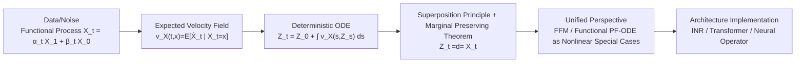

# Flow Straight and Fast in Hilbert Space: Functional Rectified Flow

**Conference**: ICLR 2026  
**OpenReview**: [https://openreview.net/forum?id=GWK8fm1r9y](https://openreview.net/forum?id=GWK8fm1r9y)  
**Code**: Rewritten based on open-source repositories from Franzese et al. (2023) and Kerrigan et al. (2024) (JAX)  
**Area**: Generative Models / Functional Generative Models / Rectified Flow  
**Keywords**: Rectified Flow, Hilbert Space, Functional Generative Models, Flow Matching, Superposition Principle, Neural Operators  

## TL;DR
This paper rigorously extends rectified flow to infinite-dimensional separable Hilbert spaces, proving that its "marginal-preserving" property remains valid in functional spaces. It unifies functional flow matching and functional probability flow ODEs as nonlinear special cases within this framework while removing unverifiable measure-theoretic assumptions present in existing theories.

## Background & Motivation
- **Background**: Generative methods such as diffusion models, flow matching, and rectified flow have achieved SOTA in Euclidean spaces and are being extended to infinite-dimensional functional spaces (functional diffusion, functional GAN, functional flow matching) to support variable-resolution generation, modality-agnostic architectures, and higher memory efficiency.
- **Limitations of Prior Work**: Rectified flow is highly attractive due to its deterministic straight transmission paths, few-step sampling, and connections to optimal transport. However, its functional (infinite-dimensional) extension has remained a gap. The closest work, functional flow matching (Kerrigan et al., 2024), relies on a strong measure-theoretic assumption: the conditional measure $\mu_t^x$ must be absolutely continuous with respect to the marginal $\mu_t$. This assumption often fails even in finite-dimensional Euclidean spaces and is difficult to verify.
- **Key Challenge**: To transplant rectified flow based on "expected velocity / continuity equations" to infinite dimensions, the primary obstacle is that the **superposition principle**, which finite-dimensional proofs rely on, does not automatically hold in general separable Hilbert spaces and must be established from scratch.
- **Goal**: Provide a rigorous mathematical construction of rectified flow in general separable Hilbert spaces, prove the marginal-preserving theorem, and use it as a unified perspective to explain existing functional ODE generative models.
- **Core Idea**: **Replace the absolute continuity assumption with the Hilbert space superposition principle**—rigorously establishing that any distribution solving the continuity equation can be decomposed into path distributions solving the ODE in infinite dimensions. This bypasses the restrictive conditions of Kerrigan et al. and provides a more verifiable and general foundation for functional generation.

## Method

### Overall Architecture
The paper reconstructs rectified flow on a separable Hilbert space $H$ through a "Definition-Assumption-Theorem" approach: first, data/noise is viewed as a functional-valued stochastic process $X:[0,1]\times\Omega\to H$, defining its expected velocity field $v_X$; second, two mild assumptions (IVP well-posedness + finite drift) are used to ensure the flow is well-behaved; the core is proving that the rectified flow $\{Z_t\}$ induced by the deterministic ODE driven by $v_X$ shares the same marginal distributions as the original process $\{X_t\}$ at each time step; finally, this framework is extended to nonlinear interpolation paths, unifying FFM and functional PF-ODEs as special cases while discussing three applicable network implementations.

### Key Designs

**1. Expected Velocity and Rectifiable Processes in Hilbert Space: Implementing "Linear Interpolation" in Infinite Dimensions**  
Given a pathwise continuously differentiable stochastic process $X=\{X_t\}$ on a separable Hilbert space $H$, the expected velocity field is defined as the conditional expectation $v_X(t,x)=\mathbb{E}[\dot X_t\mid X_t=x]$ (taking zero outside the support of $X_t$). When using linear interpolation $X_t=tX_1+(1-t)X_0$ (where $X_0$ is noise and $X_1$ is data, sampled independently), it follows that $\dot X_t=X_1-X_0$. Thus, the training objective for a neural network $v_\theta$ to fit the velocity field is:
$$\min_\theta \int_0^1 \mathbb{E}_{x\sim X}\,\lVert (x_1-x_0)-v_\theta(x_t,t)\rVert^2\,dt,$$
which is formally identical to finite-dimensional rectified flow. The paper introduces two assumptions for well-behavedness: first, the existence and uniqueness of a $C^1$ solution to the initial value problem $z(t)=u+\int_0^t v(s,z(s))ds$ with a continuous solution map (which holds under standard Lipschitz conditions, used here as a sufficient condition rather than a core assumption); second, finite time integration of expected velocity, $\mathbb{E}[\sup_t\lVert\dot X_t\rVert]<\infty$, to exclude pathological behaviors like "infinite total drift." Processes satisfying these are termed **rectifiable**, and their induced deterministic flow $Z_t=Z_0+\int_0^t v_X(s,Z_s)ds,\ Z_0\sim X_0$ constitutes the infinite-dimensional rectified flow, where all randomness originates solely from the initial value $Z_0$.

**2. Marginal-Preserving Theorem Based on Superposition Principle: The Real Difficulty in Infinite-Dimensional Proofs**  
The core conclusion is Theorem 5: if the $H$-valued process $\{X_t\}$ is rectifiable and $\{Z_t\}$ is its induced rectified flow, then $Z_t\overset{d}{=}X_t$ for all $t$. This means that although $Z_t$ evolves deterministically via the ODE given $Z_0$, it maintains the same marginal distribution as $X_t$ at every moment. Therefore, after learning the velocity field $v_\theta$, the data distribution can be sampled by numerically integrating the ODE from a noise initial value. The real difficulty lies in rigorously establishing the **superposition principle** (that any distribution solving the continuity equation driven by $v_X$ can be "decomposed" into a family of path distributions solving the ODE) in a general separable Hilbert space, and then strictly aligning the resulting measure-theoretic decomposition with the solutions of the IVP, requiring several non-trivial technical lemmas. Based on this theorem, the transmission cost reduction and "straightening" effects of finite-dimensional rectified flow are also extended to infinite dimensions.

**3. Nonlinear Generalized Paths: Subsuming FFM and Functional PF-ODE**  
The paper extends interpolation paths to $X_t=\alpha_t X_1+\beta_t X_0$, where $\alpha_t, \beta_t$ are arbitrary $C^1$ functions of time. Setting $\alpha_t=t, \beta_t=1-t$ reverts to linear rectified flow. Under this parameterization, the "OT path" $(\alpha_t=t, \beta_t=1-(1-\sigma_{\min})t)$ and "VP path" $(\beta_t=\sqrt{1-\alpha_t^2})$ from functional flow matching (Kerrigan et al., 2024) become specific instances of $(\alpha_t, \beta_t)$. Furthermore, Proposition 7 proves that the functional probability flow ODE (the reverse PF-ODE of a variance-preserving SDE) from Na et al. (2025) is the time-reversal of a nonlinear rectified flow $Y'_t=\eta(t)Y'_0+\sqrt{\kappa(t)}\,U$. This provides the insight that a single unified formula can generate multiple existing functional models. **Key Advantage**: This framework only requires pathwise continuous differentiability (a design choice rather than a data assumption), completely removing restrictive assumptions required by FFM such as $\mu_t^x\ll\mu_t$ absolute continuity or $X_1$ residing in the Cameron–Martin space of the initial Gaussian measure.

**4. Three Implementable Architectures: Reducing Infinite-Dimensional Velocity Fields to Pointwise Discrete Representations**  
The expected velocity field $v_X(x_t,t):H\times[0,T]\to H$ is defined on an infinite-dimensional domain and cannot be learned directly. Leveraging the fact that when $H=L^2(M)$, a function can be characterized by its pointwise values $\{(x[p_i],p_i)\}$, the paper provides three implementations: (a) **Implicit Neural Representation (INR)**, using a network $n(\psi,t,\theta)$ with shared parameters $\theta$ and per-sample modulation vectors $\psi$. For each $x_t$, $\psi^*=\arg\min_\psi\sum_{p_i}(n(\psi,t,\theta)[p_i]-x_t[p_i])^2$ is solved online via gradient descent. (b) **Transformer**, treating discrete values $\{x_t[p_i]\}$ as a sequence and coordinates $\{p_i\}$ as positional encodings to output $\{v_\theta(x_t,t)[p_i]\}$. (c) **Neural Operator**, parameterizing the velocity field directly, which is particularly suitable for PDE data on regular grids. These correspond to lightweight, high-fidelity image, and PDE scenarios in the experiments, respectively.

## Key Experimental Results
> Key Setting: INR for MNIST, Transformer for CelebA, and Neural Operator for Navier–Stokes. **Ours uses the exact same network architectures as competitors like FDP/FFM** to ensure gains result from the proposed objective rather than model capacity.

### Main Results

MNIST (32×32, INR):

| Method | FID (↓) | Parameters |
|---|---|---|
| **FRF (INR, ours)** | **0.41** | ≈0.1M |
| FDP (INR) | 0.43 | ≈0.1M |

CelebA (64×64, Transformer):

| Method | FID (↓) | FID-CLIP (↓) | Parameters |
|---|---|---|---|
| **FRF (ViT, ours)** | **6.63** | **3.70** | ≈20M |
| FDP (INR) | 35.00 | 12.44 | ≈1M |
| FDP (ViT) | 11.00 | 6.55 | ≈20M |
| FD2F | 40.40 | – | ≈10M |
| ∞-DIFF | – | 4.57 | ≈100M |

Navier–Stokes (Neural Operator, Density MSE):

| Method | Density MSE (Mean ± Std) |
|---|---|
| **FRF** | **2.39×10⁻⁵ ± 4.45×10⁻⁶** |
| FFM | 4.50×10⁻⁵ ± 1.52×10⁻⁵ |
| DDPM | 1.02×10⁻⁴ ± 8.20×10⁻⁶ |
| GANO | 4.16×10⁻³ ± 1.82×10⁻³ |
| DDO | 9.61×10⁻³ ± 1.26×10⁻² |

### Ablation Study
Rather than traditional component-wise ablation, the paper uses "same-architecture comparison" as a fairness control. By sharing networks across three backbone types (INR/ViT/Neural Operator) with SOTA methods, performance differences are attributed to the rectified flow objective itself:

| Control Dimension | Setup | Conclusion |
|---|---|---|
| INR Capacity | FRF vs FDP, both ≈0.1M | FRF achieves lower FID (0.41 vs 0.43) |
| ViT Capacity | FRF vs FDP-ViT, both ≈20M | FRF FID (6.63) significantly outperforms 11.00 |
| Parameter Efficiency | FRF vs ∞-DIFF | FRF surpasses a ≈100M parameter competitor with only ≈20M |

### Key Findings
- **Superiority Under Same Architecture**: FRF outperforms or matches corresponding SOTA methods across all three backbones, proving gains stem from the functional rectified flow objective.
- **Architectural Flexibility**: The framework can directly utilize different architectures designed for competitors without specialized customization.
- **Super-resolution from Continuous Representation**: Models trained on low-res MNIST can generate smooth samples at 64×64 or 128×128 resolutions, with contours more coherent than naive upsampling.
- **Significant Parameter Efficiency**: On CelebA, FRF outperforms ∞-DIFF using roughly $1/5$ of the parameters.

## Highlights & Insights
- **Dual Contribution**: Rigorously establishes rectified flow in infinite-dimensional Hilbert spaces while loosening constraints by replacing FFM's unverifiable absolute continuity assumption with the design choice of "pathwise differentiability."
- **Unified Perspective**: A single nonlinear interpolation formula $X_t=\alpha_t X_1+\beta_t X_0$ provides a unified lens for FFM, functional PF-ODEs, and functional rectified flow.
- **Superposition Principle in Infinite Dimensions** is the core technical contribution, bridging measure decomposition of the continuity equation with the existence and uniqueness of ODE solutions.
- **Architecture Agnostic**: Successfully outperforms competitors using their own network architectures, demonstrating strong robustness.

## Limitations & Future Work
- **Inductive Bias in Complex Tasks**: The authors acknowledge that domain-specific architectures and inductive biases may still be indispensable for highly complex tasks.
- **Experimental Scale**: Validated only on MNIST, CelebA 64×64, and Navier–Stokes; lacks testing on large-scale/high-res natural images or more complex modalities like text-to-speech.
- **INR Online Optimization Cost**: Each sample requires several gradient descent steps to find the modulation vector $\psi$, adding overhead to training and inference.
- **Sampling Step Advantages**: While rectified flow is known for few-step sampling in finite dimensions, the paper does not systematically report the quality of few-step sampling or the effects of "reflow" in infinite dimensions.

## Related Work & Insights
- **Rectified Flow (Liu et al., 2022)** serves as the finite-dimensional starting point; its marginal-preserving, cost-reducing, and straightening effects are generalized here.
- **Functional Flow Matching (Kerrigan et al., 2024)** is the direct competitor; this work proves it is a special case and removes its measure-theoretic assumptions.
- **Functional PF-ODE (Na et al., 2025)** is subsumed by Proposition 7 as a time-reversal of nonlinear rectified flow.
- **Functional Diffusion (Franzese et al., 2023), ∞-DIFF** provide the INR/Operator architectures and image baselines.
- **Insight**: Utilizing the superposition principle as a unified tool may further enable research in functional SDEs, optimal transport, and variable-resolution generation.

## Rating
- Novelty: ⭐⭐⭐⭐⭐ First rigorous establishment of rectified flow in infinite-dimensional Hilbert spaces with loosened theoretical assumptions.
- Experimental Thoroughness: ⭐⭐⭐ Convincing same-architecture comparisons, but dataset scale is small and lacks large-scale high-res validation.
- Writing Quality: ⭐⭐⭐⭐ Clear structure with a distinct Definition-Assumption-Theorem hierarchy; however, measure-theoretic details are heavy for non-theoretical readers.
- Value: ⭐⭐⭐⭐ Provides a unified and verifiable theoretical foundation for functional generative models, essential for future infinite-dimensional research.

<!-- RELATED:START -->

## Related Papers

- [\[CVPR 2026\] Functional Mean Flow in Hilbert Space](../../CVPR2026/image_generation/functional_mean_flow_in_hilbert_space.md)
- [\[ICLR 2026\] Free Lunch for Stabilizing Rectified Flow Inversion](free_lunch_for_stabilizing_rectified_flow_inversion.md)
- [\[ICLR 2026\] SafeFlowMatcher: Safe and Fast Planning using Flow Matching with Control Barrier Functions](safeflowmatcher_safe_and_fast_planning_using_flow_matching_with_control_barrier_.md)
- [\[ICLR 2026\] Joint Distillation for Fast Likelihood Evaluation and Sampling in Flow-based Models](joint_distillation_for_fast_likelihood_evaluation_and_sampling_in_flow-based_mod.md)
- [\[ICLR 2026\] FlowAlign: Trajectory-Regularized, Inversion-Free Flow-based Image Editing](flowalign_trajectory-regularized_inversion-free_flow-based_image_editing.md)

<!-- RELATED:END -->
