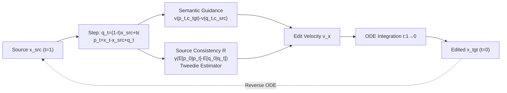

# FlowAlign: Trajectory-Regularized, Inversion-Free Flow-based Image Editing

**Conference**: ICLR 2026  
**OpenReview**: [https://openreview.net/forum?id=nyttIJfwW7](https://openreview.net/forum?id=nyttIJfwW7)  
**Code**: TBD  
**Area**: Image Generation / Image Editing  
**Keywords**: Image Editing, Flow Matching, Rectified Flow, Inversion-free, Optimal Control, Trajectory Regularization, Stable Diffusion 3  

## TL;DR
To address the issues of unsmooth trajectories and poor source consistency in inversion-free flow editing (FlowEdit), FlowAlign employs an optimal control framework with a source similarity regularization at the terminal point. This decouples the editing velocity field into "semantic guidance" and "source consistency" terms, significantly improving source structure preservation with only 1 additional NFE and naturally supporting reverse ODE reconstruction.

## Background & Motivation
- **Background**: Text-driven image editing can be viewed as a Continuous Normalization Flow (CNF) pushing a source distribution to a target distribution. Using pre-trained "noise-to-image" flow models (e.g., Stable Diffusion 3), editing can be performed without retraining. Early SDEdit required careful selection of initial noise levels, while DDIB relied on ODE inversion which is susceptible to discretization errors; RF-Inversion used optimal control for inversion but incurred high ODE inversion costs.
- **Limitations of Prior Work**: FlowEdit achieved direct ODE simulation between two images without inversion for the first time. However, it was empirically found to be **extremely sensitive to hyperparameters and frequently loses source consistency**. It constructs $q_t$ with a randomly sampled noise $\epsilon$ at each timestep, leading to an unsmooth $q_t$ trajectory (see Fig.2b of the paper). It also heuristically applies different CFG scales to source/target velocity fields and skips early timesteps, introducing numerous hyperparameters and breaking ODE determinism. Furthermore, FlowEdit requires 4x NFE due to dual CFG.
- **Key Challenge**: Being inversion-free (no explicit inversion latent) is the core advantage of such methods, yet it is also the root of trajectory instability—the lack of an inversion anchor causes the trajectory to deviate from the source image. How to ensure the editing trajectory follows editing prompts (semantic alignment) while remaining close to the source image (structural consistency) **without performing inversion**?
- **Goal**: Apply an explicit trajectory regularization to inversion-free editing from an optimal control perspective, transforming the balance between semantic alignment and structural consistency into two interpretable and adjustable terms in the velocity field, while ensuring the transformation is reversible.
- **Core Idea**: **Terminal point similarity regularization**. In the optimal control problem, the requirement that "the terminal solution $x_0$ should be close to the source image $x_{src}$" is treated as a terminal loss $m(x_0)=\frac{\eta}{2}\|x_0-x_{src}\|^2$ (using a finite $\eta$ rather than $\eta\to\infty$ as in RF-Inversion). The resulting optimal velocity field naturally decomposes into "semantic guidance" and "source consistency" terms.

## Method

### Overall Architecture
FlowAlign reuses the pre-trained "noise-to-image" flow model $v_\theta$ without any additional training or ODE inversion. It models the evolution from the source image $x_{src}$ ($t=1$) to the target image $x_{tgt}$ ($t=0$) as a **time-reversed optimal control problem**: in addition to the source-to-target velocity field, it explicitly constrains the terminal point to resemble the source image. Solving this problem yields a new editing velocity field, which is integrated along the ODE. Each step only requires one more denoising estimation (+1 NFE) compared to FlowEdit.

### Key Designs

**1. Inversion-free ODE Simulation: Constructing the edit flow using two flows sharing noise.** Editing is formulated as a linear conditional flow $\psi_t(x_{src}|x_{tgt})=x_t=(1-t)x_{tgt}+tx_{src}$ between two image distributions. Training this directly is costly. FlowAlign leverages pre-trained models to construct two flows mapping the same noise $\epsilon$ to the source/target images respectively: $q_t=(1-t)x_{src}+t\epsilon$ and $p_t=(1-t)x_{tgt}+t\epsilon$. Combining these yields the key equation $x_t=p_t-q_t+x_{src}$, thus the editing ODE becomes $dx_t=[v_\theta(p_t,c_{tgt})-v_\theta(q_t,c_{src})]dt$, where $p_t:=q_t+x_t-x_{src}$. This simulates the flow between two images **without training or inversion**. While this step is shared with FlowEdit, FlowEdit's random sampling of $\epsilon$ at each step causes $q_t$ trajectory jitter, which is the root of instability.

**2. Terminal Point Regularization: Using "resemblance to source" as terminal loss.** This is the core contribution. The authors formulate editing as time-reversed optimal control $\dot x_t=u(x_t),\,x_1=x_{src}$ with a cost functional $V(u_t)=\int_0^1 \ell(x_t,u_t,t)dt+m(x_0)$. The running loss $\ell=\frac12\|u_t-(v_\theta(p_t,c_{tgt})-v_\theta(q_t,c_{src}))\|^2$ keeps the control close to the original editing velocity field. Since this alone is insufficient to prevent trajectory drift, a terminal loss $m(x_0)=\frac{\eta}{2}\|x_0-x_{src}\|^2$ is introduced, requiring the ODE endpoint to be close to the source image. Using a **finite $\eta$** (unlike $\eta\to\infty$ in RF-Inversion) avoids collapsing to the trivial solution $x_t\equiv x_{src}$ and instead achieves a balance between terminal constraints and editing signals.

**3. Decoupled Editing Velocity Field: Semantic guidance + Source consistency gradient.** Solving the optimal control problem (Proposition 1) yields $v_t^x \simeq \underbrace{v_t(p_t,c_{tgt})-v_t(q_t,c_{src})}_{\text{Semantic Guidance}}+\gamma\underbrace{(\mathbb{E}[p_0|p_t]-\mathbb{E}[q_0|q_t])}_{\text{Source Consistency }R}$, where $\gamma=\frac{\eta}{\eta t-1}$, and $\mathbb{E}[q_0|q_t]=q_t-tv_t(q_t,c_{src})$, $\mathbb{E}[p_0|p_t]=p_t-tv_t(p_t,c_{tgt})$ are clean estimates provided by the Tweedie formula. The first term provides the semantic direction from source to target. The second term, based on the difference between clean estimates of $p_t$ and $q_t$, acts as a gradient pulling the trajectory back toward source consistency. Though explicitly constrained only at the terminal point, it implicitly suppresses unnecessary deviations from the source image along the entire trajectory—this is the source of trajectory smoothing and reversible reconstruction.

**4. Single-sided CFG and Minimal Hyperparameters.** Unlike FlowEdit, which uses different CFG scales for both source/target velocities (resulting in 4x NFE and broken determinism), FlowAlign only applies CFG to the target trajectory $p_t$: $v_\theta(p_t,c_{src},c_{tgt})=v_\theta(p_t,c_{src})+\omega(v_\theta(p_t,c_{tgt})-v_\theta(p_t,c_{src}))$. A value of $\omega=7.5$ is typically effective. The final update equation $dx_t=[v_t(p_t,c_{tgt},c_{src})-v_t(q_t,c_{src})]dt-\gamma dt(\mathbb{E}[q_0|q_t]-\mathbb{E}[p_0|p_t])$ retains only two hyperparameters: the CFG scale $\omega$ and the source consistency scale $\zeta=-\gamma dt>0$. Setting these to constants ensures stability. Each step adds only one function evaluation relative to FlowEdit.

## Key Experimental Results

**Setup**: Baseline is Stable Diffusion 3.0 (medium); Dataset is PIE-Bench (700 synthetic + natural images with paired source/edit prompts); unified 33 NFE (inversion-based methods use 17+17); Hardware is RTX 4090 (24GB). Metrics include CLIP similarity (semantic alignment) + Background PSNR (structural consistency), scanned over CFG ∈ {5.0, 7.5, 10.0, 13.5}.

### Main Results (Semantic Alignment vs. Structural Consistency Trade-off)
- On the CLIP-vs-Background PSNR trade-off curve, FlowAlign achieves the **highest structural preservation among all methods**. Semantic alignment is superior to SDEdit/DDIB and comparable to or slightly lower than FlowEdit/RF-Inversion.
- However, the high CLIP scores of FlowEdit/RF-Inversion often come at the **expense of source structure** (over-expressing target objects or warping the original image).
- **Human Preference Study** (100 random samples, pairwise comparison): Users preferred FlowAlign in all comparisons, citing its balance of editing accuracy and source structure preservation.

### Reverse Editing (Source Reconstruction, higher accuracy indicates a deterministic ODE trajectory)

| Metric | PSNR ↑ | DINO Dist ↓ | LPIPS ↓ | MSE ↓ |
|---|---|---|---|---|
| SDEdit | 13.83 | 0.078 | 0.419 | 0.043 |
| DDIB | 18.18 | 0.041 | 0.190 | 0.019 |
| RF-Inv | 12.14 | 0.113 | 0.502 | 0.065 |
| FlowEdit | 19.88 | 0.037 | 0.147 | 0.012 |
| **Ours** | **27.42** | **0.025** | **0.085** | **0.006** |

Reconstructing the source image by solving the ODE backward from the edited image, FlowAlign leads across all four metrics (PSNR 27.42 vs. FlowEdit 19.88), achieving near-perfect reconstruction and verifying trajectory smoothness and determinism.

### Ablation Study ($\omega$ and $\zeta$)

| Setting | Phenomenon |
|---|---|
| $\zeta=0.01$ | Achieves the best balance between semantic alignment and structural preservation |
| $\omega=\zeta=0$ | Under-editing (bottom-left corner, minimal changes to the image) → confirms the necessity of CFG |
| Increasing $\omega$ | Stronger semantics but reduced structural preservation (controllable trade-off) |

### Key Findings
- Terminal point regularization not only constrains the endpoint but also implicitly maintains source consistency along the entire trajectory. Reconstruction capability stems from trajectory smoothness rather than "minimal editing."
- The framework extends at zero cost to **3D editing** (replacing SDS to edit Gaussian Splatting parameters) and **video editing** (frame-by-frame processing yields visually coherent backgrounds due to strong source consistency, despite lacking explicit temporal constraints).

## Highlights & Insights
- **Theoretical Elegance**: Formulates the instability of inversion-free editing as "trajectory drift due to missing inversion anchors" and uses terminal loss + optimal control to cleanly decompose the editing velocity into "semantic guidance" and "source consistency" with clear physical meaning.
- **Insight on Finite $\eta$**: Contrast with RF-Inversion's $\eta\to\infty$ highlights that "finite regularization strength" avoids collapsing to a trivial solution and is key to the balance.
- **Minimalist and Efficient**: Compared to FlowEdit's 4× NFE and numerous heuristic hyperparameters, FlowAlign adds only 1 NFE and has only two constant hyperparameters $\omega,\zeta$, while maintaining ODE determinism (supporting reverse reconstruction).

## Limitations & Future Work
- The fundamental trade-off between semantic alignment and structural consistency remains; it does not universally outperform FlowEdit/RF-Inversion on CLIP scores alone (though authors argue high CLIP in those methods stems from source destruction).
- Video editing is handled frame-by-frame **without explicit temporal consistency modeling**. Strong source consistency provides coherent backgrounds as a "by-product," but complex motion scenes may still exhibit flickering.
- Main experiments were primarily validated on SD3-medium; the universality of hyperparameters $\zeta=0.01$ and $\omega=7.5$ across other flow models or resolutions requires broader validation.
- Terminal regularization based on $\ell_2$ pixel/latent distance may over-constrain edits requiring significant geometric or layout changes.

## Related Work & Insights
- **Inversion-free Flow Editing**: FlowEdit (the direct precursor; this work serves as its stabilization upgrade).
- **Inversion/Optimal Control-based**: RF-Inversion (optimal control for inversion, $\eta\to\infty$), DDIB (depends on inversion), SDEdit (denoising after adding noise).
- **Flow Matching Foundation**: Flow Matching / Conditional Flow Matching (Lipman et al.), Rectified Flow (Liu et al.), Stable Diffusion 3 / DiT.
- **Insight**: Reformulating training-free editing as optimal control + terminal regularization is a general strategy for adding "anchors" to inversion-free methods. Using the difference of Tweedie clean estimates as a source consistency gradient is transferable to other tasks requiring reference adherence (e.g., controllable generation, style preservation, 3D/video editing).

## Rating
- **Novelty**: ⭐⭐⭐⭐ Uses optimal control terminal regularization to unifiedly explain and solve trajectory instability in inversion-free editing; the "semantic + source consistency" decoupling is clean; the finite $\eta$ insight is valuable.
- **Experimental Thoroughness**: ⭐⭐⭐⭐ Comprehensive comparison on PIE-Bench + human preference + reverse reconstruction (winner across 4 metrics) + ablation + 3D/video extensions; however, main experiments focus on the SD3 base.
- **Writing Quality**: ⭐⭐⭐⭐ Clear derivations, good connection between motivation and formulas, complete Proposition + Algorithm pseudocode, intuitive diagrams.
- **Value**: ⭐⭐⭐⭐ Training-free, low cost, reversible, and directly extendable to 3D/video. It is a robust improvement over the FlowEdit approach with high practical utility.

<!-- RELATED:START -->

## Related Papers

- [\[ICLR 2026\] Free Lunch for Stabilizing Rectified Flow Inversion](free_lunch_for_stabilizing_rectified_flow_inversion.md)
- [\[ICLR 2026\] UniEdit-Flow: Unleashing Inversion and Editing in the Era of Flow Models](uniedit-flow_unleashing_inversion_and_editing_in_the_era_of_flow_models.md)
- [\[ICLR 2026\] Training-Free Reward-Guided Image Editing via Trajectory Optimal Control](training-free_reward-guided_image_editing_via_trajectory_optimal_control.md)
- [\[ICCV 2025\] FlowEdit: Inversion-Free Text-Based Editing Using Pre-Trained Flow Models](../../ICCV2025/image_generation/flowedit_inversion-free_text-based_editing_using_pre-trained_flow_models.md)
- [\[NeurIPS 2025\] SplitFlow: Flow Decomposition for Inversion-Free Text-to-Image Editing](../../NeurIPS2025/image_generation/splitflow_flow_decomposition_for_inversion-free_text-to-image_editing.md)

<!-- RELATED:END -->
