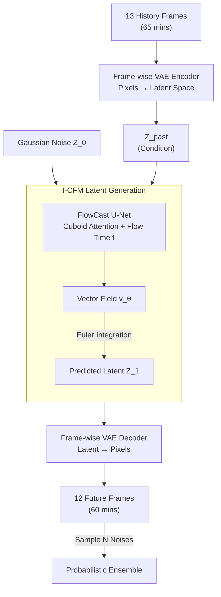

# FlowCast: Advancing Precipitation Nowcasting with Conditional Flow Matching

**Conference**: ICLR 2026  
**arXiv**: [2511.09731](https://arxiv.org/abs/2511.09731)  
**Code**: [GitHub](https://github.com/b-rbmp/FlowCast)  
**Area**: Diffusion Models / Weather Forecasting  
**Keywords**: Conditional Flow Matching, Precipitation Nowcasting, Probabilistic Forecasting, Latent Space Generation, Spatio-temporal Prediction

## TL;DR
Ours is the first to apply Conditional Flow Matching (CFM) as an end-to-end probabilistic generative model for precipitation nowcasting. It learns a direct mapping from noise to data in a compressed latent space, surpassing diffusion models in predictive accuracy and probabilistic performance with significantly fewer sampling steps.

## Background & Motivation

**Background**: Precipitation nowcasting is critical for flood control and decision-making. Deep learning methods have evolved from deterministic predictions using RNN/Transformers to probabilistic forecasting using diffusion models. Latent space diffusion models like PreDiff and LDCast are current SOTA, while CasCast performs best using a hybrid deterministic-diffusion approach.

**Limitations of Prior Work**: Deterministic models optimized with MSE result in blurry forecasts and fail to express uncertainty. Diffusion models require hundreds of iterative denoising steps, incurring high computational costs that do not meet the rapid ensemble prediction needs of time-sensitive scenarios like flood warnings.

**Key Challenge**: The contradiction between predictive accuracy and computational efficiency—diffusion models are accurate but slow, while deterministic models are fast but blurry. A probabilistic forecasting method that is both fast and accurate is needed.

**Goal**: Can CFM replace diffusion models to maintain or even exceed predictive accuracy while drastically reducing the number of sampling steps?

**Key Insight**: The straight ODE prior of CFM is better suited for spatio-temporal prediction than the curved probability flow paths of diffusion models. Although radar reflectivity distributions are multimodal, they exhibit strong temporal consistency, and linear interpolation provides a more stable prior.

**Core Idea**: The straight-line transport paths learned by CFM in latent space naturally fit the continuity of spatio-temporal data, achieving high-quality probabilistic forecasts in few steps.

## Method

### Overall Architecture
FlowCast solves the problem of "fast and accurate probabilistic precipitation nowcasting": given a sequence of historical radar observations, it predicts several future frames and samples multiple members to express uncertainty, while reducing inference steps to a fraction of diffusion models. The pipeline consists of two stages. **An offline-pretrained frame-wise VAE** compresses high-dimensional radar pixels into a low-dimensional latent space to make expensive generative modeling affordable. **A Conditional Flow Matching (CFM) model is trained in the latent space** to learn a vector field parameterized by a Cuboid Attention U-Net, directly "transporting" Gaussian noise to radar latent representations along nearly straight trajectories. During inference, 13 historical observations (65 minutes) are encoded as conditions. Starting from random noise, future latent representations are obtained via integration using a few Euler steps, which are then decoded back to 12-frame pixel forecasts (60 minutes) by the VAE. Sampling different noises multiple times yields a probabilistic ensemble of $N$ members.

### Key Designs

**1. Frame-wise VAE: Compressing radar frames into low-dimensional latent space for affordable generation**

Training probabilistic generative models directly on raw pixel space is prohibitively expensive. FlowCast follows the approach of latent diffusion models by using a frame-wise VAE to compress each radar image from high-dimensional pixels to low-dimensional latent representations. The encoder-decoder uses a hierarchical structure with residual blocks and self-attention, trained with three loss terms: L1 reconstruction for pixel fidelity, KL divergence (weight 1e-4) to constrain latent distribution, and PatchGAN adversarial loss for sharp high-frequency details. Post-compression, CFM only needs to learn dynamics in a much smaller latent space, significantly reducing training and sampling costs.

**2. Independent CFM (I-CFM) Training: Replacing curved diffusion paths with straight transport for high-quality few-step sampling**

The slow inference of diffusion models stems from their curved probability flow paths, necessitating many small steps for approximation. FlowCast adopts Conditional Flow Matching to train a vector field $v_\theta$ in latent space, directly learning the transport from Gaussian noise to radar latent representations. It employs independent couplings for the probability path:

$$p_t(x_t \mid x_0, x_1) = \mathcal{N}\big((1-t)x_0 + t x_1,\ \sigma^2 I\big),$$

The corresponding target vector field is the difference between endpoints $u_t = x_1 - x_0$. The training objective is to regress this vector field:

$$\mathcal{L} = \big\| v_\theta(Z_t, t, Z_{\text{past}}) - u_t \big\|^2.$$

Here, $Z_{\text{past}}$ represents latent representations of historical observations injected as conditions. Critically, $\sigma > 0$: compared to rectified flows where $\sigma \to 0$, a non-zero $\sigma$ "thickens" the training trajectory into a pipe with width, improving stability for high-dimensional latent data. Because it learns nearly straight ODE trajectories, high-quality data can be integrated from noise in very few Euler steps, which is why it maintains accuracy at 20 steps comparable to 50 steps.

**3. FlowCast U-Net: Efficient spatio-temporal modeling via Cuboid Attention with flow-time conditioning**

The backbone of the vector field $v_\theta$ is a spatio-temporal U-Net, with core building blocks adapted from Earthformer’s Cuboid Attention. It partitions features into 3D cuboids and performs local self-attention within them to efficiently capture local spatio-temporal evolution of radar echoes. The hierarchical encoder-decoder structure of the U-Net shares global information across scales. Flow-time $t$ embeddings are injected into every layer, allowing the same network to provide correct velocity directions at different positions along the integration trajectory.

### Loss & Training
- VAE: L1 Reconstruction + KL Divergence (weight 1e-4) + PatchGAN Adversarial Loss.
- CFM: Mean Squared Error regression of the vector field, AdamW lr=1e-4.
- Sampling: Euler solver with variable steps (5/10/20/50/100).

## Key Experimental Results

### Main Results
SEVIR dataset (US Radar), 8-member ensemble prediction:

| Model | Type | CSI-M↑ | FSS-M↑ | CRPS↓ | NFE |
|------|------|--------|--------|-------|-----|
| Earthformer | Deterministic | Baseline | Baseline | Higher | 1 |
| PreDiff | Diffusion | Suboptimal | Suboptimal | Suboptimal | 250 |
| CasCast | Hybrid | High | High | High | 250 |
| FlowCast (50 steps) | CFM | **SOTA** | **SOTA** | **SOTA** | 50 |
| FlowCast (20 steps) | CFM | Near SOTA | Near SOTA | Near SOTA | 20 |

### Ablation Study: CFM vs. Diffusion Objective (Same Architecture)

| Configuration | CSI-M↑ | CRPS↓ | Description |
|------|--------|-------|------|
| CFM 50 steps | Best | Best | Full Method |
| Diffusion 50 steps | Lower | Lower | Same arch with diffusion objective |
| CFM 20 steps | High | High | High performance maintained with fewer steps |
| Diffusion 20 steps | Significant Drop | Significant Drop | Sharp performance decline as steps decrease |

### Key Findings
- FlowCast outperforms PreDiff and CasCast (which require 250 steps) using only 50 steps, a 5x improvement in computational efficiency.
- Key ablation proves: Under identical architectures, the CFM objective is more accurate and robust to step count than the diffusion objective.
- Findings were validated on the ARSO local dataset, showing the method is not dataset-dependent.
- CFM maintains high performance even at low step counts (20 steps), whereas diffusion models degrade rapidly.

## Highlights & Insights
- **Direct Comparison of CFM vs. Diffusion**: Ours is the first in this field to conduct a strictly fair comparison by ablating CFM and diffusion objectives under the same architecture, proving that CFM's advantage in spatio-temporal prediction stems from the objective itself, not just the architecture.
- **Inductive Bias of Straight Trajectories**: A unique insight into meteorological spatio-temporal data—radar reflectivity, while multimodal, is temporally continuous. CFM’s linear interpolation paths match this characteristic better than diffusion’s curved paths.
- **End-to-End Probabilistic Model**: Unlike CasCast, which requires a deterministic base + diffusion refinement, FlowCast performs complete probabilistic modeling from noise to data directly, making it more elegant.

## Limitations & Future Work
- Only validated at 5-min/1-km resolution; higher resolutions or longer lead times were not explored.
- The VAE is trained separately and then frozen; joint training might raise the performance ceiling.
- The ensemble size is fixed at 8; optimal ensemble size was not analyzed.
- Only Euler solvers were compared; higher-order solvers (e.g., RK45) might further reduce step counts.

## Related Work & Insights
- **vs. PreDiff/LDCast**: All are latent generative models, but FlowCast uses CFM instead of diffusion, reducing steps from 250 to 50.
- **vs. CasCast**: CasCast requires two models (deterministic + diffusion); FlowCast is a simpler end-to-end single model.
- **vs. Feng et al. rectified flow methods**: They only use RF for refinement of deterministic forecasts; FlowCast is a full probabilistic generative model.

## Rating
- Novelty: ⭐⭐⭐⭐ First use of CFM as an end-to-end probabilistic model for nowcasting; rigorous ablation design.
- Experimental Thoroughness: ⭐⭐⭐⭐ Two datasets, multiple metrics, CFM vs. Diffusion ablation, step sensitivity analysis.
- Writing Quality: ⭐⭐⭐⭐⭐ Clear motivation, scientific experimental design, open-source code.
- Value: ⭐⭐⭐⭐ Significant impact on weather forecasting; proves CFM as a strong alternative to diffusion.

<!-- RELATED:START -->

## Related Papers

- [\[ICLR 2026\] FlowCast: Trajectory Forecasting for Scalable Zero-Cost Speculative Flow Matching](flowcast_trajectory_forecasting_for_scalable_zero-cost_speculative_flow_matching.md)
- [\[ICLR 2026\] Delay Flow Matching](delay_flow_matching.md)
- [\[ICLR 2026\] Flow Matching with Semidiscrete Couplings](flow_matching_with_semidiscrete_couplings.md)
- [\[ICLR 2026\] Discrete Guidance Matching: Exact Guidance for Discrete Flow Matching](discrete_guidance_matching_exact_guidance_for_discrete_flow_matching.md)
- [\[ICLR 2026\] Carré du champ Flow Matching: 用几何感知噪声改善生成模型的质量-泛化权衡](carré_du_champ_flow_matching_better_quality-generalisation_tradeoff_in_generativ.md)

<!-- RELATED:END -->
