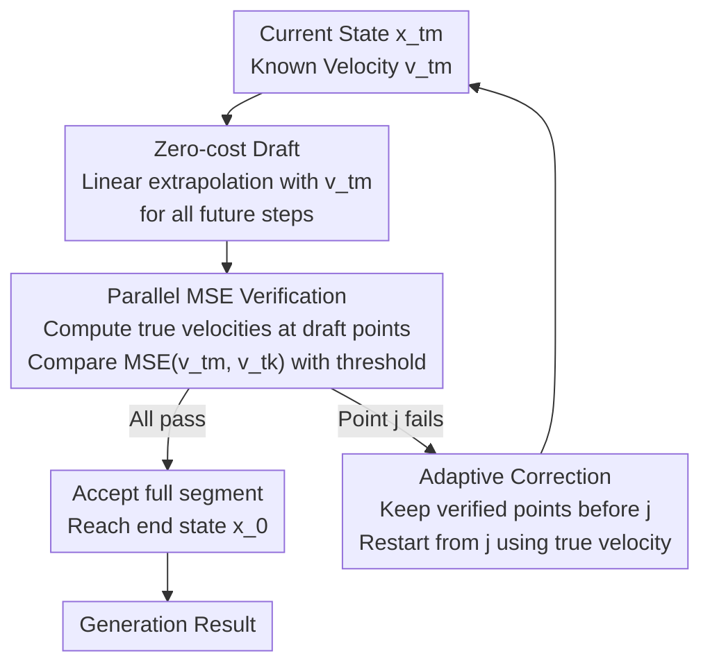

# FlowCast: Trajectory Forecasting for Scalable Zero-Cost Speculative Flow Matching

**Conference**: ICLR 2026  
**arXiv**: [2602.01329](https://arxiv.org/abs/2602.01329)  
**Code**: None  
**Area**: Diffusion Models / Inference Acceleration  
**Keywords**: Flow Matching, Speculative Decoding, Zero-cost Acceleration, Inference Optimization, Trajectory Forecasting

## TL;DR
The FlowCast framework is proposed to introduce speculative decoding into Flow Matching models. By leveraging the local smoothness of the velocity field, current velocity predictions are used as zero-cost drafts to extrapolate future states. Selective skipping of redundant steps via MSE verification achieves >2.5× acceleration without quality loss.

## Background & Motivation

**Background**: Flow Matching (FM) has become a mainstream method for high-quality generative modeling (e.g., FLUX.1, Wan video generation), mapping noise to data by solving ODEs. However, ODE integration is inherently sequential, with each step depending on the previous output, resulting in slow inference.

**Limitations of Prior Work**: Existing acceleration methods (distillation, trajectory truncation, consistency training) either degrade quality (blurring textures, semantic drift), require expensive retraining, or lack generalization. This issue is magnified in video generation, where the expanded temporal dimension exponentially increases the computational burden.

**Key Challenge**: High-fidelity FM relies on a sufficient number of sampling steps, yet more steps imply slower inference. There is a need to intelligently skip "unnecessary" steps without retraining.

**Goal**: How to adaptively accelerate FM inference without introducing auxiliary models or performing any retraining?

**Key Insight**: FM models are trained to maintain a nearly constant velocity; empirically, the velocity field changes slowly between adjacent steps. This implies that the velocity prediction at the current step can serve as a "free draft" for future steps.

**Core Idea**: Utilize the FM model's own velocity prediction as a zero-cost draft for speculative extrapolation. Steps are skipped if MSE verification passes, and the model backtracks otherwise.

## Method

### Overall Architecture
FlowCast addresses the long-standing efficiency bottleneck in Flow Matching inference: solving the ODE to transform noise into data requires waiting for the output of each preceding step, forcing the entire trajectory to be sequential. It adapts speculative decoding from Large Language Models (LLMs) but without introducing auxiliary small models or requiring retraining. One inference round involves three stages: first, use the current velocity at the current timestamp to linearly extrapolate all future states (Zero-cost Draft); then, compute the true velocities of these draft points in parallel and compare them to the draft velocity via MSE (Parallel MSE Verification); finally, discard and backtrack from the first point that fails the criteria (Adaptive Correction). Stable segments allow for large skips, while volatile segments trigger fine-grained integration, maintaining speed without sacrificing quality.

### Key Designs

**1. Zero-cost Draft: Treating current velocity as a free draft for future steps**

The first challenge in speculative decoding is "where the draft comes from." In LLMs, a dedicated small model is often trained to guess, but this is unnecessary for FM. The FM training objective itself encourages walking along linear interpolation paths and maintaining constant velocity; empirically, velocity variation between adjacent steps is minimal. Consequently, FlowCast uses the velocity $v_{t_m}$ calculated at the current step $t_m$ to perform linear extrapolation for each subsequent step:

$$\tilde{x}_{t_k} = x_{t_m} + (t_k - t_m) \cdot v_{t_m}, \quad k = m+1, \ldots, K$$

This step involves no extra forward passes, making the draft truly "zero-cost," which is the fundamental reason it is more lightweight than LLM speculative decoding—an entire draft model is eliminated.

**2. Parallel MSE Verification: Determining draft reliability in the velocity space**

While drafts are free, they cannot be accepted blindly, as regions with rapid velocity shifts would lead to significant extrapolation error. The critical design choice is **performing comparisons in the velocity space rather than the data space**: for every draft state $\tilde{x}_{t_k}$, its true velocity $v(\tilde{x}_{t_k}, t_k)$ is calculated and compared against the initial $v_{t_m}$. The draft is accepted if $\text{MSE}(v_{t_m}, v_{t_k}) < \epsilon$. Velocity is more sensitive than data to local dynamic changes, and its verification overhead is lower. Furthermore, since these draft points are independent, their true velocities can be computed in a single parallel forward pass. Scanning forward along the timestamps, the first point $j$ that exceeds the MSE threshold causes that point and all subsequent drafts to be discarded.

**3. Adaptive Correction: Backtracking after a rejection point**

If verification fails at point $j$, the preceding points $\{x_{m+1}, \ldots, x_{j-1}\}$ are already verified and retained. Starting from $j$, the true velocity $v_{t_{j-1}}$ calculated near that point is used as a new starting point for another round of extrapolation. This "accept-backtrack-re-extrapolate" loop allows the step size to adapt to local trajectory dynamics: stable regions allow for large skipping (aggressive acceleration), while volatile regions are caught by verification and relegated to fine-grained integration (ensuring fidelity).

**4. Error Bound: Theoretical upper bound on skipping error**

To address concerns regarding uncontrolled error from aggressive skipping, FlowCast establishes theoretical safety. Lemma 4.1 assumes the velocity field is Lipschitz continuous (constant $M$) with bounded second derivatives ($N$), proving that the global error of speculative integration satisfies $\|x(t_k) - x_k\| \leq \frac{e^{Mt_k}-1}{2M}(hN + 2p\sqrt{\epsilon})$. Total error is controlled by step size $h$ and weight $\epsilon$. Theorem 4.2 inverts this: given a target tolerance $q_d$, by setting the threshold $\epsilon \leq (\frac{q_d}{2A})^2$ (where $A = \frac{e^M-1}{M}$), the speculative error is guaranteed not to exceed $q_d$. This allows the threshold $\epsilon$ to be derived from target accuracy rather than pure trial and error.

## Key Experimental Results

### Main Results
Text-to-Image Generation (GenEval Dataset + FLUX Model):

| Method | Overall↑ | CLIPIQA↑ | Speedup |
|------|----------|----------|--------|
| FLUX 50 steps | 0.65 | 0.83 | 1.0× |
| FLUX 25 steps | 0.64 | 0.80 | 2.0× |
| FLUX 10 steps | 0.57 | 0.59 | 5.0× |
| FlowCast + FLUX | 0.65 | 0.83 | **>2.5×** |

### Multi-task Verification

| Task | Model | Speedup | Quality Loss |
|------|------|--------|---------|
| Text-to-Image | FLUX | >2.5× | None |
| Text-to-Image | BAGEL | >2.5× | None |
| Image Editing | GEdit | >2.5× | None |
| Multi-turn Editing | EditBench | >2.5× | None |
| Video Generation | VBench | >2.5× | None |

### Key Findings
- FlowCast achieves >2.5× acceleration with quality identical to the full 50-step generation, whereas simply reducing steps to 25 or 10 leads to significant quality degradation.
- The advantage is particularly pronounced in multi-turn editing tasks, where step-reduction methods suffer from cumulative error, while FlowCast maintains precision.
- **Key Insight**: Over 60% of steps in an FM trajectory exhibit velocity changes within the threshold and can be safely skipped.
- The threshold $\epsilon$ is insensitive to quality within a certain range, demonstrating the robustness of the method.

## Highlights & Insights
- **Insight on Zero-cost Draft**: By exploiting the constant velocity nature of the FM training objective, the draft is obtained entirely for "free" without any auxiliary models. This is far more lightweight than speculative decoding in LLMs (which requires small models).
- **Migration of Speculative Decoding from LLMs to Vision**: While FM is not autoregressive, the sequential dependence of its ODE integration is analogous. The paper elegantly solves the "draft design" and "draft verification" problems using velocity smoothness.
- **Plug-and-play and Stackable**: This approach is orthogonal to existing acceleration methods and can be used on top of distillation or truncation.

## Limitations & Future Work
- Speedup depends on the smoothness of the velocity field; acceleration may be limited for certain models or scenarios (e.g., audio generation with rich high-frequency details).
- Only Euler solvers were verified; the effectiveness under higher-order solvers (e.g., Midpoint, RK4) remains unknown.
- Parallel verification requires computing velocities for all draft points simultaneously, increasing memory overhead as the number of skipped steps increases.
- The threshold $\epsilon$ requires manual setting; while robust, the optimal value may vary by task.

## Related Work & Insights
- **vs TeaCache**: TeaCache skips steps based on timestamp embedding similarity, while FlowCast uses direct velocity MSE verification, which is more straightforward and theoretically grounded.
- **vs Distillation (InstaFlow, etc.)**: Distillation requires training and often reduces quality, whereas FlowCast is training-free and lossless.
- **vs Consistency Models**: Consistency models require modifying the training pipeline, while FlowCast is a purely post-processing acceleration.
- **Transferable Ideas**: The speculative generation framework can be extended to any generative model based on ODE solving.

## Rating
- Novelty: ⭐⭐⭐⭐⭐ Elegant zero-cost draft design for FM inference.
- Experimental Thoroughness: ⭐⭐⭐⭐ Coverage of image generation, editing, and video generation with theoretical analysis.
- Writing Quality: ⭐⭐⭐⭐ Clear explanation of motivation and methodology; good integration of theory and experiments.
- Value: ⭐⭐⭐⭐⭐ Highly valuable plug-and-play, training-free acceleration for the FM community.

<!-- RELATED:START -->

## Related Papers

- [\[ICLR 2026\] FlowCast: Advancing Precipitation Nowcasting with Conditional Flow Matching](flowcast_advancing_precipitation_nowcasting_with_conditional_flow_matching.md)
- [\[ICLR 2026\] Delay Flow Matching](delay_flow_matching.md)
- [\[ICLR 2026\] Value Matching: Scalable and Gradient-Free Reward-Guided Flow Adaptation](value_matching_scalable_and_gradient-free_reward-guided_flow_adaptation.md)
- [\[ICLR 2026\] Source-Guided Flow Matching](source-guided_flow_matching.md)
- [\[ICLR 2026\] Flow Matching with Semidiscrete Couplings](flow_matching_with_semidiscrete_couplings.md)

<!-- RELATED:END -->
