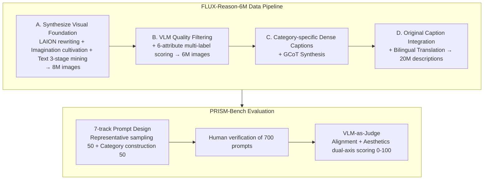

# FLUX-Reason-6M & PRISM-Bench: A Million-Scale Text-to-Image Reasoning Dataset and Comprehensive Benchmark

**Conference**: ICLR 2026  
**OpenReview**: [https://openreview.net/forum?id=cPzgZnpVbN](https://openreview.net/forum?id=cPzgZnpVbN)  
**Code**: [https://github.com/rongyaofang/prism-bench](https://github.com/rongyaofang/prism-bench)  
**Area**: Image Generation / Text-to-Image Datasets and Evaluation  
**Keywords**: Text-to-image, reasoning dataset, Generating Chain-of-Thought (GCoT), evaluation benchmark, bilingual, VLM-as-Judge  

## TL;DR
This work constructs FLUX-Reason-6M, a reasoning-oriented text-to-image dataset containing 6 million FLUX-generated images and 20 million bilingual descriptions (core feature: "Generating Chain-of-Thought, GCoT" annotations). It also introduces PRISM-Bench, a fine-grained evaluation benchmark with seven tracks using advanced VLMs as judges, revealing the actual performance gap between open-source and closed-source text-to-image models in dimensions like text rendering and long-text instruction following.

## Background & Motivation
- **Background**: Closed-source text-to-image models (Gemini2.5-Flash-Image, GPT-Image-1) lead significantly in complex instruction following and controllable synthesis, while open-source models struggle with complex and detailed prompts, with the gap continuing to widen.
- **Limitations of Prior Work 1 (Data)**: Existing open-source datasets are mostly flat image-caption pairs crawled from the web (e.g., LAION, CC), which describe "what is drawn" but not "why it is composed this way," failing to provide models with reasoning capabilities. A few reasoning datasets (e.g., GoT) are limited to bounding-box layout planning, covering narrow dimensions.
- **Limitations of Prior Work 2 (Evaluation)**: Mainstream benchmarks evaluate only limited dimensions, ignoring key capabilities like imagination and emotional expression. Furthermore, they rely on object detectors and coarse CLIP scores, which saturate easily and fail to distinguish model performance levels.
- **Key Challenge**: Training "reasoning-capable" text-to-image models is hindered by both a lack of large-scale structured reasoning supervision signals and a lack of discriminative evaluation aligned with human judgment.
- **Goal**: Address the shortcomings in both training data and evaluation benchmarks to lower the threshold for reproduction and promote the training of next-generation open-source reasoning-capable models.
- **Key Insight**: **Generating high-quality images with FLUX + reverse-labeling "Generating Chain-of-Thought (GCoT)" using VLMs.** Images are decomposed into multi-dimensional dense descriptions and step-by-step generation logic across six attributes (imagination, entity, text rendering, style, affect, composition) as learnable reasoning supervision. PRISM-Bench is then designed based on the same six attributes plus GCoT with seven tracks using VLM-as-Judge.

## Method

### Overall Architecture
The work follows two main lines: **FLUX-Reason-6M dataset construction** (A→D four-stage pipeline) and **PRISM-Bench evaluation** (prompt design + dual-axis evaluation protocol). On the data side, 128 A100 GPUs were used for 4 months (~15,000 A100-days): first synthesizing high-quality visual foundations, then filtering and scoring via VLM, generating dense annotations/GCoT, and integrating original captions with bilingual translations. On the evaluation side, 700 human-verified prompts across seven tracks are used, with GPT-4.1 / Qwen2.5-VL-72B scoring "alignment" and "aesthetics" on dual axes.

### Key Designs

**1. Six Attributes + Generating Chain-of-Thought (GCoT): Mapping "how to draw" into learnable reasoning supervision.** This is the conceptual foundation of the work. The authors define six attributes crucial to modern T2I: text rendering (typography and readability), composition (layout and spatial relations), imagination (creative concept fusion), affect (emotional expression), entity (precise depiction of knowledge), and style (artistic/photographic style). Built upon this, GCoT no longer merely lists content like standard captions. Instead, it decomposes semantic intent and compositional logic into multi-step detailed plans: scene elements, their interactions, layout choices, color and style decisions, typography quality, and emotional tone, explaining "what to place first and why it is placed that way." Thus, the model learns rules behind composition and style rather than just "word-to-pixel" mappings.

**2. Progressive Imagination Cultivation + Text "Mining-Generation-Synthesis" Pipeline: Strengthening synthesis foundations.** While rewriting LAION-Aesthetics captions provides a high-quality start, it systematically underestimates "imagination" and "text rendering." For imagination, Gemini-2.5-Pro generates 200 seeds, then Qwen3-32B expands them using in-context examples with high sampling temperature for novelty. For text rendering, a three-stage pipeline is used: Qwen2.5-VL-32B mines images with clear text from LAION-2B, generates captions describing text content/visuals/context, and FLUX.1-dev synthesizes new images to ensure alignment between rendered text and captions.

**3. VLM-driven Multi-dimensional Filtering, Dense Labeling, and Original Caption Recirculation.** VLMs act as "inspectors and annotators." Qwen-VL performs basic quality screening (removing blur, artifacts, structural errors), followed by scoring each image (1–10) across six attributes to assign multi-labels based on specific thresholds. Text rendering undergoes an extra pass to remove unclear or incorrect text. Category-specific dense descriptions are then generated (e.g., identity/attributes for entities, technique/aesthetics for style), and the original image plus all captions are fed back into the VLM to synthesize GCoT. Finally, original LAION captions are scored for alignment, with those exceeding thresholds recirculated to enrich linguistic diversity, resulting in ~20 million descriptions translated into Chinese.

**4. PRISM-Bench: Seven-Track Prompt Construction + VLM Dual-Axis Evaluation.** The benchmark shares the six attributes with the dataset, plus a "Long Text" track using GCoT descriptions to test dense instruction following. Each of the seven tracks has 100 prompts: 50 from representative sampling (k-means clustering of top-scoring prompts) and 50 category-specifically constructed (e.g., for text rendering, sampling content length, font, and scene). PRISM-Bench-ZH includes culturally adapted Chinese prompts. Evaluation uses GPT-4.1 and Qwen2.5-VL-72B as judges for "fine-grained alignment" (1–10 score + reasoning) and "aesthetics," averaged and mapped to 0–100.

## Key Experimental Results

### Main Results Table (PRISM-Bench, GPT-4.1 Judge, Overall Avg. for representative models)

| Model | Imag. | Entity | Text | Style | Affect. | Comp. | LongText | Overall |
|------|-------|--------|------|-------|---------|-------|----------|---------|
| SD1.5 | 36.4 | 47.5 | 20.6 | 55.3 | 61.0 | 56.1 | 32.9 | 44.2 |
| SDXL | 58.2 | 70.0 | 25.4 | 73.9 | 78.0 | 75.4 | 41.9 | 60.4 |
| FLUX.1-dev | 71.1 | 71.0 | 56.3 | 76.4 | 89.7 | 86.8 | 64.6 | 73.7 |
| Qwen-Image | 79.6 | 76.3 | 61.6 | 86.6 | 90.4 | 90.3 | 74.5 | 79.9 |
| Gemini2.5-Flash-Image | 88.6 | 84.2 | 69.7 | 90.7 | 92.1 | 90.5 | 81.1 | 85.3 |
| **GPT-Image-1 [High]** | 86.4 | **88.2** | **74.5** | **93.1** | 90.8 | **92.8** | 78.3 | **86.3** |

### PRISM-Bench-ZH (Chinese, GPT-4.1 Judge, Overall Avg.)

| Model | Overall |
|------|---------|
| HiDream-I1-Dev | 51.7 |
| Bagel | 65.4 |
| Qwen-Image | 81.1 |
| SEEDream 3.0 | 82.0 |
| **GPT-Image-1 [High]** | **87.5** |

### Key Findings
- **Closed-source models lead and the gap is widening**: GPT-Image-1 (86.3) and Gemini2.5-Flash-Image (85.3) lead in almost all tracks. Open-source models like Qwen-Image form a competitive second tier but still show visible gaps.
- **Difficulties concentrate in text rendering and long text**: While Style and Composition are relatively mature, Text rendering and Long Text are the weakest areas for all models, showing the most room for improvement.
- **Bilingual text rendering contrast**: SEEDream 3.0 and Qwen-Image are weaker in English text rendering but excel in Chinese, validating the value of the "culturally adapted prompt" design in the ZH benchmark.
- **High discriminative power**: Clear evolutionary progress within model families (SD1.5 → SDXL → SD3.5-Large) is visible, indicating the benchmark does not saturate easily like CLIP-based metrics.

## Highlights & Insights
- **Grounding "reasoning" in data supervision**: GCoT provides explicit "decision-making process" descriptions, offering learnable reasoning signals similar to LLM CoT for T2I.
- **Integrated Data-Evaluation Design**: The six attributes serve as both data annotation dimensions and evaluation tracks, ensuring alignment between training signals and evaluation metrics.
- **Bilingual & Cultural Adaptation**: Chinese text rendering prompts are adapted for context rather than translated literally, revealing phenomena like "weak English, strong Chinese" rendering.
- **Significant Engineering Scale**: 6M images / 20M captions / 15,000 A100-days, with a commitment to open-sourcing data and benchmarks, lowers barriers for the community.

## Limitations & Future Work
- **Dependence on FLUX.1-dev for synthesis**: Stylistic traits or flaws in the visual base may be inherited, potentially introducing synthetic bias compared to real image distributions.
- **VLM Reliance**: Filtering, dense captions, GCoT, and scoring all rely on Qwen-VL / GPT-4.1, potentially magnifying VLM biases or errors.
- **Lack of New Model Training**: The actual reasoning gain from GCoT supervision in training new models remains to be verified by subsequent experiments.
- **Stability of VLM-as-Judge**: Closed-source judges like GPT-4.1 are not perfectly reproducible and may drift over time, affecting long-term comparability.

## Related Work & Insights
- **Data Side**: Compared to flat image-text pairs like LAION/CC or narrow reasoning data like GoT (layout only), this work extends reasoning supervision to six dimensions with explicit generation steps.
- **Evaluation Side**: Unlike GenEval or T2I-CompBench which rely on object detectors/CLIP, PRISM-Bench uses VLM fine-grained scoring to mitigate saturation and adds neglected dimensions like imagination and affect.
- **Inspiration**: The GCoT "explicit generation plan" approach can be transferred to controllable generation, image editing, or video tasks.

## Rating
- **Novelty**: ⭐⭐⭐⭐ — GCoT multi-dimensional reasoning + integrated data/eval design is relatively fresh, though individual techniques are scaled-up combinations of existing methods.
- **Experimental Thoroughness**: ⭐⭐⭐⭐ — Covers 19 models across seven tracks with dual judges and bilingual benchmarks, though missing direct training ablation of GCoT benefits.
- **Writing Quality**: ⭐⭐⭐⭐ — Clear motivation, systematic pipeline, and well-organized benchmarks.
- **Value**: ⭐⭐⭐⭐⭐ — 6M images / 20M bilingual descriptions and a discriminative benchmark represent high-value infrastructure for the open-source T2I community.

<!-- RELATED:START -->

## Related Papers

- [\[CVPR 2026\] I2I-Bench: A Comprehensive Benchmark Suite for Image-to-Image Editing Models](../../CVPR2026/image_generation/i2i-bench_a_comprehensive_benchmark_suite_for_image-to-image_editing_models.md)
- [\[CVPR 2026\] UnicEdit-10M: A Dataset and Benchmark Breaking the Scale-Quality Barrier via Unified Verification for Reasoning-Enriched Edits](../../CVPR2026/image_generation/unicedit-10m_a_dataset_and_benchmark_breaking_the_scale-quality_barrier_via_unif.md)
- [\[ICLR 2026\] NextStep-1: Toward Autoregressive Image Generation with Continuous Tokens at Scale](nextstep-1_toward_autoregressive_image_generation_with_continuous_tokens_at_scal.md)
- [\[ICLR 2026\] ImageDoctor: Diagnosing Text-to-Image Generation via Grounded Image Reasoning](imagedoctor_diagnosing_text-to-image_generation_via_grounded_image_reasoning.md)
- [\[ICLR 2026\] RePrompt: Reasoning-Augmented Reprompting for Text-to-Image Generation via Reinforcement Learning](reprompt_reasoning-augmented_reprompting_for_text-to-image_generation_via_reinfo.md)

<!-- RELATED:END -->
