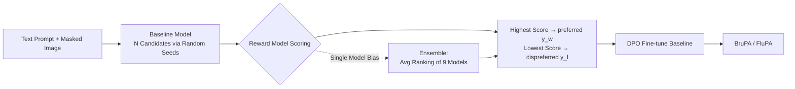

# Follow-Your-Preference: Towards Preference-Aligned Image Inpainting

**Conference**: ICLR 2026  
**OpenReview**: [https://openreview.net/forum?id=n6XbPGStit](https://openreview.net/forum?id=n6XbPGStit)  
**Code**: [https://github.com/shenytzzz/Follow-Your-Preference](https://github.com/shenytzzz/Follow-Your-Preference)  
**Area**: Image Generation / Image Inpainting / Preference Alignment  
**Keywords**: image inpainting, preference alignment, DPO, reward model, reward hacking, reward ensemble  

## TL;DR
Instead of proposing a new method, this paper returns to basics to systematically investigate fundamental questions regarding "preference alignment for image inpainting using DPO and public reward models"—whether reward models are reliable, how preference data scales, and the origins of reward hacking. It finds that **simply ensembling and ranking 9 reward models** eliminates individual biases and significantly surpasses SOTA, establishing a simple yet solid baseline for this emerging direction.

## Background & Motivation
- **Background**: Diffusion and flow-based models have drastically improved the quality of image inpainting, with models like BrushNet and FLUX.1 Fill capable of generating visually coherent content. Simultaneously, aligning visual generation with human preferences (e.g., Diffusion-DPO, various RLHF methods) has become a research hotspot.
- **Limitations of Prior Work**: Existing preference alignment efforts are primarily focused on text-to-image generation; **dedicated work for image inpainting is extremely scarce**. Furthermore, alignment relies on reward models, but prior works often **directly adopt existing reward models without sufficient evaluation**, lacking a systematic understanding of their reliability, scalability of preference data, and how reward hacking occurs.
- **Key Challenge**: Manual annotation of preference data is expensive and non-scalable $\to$ reliance on public reward models for automatic construction is necessary. However, reward models themselves **carry unverified biases**, and blind usage can inject these biases into the aligned model, leading to reward hacking (where metrics improve, but human perception worsens).
- **Goal**: Instead of pursuing novel algorithms, this work aims to **clarify the foundational questions** of this new direction and provide a simple, reproducible, and highly competitive baseline.
- **Key Insight**: **[Regressive Systematic Study]** Utilize the mature DPO for alignment training while conducting large-scale controlled experiments across 9 reward models, 2 benchmarks, and 2 structurally distinct baselines. **[Reward Ensemble]** Individual reward models exhibit specific biases, but averaging their rankings (ensemble) cancels out these biases, resulting in robust and generalizable preference data.

## Method

### Overall Architecture
The method intentionally maintains a "no new architecture, no new dataset" approach: for each text prompt and mask, the baseline inpainting model generates multiple candidates using different random seeds. A reward model scores these candidates, selecting the **highest score as the preferred ($y_w$) and the lowest as the dispreferred ($y_l$)** to form pairs. DPO is then used to fine-tune the baseline on this data. All research variables are isolated to the choice of the reward model used for data construction.

### Key Designs

**1. Preference Data Construction via DPO + Public Reward Models: Scaling the pipeline by replacing manual labels.** The authors chose DPO over PPO/GRPO as it transforms alignment into a direct supervised learning task, offering higher efficiency and stability. The visual DPO loss is formulated as $L_{DPO}=-\mathbb{E}[\log\sigma(-\beta((L^w_\theta-L^w_{ref})-(L^l_\theta-L^l_{ref})))]$, where $L^w$ and $L^l$ represent the denoising losses (DDPM or Flow Matching) of the policy and reference models on preferred and dispreferred samples, respectively. By generating 16 candidates per prompt and ranking them, the data construction process is infinitely scalable.

**2. Controlled Diagnosis across 9 Reward Models × 2 Baselines × 2 Benchmarks: Verifying reward model credibility.** Using an "oracle" setting (where the same reward model constructs and evaluates data), the study found that **CLIPScore, VQAScore, and Perception can yield evaluation scores lower than the baseline or random selection even when trained on their own data**. This indicates they are unreliable as evaluators, likely due to coarse-grained contrastive pre-training or simplistic VQA-style scoring. However, most reward models still provide effective training signals (generally outperforming baseline/random under GPT-4 evaluation), suggesting that "being a good data constructor" does not necessarily mean "being a good evaluator."

**3. Two Dimensions of Preference Data Scaling: Robust trends in both candidate and sample scaling.** The authors expanded along two axes: **candidate scaling** (increasing the number of candidates per prompt to increase diversity and widen the gap between $y_w$ and $y_l$) and **sample scaling** (increasing dataset size for better pattern learning). Trends remained consistent across BrushNet, FLUX.1 Fill, BrushBench, and EditBench. However, with HPSv2, GPT-4 scores significantly deteriorated in late-stage scaling, exposing reward hacking.

**4. Attribution of Reward Model Bias and Reward Hacking: Visualizing specific biases.** Visualization revealed that **HPSv2 prefers bright lighting, complex compositions, and vivid colors, while PickScore prefers the opposite (darker, simpler, low saturation)**. These biases impact baselines differently: BrushNet inherently generates vivid images, making PickScore more compatible, whereas FLUX.1 Fill generates flatter images, making HPSv2 more effective. A mismatch between a single reward model's "personality" and the baseline's "personality" triggers hacking.

**5. Ensemble Reward Model: Using average ranking to cancel biases.** The authors propose an **Ensemble** approach that selects $y_w$ and $y_l$ based on the **average rank** across all reward models. This ensemble ranked in the top two in 11/12 cases for BrushNet and 7/12 for FLUX.1 Fill across public model evaluations, and 3/4 in GPT-4 evaluations. By averaging preferences, individual biases are neutralized, making it robust to reward hacking. The final models are named **BruPA** (BrushNet + Ensemble) and **FluPA** (FLUX.1 Fill + Ensemble).

## Key Experimental Results

### Main Results (Comparison with SOTA, selected from BrushBench / EditBench)

| Model | ImageR (Brush./Edit.) | HPSv2 (Brush./Edit.) | HPSv3 (Brush./Edit.) | GPT-4 (Brush./Edit.) |
|------|------|------|------|------|
| BrushNet (baseline) | 12.717 / -1.296 | 27.509 / 23.076 | 5.749 / 0.403 | 79.391 / 57.046 |
| **BruPA (Ours)** | **13.315 / 10.463** | **28.037 / 23.933** | **6.276 / 1.398** | **83.054 / 61.186** |
| FLUX.1 Fill (baseline) | 12.760 / 4.910 | 27.476 / 24.076 | 6.055 / 2.470 | 83.935 / 66.979 |
| **FluPA (Ours)** | **13.859 / 7.707** | **28.735 / 25.972** | **7.000 / 4.230** | **87.609 / 72.307** |

Both baselines showed comprehensive improvements after Ensemble preference alignment across standard metrics, GPT-4 evaluation, and human evaluation. Specific improvements in metrics like ImageReward were substantial (e.g., BruPA's EditBench ImageR increased from -1.296 to 10.463).

### Ablation Study

| Aspect | Key Finding |
|------|------|
| Oracle Reward Test | CLIPScore / VQAScore / Perception scores can be lower than baseline/random; **unreliable evaluation**. |
| HPSv2 vs. Ensemble Scaling | HPSv2 GPT-4 scores **dropped significantly** in late-stage scaling (reward hacking); Ensemble remained robust. |
| Single Model vs. Ensemble | Ensemble achieved best results across benchmarks, architectures, evaluators, and scaling dimensions. |
| New Dataset (I Dream My Painting) | Validated the transferability of conclusions to additional benchmarks. |

### Key Findings
- **Most reward models can construct effective preference data, but "good constructor $\neq$ good evaluator"**—it is crucial to evaluate these roles separately.
- **Candidate and sample scaling trends are robust and generalizable**, but biased reward models (like HPSv2) can destroy scaling gains due to reward hacking.
- **Reward model biases are concentrated in brightness, composition, and color palette**, and are most harmful when mismatched with the baseline's "personality."
- **Simple reward ensembling (average ranking) cancels out biases**, surpassing SOTA without architectural changes or new manual data.

## Highlights & Insights
- **Methodological value outweighs "new model" value**: By systematically answering foundational questions for inpainting alignment through extensive experimentation, the paper provides a strong, reproducible baseline with significant guidance for future research.
- **Ensembling to cancel bias is a simple yet universal insight**: This applies beyond inpainting to any preference alignment task relying on off-the-shelf reward models (T2I, video generation, etc.).
- **Concrete attribution of reward hacking**: Identifying specific visual biases (brightness/composition/color) and the "personality match" between reward models and baselines provides more actionable insights than vague mentions of "hacking."
- **Robustness across paradigms**: Validated on both U-Net+DDPM (BrushNet) and Transformer+Flow (FLUX.1 Fill), ensuring the universality of the conclusions.

## Limitations & Future Work
- **Reliance on GPT-4 as a "fair evaluator"**: This assumption remains strictly unproven; much of the conclusion's credibility rests on this "untested hypothesis."
- **Uniform average ranking in Ensemble**: Superior ensemble strategies weighting models based on baseline personality or specific tasks were not explored.
- **Qualitative bias characterization**: Attribution relies on visual samples (brightness/palette); there is a lack of quantitative, automated tools for bias detection.
- **Limited to inpainting**: The effectiveness of "reward ensembling" in other generative tasks requires further systematic validation.

## Related Work & Insights
- **Preference Alignment**: Evolutionary path from RLHF (PPO/GRPO) to DPO (Rafailov 2023) and visual Diffusion-DPO (Wallace 2024). While PrefPaint uses human-labeled reward models, this work enables scalability by ensembling public models.
- **Reward Model Ecosystem**: This work provides an empirical "health check" for models like CLIPScore, Aesthetic, ImageReward, PickScore, HPS, etc., as "data constructors."
- **Inpainting Baselines**: Proven effective across distinct paradigms like BrushNet (dual-branch U-Net) and FLUX.1 Fill (rectified flow transformer).
- **Key Insight**: In any scenario using off-the-shelf reward models for alignment, first **scrutinize reliability and bias**, then use **simple ensembling** to mitigate risks—this is often more cost-effective than developing complex alignment algorithms.

## Rating
- **Novelty**: ⭐⭐⭐ — Uses mature DPO and simple ensemble; however, the systematic research perspective and the "ensemble for bias cancellation" insights are fresh.
- **Experimental Thoroughness**: ⭐⭐⭐⭐⭐ — Extensive coverage across 9 reward models, 2 baselines, 2 benchmarks, scaling analysis, bias attribution, SOTA comparison, and human/GPT-4 evaluation.
- **Writing Quality**: ⭐⭐⭐⭐ — Organized via "Problem-Discovery-Conclusion," with clear findings and effective visualization, though dense tables can be overwhelming.
- **Value**: ⭐⭐⭐⭐ — Establishes a strong baseline for inpainting alignment; insights on reward ensembling and hacking attribution are highly relevant to the broader visual alignment community.

<!-- RELATED:START -->

## Related Papers

- [\[ICLR 2026\] Follow-Your-Shape: Shape-Aware Image Editing via Trajectory-Guided Region Control](follow-your-shape_shape-aware_image_editing_via_trajectory-guided_region_control.md)
- [\[ICLR 2026\] ViPO: Visual Preference Optimization at Scale](vipo_visual_preference_optimization_at_scale.md)
- [\[CVPR 2025\] Boost Your Human Image Generation Model via Direct Preference Optimization](../../CVPR2025/image_generation/boost_your_human_image_generation_model_via_direct_preference_optimization.md)
- [\[ICML 2026\] Anomaly-Preference Image Generation (APO)](../../ICML2026/image_generation/anomaly-preference_image_generation.md)
- [\[ICLR 2026\] Towards Better Optimization for Listwise Preference in Diffusion Models](towards_better_optimization_for_listwise_preference_in_diffusion_models.md)

<!-- RELATED:END -->
