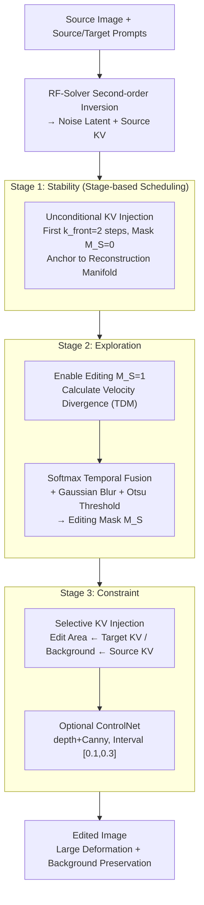

# Follow-Your-Shape: Shape-Aware Image Editing via Trajectory-Guided Region Control

**Conference**: ICLR 2026  
**arXiv**: [2508.08134](https://arxiv.org/abs/2508.08134)  
**Code**: [Project Page](https://follow-your-shape.github.io/)  
**Area**: Diffusion Models / Image Editing  
**Keywords**: Shape Editing, Trajectory Divergence Map, training-free, Flow Matching, KV Injection

## TL;DR
Follow-Your-Shape is proposed as a training-free and mask-free shape-aware image editing framework. It constructs a Trajectory Divergence Map (TDM) by calculating token-level velocity differences between inversion and editing trajectories to precisely locate the editing region. Combined with stage-based KV injection, it achieves significant shape transformations while strictly preserving the background.

## Background & Motivation
**Background**: Image editing based on Diffusion/Flow models performs well on general tasks but often fails in structural editing involving large-scale shape transformations—either failing to achieve the target shape or destroying non-edited regions.

**Limitations of Prior Work**: Existing region control strategies have fundamental flaws:
   - External binary masks: Too rigid to handle fine boundaries.
   - Cross-attention map inference: Noisy and unstable, making it unreliable for large deformations.
   - Unconditional KV injection: Preserves structure globally but suppresses the target edit.

**Key Challenge**: The conflict between editing controllability and content preservation—enabling Flow models to precisely modify the target region's shape without affecting other areas.

**Goal**: How to achieve precise large-scale shape editing without training or external masks?

**Key Insight**: From a dynamical systems perspective, the editing region can be localized by the degree of divergence between denoising trajectories under source and target conditions.

**Core Idea**: Automatically locate the editing area by comparing velocity field differences under source and target prompts, and implement stable shape-aware editing using stage-based KV injection.

## Method

### Overall Architecture
Follow-Your-Shape addresses the overlooked sub-task of "large-scale shape editing": changing an object into a drastically different shape (e.g., changing a standing cat to a curled one) while strictly preserving the background. Built upon FLUX.1-dev, it is an inference-time framework that requires neither training nor external masks. The pipeline is as follows: given a source image and source/target prompts, a second-order RF-Solver inversion maps the image to a noise latent and records source KV features. The denoising process is then divided into three stages: Stage 1 uses unconditional KV injection to anchor the trajectory to the reconstruction manifold; Stage 2 allows editing while calculating the TDM from velocity field divergence in real-time to generate an editing mask; Stage 3 applies selective KV injection (target KV for the editing area, source KV for the background, supplemented by optional ControlNet constraints) to produce the final result.

### Key Designs

**1. Stage-based Editing Schedule: Stability → Exploration → Constraint, avoiding unreliable TDM in high-noise phases.**

The Trajectory Divergence Map (TDM) is used to delineate the editing region, but it is unreliable in the early denoising stages where noise dominates; using it throughout would misidentify the background as an editing area. Consequently, the denoising process is segmented. Stage 1 takes the first $k_{\text{front}}=2$ steps for unconditional KV injection (mask $M_S=\mathbf{0}$) to stabilize the trajectory on the reconstruction manifold. Stage 2 enables editing within a window $N$ ($M_S=1$) and collects TDM data to aggregate into a mask. Stage 3 performs selective injection based on this mask. Ablations show $k_{\text{front}}=2$ is the optimal balance for PSNR and CLIP Similarity.

**2. Trajectory Divergence Map: Automatically identifying editing areas via velocity field divergence.**

To identify "what to change and what to keep" without external labels, the authors measure the difference between denoising velocity fields under source and target prompts. Tokens with high divergence indicate regions where semantics are required to change. Specifically, at each step $t$, the $L_2$ distance between source and target velocities is calculated for each token $i$:

$$\delta_t^{(i)} = \| v_\theta(\mathbf{z}_t^{(i)}, t, \mathbf{c}_{\text{tgt}}) - v_\theta(\mathbf{x}_t^{(i)}, t, \mathbf{c}_{\text{src}}) \|_2$$

This is normalized to $\tilde{\delta}_t^{(i)} \in [0,1]$. After the window ends, TDMs are aggregated via softmax temporal fusion: $\hat{\delta}^{(i)} = \sum_{t \in N} \alpha_t^{(i)} \tilde{\delta}_t^{(i)}$, where $\alpha_t^{(i)} = \exp(\tilde{\delta}_t^{(i)}) / \sum_{t'} \exp(\tilde{\delta}_{t'}^{(i)})$. This emphasizes tokens that change significantly at specific steps. The result is refined with Gaussian blur $\tilde{M}_S = \mathcal{G}_\sigma * \hat{\delta}$ and binarized using an adaptive Otsu threshold $M_S$, making the process fully automated.

**3. Selective KV Injection via Masking: Target for edit area, Source for background.**

In Stage 3, KV features are mixed in attention layers to balance controllability and preservation:

$$\{K^*, V^*\} \leftarrow M_S \odot \{K^{\text{tgt}}, V^{\text{tgt}}\} + (1 - M_S) \odot \{K^{\text{inv}}, V^{\text{inv}}\}$$

The editing region uses target prompt features to drive shape changes, while the background uses inverted source features for strict preservation. ControlNet (depth + Canny) is optionally used within the normalized denoising interval $[0.1, 0.3]$ to further stabilize geometric consistency.

**4. ReShapeBench: Filling the gap in large-scale shape editing evaluation.**

Existing benchmarks lack systematic evaluation for large-scale shape transformations. The authors constructed ReShapeBench, containing 290 test cases: single-object (70), multi-object (50), and a general set (50). Source and target prompts differ only in foreground descriptions, focusing the evaluation on shape changes rather than background or style variations.

### Loss & Training
This is a training-free framework. The default configuration uses 14 denoising steps, a guidance scale of 2.0, $k_{\text{front}}=2$, and second-order RF-Solver inversion. ControlNet is active in the range $[0.1, 0.3]$ with depth strength 2.5 and Canny strength 3.5.

## Key Experimental Results

### Main Results (ReShapeBench + PIE-Bench)

| Method | AS↑ | PSNR↑ | LPIPS↓(×10³) | CLIP Sim↑ |
|------|-----|-------|-------------|-----------|
| MasaCtrl | 5.83 | 23.54 | 125.36 | 20.84 |
| RF-Edit | 6.52 | 33.28 | 17.53 | 30.41 |
| KV-Edit | 6.51 | 34.73 | 16.42 | 26.97 |
| FLUX.1 Kontext | 6.53 | 32.91 | 18.35 | 28.53 |
| Ours (w/o ControlNet) | 6.52 | 34.85 | **9.04** | 32.97 |
| **Ours (Full)** | **6.57** | **35.79** | **8.23** | **33.71** |

*Follow-Your-Shape leads across all metrics on ReShapeBench, with an LPIPS of 8.23 (next best 16.42) and CLIP Sim of 33.71 (next best 30.41).*

### Ablation Study (Influence of $k_{\text{front}}$)

| $k_{\text{front}}$ | AS↑ | PSNR↑ | LPIPS↓(×10³) | CLIP Sim↑ |
|------|-----|-------|-------------|-----------|
| 0 | 6.51 | 32.79 | 10.04 | 31.05 |
| 1 | 6.55 | 34.38 | 9.88 | 32.56 |
| **2** | **6.57** | **35.79** | **8.23** | **33.71** |
| 3 | 6.52 | 31.25 | 10.52 | 29.41 |
| 4 | 6.48 | 30.41 | 12.37 | 27.66 |

*There is an optimal value for $k_{\text{front}}$; $k_{\text{front}}=2$ achieves the best balance between stability and editing capability.*

### Key Findings
- Even without ControlNet, TDM-guided KV injection significantly outperforms all baselines.
- Diffusion-based methods (MasaCtrl, PnPInversion, Dit4Edit) degrade severely under large deformations.
- Flow-based methods provide higher image quality but still suffer from ghosts or incomplete transformations during drastic shape changes.
- The Otsu threshold is adaptive and eliminates manual tuning; the TDM distribution is naturally suited for binary segmentation.
- The timing ($[0.1, 0.3]$) and intensity of ControlNet are crucial for geometric consistency.

## Highlights & Insights
- **Dynamical Systems Perspective**: Formulating editing region localization as a trajectory divergence measurement is a theoretically elegant approach.
- **Elimination of External Masks and Attention Maps**: TDM dynamically extracts editing regions from the model's own behavior.
- **Sophisticated Three-stage Scheduling**: The Stability $\to$ Exploration $\to$ Constraint pipeline aligns with the dynamic characteristics of denoising.
- **Softmax Weighted Temporal Fusion**: Better captures temporal dynamics compared to simple averaging, as tokens may diverge only at specific steps.
- **ReShapeBench addresses a benchmark gap**: Provides a specialized evaluation for large-scale shape transformations.

## Limitations & Future Work
- Limited to prompt-based editing; cannot handle complex geometric transformations that are difficult to describe via text.
- Requires second-order inversion (RF-Solver), which doubles the computational cost.
- TDM is unreliable in high-noise phases, necessitating a stage-based strategy and extra hyperparameters ($k_{\text{front}}, N$).
- Optional dependence on ControlNet deviates from the ideal of "no external tools."
- Extension to video editing remains unexplored.

## Related Work & Insights
- **RF-Edit / RF-Solver**: Ours is built on RF-Solver inversion, replacing its global KV injection with TDM-guided strategies.
- **DiffEdit**: Also generates masks from source-target prediction differences but is diffusion-based and ignores trajectory dynamics.
- **Stable Flow**: Proposes selective injection into vital layers; Follow-Your-Shape performs selective injection in the spatial dimension.
- Insight: The deterministic ODE trajectories of Flow Matching are naturally suited for divergence metrics; this "trajectory-based" paradigm could extend to video or 3D content editing.

## Rating
- Novelty: ⭐⭐⭐⭐ — The trajectory divergence perspective is novel, though stage-based injection is incremental.
- Experimental Thoroughness: ⭐⭐⭐⭐ — Dual benchmarks and detailed ablations, though lacks a user study.
- Writing Quality: ⭐⭐⭐⭐⭐ — Clear motivation illustrations and fluid methodological derivation.
- Value: ⭐⭐⭐⭐ — Provides a systematic solution for the neglected sub-task of shape editing.

<!-- RELATED:START -->

## Related Papers

- [\[ICLR 2026\] Training-Free Reward-Guided Image Editing via Trajectory Optimal Control](training-free_reward-guided_image_editing_via_trajectory_optimal_control.md)
- [\[ICLR 2026\] Follow-Your-Preference: Towards Preference-Aligned Image Inpainting](follow-your-preference_towards_preference-aligned_image_inpainting.md)
- [\[ICLR 2026\] RegionE: Adaptive Region-Aware Generation for Efficient Image Editing](regione_adaptive_region-aware_generation_for_efficient_image_editing.md)
- [\[ICLR 2026\] FlowAlign: Trajectory-Regularized, Inversion-Free Flow-based Image Editing](flowalign_trajectory-regularized_inversion-free_flow-based_image_editing.md)
- [\[ICLR 2026\] W-Edit: A Wavelet-based Frequency-aware Framework for Text-driven Image Editing](w-edit_a_wavelet-based_frequency-aware_framework_for_text-driven_image_editing.md)

<!-- RELATED:END -->
