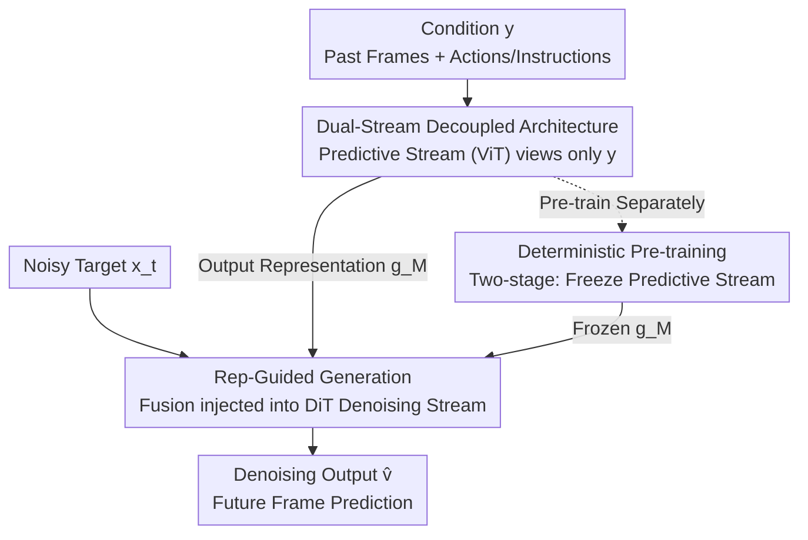

# Foresight Diffusion: Improving Sampling Consistency in Predictive Diffusion Models

**Conference**: ICLR 2026  
**OpenReview**: [https://openreview.net/forum?id=9WJoD0iDig](https://openreview.net/forum?id=9WJoD0iDig)  
**Area**: Diffusion Models  
**Keywords**: Predictive Diffusion, Sampling Consistency, Condition Decoupling, Deterministic Predictor, Video Prediction

## TL;DR
Addressing the issue that diffusion models applied to predictive learning suffer from high variance between samples and poor alignment with ground truth trajectories, ForeDiff decouples "condition understanding" from "target denoising" into two independent streams. It utilizes a pre-trained deterministic predictor to extract representations for guiding generation, simultaneously improving prediction accuracy and sampling consistency in robotic video prediction and scientific spatiotemporal forecasting.

## Background & Motivation

**Background**: Diffusion models and flow-based models excel at modeling complex multimodal distributions. Recently, they have been widely applied to predictive learning—modeling "predicting future trajectories based on past observations" as a conditional generation problem $p(x|y)$, where $x$ represents the latents of future frames and $y$ represents past frames along with conditions like actions or instructions.

**Limitations of Prior Work**: Generative tasks (e.g., text-to-image) pursue **diversity**, where variation between samples is a merit. However, predictive learning is fundamentally different; its stochasticity primarily stems from "incomplete observations," necessitating **sampling consistency**. Repeated sampling under the same condition should yield concentrated results with low variance that closely align with the ground truth trajectory. The authors observed that vanilla diffusion models perform strongly in best-case and average LPIPS with fewer parameters (Fig 3a/3b), but **worst-case LPIPS is significantly inferior to autoregressive models like iVideoGPT**, showing high sample variance and heavy-tailed distributions. In other words, they "occasionally predict well but are unstable," which is fatal for predictive tasks.

**Key Challenge**: The authors attribute poor consistency to **suboptimal predictive ability**, which originates from the **entanglement of condition understanding and target denoising within a shared architecture and joint training**. Architecturally, the same parameters must simultaneously understand condition $y$ and denoise the noisy target $x_t$, which restricts the full utilization of conditions. During training, the informative $x_t$ provides a "shortcut," making the model rely on the generative prior of $x_t$ rather than learning precise task dynamics from $y$.

**Goal**: To strengthen "condition understanding" as an independent component while retaining the generative power of diffusion models, thereby improving accuracy and suppressing variance in consistency.

**Key Insight**: The authors analyze a limit case: at $t=1$ (pure noise, where $x_1$ contains no signal), the diffusion model must rely solely on $y$ to predict, effectively degenerating into a deterministic predictor. Thus, "performance at $t=1$" serves as a proxy for the upper bound of the diffusion model's predictive ability. Experiments show vanilla diffusion **fails to outperform** an isomorphic deterministic ViT predictor at this point (Fig 3c), proving its predictive potential is not fully exploited.

**Core Idea**: Replace "shared architecture joint training" with "decoupled condition understanding + deterministic pre-training," allowing an independent deterministic stream to master the condition and feed its internal representations into the denoising stream to guide generation.

## Method

### Overall Architecture
The core of ForeDiff is splitting a vanilla conditional diffusion model from a single stream into **two streams**: a **predictive stream** (consisting of $M$ deterministic ViT blocks) that processes only condition $y$ without touching the noisy target $x_t$, and a **generative stream** (consisting of $N$ DiT blocks) that follows the standard denoising process. The informational representation $g_M$ from the predictive stream replaces the original condition $y$ and is injected into the generative stream via a Fusion module to guide denoising.

The architecture-only version is called **ForeDiff-zero** (end-to-end joint training). Adding **two-stage training** yields the full **ForeDiff**: the first stage pre-trains the predictive stream as an independent deterministic predictor; the second stage freezes it and uses representation $g_M$ as a condition to train the generative stream. The forward process is:

$$g_0 = \text{PatchEmbed}(y),\quad g_i = \text{ViT}_i(g_{i-1}),\ i=1,\dots,M$$
$$h_0 = \text{PatchEmbed}(x_t),\quad h_1 = \text{Fusion}(h_0, g_M, t),\quad h_{i+1} = \text{DiT}_i(h_i, t),\ i=1,\dots,N$$

When $M=0$, ForeDiff-zero reduces to vanilla conditional diffusion (where Fusion acts directly on the raw condition).

### Key Designs

**1. Dual-Stream Decoupled Architecture: Separating Condition Understanding and Denoising**

This design directly targets the dual-role parameter conflict and shortcut dependence on $x_t$ in shared architectures. Vanilla diffusion inputs $y$ and $x_t$ together into the shared backbone at the entry point, squeezing condition understanding. ForeDiff-zero introduces physically isolated streams: the predictive stream consists of $M$ ViT blocks with $y$ as the only input, **never accessing $x_t$**. Consequently, its parameters are entirely dedicated to condition understanding. The generative stream maintains standard DiT denoising but replaces raw $y$ with the processed representation $g_M$. Since the predictive stream is oblivious to $x_t$, it loses the "shortcut" of copying generative priors from $x_t$, mitigating entanglement. However, experiments show decoupling alone (ForeDiff-zero) yields only minor accuracy gains and **hardly improves consistency variance**, leading to the second design.

**2. Deterministic Pre-training + Frozen Representation Guidance: Pushing Predictive Ability to the Bound**

Architecture decoupling is insufficient if the ViT stream only learns "static representations" rather than true predictive ability during end-to-end training. Inspired by the $t=1$ limit analysis, ForeDiff uses two-stage training to maximize the predictive stream's capability. In the first stage, a PredHead is attached to the predictive stream to form a deterministic predictor $f_\xi(y)=\text{PredHead}(g_M)$, trained with a pure predictive loss $L_{\text{deter}}=\mathbb{E}_{x_0,y}[\|P_\xi(y)-x_0\|_2^2]$. In the second stage, the predictive stream is **frozen**, the PredHead is **removed**, and the internal representation $g_M$ serves as the condition to train the generative stream using the loss:

$$L_{\text{denoise}}=\mathbb{E}_{x_0,y,\epsilon,t}\big[\|G_\theta(x_t, P'_\xi(y), t)-(\epsilon-x_0)\|_2^2\big]$$

where $P'_\xi$ is the predictive stream minus the PredHead. Notably, the guidance signal is the **internal representation $g_M$ rather than the final output of the predictor**. Ablations show that guiding with explicit PredHead outputs degrades performance, indicating that context-rich intermediate representations are more beneficial for generation than "collapsed" predicted values. This deterministic pre-training step allows ForeDiff to significantly reduce STD metrics compared to ForeDiff-zero, truly solving the consistency problem.

**3. Synergistic Gains of Hybrid Architecture: 1+1 > 2**

ForeDiff combines "deterministic prediction" and "conditional diffusion." These are not simply superimposed; they are **synergistic**. Control experiments show that expanding vanilla diffusion to 18 DiT blocks (matching ForeDiff's parameter count) still results in significantly lower performance, as does using a standalone deterministic predictive stream. Only the combination of "deterministic predictive stream guiding a diffusion generative stream" achieves substantial leads. This suggests that the gains stem from the architectural design rather than parameter scale: the deterministic stream pushes condition understanding to its limit and provides stable "foresight" representations, while the diffusion stream retains its capacity to model stochasticity and generate high-fidelity details.

### Loss & Training
Two losses are used across the stages: the first stage uses a deterministic regression loss $L_{\text{deter}}$ (L2 in latent space) for the predictive stream; the second stage uses a flow matching velocity field loss $L_{\text{denoise}}$ for the generative stream to approximate $\epsilon-x_0$. The default configuration comprises 6 ViT blocks (predictive stream) + 12 DiT blocks (generative stream), utilizing standard ViT/DiT structures. CFG (classifier-free guidance) can be orthogonally applied to ForeDiff for further minor improvements.

## Key Experimental Results

### Main Results

Robotic video prediction (RoboNet 10 frames / RT-1 14 frames, 64×64), smaller STD indicates better consistency:

| Dataset | Method | FVD ↓ | LPIPS ↓ | STD_LPIPS ↓ | STD_SSIM ↓ |
|--------|------|------|---------|------------|------------|
| RoboNet | Vanilla Diffusion | 53.8 | 5.65 | 0.65 | 1.33 |
| RoboNet | ForeDiff-zero | 52.7 | 5.54 | 0.66 | 1.36 |
| RoboNet | **ForeDiff** | **51.5** | **5.25** | **0.35** | **0.70** |
| RT-1 | Vanilla Diffusion | 11.7 | 3.79 | 0.53 | 1.11 |
| RT-1 | ForeDiff-zero | 11.1 | 3.60 | 0.50 | 1.03 |
| RT-1 | **ForeDiff** | 12.0 | **3.42** | **0.17** | **0.33** |

Scientific spatiotemporal forecasting (HeterNS, 2D Navier-Stokes vorticity, predicting next 10 frames), metrics ×100:

| Method | L2 ↓ | Relative L2 ↓ |
|------|------|--------------|
| Vanilla Diffusion | 1.73 | 1.50 |
| ForeDiff-zero | 1.03 | 0.83 |
| **ForeDiff** | **0.19** | **0.18** |

The advantage in physical scenarios is even more pronounced: ForeDiff's relative L2 drops from 1.50 in vanilla to 0.18, nearly an order of magnitude improvement, as these tasks are highly sensitive to long-term consistency where errors accumulate over simulation steps.

### Ablation Study
| Configuration | Key Phenomenon | Explanation |
|------|---------|------|
| Full ForeDiff (Two-stage) | Gains in both Accuracy + Consistency | Significant drop in STD |
| ForeDiff-zero (Decoupling only) | Minor Accuracy Gain, STD unchanged | Consistency improvement stems primarily from deterministic pre-training |
| Guide with PredHead output | Performance Drop | Internal representations > Explicit prediction outputs |
| ViT blocks $M$: 0→12 | Saturation reached quickly | Lightweight auxiliary modules suffice; returns diminish with more blocks |
| Vanilla scaled to 18 DiT blocks | Still significantly behind | Gains stem from design, not parameter count |

### Key Findings
- **Consistency is driven by "deterministic pre-training" rather than "decoupling alone"**: ForeDiff-zero decouples the streams, but STD remains nearly unchanged. Only with two-stage frozen pre-training does STD_LPIPS drop from 0.65 to 0.35 (RoboNet) and 0.53 to 0.17 (RT-1).
- **Guidance signals should use intermediate representations**: Switching the generative stream's condition from internal representation $g_M$ to PredHead's explicit prediction output causes performance drops, confirming that "rich representations are more useful than collapsed predicted values."
- **Predictive ability is cost-effective**: Only a few ViT blocks are needed to benefit the fixed generative backbone; $M$ beyond a certain point yields diminishing returns, implying the auxiliary prediction module can be very lightweight.
- **Competitiveness in best-of-100 evaluation**: Even under the unfavorable Top-1 (best of 100 samples) evaluation setting, ForeDiff's FVD=51.5 on RoboNet still outperforms strong baselines like FitVid and iVideoGPT.

## Highlights & Insights
- **$t=1$ limit analysis is the highlight**: Using the lemma that "at pure noise, the diffusion model degenerates into a deterministic predictor" to argue that "diffusion models have a predictive upper bound that is currently not reached" is both rigorous and intuitive, naturally justifying the motivation for a specialized deterministic stream.
- **Distinguishing between "diversity" and "consistency" requirements**: Explicitly points out that generative tasks require diversity while predictive tasks require consistency, proposing the use of STD_metric (standard deviation of metrics across multiple samples) for quantitative measurement—an evaluation perspective with inherent transfer value.
- **Decoupling + Frozen Representation Guidance**: This strategy can be transferred to any conditional generation task where conditions are critical but easily bypassed by generative shortcuts (e.g., controllable image editing, layout-to-image), by pre-training and freezing the condition encoder separately.

## Limitations & Future Work
- **Dependency on a good deterministic predictor**: The consistency gains of the entire method are tied to the quality of the first-stage deterministic pre-training. If the condition itself struggles to learn a strong deterministic mapping (e.g., highly chaotic systems), the upper bound may be low.
- **Complexity of two-stage training**: Compared to vanilla end-to-end training, this adds an independent pre-training and freezing stage, increasing engineering overhead.
- **Task Scope**: Experiments are concentrated on robotic video prediction and 2D physical simulations at 64×64 resolution. Whether this scales to high resolution, longer sequences, or more open generative scenarios is not fully verified.
- **Improvements**: Potential exploration of "soft-freezing" the predictive stream or alternating fine-tuning with the generative stream to provide more adaptation space while retaining consistency.

## Related Work & Insights
- **vs. Vanilla Conditional Diffusion**: The latter processes conditions and noisy targets jointly in a shared backbone, where predictive ability is hampered by entanglement, resulting in high sample variance. ForeDiff achieves a win-win in accuracy and consistency by physically isolating the streams and pre-strengthening the condition stream.
- **vs. Autoregressive Prediction (iVideoGPT, etc.)**: Autoregressive models are more stable in the worst-case but inferior in best/average cases compared to diffusion. ForeDiff suppresses the worst-case long tail while retaining diffusion's high-fidelity generation, combining the strengths of both.
- **vs. Post-training enhancements like CFG**: While CFG can slightly improve consistency, its gains are limited and orthogonal to ForeDiff. Both can be combined, but ForeDiff addresses the more fundamental issue of predictive capability.

## Rating
- Novelty: ⭐⭐⭐⭐ The entry point of "decoupling condition understanding + $t=1$ limit analysis to locate predictive bounds" is novel, and the method is simple yet grounded in solid insights.
- Experimental Thoroughness: ⭐⭐⭐⭐ Covers video prediction and scientific forecasting. Ablations clearly separate the contributions of "decoupling vs. pre-training," though resolution and scale are relatively small.
- Writing Quality: ⭐⭐⭐⭐ Logical derivation from motivation (consistency needs → entanglement → limit analysis) is clear, supported well by figures.
- Value: ⭐⭐⭐⭐ Provides a clear direction for "diffusion models in predictive learning"; the STD consistency evaluation and decoupling approach are highly transferable.

<!-- RELATED:START -->

## Related Papers

- [\[ICLR 2026\] Diagnosing and Improving Diffusion Models by Estimating the Optimal Loss Value](diagnosing_and_improving_diffusion_models_by_estimating_the_optimal_loss_value.md)
- [\[ICLR 2026\] Steer Away From Mode Collisions: Improving Composition In Diffusion Models](steer_away_from_mode_collisions_improving_composition_in_diffusion_models.md)
- [\[ICLR 2026\] Improving Diffusion Models for Class-imbalanced Training Data via Capacity Manipulation](improving_diffusion_models_for_class-imbalanced_training_data_via_capacity_manip.md)
- [\[ICLR 2026\] HiGS: History-Guided Sampling for Plug-and-Play Enhancement of Diffusion Models](higs_history-guided_sampling_for_plug-and-play_enhancement_of_diffusion_models.md)
- [\[ICLR 2026\] FACM: Flow-Anchored Consistency Models](facm_flow-anchored_consistency_models.md)

<!-- RELATED:END -->
