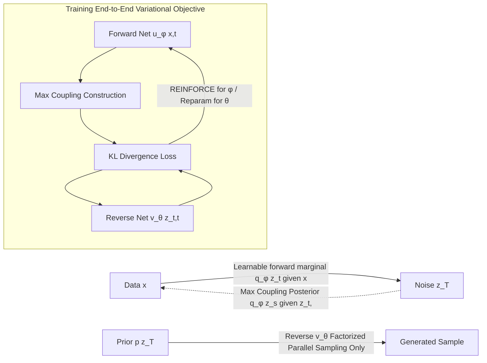

# Forward-Learned Discrete Diffusion: Learning how to noise to denoise faster

**Conference**: ICLR 2026  
**OpenReview**: [https://openreview.net/forum?id=45EtKUdgbJ](https://openreview.net/forum?id=45EtKUdgbJ)  
**Code**: To be confirmed  
**Area**: Generative Models / Discrete Diffusion  
**Keywords**: Discrete Diffusion, Learnable Forward Process, Few-step Generation, Non-Markovian, Maximum Coupling, REINFORCE  

## TL;DR
Instead of struggling to make a factorized reverse process approximate a complex target, FLDD makes the **forward noising process learnable**. This ensures the induced reverse target is factorized and easily matched by existing samplers, reducing discrete diffusion sampling from hundreds of steps to 10 without changing the sampler or increasing inference overhead.

## Background & Motivation
- **Background**: Discrete diffusion performs strongly in domains like text, molecules, and images. For efficient parallel sampling, the reverse (generative) process is typically parameterized as a **factorized distribution** $p_\theta(z_s|z_t)=\prod_i p_\theta(z_s^i|z_t)$, allowing all coordinates to be updated in parallel.
- **Limitations of Prior Work**: Continuous diffusion can learn deterministic trajectories connecting noise and data via generative ODEs for few-step generation. However, discrete spaces **lack** such continuous deterministic trajectories. Distillation and consistency acceleration techniques cannot be directly transferred. Consequently, discrete diffusion often requires $T$ steps comparable to the sequence length $D$, making inference slow and expensive.
- **Key Challenge**: Given a fixed forward process, the true target for the reverse process is the marginalized posterior $q(z_s|z_t)=\mathbb{E}_{q(x|z_t)}[q(z_s|z_t,x)]$ (Eq. 6). This is **generally non-factorized**, especially when $T$ is small. Factorized reverse models cannot match this non-factorized target, leading to failure in few-step training. Increasing reverse model flexibility would sacrifice parallel sampling efficiency.
- **Goal**: Narrow the gap between the target $q(z_s|z_t)$ and the model $p_\theta(z_s|z_t)$ to achieve few-step generation **without modifying the reverse process or increasing inference overhead**.
- **Core Idea**: **Change the forward process rather than the reverse.** Since the forward process implicitly defines the reverse target, the forward process is made learnable to adapt itself into a "factorized form that the reverse model can match." Two intuitive examples: a mixture of Gaussians cannot be sampled in one factorized step, but **can in two steps** (first sample the component index, then the Gaussian); a discrete random walk is modelable in $D$ steps or two steps (prefix sums of independent $\pm1$). Crucially, these "good intermediate structures" depend on the data distribution, so they should be **learned from data**.

## Method

### Overall Architecture
FLDD keeps the standard factorized reverse sampler and variational objective of discrete diffusion completely unchanged. The only modification is replacing the "fixed Markovian" forward process with a "learnable non-Markovian process." During training, the forward network $u_\phi$ and reverse network $v_\theta$ are optimized end-to-end to minimize the same variational lower bound: the reverse process adapts to the forward, while the forward process adapts to the reverse. This forces the forward process to produce a factorized reverse target. The forward network is not needed during inference, resulting in zero extra overhead.

### Key Designs

**1. Non-Markovian Learnable Forward: Moving the target within reach.** Training only requires efficient sampling from the marginal $q(z_t|x)$ and an analytic posterior $q(z_s|z_t,x)$ for KL calculation. The forward process is redefined from a Markovian form to a non-Markovian form $q(z_{0:T}|x)=q(z_T|x)\prod_t q(z_s|z_t,x)$ (Eq. 8), where marginals $q_\phi(z_t|x)$ and posteriors $q_\phi(z_s|z_t,x)$ are learnable via parameters $\phi$. Flexible parameterization allows finding $\phi$ such that the induced target $q_\phi(z_s|z_t)$ (Eq. 6) becomes factorized.

**2. Factorized Forward Marginals: Global awareness for coordinate noising.** Forward marginals follow the same factorized form as the generative model: $q_\phi(z_t|x)=\prod_i q_\phi(z_t^i|x)$, where $q_\phi(z_t^i|x)=\mathrm{Cat}(z_t^i; u_\phi^i(x,t))$ (Eq. 9). The essential difference from conventional discrete diffusion is that the noising distribution for each coordinate $z_t^i$ depends on the **entire data point $x$ rather than just $x_i$**. Boundary conditions $q_\phi(z_0|x)=\delta(z_0-x)$ and $q_\phi(z_T|x)=p(z_T)$ are ensured via reparameterization of $u_\phi$.

**3. Maximum Coupling Posterior: Non-parametric probability mass transport.** The posterior must be analytic and consistent with marginals, i.e., $q_\phi(z_s|x)=\int q_\phi(z_t|x)q_\phi(z_s|z_t,x)\,dz_t$ (Eq. 10). FLDD uses the Maximum Coupling technique to construct this coordinate-wise: when moving mass from $u_t$ to $u_s$, it **minimizes changes**. For $z_t=k$, if $u_s^k\ge u_t^k$, it keeps $z_s=z_t$; if $u_s^k<u_t^k$, the excess mass $u_t^k-u_s^k$ is redistributed according to the deficit $m_{s|t}=\frac{\min(0,u_s-u_t)}{\|\min(0,u_s-u_t)\|}$ (Eq. 11). This allows forward trajectories to have complex non-linear dependence on the whole $x$ while remaining computationally efficient.

**4. REINFORCE Optimization + Relaxation Warmup: Overcoming discrete non-differentiability.** While $\theta$ is optimized via reparameterization, gradients for $\phi$ involve discrete $z_t$. FLDD uses REINFORCE (Eq. 13) to obtain unbiased Monte Carlo estimates. Since REINFORCE has high variance, **relaxation warmup** is introduced: Concrete/Gumbel-Softmax provides a continuous relaxation $\bar q_{\tau,\phi}(\bar z_t|x)$, and the posterior is computed as a weighted combination. The temperature $\tau$ is exponentially annealed from $1$ to $10^{-3}$ over $10^4\sim10^5$ steps before switching to REINFORCE. Note: conventional "predict $\hat x$ and resample" tricks are inapplicable here as $q_\phi(x|z_t)$ is generally non-factorized.

## Key Experimental Results

Framework positioning: FLDD is a general framework for reducing sampling steps. The goal is higher sample quality **given a step budget under the same reverse parameterization**.

### Main Results

ROCStories Text Generation (Table 1):

| Method | MAUVE ↑ | PPL ↓ | Div ↑ |
|------|---------|-------|-------|
| GPT2 | 0.789 | 20.5 | 0.252 |
| SEDD | 0.598 | 70.8 | 0.336 |
| COSMOS | 0.940 | 26.3 | 0.346 |
| **FLDD, T=100** | 0.538 | 55.2 | 0.280 |
| **FLDD, T=10** | 0.511 | 60.5 | 0.285 |

Molecule Generation QM9 / ZINC250k (Table 2):

| Method | QM9 Valid↑ | QM9 FCD↓ | ZINC Valid↑ | ZINC FCD↓ |
|------|-----------|----------|-------------|-----------|
| GDSS | 95.72 | 2.900 | 97.01 | 14.656 |
| Dirichlet FM | 99.10 | 0.888 | 97.52 | 14.222 |
| CatFlow | 99.81 | 0.441 | 99.21 | 13.211 |
| **FLDD, T=100** | 99.67 | 0.328 | 97.79 | 8.487 |
| **FLDD, T=10** | 99.08 | 0.385 | 96.77 | 10.414 |

### Ablation Study

| Setting | Observation |
|------|------|
| 2D Toy Data (GMM, 2 steps) | Model automatically generates factorized intermediate structures before the final mixture, validating the ability to learn suitable intermediate distributions. |
| Binarized MNIST, T=4 | Normal MDM uses uniform unmasking, leading to unnatural few-step samples. FLDD learns a data-aware mask schedule (unmasking low-correlation tokens first), producing realistic images in 4 steps. |
| T=100 vs T=10 | FLDD shows only slight degradation when dropping from 100 to 10 steps, whereas standard diffusion fails to generate realistic samples at 10 steps. |

### Key Findings
- **Quality-Latency Trade-off**: FLDD at T=10 remains close to T=100 performance, while other discrete diffusion models collapse. On ZINC250k, FLDD's FCD (8.487) significantly outperforms many T=100 baselines.
- **Benefits for Masked Diffusion**: By restricting the forward process to masking probabilities conditioned on the whole image, FLDD learns data-aware scheduling that prioritizes unmasking low-correlation tokens.
- Some baselines outperform FLDD at T=100, which authors attribute to unoptimized hyperparameters and the use of direct $q_\phi(z_s|z_t)$ parameterization—known to be sub-optimal—rather than a flaw in the framework.

## Highlights & Insights
- **Perspective Reversal**: Reframes the problem from "forcing the reverse to chase a complex target" to "reshaping the target into something the reverse can easily reach." It requires no changes to the sampler and zero extra inference cost.
- **Global Data-Dependent Noising**: Unlike standard diffusion where coordinate corruption depends only on time, FLDD allows noising to depend on the entire $x$. This global awareness allows the noise schedule to encode the data's correlation structure.
- **Maximum Coupling**: This non-parametric posterior ensures marginal consistency using only vector operations, elegantly bypassing the difficulty of having a learnable forward posterior that is both analytic and consistent.
- The framework is orthogonal to existing extensions (text, molecules, masking) and serves as a plug-and-play acceleration method.

## Limitations & Future Work
- **REINFORCE Reliance**: High-variance gradients for $\phi$ require Concrete relaxation warmup for stability. Training complexity is a concern.
- **Parameter Overhead**: While it does not increase inference cost, the forward network doubles the number of parameters and increases training compute/memory.
- **Sub-optimal Reverse Parameterization**: FLDD is forced to directly parameterize $q_\phi(z_s|z_t)$ instead of the superior "predict $\hat x$ and resample" approach, limiting parity with SOTA at T=100.
- **Forward Parameterization**: The choice of marginals and posteriors is not exhaustive. Autoregressive marginals or optimal transport-based posteriors remain unexplored.

## Related Work & Insights
- **Learnable Forward Processes**: Neural Flow Diffusion Models (Bartosh et al., 2024) showed this helps in continuous domains; FLDD extends this to the discrete domain using non-Markovian parameterization.
- **Discrete Diffusion Acceleration**: While continuous domains use distillation/consistency (Salimans 2024), FLDD achieves few-step generation by reshaping the training target's "shape."
- **Insight**: When model capacity is limited by efficiency constraints, "reshaping the target to fit the model's range" is often more effective than "expanding the model."

## Rating
- Novelty: ⭐⭐⭐⭐ Clean and rare reframing of the forward process for discrete domains.
- Experimental Thoroughness: ⭐⭐⭐ Covers multiple domains but lacks system-wide tuning and ablation on REINFORCE variance or alternative forward choices.
- Writing Quality: ⭐⭐⭐⭐ Motivations are clear, intuitive examples are effective, and the "why" of few-step feasibility is well-explained.
- Value: ⭐⭐⭐⭐ Provides a general, inference-free acceleration path for discrete diffusion with strong practical implications.

<!-- RELATED:START -->

## Related Papers

- [\[ICLR 2026\] ReDDiT: Rehashing Noise for Discrete Visual Generation](reddit_rehashing_noise_for_discrete_visual_generation.md)
- [\[ICLR 2026\] Consolidating Reinforcement Learning for Multimodal Discrete Diffusion Models](consolidating_reinforcement_learning_for_multimodal_discrete_diffusion_models.md)
- [\[ICML 2026\] Adapting Noise to Data: Generative Flows from Learned 1D Processes](../../ICML2026/image_generation/adapting_noise_to_data_generative_flows_from_1d_processes.md)
- [\[ICLR 2026\] Flow Matching with Injected Noise for Offline-to-Online Reinforcement Learning](flow_matching_with_injected_noise_for_offline-to-online_reinforcement_learning.md)
- [\[ICLR 2026\] Loopholing Discrete Diffusion: Deterministic Bypass of the Sampling Wall](loopholing_discrete_diffusion_deterministic_bypass_of_the_sampling_wall.md)

<!-- RELATED:END -->
