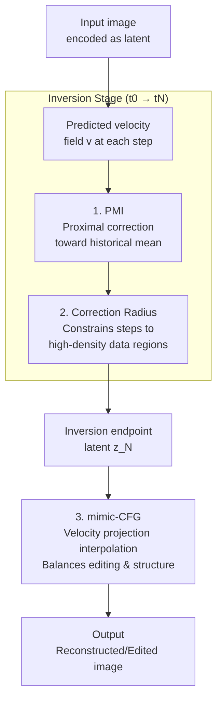

# Free Lunch for Stabilizing Rectified Flow Inversion

**Conference**: ICLR 2026  
**arXiv**: [2602.11850](https://arxiv.org/abs/2602.11850)  
**Code**: None  
**Area**: Diffusion Models/Image Editing  
**Keywords**: Rectified Flow, Inversion Stability, Proximal-Mean Inversion, Image Editing, Velocity Field Correction

## TL;DR
Two training-free methods, PMI (Proximal-Mean Inversion) and mimic-CFG, are proposed to stabilize Rectified Flow inversion by performing proximal gradient correction of the velocity field toward its historical mean, achieving SOTA reconstruction and editing quality with fewer NFE on PIE-Bench.

## Background & Motivation

**Background**: Rectified Flow (RF) models (e.g., FLUX, Wan) have become strong alternatives to diffusion models, as their learned near-constant velocity fields enable faster and more stable sampling. The training-free inversion capability of RF supports downstream tasks such as reconstruction and editing.

**Limitations of Prior Work**: Inevitable approximation errors during inversion accumulate across timesteps. Theory has proven that ODE mappings are inherently unstable in high-dimensional spaces (the probability that the geometric mean instability coefficient > 1 approaches 1 as dimensionality increases), where small latent perturbations lead to large reconstruction errors. Existing methods like RF-Solver and FireFlow mitigate this by increasing steps/NFE, which is computationally expensive.

**Key Challenge**: Inversion precision requires more steps (and computation), but practical applications demand efficiency (fewer steps). Velocity field perturbations are amplified by instability during inversion, yet completely eliminating these perturbations is impossible.

**Goal**: How to stabilize the perturbed velocity field during inversion without increasing NFE?

**Key Insight**: The RF training objective produces a near-constant velocity field; therefore, the moving average of historical velocities can serve as a stable reference direction. Proximal optimization is used to pull the current velocity toward the mean direction while constraining the correction step within a theoretically derived spherical Gaussian range.

**Core Idea**: Use the historical mean of the velocity field for proximal gradient correction to stabilize RF inversion. During editing, apply mimic-CFG for velocity projection interpolation to balance editing strength and structural preservation.

## Method

### Overall Architecture
The paper addresses the issue of "error accumulation across timesteps amplified by high-dimensional instability" in RF inversion without resorting to increasing steps like RF-Solver or FireFlow. The approach leverages the property that RF training objectives produce near-constant velocity fields, treating the moving average of historical velocities as a stable reference direction to correct the velocity field without additional network calls. The pipeline consists of two stages: the inversion stage ($t_0 \to t_N$) uses PMI for proximal gradient correction of predicted velocities with a theoretically derived correction radius, and the editing/reconstruction stage ($t_N \to t_0$) uses mimic-CFG for velocity projection interpolation. Both are zero-cost and plug-and-play for any RF model.

### Key Designs

**1. Proximal-Mean Inversion (PMI): Proximal Correction of Perturbed Velocity via Historical Mean**

The root of inversion instability is the amplification of approximation errors by high-dimensional ODE mappings. PMI responds by finding a reliable "anchor" for predicted velocities at each step: the weighted moving average of historical velocities $\bar{\mathbf{v}}_{t_k} = \frac{1}{t_{k+1}-t_0}\sum_{i=0}^{k}(t_{i+1}-t_i)\mathbf{v}_{t_i}$. Given the near-constant velocity field of RF, this mean direction is naturally stable. The correction is formulated as a proximal optimization objective:

$$F(\mathbf{v}) = \|\mathbf{v} - \mathbf{v}_{t_{k-1}}\|_1 + \frac{1}{2\lambda}\|\mathbf{v} - \bar{\mathbf{v}}_{t_k}\|_2^2$$

The $L_1$ term constrains the current velocity to remain close to the previous step (local consistency), while the $L_2$ term pulls it toward the historical mean (global consistency). A closed-form update is derived using first-order Taylor approximation: $\hat{\mathbf{v}}_{t_k} = \mathbf{v}_{t_k} - r_{t_k}\frac{\nabla F(\mathbf{v}_{t_k})}{\|\nabla F(\mathbf{v}_{t_k})\|_2}$, where the step size is controlled by the correction radius $r_{t_k}$. This requires only a mean accumulator and one closed-form update, adding zero NFE.

**2. Theoretical Derivation of Correction Radius: Constraining Steps to High-Density Regions**

The step size $r_i$ in PMI cannot be arbitrary; excessive steps deviate from the data manifold into low-density regions, while insufficient steps fail to stabilize the field. Using Proposition 1 derived from concentration inequalities of high-dimensional Gaussian distributions, the safety radius is defined as:

$$r_i = \sqrt{2n + 3\sqrt{2n}} \cdot \frac{\Delta t_i}{T} + \epsilon$$

Where $n$ is the latent dimension and $\Delta t_i$ is the current step size. This ensures the corrected velocity remains within the high-density range of the spherical Gaussian, transforming empirical tuning into a theoretically calculated value.

**3. mimic-CFG: Balancing Editing Strength and Structure via Velocity Projection Interpolation**

In the editing stage, the conflict is between "noticeable changes" and "structural preservation." mimic-CFG first projects the current velocity onto the historical mean direction of the edit:

$$\bar{\mathbf{v}}_{t_k}^{\text{proj}} = \frac{\mathbf{v}_{t_k}^\top \bar{\mathbf{v}}_{t_k}^{\text{edit}}}{\|\bar{\mathbf{v}}_{t_k}^{\text{edit}}\|_2^2}\bar{\mathbf{v}}_{t_k}^{\text{edit}}$$

Then, linear interpolation is performed: $\hat{\mathbf{v}}_{t_k} = (1-w)\bar{\mathbf{v}}_{t_k}^{\text{proj}} + w \cdot \mathbf{v}_{t_k}$, where $w$ adjusts editing intensity. This is named "mimic-CFG" because its structure is isomorphic to Classifier-Free Guidance: the projected component acts like the "unconditional" direction for structure preservation, while the original velocity acts like the "conditional" direction for editing.

### Loss & Training
The method is entirely training-free and only modifies the velocity field during inference. PMI performs a proximal gradient update, and mimic-CFG performs velocity projection plus linear interpolation; neither increases NFE.

## Key Experimental Results

### Main Results
On PIE-Bench (700 editing tasks) using the FLUX model:

| Method | PSNR↑ | LPIPS↓ | Struct. Dist.↓ | CLIP Sim.↑ | NFE |
|------|-------|--------|----------|------------|-----|
| DDIM Inversion | Baseline | Baseline | Baseline | Baseline | N |
| RF-Solver | Good | Good | Good | Good | 2N |
| FireFlow | Good | Good | Good | Good | 2N |
| Baseline + PMI | **Better** | **Better** | **Better** | **Better** | N |
| Baseline + PMI + mimic-CFG | **SOTA** | **SOTA** | **SOTA** | **SOTA** | N |

### Ablation Study

| Configuration | PSNR↑ | Description |
|------|-------|------|
| No Correction | Baseline | Original Inversion |
| PMI (L1 Norm) | **Optimal** | Full Scheme |
| PMI (L2 Norm) | Sub-optimal | L2 is inferior to L1 |
| PMI (L∞ Norm) | Fair | Sparse correction |
| Prompt-free Recon. | Inversion Quality | Excludes prompt interference |

### Key Findings
- PMI adds zero NFE but significantly improves PSNR (+2-3dB), proving to be a genuine "free lunch."
- The $L_1$ norm performs best in the proximal objective, likely because it provides more moderate sparse correction.
- Evaluating inversion quality under prompt-free conditions is a key contribution, isolating stability from prompt alignment.
- The weight $w$ in mimic-CFG provides intuitive control over editing intensity.

## Highlights & Insights
- **"Free Lunch" is Truly Free**: PMI only requires a velocity mean accumulator and a closed-form update, achieving zero-cost quality improvement.
- **Theory-Driven Correction Radius**: Instead of arbitrary hyperparameter tuning, safe correction ranges are derived from instability theorems.
- **Elegant Analogy for mimic-CFG**: Analogizing velocity projection to CFG provides clear intuition and ease of control.
- **Prompt-free Evaluation**: A methodology proposed to measure inversion stability more purely.

## Limitations & Future Work
- Hyperparameters such as $\lambda$ and $\epsilon$ require tuning, though the paper provides reasonable defaults.
- The theoretical assumption of a near-constant velocity field may not hold for under-trained RF models.
- The weight $w$ might require different settings for varied editing types.
- Validation is limited to image editing; video/3D scenarios remain unexplored.

## Related Work & Insights
- **vs RF-Solver/FireFlow**: These increase precision via high-order expansion or iterative steps but increase NFE. PMI can be stacked with them without additional NFE.
- **vs Direct Inversion**: Direct Inversion separates source/target diffusion for preservation; mimic-CFG achieves similar effects more light-weightily via projection.
- **vs FlowEdit**: FlowEdit constructs a direct ODE, bypassing inversion. PMI + mimic-CFG retains inversion flexibility.

## Rating
- Novelty: ⭐⭐⭐⭐ Innovative use of proximal optimization for field stability.
- Experimental Thoroughness: ⭐⭐⭐⭐ Comprehensive PIE-Bench evaluation and prompt-free tests.
- Writing Quality: ⭐⭐⭐⭐⭐ Clear theoretical derivation and algorithm pseudocode.
- Value: ⭐⭐⭐⭐⭐ High practical utility for RF-based editing.

<!-- RELATED:START -->

## Related Papers

- [\[ICLR 2026\] FlowAlign: Trajectory-Regularized, Inversion-Free Flow-based Image Editing](flowalign_trajectory-regularized_inversion-free_flow-based_image_editing.md)
- [\[ICML 2025\] Taming Rectified Flow for Inversion and Editing](../../ICML2025/image_generation/taming_rectified_flow_for_inversion_and_editing.md)
- [\[ICLR 2026\] Flow Straight and Fast in Hilbert Space: Functional Rectified Flow](flow_straight_and_fast_in_hilbert_space_functional_rectified_flow.md)
- [\[ICLR 2026\] UniEdit-Flow: Unleashing Inversion and Editing in the Era of Flow Models](uniedit-flow_unleashing_inversion_and_editing_in_the_era_of_flow_models.md)
- [\[ICCV 2025\] FlowEdit: Inversion-Free Text-Based Editing Using Pre-Trained Flow Models](../../ICCV2025/image_generation/flowedit_inversion-free_text-based_editing_using_pre-trained_flow_models.md)

<!-- RELATED:END -->
