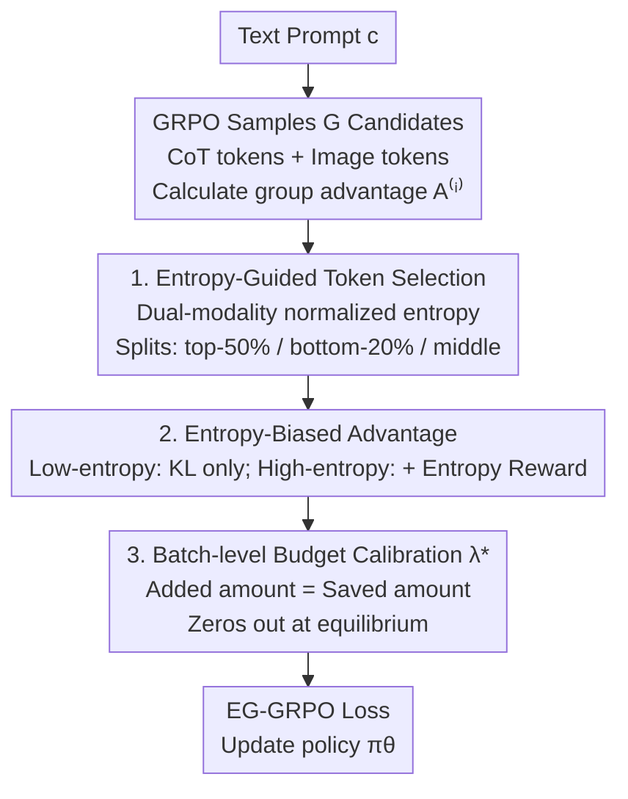

# From Broad Exploration to Stable Synthesis: Entropy-Guided Optimization for Autoregressive Image Generation

**Conference**: ICLR 2026  
**OpenReview**: [https://openreview.net/forum?id=NCLjpR2MDq](https://openreview.net/forum?id=NCLjpR2MDq)  
**Code**: https://github.com/minebetter/EG-GRPO  
**Area**: Image Generation / Autoregressive T2I / RL Alignment  
**Keywords**: Text-to-Image Generation, Autoregressive Generation, GRPO, Entropy, Chain-of-Thought

## TL;DR
This paper quantifies the division of labor between CoT and RL in autoregressive T2I using "entropy"—CoT expands the exploration space while RL contracts it toward high-reward regions. Observing that reward is strongly negatively correlated with the mean and variance of image token entropy, the authors propose EG-GRPO: reallocating optimization budgets based on token entropy (low-entropy tokens follow KL for stability, while high-entropy tokens receive entropy rewards for structured exploration). It achieves SOTA on T2I-CompBench and WISE.

## Background & Motivation

**Background**: Autoregressive T2I models (e.g., Janus-Pro, Parti) encode images into discrete token sequences and perform token-by-token prediction. Recent trends involve adding two components: Chain-of-Thought (CoT) for semantic planning and Reinforcement Learning (group-relative methods like GRPO) to directly optimize human preferences or task rewards. CoT+RL effectively improves compositional generalization and alignment quality.

**Limitations of Prior Work**: How "CoT exploration" and "RL optimization" interact and how this interaction affects generation uncertainty and stability remains poorly understood. Consequently, RL broadcasts the same group-relative advantage $A^{(i)}$ indiscriminately to all tokens in a sequence—repeatedly applying reward gradients to already confident (low-entropy) tokens (risking catastrophic forgetting of learned knowledge) while failing to concentrate optimization on high-entropy tokens that truly need uncertainty reduction.

**Key Challenge**: T2I must balance "exploration for diversity" with "exploitation for alignment fidelity" while maintaining stability across repeated samplings. The equal-weighted per-token updates in GRPO are imprecise for both goals—they do not distinguish token confidence nor provide an explicit mechanism to suppress instability.

**Goal**: (1) Quantify the CoT–RL interaction using measurable metrics; (2) Design a token-level GRPO variant that reallocates budgets based on uncertainty without breaking the original convergence properties.

**Key Insight**: The authors use Shannon entropy to quantify token-level uncertainty in both modalities—textual CoT tokens and image tokens—observing distributions in a 2D "Mean Entropy × Reward" space. Three empirical findings support the method: ① CoT expands entropy distributions (exploration), while RL contracts and shifts them left (exploitation); ② Final rewards are **strongly negatively correlated with the mean and standard deviation** of image token entropy (with higher std strengthening the negative correlation with mean entropy); ③ Textual CoT entropy determines downstream image quality—low-entropy CoT produces more compact, higher-reward image clusters.

**Core Idea**: Since reward $\approx$ reducing "uncertainty (mean entropy) + instability (entropy std)," the optimization budget should not be flattened across all tokens. Instead, **reallocate based on entropy**: protect low-entropy tokens and concentrate reward-driven updates on high-entropy tokens, adding an entropy reward to the latter to promote "structured exploration without collapse."

## Method

### Overall Architecture

EG-GRPO (Entropy-Guided GRPO) is a token-level modification of GRPO that retains its group-relative structure but shifts update budgets from "confident tokens" to "uncertain tokens." Given a prompt, the policy $\pi_\theta$ samples $G$ sequences (each containing text CoT + image tokens) and computes group-relative advantages $A^{(i)}$. It then **independently calculates** normalized Shannon entropy $\bar H^{(i)}_t = H^{(i)}_t / \log|V| \in [0,1]$ for each modality, categorizing tokens into high (top-50%), low (bottom-20%), and middle sets per sequence. Two masks are used to rewrite the advantage coefficients broadcast to each token—low-entropy tokens lose the reward-driven term (keeping only KL), and high-entropy tokens receive an entropy reward on top of the advantage. Finally, a **batch-level calibration coefficient** $\lambda^\star$ binds the "added amount" at high entropy to the "saved amount" at low entropy, ensuring the total batch update scale matches GRPO and the reward automatically nulls at the GRPO equilibrium point.

### Key Designs

**1. Entropy-guided token selection: Categorizing tokens by uncertainty to decide what to optimize vs. protect**

GRPO broadcasts the same sequence-level advantage $A^{(i)}$ to all tokens equally, applying reward gradients even to highly confident tokens, which wastes budget and may bias learned knowledge. Ours first quantifies "confidence": for the $t$-th token in sequence $i$, the normalized entropy is $\bar H^{(i)}_t = H^{(i)}_t/\log|V|$. Sorting occurs **independently for text CoT and image token modalities** to find per-sequence percentiles: high-entropy set $S_{hi}$ (top-50%), low-entropy set $S_{lo}$ (bottom-20%), and middle $S_{mid}$ (remaining 30%). Two masks are introduced: $M^{(i)}_t = \mathbb{I}[t \notin S_{lo}]$ (removes reward-driven updates for low-entropy tokens) and $U^{(i)}_t = \mathbb{I}[t \in S_{hi}]$ (marks tokens for entropy rewards). Independent sorting prevents high-entropy tokens of one modality from being overshadowed by the other.

**2. Entropy-biased advantage: Low-entropy tokens use KL for stability; high-entropy tokens use entropy rewards for structured exploration**

The broadcast coefficient $A^{(i)}$ is rewritten into a token-level version:

$$\tilde A^{(i)}_t = M^{(i)}_t\, A^{(i)} + U^{(i)}_t\, \lambda\, \mathrm{sg}\!\left[\bar H^{(i)}_t\right],$$

where $\mathrm{sg}[\cdot]$ denotes stop-gradient. Each part serves a purpose: when $M^{(i)}_t=0$ (lowest 20% tokens), the reward gradient vanishes, and the token is only constrained by KL-to-reference, "freezing" confident regions to prevent drift. When $U^{(i)}_t=1$ (highest 50% tokens), an additional term $\lambda\,\bar H^{(i)}_t$ is added to the advantage—higher entropy leads to a larger reward, strengthening positive updates and weakening negative ones, which suppresses uncertainty under softmax parameterization. The final loss substitutes $\tilde A^{(i)}_t$ back into GRPO:

$$L_{\text{EG-GRPO}}(\theta) = -\frac{1}{G}\sum_{i=1}^{G}\frac{1}{T^{(i)}}\sum_{t=1}^{T^{(i)}} \tilde A^{(i)}_t \log \pi_\theta\!\left(o^{(i)}_t \mid c, o^{(i)}_{<t}\right) + \beta\, D_{\mathrm{KL}}(\pi_\theta \,\Vert\, \pi_{\mathrm{ref}}).$$

**3. Batch-level budget calibration and equilibrium zeroing: Keeping updates close to GRPO without altering convergence points**

Additive entropy rewards introduce new update scales. To maintain stability, $\lambda$ is constrained by budget conservation: the quality saved from low-entropy tokens ($\approx p_{lo}|A^{(i)}|$) is re-invested into high-entropy tokens. Specifically (Proposition 1):

$$\lambda^\star = \kappa \cdot \frac{\sum_{i\in\mathcal B} |A^{(i)}| \cdot \frac{1}{T^{(i)}}\sum_{t\in S_{lo}} 1}{\sum_{i\in\mathcal B} \frac{1}{T^{(i)}}\sum_{t\in S_{hi}} \mathrm{sg}[\bar H^{(i)}_t]},\quad \kappa \in (0,1],$$

ensuring $\mathbb{E}[B^{(i)}_{\text{EG}}] \approx \kappa\,\mathbb{E}[B^{(i)}_{\text{GRPO}}]$. Crucially, since $\lambda^\star \propto \sum_i |A^{(i)}|$, at the GRPO equilibrium point where $A^{(i)}\equiv 0$, $\lambda^\star=0$ and the entropy reward vanishes, reverting EG-GRPO to pure KL regularization (Corollary 5.1). This **preserves all stationary points of the base goal**.

### Loss & Training
The objective is $L_{\text{EG-GRPO}}$ with $\beta=0.01$. The backbone is Janus-Pro-7B ($LR=1\times10^{-6}$). Training uses 6,786 prompts from T2I-CompBench (text-only, with GPT-4o mini extracted object-attribute labels). The reward pipeline combines HPS, GroundingDINO, GIT, and a custom object-relation module tuned via LLaVA-OneVision-7B.

## Key Experimental Results

### Main Results

EG-GRPO surpasses the strong baseline T2I-R1 on T2I-CompBench and WISE, with the most significant gains in Shape:

| Dataset/Category | Metric | EG-GRPO | T2I-R1 (Prev. SOTA) | Gain |
|--------|------|------|----------|------|
| T2I-CompBench · Color | Score | 84.11 | 82.58 | +1.53 |
| T2I-CompBench · Shape | Score | 60.88 | 58.67 | +2.21 |
| T2I-CompBench · Texture | Score | 77.38 | 76.94 | +0.44 |
| WISE · Culture | Score | 49.00 | 48.00 | +1.00 |
| WISE · Spatio-temporal | Score | 56.00 | 55.50 | +0.50 |
| WISE · Science | Score | 46.33 | 45.00 | +1.33 |

Compared to the base Janus-Pro-7B (Color/Shape/Texture: 63.59/35.28/49.36), CoT+RL provides a massive boost, which EG-GRPO further stabilizes.

### Ablation Study

Entropy guidance on only a single modality performs worse, sometimes even lower than the baseline:

| Configuration | Color | Shape | Texture | Description |
|------|---------|---------|---------|------|
| EG-GRPO (Full) | 84.11 | 60.88 | 77.38 | Both CoT and image tokens |
| w/ only sem (CoT tokens) | 81.29 | 55.68 | 74.10 | Only text modality |
| w/ only tok (image tokens) | 79.25 | 53.73 | 72.46 | Only image modality |
| w/o All (=T2I-R1) | 82.58 | 58.67 | 76.94 | Standard GRPO baseline |

Notably, `w/ only tok` (79.25) is worse than `w/o All` (82.58), suggesting that single-modality entropy regularization creates inter-modal imbalances.

### Key Findings
- **Dual modalities are essential**: Controlling only one modality drops performance below the base GRPO, confirming that uncertainty at both the planning (text) and decoding (vision) ends must be managed.
- **Reducing entropy does not sacrifice diversity**: The Vendi Score remains stable compared to T2I-R1 on quality-matched subsets (2.593 vs 2.592). Entropy rewards suppress "bad instability" rather than semantic diversity.
- **Analysis-driven design**: Reward is strongly correlated with image entropy std (slope −1.049); focusing on high-std/high-entropy "unconverged zones" is the most efficient strategy.

## Highlights & Insights
- **Quantifying the CoT vs RL division of labor**: CoT expands exploration (entropy increase), while RL enforces exploitation (entropy decrease). This "distribution evolution in entropy-reward space" is a transferable diagnostic tool.
- **Budget conservation + equilibrium zeroing**: Re-investing savings from low-entropy tokens into high-entropy tokens ensures stability while preserving stationary points.
- **Stop-gradient entropy rewards**: Using $\mathrm{sg}[\bar H]$ as a coefficient prevents the model from artificially inflating entropy to game the reward, forcing it to act purely as a gradient-weighting mechanism.

## Limitations & Future Work
- Only validated on Janus-Pro-7B (discrete latent); effectiveness on continuous tokens or diffusion models is unknown.
- Fixed splitting ratios (50%/20%/30%) lack sensitivity analysis; optimal thresholds may vary by task.
- Gains in some WISE categories (e.g., Spatio-temporal) are marginal.
- Calibration $\lambda^\star$ relies on batch statistics of $|A^{(i)}|$, which might be noisy for small batches or low reward variance.

## Related Work & Insights
- **vs T2I-R1 / Standard GRPO**: T2I-R1 broadcasts advantages to all tokens. Ours reallocates the budget based on entropy without changing reward sources, serving as a "refined" plugin on top of T2I-R1.
- **vs Visual-CoG / ReasonGen-R1**: These rely on stage-aware rewards or rationale data. Ours uses "entropy" as an intrinsic signal without extra annotation.
- **vs PromptEnhancer**: PromptEnhancer modifies inputs; ours modifies the generator's token-level RL objective.

## Rating
- Novelty: ⭐⭐⭐⭐ Reallocating GRPO budgets via entropy-quantified CoT-RL labor is a novel perspective.
- Experimental Thoroughness: ⭐⭐⭐⭐ Solid benchmarks and multimodal ablations, though limited to a single backbone.
- Writing Quality: ⭐⭐⭐⭐ Clear "analysis-first" structure with rigorous propositions.
- Value: ⭐⭐⭐⭐ A lightweight, non-breaking optimization plugin for CoT+RL image generation with significant diagnostic value.

<!-- RELATED:START -->

## Related Papers

- [\[ICLR 2026\] SoftCFG: Uncertainty-guided Stable Guidance for Visual Autoregressive Model](softcfg_uncertainty-guided_stable_guidance_for_visual_autoregressive_model.md)
- [\[ICLR 2026\] Group Critical-token Policy Optimization for Autoregressive Image Generation](group_critical-token_policy_optimization_for_autoregressive_image_generation.md)
- [\[ICLR 2026\] ToProVAR: Efficient Visual Autoregressive Modeling via Tri-Dimensional Entropy-Aware Semantic Analysis and Sparsity Optimization](toprovar_efficient_visual_autoregressive_modeling_via_tri-dimensional_entropy-aw.md)
- [\[ICLR 2026\] Visual Autoregressive Modeling for Instruction-Guided Image Editing](visual_autoregressive_modeling_for_instruction-guided_image_editing.md)
- [\[ICLR 2026\] Diverse Text-to-Image Generation via Contrastive Noise Optimization](diverse_text-to-image_generation_via_contrastive_noise_optimization.md)

<!-- RELATED:END -->
