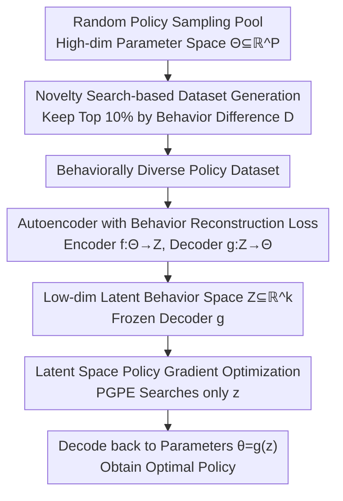

# From Parameters to Behaviors: Unsupervised Compression of the Policy Space

**Conference**: ICLR 2026  
**arXiv**: [2509.22566](https://arxiv.org/abs/2509.22566)  
**Code**: [GitHub](https://github.com/DavideTenediniPoliMi/from-parameters-to-behaviors-unsupervised-compression-of-the-policy-space)  
**Area**: Image Generation  
**Keywords**: Policy space compression, behavior manifold, autoencoder, latent space optimization, unsupervised pre-training

## TL;DR

Proposes unsupervised compression of the policy space based on the manifold hypothesis—training an autoencoder with behavior reconstruction loss (rather than parameter reconstruction loss) to compress the high-dimensional policy parameter space $\Theta \subseteq \mathbb{R}^P$ into a low-dimensional latent behavior space $\mathcal{Z} \subseteq \mathbb{R}^k$ (up to a 121801:1 compression ratio). Validated on environments such as Mountain Car, Reacher, Hopper, and HalfCheetah, it demonstrates that the intrinsic dimension of the behavior manifold depends on environmental complexity rather than network size. Furthermore, PGPE optimization in the latent space achieves faster convergence than SOTA methods like PPO and SAC in 7 out of 8 tasks.

## Background & Motivation

**Background**: The success of Deep Reinforcement Learning (RL) largely depends on the high-dimensional parameterization of policies by deep neural networks. However, this high-dimensional parameterization introduces severe sample inefficiency—policy network parameter spaces may have tens of thousands or even millions of dimensions, yet many different parameter configurations actually produce identical or extremely similar behaviors (state-action distributions).

**Limitations of Prior Work**: (1) High redundancy in the parameter space leads to extremely low search efficiency—agents struggle to search through vast parameter spaces where many directions have no impact on behavior; (2) The problem is exacerbated in multi-task scenarios, where each new task typically requires learning from scratch (tabula rasa), failing to exploit the shared structure of the environment; (3) Existing methods (such as diverse behavior discovery DIAYN, asymmetric actor-critic) only indirectly alleviate these issues without fundamentally addressing parameter space redundancy.

**Key Challenge**: While the parameter dimension $P$ of a policy network can be very large (e.g., $10^5$), the intrinsic dimension of effective behaviors may be minimal (e.g., $1 \sim 16$). Searching for solutions on a low-dimensional manifold within a high-dimensional space is profoundly inefficient.

**Goal**: To learn a generative mapping $g: \mathcal{Z} \to \Theta$ from a low-dimensional latent space to a high-dimensional parameter space such that: (1) the latent space is organized by behavior similarity (rather than parameter similarity), (2) the compression is task-agnostic (unsupervised), and (3) the compressed space supports efficient task-specific optimization.

**Key Insight**: The authors build upon the Manifold Hypothesis—a widely accepted assumption in machine learning that high-dimensional data actually lies on a low-dimensional manifold. Applying this to RL: the behaviors of effective policies lie on a low-dimensional manifold within the parameter space, the dimension of which is determined by the environment's complexity rather than the network's size.

**Core Idea**: Use behavior reconstruction loss (instead of parameter reconstruction loss) to train an autoencoder that compresses the policy parameter space, followed by policy optimization within the learned low-dimensional latent space.

## Method

### Overall Architecture

This paper addresses the issue of "massive parameter space and inefficient search" in deep RL: while policy networks range from thousands to millions of dimensions, the effective degrees of freedom determining behavior may be limited to just a few. The authors follow a two-stage Unsupervised RL (URL) approach: first, **task-agnostic pre-training** to learn a low-dimensional representation of the policy parameter space; second, **task-specific fine-tuning** within this low-dimensional space. The pre-training is divided into three sequential steps: collecting a pool of behavioral diverse policies, compressing these parameters into a latent space using an autoencoder, and finally freezing the decoder to perform optimization via policy gradients in the latent space.

### Key Designs

**1. Novelty Search-based Dataset Generation: Covering Different Regions of the Behavior Manifold**

To learn a meaningful compressed representation, the policy set fed into the autoencoder must be sufficiently diverse **in behavior**. Simple random sampling in the parameter space leads to uneven coverage—many different parameter configurations result in similar behaviors. The authors define a behavior difference metric based on L2 distance in the action space:

$$D(\pi_\theta \| \pi_{\theta'}) = \sqrt{\sum_{i=1}^{M}(\pi_\theta(\cdot|s_i) - \pi_{\theta'}(\cdot|s_i))^2}$$

This evaluates the action discrepancy between two policies over a sampled subset of states. Novelty Search is then employed: each policy is scored based on its average behavioral difference relative to its $k_n$ nearest neighbors, keeping only the top 10% in novelty. This ensures the training set is spread across the behavior manifold rather than clustering in the parameter space.

**2. Autoencoder with Behavior Reconstruction Loss: Organizing Latent Space by "Functional Similarity"**

Compression is performed using a symmetric autoencoder where the encoder $f_\xi: \Theta \to \mathcal{Z}$ maps parameters to a latent space, and the decoder $g_\zeta: \mathcal{Z} \to \Theta$ reconstructs them. Crucially, instead of the traditional parameter reconstruction error $\|\theta - (g \circ f)(\theta)\|^2$—which forces the decoder to replicate redundant parameters exactly—the authors minimize **behavior reconstruction loss**:

$$\mathcal{L}_B = \mathbb{E}_{\theta \sim \mathcal{D}_\Theta}\big[D(\pi_\theta \| \pi_{(g \circ f)(\theta)})\big]$$

In practice, this is approximated using MSE on sampled states:

$$\hat{\mathcal{L}}_B = \frac{1}{NM}\sum_{i=1}^N \sum_{j=1}^M \|\pi_{\theta_i}(s_j) - \pi_{(g \circ f)(\theta_i)}(s_j)\|_2^2$$

This shifts the decoder's objective: it no longer needs to replicate exact parameter values, but only needs to find **any set of parameters that produces the same behavior**. Consequently, the latent space is organized by functional similarity rather than numerical proximity.

**3. Latent Space Policy Gradient Optimization: Reducing $10^5$-dim Search to Low Dimensions**

Once pre-training is complete, the decoder parameters $\zeta^*$ are frozen, making $g_{\zeta^*}$ a deterministic differentiable function. Fine-tuning then occurs only in the low-dimensional latent space. Using the chain rule, standard policy gradients backpropagate through the decoder to the latent variables:

$$\nabla_z J^R(z) = \nabla_z g_{\zeta^*}(z)^\top \nabla_\theta J^R(\theta)$$

This low-dimensional optimization is particularly beneficial for parameter-exploring policy gradient methods like PGPE, which typically suffer from the curse of dimensionality. By operating in a $1 \sim 16$-dimensional latent space, PGPE regains efficiency without necessarily requiring explicit computation of the decoder's Jacobian.

### Loss & Training

The autoencoder is trained using the behavior reconstruction loss $\hat{\mathcal{L}}_B$, calculating action-space MSE via a random batch of states at each gradient step. Hyperparameters (architecture, learning rate, etc.) are kept consistent across all environments, demonstrating the generality of the approach.

## Key Experimental Results

### Main Results: Latent Behavior Compression Quality on Mountain Car (Performance Recovery)

Performance Recovery = Performance of policy decoded from latent space / Performance of original policy in dataset. A value $\geq 1$ indicates recovery or improvement over the original performance.

| Policy Size | Dataset Size | 1D | 2D | 3D |
| :--- | :--- | :--- | :--- | :--- |
| Small (~$10^1$ params) | 50k | 0.64 | 0.93 | **0.94** |
| Medium (~$10^3$ params) | 50k | 0.66 | 1.01 | **1.02** |
| Large (~$10^5$ params) | 50k | **1.02** | 1.01 | 1.01 |
| Medium | 100k | 0.51 | **1.02** | **1.02** |
| Large | 100k | **1.01** | **1.01** | **1.01** |

Large policies achieve a recovery rate of 1.01 even in a 1D latent space (a $10^5:1$ compression ratio), signifying near-perfect behavior retention. Medium policies exceed 1.0 starting from 2D, while small policies exhibit some collapse in 1D.

### Ablation Study: Generalization Performance on HalfCheetah and Hopper

| Environment | Task | 5D Recovery | 8D Recovery | 16D Recovery |
| :--- | :--- | :--- | :--- | :--- |
| Hopper | forward | 1.33 | **1.59** | 1.48 |
| Hopper | backward | **2.66** | 1.29 | 1.20 |
| Hopper | jump | **3.83** | 1.54 | 2.42 |
| HalfCheetah | forward | 1.63 | 1.80 | **1.84** |
| HalfCheetah | backward | 1.27 | 1.52 | **1.72** |
| HalfCheetah | frontflip | 0.54 | 0.74 | **1.20** |
| HalfCheetah | backflip | 0.55 | 0.75 | **1.23** |

On HalfCheetah, increasing latent dimensionality consistently improves recovery rates, suggesting a higher intrinsic manifold dimension. Harder tasks (frontflip/backflip) require 16D to exceed a 1.0 recovery rate.

### Key Findings

- **Extremely High Compression Ratios**: Achieves up to 121801:1 (Large policy to 1D latent space) with near-perfect behavioral preservation, validating the low-dimensionality of the behavior manifold.
- **Manifold Dimension vs. Environment Complexity**: Mountain Car requires 1-2D, Reacher needs 3-5D, and HalfCheetah requires 8-16D, confirming that "intrinsic dimension is determined by the environment, not the network size."
- **Convergence Speed Advantage**: Latent PGPE converges faster than PPO, SAC, TD3, and DDPG in 7 out of 8 tasks, though it does not always reach the global optimum.
- **Dataset Coverage Impacts Fine-tuning Ceiling**: Latent PGPE fails on "height" tasks because the training dataset contained too few high-performing policies for that objective, leading to insufficient learning of that region of the manifold.

## Highlights & Insights

- **Behavior Reconstruction Loss as Core Innovation**: Traditional autoencoders minimize parameter error, but behavior reconstruction loss allows the decoder to find *any* parameterization that yields the same behavior, naturally organizing the latent space by function.
- **Empirical Evidence of Environment-Driven Intrinsic Dimension**: Simple environments (Mountain Car) require low dimensions (1D), while complex ones (HalfCheetah) require higher dimensions (16D). This provides a new perspective for measuring environmental complexity.
- **Paradigmatic Significance of Modular Design**: Each of the three stages (data collection, compression, optimization) can be independently swapped, serving as a blueprint for a new paradigm in RL algorithm design.

## Limitations & Future Work

- **Bottleneck in Pre-training Dataset Coverage**: Fine-tuning performance is bounded by the training set's coverage—if a behavior is missing from the dataset (e.g., the "height" task), it won't be encoded in the latent space.
- **Computational Cost of Policy Dataset Generation**: Generating and evaluating 10k-100k policies is computationally expensive for complex environments like MuJoCo.
- **Unoptimized Autoencoder Architecture**: The paper uses a basic symmetric structure; advanced generative models (e.g., VAEs, Diffusion Models) might further improve compression quality.
- **Limited to Deterministic Policies**: Current research focuses on $\pi: \mathcal{S} \to \mathcal{A}$; learning behavior manifolds for stochastic policies remains an open problem.

## Related Work & Insights

- **vs. Diverse Behavior Discovery (e.g., DIAYN)**: While DIAYN discovers skills, it doesn't explicitly compress the policy space. These are complementary; DIAYN-discovered skills could improve the behavioral coverage of training datasets.
- **vs. Policy Distillation/Network Pruning**: Those methods compress individual task-specific networks. Ours is task-agnostic compression, learning a low-dimensional structure that serves multiple downstream tasks.
- **vs. Policy Space Reduction (Mutti et al., 2022)**: While prior work reduced cardinality (discretization), this work reduces dimensionality (continuous representation), avoiding NP-hard optimization via more relaxed constraints.

## Rating

- Novelty: ⭐⭐⭐⭐⭐ Behavior reconstruction loss combined with empirical validation of the manifold hypothesis in RL offers a fresh and profound approach.
- Experimental Thoroughness: ⭐⭐⭐⭐ Validated across 4 environments with various policy sizes and latent dimensions; however, lacks validation in more complex domains like Atari.
- Writing Quality: ⭐⭐⭐⭐ Clear problem definitions and intuitive diagrams; though some content is repetitive.
- Value: ⭐⭐⭐⭐⭐ Provides a entirely new paradigm for improving RL efficiency with significant potential for future research extensions.

<!-- RELATED:START -->

## Related Papers

- [\[ICLR 2026\] Generalization of Diffusion Models Arises with a Balanced Representation Space](generalization_of_diffusion_models_arises_with_a_balanced_representation_space.md)
- [\[ICLR 2026\] Exploring the Design Space of Transition Matching](exploring_the_design_space_of_transition_matching.md)
- [\[ICLR 2026\] DiffSDA: Unsupervised Diffusion Sequential Disentanglement Across Modalities](diffsda_unsupervised_diffusion_sequential_disentanglement_across_modalities.md)
- [\[ICLR 2026\] Discrete Variational Autoencoding via Policy Search](discrete_variational_autoencoding_via_policy_search.md)
- [\[ICML 2026\] SURF: Separation via Unsupervised Remixing Flow](../../ICML2026/image_generation/surf_separation_via_unsupervised_remixing_flow.md)

<!-- RELATED:END -->
