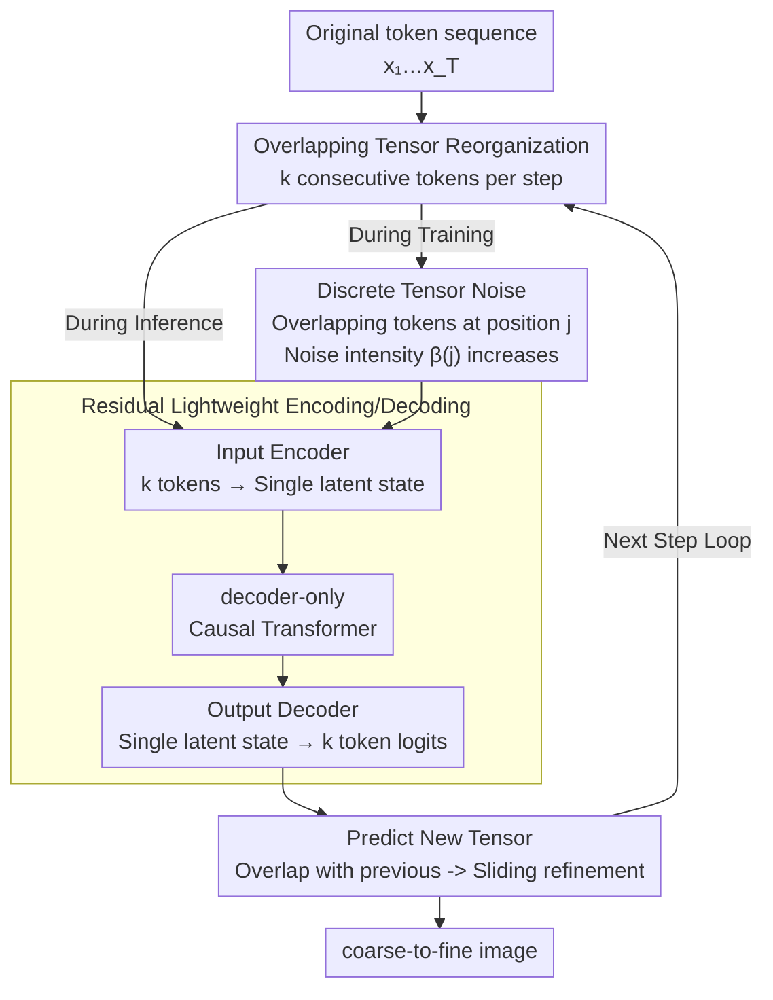

# From Prediction to Perfection: Introducing Refinement to Autoregressive Image Generation

**Conference**: ICLR 2026  
**arXiv**: [2505.16324](https://arxiv.org/abs/2505.16324)  
**Code**: None  
**Area**: Image Generation / Autoregressive Models  
**Keywords**: Autoregressive Image Generation, next-tensor prediction, discrete diffusion noise, iterative refinement, plug-and-play

## TL;DR

TensorAR is proposed to upgrade standard AR image generation from next-token prediction to next-tensor prediction. By predicting overlapping tensors (sets of continuous tokens) at each step, subsequent tensors achieve iterative refinement through overlap with previous ones. A discrete diffusion noise mechanism is introduced to solve the training information leakage problem. As a plug-and-play module, it is compatible with AR models such as LlamaGen, Open-MAGVIT2, and Janus-Pro, consistently improving generation quality across class-to-image and text-to-image tasks.

## Background & Motivation

**Background**: Autoregressive (AR) models (LlamaGen, VAR, MAR, Open-MAGVIT2) have become a mainstream paradigm for image generation, offering scalability, controllability, and the potential for unification with multimodal LLMs.

**Limitations of Prior Work**: Next-token prediction in standard AR follows a strict left-to-right sequence generation. Once a token is predicted, it cannot be corrected; thus, errors in early tokens accumulate and degrade final image quality. Existing improvement schemes require modifying the core paradigm: DART changes the classification objective to regression, MaskGIT/MAR require bidirectional attention and are incompatible with KV cache, and MAR requires additional VQ-VAE training—all of which hinder multimodal unification with standard GPT-style LLMs.

**Key Challenge**: AR models urgently need refinement capabilities to correct early prediction errors, but refinement mechanisms like diffusion or masking inherently conflict with the causal structure and classification training paradigm of AR.

**Goal**: To empower standard decoder-only AR models with the ability to iteratively refine generated tokens without modifying the base Transformer architecture or changing the classification training objective.

**Key Insight**: Predicting a group of overlapping continuous tokens (tensors) instead of a single token at each step allows the overlapping regions of adjacent tensors to naturally provide opportunities to correct previous predictions. This "sliding window refinement" achieves progressive improvement similar to diffusion while maintaining the causal structure.

**Core Idea**: By extending next-token prediction to next-tensor (overlapping token groups) prediction, sliding window iterative refinement is achieved while maintaining causal attention and classification loss.

## Method

### Overall Architecture

TensorAR reformulates standard next-token prediction as next-tensor prediction. The original token sequence $[x_1, x_2, ..., x_T]$ is reorganized into a sequence of overlapping tensors, where each tensor $\mathbf{x}_{i,k} = [x_i, x_{i+1}, ..., x_{i+k-1}]$ contains $k$ continuous tokens. During inference, at step $t$, a new tensor is output based on all preceding tensors. Adjacent tensors share $k-1$ overlapping tokens, allowing the same spatial position to be predicted repeatedly and refined progressively. The model backbone remains an unaltered decoder-only causal Transformer, with only lightweight residual modules added at the input and output to handle " $k$ tokens ↔ single hidden state" conversion, thus preserving both causal attention and the classification training objective. During training, discrete diffusion noise is injected into the overlapping tokens to force the model to learn denoising rather than simply copying ground truth.

### Key Designs

**1. Sliding Refinement with Overlapping Tensors: Enabling Coarse-to-Fine in Causal AR**

In standard AR, once a token is written, there is no way to revise it, causing early errors to amplify throughout the sequence. TensorAR breaks this by ensuring each spatial position is covered by multiple tensors. The first token $x_i$ in tensor $\mathbf{x}_{i,k}$ appears in $k$ successive tensors, effectively being refined $k$ times to reach high precision. Conversely, the last token $x_{i+k-1}$ is predicted only once and remains a coarse draft. During generation, the new tensor output at the current step overlaps with the next step's window, naturally enabling a coarse-to-fine iterative refinement process without breaking the left-to-right causal order, thus keeping KV cache usable. The window $k$ defines a unified spectrum: $k=1$ reduces to standard AR, and $k=T$ is equivalent to discrete diffusion expanded in left-to-right order. Intermediate values slide between efficiency and quality, compressing "global diffusion refinement" into "local sliding window refinement within AR."

**2. Discrete Tensor Noise: Preventing Information Leakage from Overlap**

The overlapping design introduces a risk: during training, the model could see the ground truth of a token in previous tensors, leading it to take a shortcut by copying tokens rather than learning causal dependencies. This renders refinement capabilities ineffective during inference. TensorAR adopts the concept of discrete diffusion by injecting categorical noise into the overlapping tokens of the input tensor: $q(x^*_{t+j}\mid x_{t+j}, j) = \text{Cat}\big(x^*_{t+j} \mid (1-\beta(j))x_{t+j} + \beta(j)/V\big)$. The noise intensity $\beta(j)$ increases monotonically from 0 to 1 with position $j$ within the tensor—tokens further back (not yet sufficiently refined) are more heavily corrupted. The model is forced to reconstruct ground truth from noisy tokens, acting as a denoiser during training and a refiner during inference. Four $\beta(j)$ schedules (linear, sine, square root, and exponential) are evaluated; all significantly outperform the noise-free baseline, with exponential being the default. Note that discrete diffusion is only a training tool; image generation follows AR decoding.

**3. Residual Lightweight Encoding/Decoding: Adapting Tensors Without Harming Pre-trained Weights**

Expanding the sequence granularity from tokens to tensors requires dimensional conversion at both ends. The Input Encoder uses a Query Transformer to compress $k$ token embeddings into a single hidden state for the backbone. The Output Decoder then reconstructs $k$ token logits from the single hidden state. Both modules wrap the original embedding/linear layers in a residual manner, ensuring that the pre-trained information flow is not truncated and base weights can be reused. The cost is minimal—additional parameters account for only 1.5% to 4.6%, and the proportion decreases as the model size increases (only +1.5% for XXL). Ablations show that a single-layer Query Transformer is optimal, as increasing depth degrades the FID.

### Loss & Training

The training objective combines AR cross-entropy with discrete diffusion denoising, performing a weighted sum over the $k$ positions within each tensor:

$$\mathcal{L}(\theta) = \sum_{i=1}^{T}\sum_{j=1}^{k} \mathbb{E}\big[w_j \log p_\theta(x_{i+j}\mid \mathbf{x}_{<i,k}; c)\big]$$

Loss at padding positions caused by tensor boundaries at the end of the sequence is ignored. The default configuration uses window size $k=4$, a single-layer Query Transformer, and an exponential noise schedule.

## Key Experimental Results

### Main Results: ImageNet 256×256 / 384×384 Class-Conditional Generation

| Model | Params | FID↓ | IS↑ | Precision↑ | Recall↑ |
|------|--------|------|-----|-----------|---------|
| LlamaGen-B (256) | 111M | 5.46 | 193.6 | 0.83 | 0.45 |
| **+TensorAR** | **116M (+4.6%)** | **4.71** | **225.8** | **0.85** | **0.45** |
| LlamaGen-L (256) | 343M | 3.80 | 248.3 | 0.83 | 0.52 |
| **+TensorAR** | **352M (+2.7%)** | **2.78** | **254.8** | **0.82** | **0.56** |
| LlamaGen-XL (384) | 775M | 2.62 | 244.1 | 0.80 | 0.57 |
| **+TensorAR** | **789M (+1.9%)** | **2.29** | **260.4** | **0.81** | **0.59** |
| LlamaGen-XXL (384) | 1411M | 2.34 | 253.9 | 0.81 | 0.60 |
| **+TensorAR** | **1432M (+1.5%)** | **2.03** | **267.7** | **0.82** | **0.61** |
| Open-MAGVIT2-B (256) | 343M | 3.08 | 258.3 | 0.85 | 0.51 |
| **+TensorAR** | **352M (+2.7%)** | **2.91** | **260.2** | **0.86** | **0.50** |
| Open-MAGVIT2-L (256) | 804M | 2.51 | 271.7 | 0.84 | 0.54 |
| **+TensorAR** | **820M (+2.0%)** | **2.35** | **273.4** | **0.84** | **0.53** |

SOTA comparison: MAGVIT-v2 FID=1.78, MaskBit FID=1.52, VAR-2.0B FID=1.73 (all are masked AR or specialized architectures). TensorAR-XXL reaches FID=2.03, the best performance among causal AR models, approaching masked AR levels.

### Ablation Study: Noise Schedules and Window Size (LlamaGen-B)

| Config | FID↓ | IS↑ | Precision↑ | Recall↑ |
|------|------|-----|-----------|---------|
| Baseline (No refinement) | 5.46 | 193.6 | 0.83 | 0.45 |
| **Noise Schedule** | | | | |
| Linear | 4.79 | 218.8 | 0.85 | 0.44 |
| Sine | 4.75 | 221.3 | 0.84 | 0.45 |
| Square root | 4.84 | 214.9 | 0.83 | 0.43 |
| **Exponential (Default)** | **4.71** | **225.8** | **0.85** | **0.45** |
| **Window Size $k$** | | | | |
| $k=2$ | 4.78 | 221.3 | 0.84 | 0.45 |
| $k=4$ (Default) | 4.71 | 225.8 | 0.85 | 0.45 |
| $k=8$ | 4.68 | 226.7 | 0.85 | 0.46 |
| **Query Transformer Depth** | | | | |
| $d=1$ (Default) | 4.71 | - | 0.85 | 0.45 |
| $d=2$ | 4.79 | - | 0.85 | 0.46 |
| $d=4$ | 4.90 | - | 0.82 | 0.43 |

### Main Results: Text-to-Image GenEval Instruction Following

| Model | Single Obj. | Two Obj. | Counting | Colors | Position | Color Attri. | Overall↑ |
|------|------------|----------|----------|--------|----------|-------------|---------|
| LlamaGen | 0.71 | 0.34 | 0.21 | 0.58 | 0.07 | 0.04 | 0.32 |
| **+TensorAR** | **0.99** | **0.70** | **0.57** | **0.89** | **0.28** | **0.19** | **0.61** |
| Janus-Pro-7B | 0.99 | 0.89 | 0.59 | 0.90 | 0.79 | 0.66 | 0.80 |
| **+TensorAR** | **0.99** | **0.93** | **0.53** | **0.92** | **0.85** | **0.79** | **0.83** |
| DALL-E 3 | 0.96 | 0.87 | 0.47 | 0.83 | 0.43 | 0.45 | 0.67 |
| SD3-Medium | 0.99 | 0.94 | 0.72 | 0.89 | 0.33 | 0.60 | 0.74 |

### Key Findings

- **Consistent Improvement Across Models and Scales**: TensorAR stably reduces FID for both LlamaGen (111M to 1.4B) and Open-MAGVIT2. LlamaGen-B shows the largest improvement (5.46 to 4.71, -13.7%), and even the 1.4B model sees a 0.31 point drop (2.34 to 2.03).
- **Minimal Parameter Overhead**: Additional parameters $\le$ 4.6%, with the ratio decreasing as model size grows (XXL at only +1.5%).
- **Significant Text-to-Image Boost**: On GenEval, LlamaGen’s overall score improves from 0.32 to 0.61 (+91%), and Janus-Pro improves from 0.80 to 0.83.
- **FID Decreases Monotonically with $k$**: $k=2$ is significantly better than baseline (5.46 to 4.78), and $k=8$ is lowest (4.68), though $k=4$ provides a good efficiency-quality balance.
- **Robustness to Noise Schedules**: All four schedules significantly outperform the noise-free baseline, with exponential being optimal (4.71).
- **Optimal Depth $d=1$ for Query Transformer**: Increasing depth does not lower FID but increases latency ($d=4$ leads to an FID of 4.90).
- **Beyond Simple Fine-tuning**: Fine-tuning the base model directly for the same number of steps yields no FID improvement, confirming the gains come from the refinement mechanism.

## Highlights & Insights

- **"Refinement Instead of Regeneration"**: For the first time, AR models possess the ability to correct previous predictions, mimicking a human's "drafting $\rightarrow$ revising" workflow—local improvement without overturning existing generation.
- **Diffusion as a Training Tool Rather Than a Generation Tool**: Cleverly utilizes discrete diffusion noise to solve training information leakage rather than for image generation, grafting the "denoising" concept of diffusion onto the "refinement" needs of AR.
- **Plug-and-Play Engineering Value**: No changes to Transformer architecture (remains decoder-only causal attention), training objective (remains classification cross-entropy), or VQ tokenizer. Any GPT-style AR model can directly benefit from these lightweight modules.
- **Unified Perspective**: TensorAR represents a continuous spectrum between $k=1$ (standard AR) and $k=T$ (discrete diffusion), providing a theoretical bridge between the two paradigms.
- **91% Increase in GenEval for LlamaGen**: Surprising finding—refinement not only improves image quality but also substantially enhances instruction-following capabilities.

## Limitations & Future Work

- Increasing window size $k$ linearly increases inference steps and latency; selection of $k$ requires balancing quality and speed.
- The method is currently verified only in discrete VQ tokenizer space; compatibility with continuous token methods (e.g., MAR's diffusion head) has not been explored.
- On DPG-Bench, Janus-Pro+TensorAR saw a drop from 89.48 to 84.52 in the "Other" sub-metric, suggesting refinement may occasionally introduce side effects.
- Integration with AR inference acceleration/distillation (e.g., speculative decoding) is unexplored, though identified by the authors as a promising direction.
- Refinement primarily improves early tokens; marginal gains might diminish for the latter halves of long sequences.

## Related Work & Insights

- **vs DART**: DART unifies AR and diffusion but changes the objective to regression and requires a non-Markovian framework; TensorAR maintains classification and a standard Markov process.
- **vs MaskGIT/MAR**: Masked AR requires bidirectional attention, making it incompatible with KV cache and standard LLMs; TensorAR preserves causal attention and KV cache.
- **vs VAR**: VAR uses next-scale prediction (multi-resolution coarse-to-fine); TensorAR uses next-tensor prediction (same-resolution sliding refinement), making them complementary.
- **Insights**: The refinement concept could be extended to text AR models—if LLMs could also slide and correct the previous few tokens during generation, it might improve long-text coherence.

## Rating

- Novelty: ⭐⭐⭐⭐⭐ The combination of next-tensor prediction and discrete noise is elegant and effective, providing a unified AR-diffusion perspective.
- Experimental Thoroughness: ⭐⭐⭐⭐ Excellent coverage across tasks, two base models, six scales, and comprehensive ablations; only lacking large-scale text-to-image benchmarks.
- Writing Quality: ⭐⭐⭐⭐⭐ The core idea is explained very clearly; the spectrum perspective from $k=1$ to $k=T$ offers deep insight.
- Value: ⭐⭐⭐⭐⭐ Provides a substantive advancement to the AR image generation paradigm; the plug-and-play design has high practical application value.

<!-- RELATED:START -->

## Related Papers

- [\[ICLR 2026\] Condition Errors Refinement in Autoregressive Image Generation with Diffusion Loss](condition_errors_refinement_in_autoregressive_image_generation_with_diffusion_lo.md)
- [\[ICLR 2026\] Autoregressive Image Generation with Randomized Parallel Decoding](autoregressive_image_generation_with_randomized_parallel_decoding.md)
- [\[ICLR 2026\] NextStep-1: Toward Autoregressive Image Generation with Continuous Tokens at Scale](nextstep-1_toward_autoregressive_image_generation_with_continuous_tokens_at_scal.md)
- [\[ICLR 2026\] Group Critical-token Policy Optimization for Autoregressive Image Generation](group_critical-token_policy_optimization_for_autoregressive_image_generation.md)
- [\[ICLR 2026\] Hyperspherical Latents Improve Continuous-Token Autoregressive Generation](hyperspherical_latents_improve_continuous-token_autoregressive_generation.md)

<!-- RELATED:END -->
