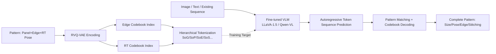

# GarmentGPT: Compositional Garment Pattern Generation via Discrete Latent Tokenization

**Conference**: ICLR 2026  
**OpenReview**: [https://openreview.net/forum?id=XzXKnazRBF](https://openreview.net/forum?id=XzXKnazRBF)  
**Code**: [https://github.com/ChimerAI-MMLab/Garment-GPT](https://github.com/ChimerAI-MMLab/Garment-GPT)  
**Area**: Garment Digitization / Structured Generation / Multimodal Generation  
**Keywords**: Sewing Pattern Generation, RVQ-VAE, Discrete Tokenization, Vision-Language Model, Garment Digitization  

## TL;DR
GarmentGPT quantizes the continuous boundary curves of sewing patterns into discrete codebook tokens using RVQ-VAE. It then enables a fine-tuned VLM to autoregressively "select words" to generate these tokens, transforming pattern generation from low-level coordinate regression into high-level symbolic compositional reasoning. The work is supported by a million-scale dataset of paired real human portraits and patterns.

## Background & Motivation
- **Background**: Garment digitization is a fundamental requirement for digital humans, virtual try-on, and e-commerce. A sewing pattern (2D panels + edge curves + stitching relationships) serves as the "blueprint" determining the final 3D shape, fit, and style of a garment. Traditional pattern making relies heavily on the experience and intuition of pattern makers, which remains a bottleneck for scaling digital clothing.
- **Limitations of Prior Work**: Two mainstream routes for automatic pattern generation remain in the "raw data space" and lack high-level reasoning. ① Diffusion models (e.g., SewingLDM) excel at fitting distributions but act as "data duplicators" without understanding garment construction principles; ② Direct use of VLMs (e.g., ChatGarment, AIpparel) to regress raw floating-point coordinates forces a strong reasoning engine into low-level numerical regression, where thousands of coordinate errors accumulate catastrophically.
- **Key Challenge**: Patterns require both **precise geometric constraints** (accurate vertices, control points, and radii) and **high-level compositional topology** (which edges are sewn together, how panels are assembled). Continuous coordinate regression cannot simultaneously satisfy precision and symbolic reasoning. Furthermore, there is a lack of large-scale paired data between "real photos ↔ precise patterns," preventing models from generalizing to real-world photo inputs.
- **Goal**: Align pattern generation with the symbolic reasoning capabilities of LLMs to directly produce structurally correct, editable, and manufacturable patterns from real human portraits/text.
- **Core Idea**: **Discrete Compositional Paradigm**—Drawing inspiration from Latent Diffusion's approach of mapping problems to a compact semantic latent space, the authors first use RVQ-VAE to "dictionary-ize" pattern curves into discrete tokens representing meaningful components (panels, curves, connections). Then, a VLM **autoregressively predicts token sequences instead of regressing coordinates**, transforming generation into a compositional task of "assembling words based on tailoring principles."

## Method

### Overall Architecture
GarmentGPT consists of two core modules in series: ① A **Quantization Module** (RVQ-VAE) that encodes the continuous curves of each edge and the positional parameters of each panel into discrete codebook indices; ② A **Sequence Generation/Editing Module** (fine-tuned VLM) that takes images/text/existing pattern sequences as conditions to autoregressively predict a "garment sequence" with special tokens. Finally, pattern matching is used to deconstruct the sequence and query the codebook to decode the full pattern (size, panel pose, edge geometry, and stitching).

### Key Designs
**1. RVQ-VAE Pattern Quantization: Independent codebooks for edge geometry and panel pose.** This is the foundation of the paradigm. Each edge is classified into four geometric types (line, quadratic/cubic Bezier, arc), each with specific parameters. The authors uniformly sample $N$ points per edge for a lightweight ResNet encoder. Panel translation-rotation (RT, under SMPL A-pose) is concatenated into a single vector for a smaller ResNet encoder. **Residual Vector Quantization** (RVQ) then maps continuous latent vectors to hierarchical codebook indices, where $Q$ residual layers balance compression and reconstruction quality. Crucially, for "representation purity," the edge and RT parameters use **completely non-shared** encoder-decoders and codebooks to avoid crosstalk between geometry and pose. During decoding, serialized indices retrieve quantized vectors; the edge decoder restores endpoints and type-specific attributes, while RT regresses continuous values, achieving high-fidelity reconstruction.

**2. Hierarchical Tokenization: Grammatizing pattern topology with special tokens.** Once indices are obtained, they must be organized into sequences digestible by VLMs. The authors designed paired special tokens $T = \{\langle\text{SoG}\rangle, \langle\text{EoG}\rangle, \langle\text{SoP}\rangle, \langle\text{EoP}\rangle, \langle\text{SoL}\rangle, \langle\text{EoL}\rangle, \langle\text{SoE}\rangle, \langle\text{EoE}\rangle, \langle\text{SoS}\rangle, \langle\text{EoS}\rangle, \langle\text{ESEG}\rangle\}$ to mark the start/end of "garment/panel/pose/edge/stitching." $\langle\text{ESEG}\rangle$ acts as a separator for edges within a panel. The sequence resembles a syntax tree: $\langle\text{SoG}\rangle$ followed by size → panel data (identifier, pose, edge sequence in order) → stitching relations (describing edge pairs, e.g., right_btorso edge 4 and left_btorso edge 4) → $\langle\text{EoG}\rangle$. This explicitly encodes geometric topology into symbolic sequences, leveraging the VLM's language modeling strengths.

**3. VLM Autoregressive "Word Selection": Reframing coordinate regression as token selection.** LLaVA-1.5-7B / Qwen-2.5-VL are used as backbones with three adaptations: ① **Vocabulary Expansion**—Topological special tokens and codebook indices (0–1023) are added as learnable embeddings; ② **Multimodal Input Construction**—Generation uses image-text pairs, while editing uses "sequence + editing instruction" pairs, fused via projection layers; ③ **Training Paradigm**—The VLM is fine-tuned to autoregressively predict tokens, minimizing cross-entropy loss $L_{\text{VLM}} = -\frac{1}{N}\sum_{i=1}^{N} \log P(\text{token}_i \mid \text{token}_{<i}, C)$, where $C$ is the context. By "selecting words" from a finite vocabulary rather than regressing unbounded floats, the symbolic reasoning advantage is unleashed, bypassing error accumulation.

**4. Composite Loss for Quantizer: Fine-grained constraints by geometric type.** The RVQ-VAE training objective is a weighted composite loss $L_{\text{quant}} = \lambda_{\text{cls}}L_{\text{cls}} + \lambda_{\text{vertex}}L_{\text{vertex}} + \lambda_{\text{control}}L_{\text{control}} + \lambda_{\text{commit}}L_{\text{commit}}$: $L_{\text{cls}}$ predicts geometry via cross-entropy; $L_{\text{vertex}} = \|v_{\text{pred}} - v_{\text{gt}}\|_2^2$ constrains endpoint precision; $L_{\text{control}}$ is calculated per type (lines use trisection points, Beziers use control point L2, and arcs use $L_{\text{control}}^{\text{arc}} = \|r_{\text{pred}} - r_{\text{gt}}\|_2^2 + \text{BCE}(d_{\text{pred}}, d_{\text{gt}}) + \text{BCE}(a_{\text{pred}}, a_{\text{gt}})$ for radius, direction, and arc flags); $L_{\text{commit}} = \beta\|z_e(x) - \text{sg}(z_q)\|_2^2$ maintains the mapping.

**5. Data Curation Pipeline: Million-scale real portrait-pattern pairs via GarmentCode.** The biggest hurdle for real-world application is the lack of "real photo ↔ precise pattern" pairs. The authors use a four-stage pipeline: ① **Texture Extraction & Augmentation**—Grounded-SAM + FabricDiffusion process existing datasets to produce RGT-164K (164k unique textures); ② **Motion-Aware Simulation**—SMPL poses from AMASS are used with GarmentCode + ContourCraft to render dressed humans in various poses; ③ **Photorealistic Transformation**—Keyframes are converted to photo-level images via Qwen-Image-Edit, preserving structural consistency via physical simulation; ④ **Quality Filtering**—Cases of detachment, exposure, or abnormal coverage are filtered, raising acceptable alignment from 64.3% to 99.6%. This results in RG-1M (million-scale pairs) and RG-Bench (the first benchmark for real portrait-based pattern generation).

## Key Experimental Results

### Main Results (Structured GarmentCode Dataset)

| Method | Setting | Panel Acc.↑ | Edge Acc.↑ | Stitch Acc.↑ | Vertices L2↓ | Rotation L2↓ | Translation L2↓ |
|------|------|------|------|------|------|------|------|
| ChatGarment | — | 60.22% | 42.12% | 49.21% | 30.15 | 10.51 | 10.03 |
| AIpparel | — | 78.92% | 74.31% | 56.57% | 25.55 | 3.87 | 5.22 |
| GarmentGPT (LLaVA-1.5) | Text-only | 64.03% | 76.71% | 53.16% | 48.19 | 0.84 | 8.80 |
| GarmentGPT (LLaVA-1.5) | Image-only | 93.53% | 89.75% | 80.98% | 17.33 | 0.56 | 2.93 |
| **GarmentGPT (LLaVA-1.5)** | **Image+Text** | **95.62%** | **90.48%** | **81.84%** | 18.43 | 0.59 | 3.05 |
| GarmentGPT (LLaVA-1.5) | Editing | 93.80% | 94.62% | 92.95% | 11.07 | 0.97 | 2.93 |

- Compared to the continuous regression SOTA (AIpparel), Panel Acc. improved by +16.7% and Stitch Acc. by +25.3%, validating the discrete compositional paradigm. Multimodal fusion outperformed single modalities (Panel 93.53%→95.62%). The editing task achieved a Stitch Acc. of 92.95%, showing discrete representations are amenable to local modifications.

### Real-Garments Benchmark (Real Photos, >2000 images)

| Method | Panel Acc.↑ | Edge Acc.↑ | Stitch Acc.↑ | Vertices L2↓ |
|------|------|------|------|------|
| ChatGarment | 25.34% | 17.82% | 18.45% | 71.28 |
| AIpparel | 38.76% | 41.25% | 27.34% | 58.92 |
| GarmentGPT (Image-only) | 88.67% | 84.28% | 76.34% | 19.45 |
| **GarmentGPT (Image+Text)** | **90.84%** | **85.92%** | **77.56%** | 20.67 |

- All methods dropped in performance in real scenarios (verifying benchmark difficulty), but GarmentGPT retained ~95% performance. Its Panel Acc. (90.84%) is **2.3×** that of the best baseline, indicating discrete tokens learn robust, pose-invariant representations.

### Ablation Study: RVQ-VAE Residual Layers Q

| Metric | Q=1 | Q=3 | Q=5 | Q=8 |
|------|------|------|------|------|
| Total Loss↓ | 3.72 | 0.36 | 0.15 | **0.08** |
| Vertex Loss↓ (×10⁻³) | 5.9 | 0.39 | 0.14 | **0.05** |
| Curve Acc.↑ | 93.3% | 98.9% | 99.5% | **99.8%** |

### Key Findings
- Increasing residual layers from 1 to 8 significantly improved reconstruction (curve accuracy 93.3%→99.8%). $Q=8$ is essential for reliable pattern tokenization—reconstruction quality sets the lower bound for the pipeline.
- Larger VLM backbones generally perform better but with diminishing returns: Qwen 3B→7B→32B yielded Panel Acc. of 85.56%→90.31%→91.05%. LLaVA-1.5-7B proved the strongest on this specific task.

## Highlights & Insights
- **Insight on Paradigm Shift**: Reframing pattern generation from "low-level coordinate regression" to "high-level token selection" allows VLMs to perform symbolic/compositional reasoning rather than struggling with numerical regression. This is the core transferable idea to other structured geometries (CAD, vector graphics, meshes).
- **Decoupled Quantization**: Independent codebooks for edge geometry and panel RT avoid representation crosstalk, a key engineering detail for high-fidelity reconstruction.
- **Data Closed-Loop for real-world deployment**: Using simulation + realism transfer + multi-stage filtering to create million-scale pairs solves the lack of real-world data and establishes RG-Bench as a new standard.

## Limitations & Future Work
- The real benchmark is synthesized via "virtual rendering → photorealistic transfer," which still has a domain gap compared to internet photos.
- Pattern geometry is limited to four edge types; whether complex drapes or special cuts can be fully expressed by a finite dictionary requires verification.
- Codebook size (1024) and $Q=8$ are fixed hyperparameters; their adequacy for ultra-complex garments is yet to be explored.
- Evaluation focuses on structural accuracy and geometric error, lacking end-to-end human evaluation of 3D simulation fit and manufacturability.

## Related Work & Insights
- **Pattern Generation**: Optimization methods (Sensitive Couture) are hard to scale; autoregressive methods (GarmentCode, AIpparel) using Transformer sequences suffer from slow inference and error propagation; diffusion methods (SewingLDM) are efficient but lack geometric precision. GarmentGPT balances precision and efficiency.
- **Structured Data Generation**: VLMs have been used for 3D meshes, skeletons, and CAD. This work tailors the "Discrete + Autoregressive" approach to the specific constraints of pattern topology.
- **Latent Space Generation**: Directly aligns with the "mapping to compact semantic latent space" philosophy of Latent Diffusion, migrating it from image diffusion to discrete autoregressive geometric generation.

## Rating
- **Novelty**: ⭐⭐⭐⭐ First framework to operationalize pattern generation into discrete latent space with VLM autoregression. Clear paradigm shift.
- **Experimental Thoroughness**: ⭐⭐⭐⭐ Extensive benchmarks, backbone and layer ablations, significant gains (2.3× in real scenes); however, real samples are still somewhat synthetic.
- **Writing Quality**: ⭐⭐⭐⭐ Logic from motivation to paradigm is sound; tokenization and losses are well-defined.
- **Value**: ⭐⭐⭐⭐ Open-sourced dataset and benchmark, moving digital clothing from expert tailoring toward "photo-to-pattern" generation with high practical value.

<!-- RELATED:START -->

## Related Papers

- [\[ICLR 2026\] WeTok: Powerful Discrete Tokenization for High-Fidelity Visual Reconstruction](wetok_powerful_discrete_tokenization_for_high-fidelity_visual_reconstruction.md)
- [\[ICCV 2025\] Multimodal Latent Diffusion Model for Complex Sewing Pattern Generation](../../ICCV2025/image_generation/multimodal_latent_diffusion_model_for_complex_sewing_pattern_generation.md)
- [\[ICLR 2026\] ReDDiT: Rehashing Noise for Discrete Visual Generation](reddit_rehashing_noise_for_discrete_visual_generation.md)
- [\[ICLR 2026\] Long-Text-to-Image Generation via Compositional Prompt Decomposition](long-text-to-image_generation_via_compositional_prompt_decomposition.md)
- [\[ICLR 2026\] Discrete Adjoint Matching](discrete_adjoint_matching.md)

<!-- RELATED:END -->
