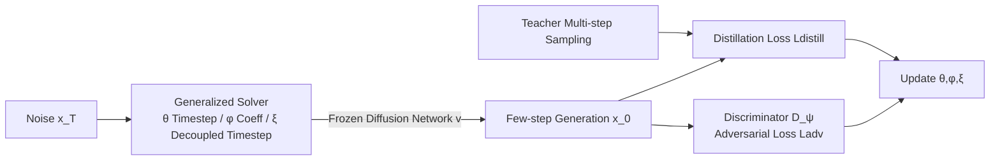

# GAS: Improving Discretization of Diffusion ODEs via Generalized Adversarial Solver

**Conference**: ICLR 2026  
**OpenReview**: [https://openreview.net/forum?id=R1l46h8kyM](https://openreview.net/forum?id=R1l46h8kyM)  
**Code**: [https://github.com/3145tttt/GAS](https://github.com/3145tttt/GAS)  
**Area**: Image Generation / Diffusion Model Acceleration  
**Keywords**: Diffusion ODE Solver, Solver Distillation, Timestep Learning, Adversarial Training, Few-step Sampling  

## TL;DR
This paper proposes the **Generalized Adversarial Solver (GAS)**: it adopts a "Generalized Solver" parameterization—learning additive corrections on theoretical solver coefficients and incorporating all historical points into a linear multi-step signature—and couples it with adversarial loss. GAS systematically reduces the FID of diffusion models below that of existing solver distillation methods in 4–10 step few-step sampling scenarios.

## Background & Motivation
- **Background**: Diffusion models achieve SOTA generation quality but suffer from slow sampling requiring dozens of Function Evaluations (NFE). Acceleration routes are divided into two categories: retraining/distilling few-step student models (high quality but heavy on VRAM/computation) and inference-time methods (designing specialized solvers, caching, quantization). The latter is more lightweight, with the paradigm of "training a student solver to align with a teacher" (e.g., LD3, S4S) directly optimizing timesteps and solver coefficients, representing the most cost-effective direction.
- **Limitations of Prior Work**: Existing learnable solver methods suffer from "training side effects"—unstable loss scales (GITS/DMN series), restricted parameter spaces (Tong et al. LD3), or decoupled training of parameter subsets (S4S Frankel et al.). These make training schemes complex and fragile. Crucially, distilling a solver into a student with extremely few parameters makes it **difficult to preserve fine-grained details** and introduces artifacts at low NFE.
- **Key Challenge**: It is difficult to simultaneously achieve "parameters sufficient to express details" and "simple, stable training without tricks"; pure regression-based distillation losses also struggle with details and artifacts.
- **Goal**: Design a simple but more expressive solver parameterization paired with a loss function capable of fixing artifacts and enhancing details to outperform existing solver/timestep training methods under the same computational budget.
- **Core Idea** (**Generalized Solver + Theoretical Guidance + Adversarial Loss**): Extend the signature of linear multi-step solvers to a "weighted sum of all historical points and velocities"; rather than learning coefficients from scratch, learn **additive corrections on the theoretical coefficients of a strong baseline solver (DPM-Solver++(3M))**. Combine distillation loss with adversarial loss specifically to recover details and suppress artifacts.

## Method

### Overall Architecture
GAS freezes the pre-trained diffusion model and only trains a lightweight "student sampler." The student uses a **Generalized Solver (GS)** signature for each step: a weighted sum of the current point, all historical points, and all historical velocities. The weights are determined by three sets of parameters $(\theta, \phi, \xi)$, where $\theta$ controls the timestep schedule, $\phi$ controls solver coefficients (added as corrections to theoretical ones), and $\xi$ controls the decoupled timesteps fed to the network. Training combines **distillation loss** (aligning with the teacher's high-quality multi-step output) and **adversarial loss** (discriminator realism) to produce GAS.

### Key Designs

**1. Generalized Solver Signature: Removing Order Constraints and Including All History**—Traditional linear multi-step solvers use only the $K$ most recent velocities for stepping, with the signature $x_{n+1}=a_n x_n+\sum_{j=\max(n-K+1,0)}^{n} c_{j,n}\,v(x_j,t_j)$. This work observes that at lower NFE and fewer steps, available parameters are inherently limited, so it is better to relax constraints. The signature is extended to a weighted sum of **all** historical points and velocities without order limits: $x_{n+1}=\sum_{j=0}^{n} a_{j,n}\,x_j+\sum_{j=0}^{n} c_{j,n}\,v(x_j,t_j)$. Historical points $x_j$ are explicitly added (theoretically, points can be represented as linear combinations of velocities; here, "over-parameterization" is intentional to simplify training). This allows student capacity to grow naturally with sampling steps, compensating for the lack of detail preservation in low-parameter models.

**2. Additive Correction on Theoretical Coefficients (Theoretical Guidance)**—Instead of directly learning $a_{j,n}, c_{j,n}$ as scalars, a strong solver like DPM-Solver++(3M) is used as "time-dependent theoretical guidance," and only **additive corrections** are learned. For the current point coefficient $a_{n,n}(\theta,\phi)=a_{n,n}(t^\theta_{n:n+1})+\hat a_{n,n}(\phi)$ (theoretical term + learnable term), and historical point coefficients $a_{j,n}=\hat a_{j,n}(\phi)$; for velocities within the recent $K$ steps, it is the weighted sum of theoretical finite-difference approximations and learned corrections $\sum_{j=0}^{K-1}[\tilde c_{j,n}(t^\theta_{j:n+1})+\hat c_{j,n}(\phi)]\sum_{i=n-j}^{n}\omega_{i,n}v(x_i,t^\theta_i)$, while older velocities are purely learned $\hat c_{j,n}(\phi)$. All corrections are **initialized to zero**, so the solver starts equivalent to a strong theoretical baseline, ensuring convergence and stability even if timesteps change abruptly (Ablation in Table 5: FID at NFE=6 jumps from 4.49 to 10.53 without theoretical guidance).

**3. Decoupled Timestep Design with Three Parameter Sets**—$\theta$ transforms logits into timesteps via a "stick-breaking" cumulative product $t^\theta_n=(T-\delta)\prod_{j=1}^{n}\sigma(\theta_j)+\delta$, naturally guaranteeing monotonic decrease within valid ranges; $\xi$ adds a decoupled correction $t^\theta_j+\xi_j$ for "timesteps fed into the network for prediction" (following LD3/S4S). Unlike S4S, which decouples subsets of parameters for multi-stage training, GS optimizes timesteps, coefficient corrections, and decoupled timesteps **jointly within a single signature**, avoiding instability from decoupled training.

**4. Adversarial Loss for Detail Enhancement and Artifact Removal (GS → GAS)**—"Solver distillation" is reframed as a **paired translation/per-sample mapping task**: similar to findings in pix2pix and SRGAN where regression plus adversarial losses significantly improve quality. Besides distillation loss (LPIPS in pixel space, L1 in latent space), a discriminator $D_\psi$ is added for min-max training $\min_{\theta,\phi,\xi}\max_\psi L_{\text{distill}}+L_{\text{adv}}$. Relativistic loss $f(t)=-\log(1+e^{-t})$ from R3GAN with gradient penalty is used to stabilize training, and teacher/student use different initial noise samples. The adversarial term specifically suppresses artifacts and recovers fine-grained details in low-NFE regions where regression becomes difficult (Table 6: ImageNet NFE=4, GS 7.87 → GAS with traditional GAN 6.49 → Relativistic GAN 5.38).

## Key Experimental Results

### Main Results
FID (50k samples) across 6 datasets (CIFAR10 32², AFHQv2/FFHQ 64², LSUN Bedroom/ImageNet 256², MS-COCO 512² + Stable Diffusion), comparing training-free solvers and solver optimization methods:

| Dataset (NFE) | UniPC | iPNDM[GITS] | Best LD3 | S4S Alt | GS (Ours) | GAS (Ours) | Teacher |
|---|---|---|---|---|---|---|---|
| CIFAR10 (4) | 43.92 | 15.63 | 9.31 | 6.35 | 4.41 | **4.05** | 2.03 |
| CIFAR10 (6) | 13.12 | 6.82 | 3.35 | 2.67 | 2.55 | **2.49** | 2.03 |
| FFHQ (4) | 53.25 | 18.05 | 17.96 | 10.63 | 10.70 | **7.86** | 2.60 |
| FFHQ (6) | 11.24 | 9.38 | 5.97 | 4.62 | 4.49 | **3.79** | 2.60 |
| AFHQv2 (4) | — | — | — | — | — | **4.48** | — |
| ImageNet 256² (4) | — | — | — | — | 7.87 | **5.38** | — |
| LSUN Bedroom (5) | — | — | — | — | — | **4.60** | — |
| MS-COCO (4) | — | — | — | — | — | **14.71** | — |

GAS consistently outperforms prior methods across all datasets and NFEs, with particularly significant gains at low NFEs.

### Ablation Study

| Ablation Item | Setting | Result |
|---|---|---|
| Parameterization vs S4S (CIFAR10, NFE=4) | S4S 31.44 → Ours **4.39** (LPIPS 0.273→0.116) | Better parameterization, more stable training |
| Parameterization vs S4S (FFHQ, NFE=4) | S4S 24.24 → Ours **10.79** | Same as above |
| Theoretical Guidance (FFHQ, NFE=6) | w/o theory 10.53 → w/ theory **4.49** | Significant contribution from guidance |
| Theoretical Guidance (FFHQ, NFE=4) | w/o theory 15.23 → w/ theory **10.70** | Same as above |
| Adversarial Loss (ImageNet, NFE=4) | GS 7.87 → Trad. GAN 6.49 → Rel. GAN **5.38** | GAN loss stabilizes quality improvement |

### Key Findings
- **Theoretical guidance is key to stability and convergence**: Initializing learnable corrections to zero ensures the solver starts equivalent to DPM-Solver++(3M), preventing crashes during abrupt timestep changes; without it, FID deteriorates significantly.
- **Generalized parameterization is more stable and faster**: LPIPS curves (Fig.3) show that the proposed parameterization yields a smoother and more stable training process compared to S4S, which reproduces the training instability reported by S4S itself.
- **Adversarial loss specifically addresses low-NFE artifacts**: In few-step regions where regression tasks are most difficult, the adversarial term visibly removes artifacts and restores details; while it requires more iterations to converge, it results in lower FID.

## Highlights & Insights
- **"Learning corrections on top of strong priors" rather than from scratch**: Using the theoretical coefficients of mature numerical solvers as a backbone and learning additive deltas with zero initialization is a simple yet highly effective stabilization trick—benefiting from theoretical convergence while gaining data-driven flexibility.
- **Restructuring solver distillation as paired image translation**: This perspective explains why adversarial loss can recover high-frequency details that pure regression loss misses, providing intuition for why few-step sampling quality often appears "blurry."
- **Low NFE means few parameters; thus, capacity should be expanded**: Contrary to the mainstream approach of restricting parameter space, this paper argues that lower NFE should allow for removing order limits and including full history to let student capacity grow naturally with step count.
- **Simple method, no training tricks**: GAS does not require S4S-style decoupled multi-stage training; joint optimization is sufficient, making it more engineering-friendly.

## Limitations & Future Work
- **Requires backpropagation through the entire solver inference**: There are scalability concerns on larger images/models (VRAM grows with steps and resolution).
- **Potential need for separate training for each target NFE**: Whether GS/GAS can be made "lightweight and universal across NFEs" remains an open question left for future work.
- **Performance at extremely low NFE (1-2 steps)**: The learnable parameter count is too low, and quality at NFE=1/2 is inferior to retraining-based distillation methods.
- **Frozen diffusion backbone**: While preserving the original model's generation capabilities, it also means the upper bound is limited by the teacher.

## Related Work & Insights
- **Learnable Solvers / Timestep Distillation**: LD3 (Tong et al. 2024), S4S (Frankel et al. 2025), GITS, DMN—this work systematically improves this line in parameterization (Table 1) and training stability.
- **Specialized ODE Solvers**: DDIM, DPM-Solver(++), DEIS, UniPC—this work does not replace them but reuses DPM-Solver++(3M) as a theoretical guidance backbone.
- **Adversarial Distillation**: ADD/SDXL-Turbo, DMD, UFOGen use GAN losses for diffusion distillation; this work introduces the same idea to the more lightweight "solver distillation" setting using R3GAN relativistic loss.
- **Insight**: When a data-driven module has a strong analytical prior available, "learning residuals/corrections + zero initialization" is often more stable than learning from scratch; adversarial loss is a universal tool for recovering high-frequency information lost by regression losses.

## Rating
- **Novelty**: ⭐⭐⭐⭐ — The combination of generalized signatures (full history + no order limits), additive corrections to theoretical coefficients, and the coupling of solver distillation with adversarial loss is natural and effective.
- **Experimental Thoroughness**: ⭐⭐⭐⭐ — Covers 6 datasets, pixel/latent space, and text-to-image. Ablations on parameterization, theoretical guidance, and adversarial loss are complete with strong baseline comparisons.
- **Writing Quality**: ⭐⭐⭐⭐ — Clear motivation, intuitive parameterization comparison in Table 1, and complete derivations; notation is dense, making the Method section slightly demanding.
- **Value**: ⭐⭐⭐⭐ — Pushes few-step sampling quality close to the teacher without retraining the diffusion backbone. High practical value for resource-constrained scenarios; code is open-source.

<!-- RELATED:START -->

## Related Papers

- [\[ICLR 2026\] Dual-Solver: A Generalized ODE Solver for Diffusion Models with Dual Prediction](dual-solver_a_generalized_ode_solver_for_diffusion_models_with_dual_prediction.md)
- [\[ICLR 2026\] Scalable Energy-Based Models via Adversarial Training: Unifying Discrimination and Generation](scalable_energy-based_models_via_adversarial_training_unifying_discrimination_an.md)
- [\[ICML 2026\] Mitigating the Contractivity Trap in Diffusion ODEs via Stein Stabilization](../../ICML2026/image_generation/mitigating_the_contractivity_trap_in_diffusion_odes_via_stein_stabilization.md)
- [\[ICLR 2026\] Foresight Diffusion: Improving Sampling Consistency in Predictive Diffusion Models](foresight_diffusion_improving_sampling_consistency_in_predictive_diffusion_model.md)
- [\[ICLR 2026\] LVTINO: LAtent Video consisTency INverse sOlver for High Definition Video Restoration](lvtino_latent_video_consistency_inverse_solver_for_high_definition_video_restora.md)

<!-- RELATED:END -->
