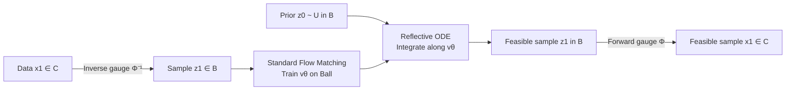

# Gauge Flow Matching: Efficient Constrained Generative Modeling over General Convex Set and Beyond

**Conference**: ICLR 2026  
**OpenReview**: [https://openreview.net/forum?id=vxq1OnaAMq](https://openreview.net/forum?id=vxq1OnaAMq)  
**Code**: TBD  
**Area**: Generative Models / Constrained Generation  
**Keywords**: Constrained generative modeling, flow matching, gauge mapping, reflective sampling, feasibility assurance  

## TL;DR
This paper proposes Gauge Flow Matching (GFM), which uses an explicit bijective gauge mapping to equivalently transform constrained generation problems on arbitrary compact convex sets to a unit ball. This allows for low-complexity reflection/projection within the ball to strictly guarantee feasibility before mapping back to the original space. GFM achieves "100% constraint satisfaction + high quality + high speed" with overhead close to standard flow matching and extends to non-convex sets like star-convex and geodesically convex sets.

## Background & Motivation
**Background**: Diffusion and flow matching models have achieved significant success in image synthesis, robot trajectory planning, and scientific simulations. However, many real-world scenarios require generated samples to strictly satisfy problem-specific constraints—such as protein structural constraints, precise image watermark placement, robot joint limits and obstacle avoidance, and consistency with physical laws. These constraints are often prerequisites for samples to be "meaningful and usable."

**Limitations of Prior Work**: Existing constrained generation methods (see Table 1 in the original paper) have significant drawbacks. Reflection-based methods (RDM/RSB/RFM) incur massive overhead in boundary localization and reflection calculations, and require the support of the initial distribution to lie within the target set $C$—while sampling from a general convex set (even a uniform distribution) is itself extremely expensive. Guidance/projection-based methods are costly for exact projection onto general sets, and approximate versions lack error analysis and feasibility guarantees. Mirror map methods only have closed-form solutions for simple convex sets like balls or simplices and map near-boundary samples to infinity, causing theoretical and practical difficulties for the transformed generative modeling.

**Key Challenge**: Prior methods cannot simultaneously achieve "broad constraint applicability," "strict feasibility guarantees," "low generation complexity," and "controllable distribution approximation error"—they either handle only special cases like box constraints/simplices or sacrifice inference time, which can be orders of magnitude slower, for feasibility.

**Goal**: Construct a constrained generation framework applicable to general compact sets (convex or non-convex) that provides provable strict feasibility, maintains complexity comparable to standard flow matching, and ensures bounded distribution approximation error.

**Core Idea**: **Replace "difficult constraint spaces" with "easy constraint spaces" using bijections**. Instead of directly handling general convex sets, GFM uses gauge (Minkowski) mapping to establish a bi-Lipschitz homeomorphism between any compact convex set and a unit ball. Constrained generation is performed on the unit ball (where sampling and reflection are closed-form $O(n)$ operations), and the results are mapped back to the original domain using the closed-form inverse mapping. Feasibility is naturally inherited from the bijectivity of the mapping.

## Method

### Overall Architecture
GFM decomposes constrained generation into four steps: "mapping - modeling - generation - re-mapping." During training, data samples $x_1$ are sent to the unit ball $B$ via the inverse gauge mapping $\Phi^{-1}$, where a standard flow matching model learns the velocity field $v_\theta$. During generation, starting from a prior in the ball (e.g., uniform distribution), an ODE solver with a reflection term integrates the path to obtain $z_1$ within the ball. Finally, the forward gauge mapping $\Phi$ maps $z_1$ back to the original convex set $C$ to output strictly feasible $x_1$.

### Key Designs

**1. Generalized Gauge Mapping: "Straightening" arbitrary convex sets into unit balls.** The core tool is the Minkowski gauge function $\gamma_C(x, x^\circ) = \inf\{\lambda \ge 0 \mid x \in \lambda(C - x^\circ)\}$, which measures the scaling needed to push a point $x$ starting from internal point $x^\circ$ to the boundary. A bijection between ball $B$ and convex set $C$ is defined as:

$$\Phi(z) = \frac{\|z\|_p}{\gamma_C(z, x^\circ)} z + x^\circ, \qquad \Phi^{-1}(x) = \frac{\gamma_C(x - x^\circ, x^\circ)}{\|x - x^\circ\|_p}(x - x^\circ)$$

Intuitively, $\Phi$ translates the unit ball to the interior point $x^\circ$ and scales it along each radial direction to align the ball's surface with the convex set's boundary. Compared to versions limited to polyhedra and cubes, this paper generalizes it to any pair of compact convex sets with efficient computation: $\gamma_C$ has closed-form expressions for linear/quadratic/conic constraints, while general convex constraints are solved with linear convergence via bisection. The interior point $x^\circ$ is pre-calculated once by solving a convex feasibility problem.

**2. Bi-Lipschitz Properties and "Centrally" Located Interior Points: Preserving distribution characteristics.** For the bijection to be effective, it must not distort the distribution beyond what can be modeled. The paper proves (Prop. 4.1) that the forward and inverse Lipschitz constants of the gauge mapping are controlled by the inner and outer radii $r_i, r_o$: $L_\Phi \le 2 r_o + r_o^2/r_i$ and $L_{\Phi^{-1}} \le 2/r_i$. If the interior point is too close to the boundary ($r_i \to 0$), the constants explode and the distribution severely distorts. Thus, a "central" interior point where $r_o$ is close to $r_i$ is found via constraint residual minimization (a linear optimization) to minimize the bi-Lipschitz constants. This boundedness ensures that the transformed distribution satisfies regularity conditions and provides a foundation for controllable approximation error.

**3. Closed-form Reflection on the Ball + Strict Feasibility: Complexity approaching standard FM.** Handling constraints on a unit ball is much easier than on general convex sets. The prior can be sampled uniformly, and generation involves integration with a reflection term $z_1 = z_0 + \int_0^1 (v_\theta(z_t,t)\,dt + dL_t)$. This reflection has a closed-form expression with $O(n)$ complexity and supports batch calculation, which is much smaller than the $O(n^2)$ neural network forward pass. Since $\Phi$ is a bijection from $B \to C$, any feasible sample in the ball is mapped to $C$ by construction. The overall generation complexity is $O(\text{NFE} \cdot n^2 + m \cdot \mathcal{C})$, where $m$ is the number of constraints and $\mathcal{C}$ is the cost of gauge calculation (e.g., $O(n)$ for linear, $O(n^2)$ for quadratic), which is the same order as standard flow matching.

**4. Extension to Non-convex Sets: Star-convex and Geodesically Convex.** The gauge principle is not limited to convex sets. For **star-convex sets** (where an interior point can "see" the entire boundary, e.g., $\ell_{0.5}$-norm balls), the gauge function and bijection naturally extend. For **geodesically convex sets** (where the unique geodesic between any two points on a Riemannian manifold lies entirely within the set), the exponential map at an interior point provides a local diffeomorphism to construct the gauge mapping in the tangent space. Both extensions inherit the computational advantages of the convex case.

## Key Experimental Results
Evaluation metrics include Feasibility (percentage of 10,000 samples satisfying constraints), distribution approximation error (MMD), training time per epoch, and batch inference time.

### Main Results

Convex Sets (Robot Arm Configuration with Linear + Quadratic Joint Constraints):

| Method | Feasibility (%) | MMD↓ (×10⁻³) | Training (s) | Inference (s) |
|------|-----------|-------------|---------|---------|
| DDPM | 95.0 | 4.79 | 0.17 | 0.59 |
| FM | 95.9 | 8.57 | 0.18 | 0.29 |
| Reflection | 100 | 25.9 | 6.40 | 14.0 |
| Metropolis | 100 | 130 | 6.40 | 6.12 |
| Projection | 100 | 93.5 | 6.40 | 7.12 |
| **GFM** | **100** | **3.50** | **0.18** | **0.63** |

Star-convex Sets:

| Method | Feasibility (%) | MMD↓ (×10⁻³) | Training (s) | Inference (s) |
|------|-----------|-------------|---------|---------|
| FM | 93.4 | 4.92 | 0.22 | 0.39 |
| Reflection | 100 | 7.96 | 5.58 | 12.4 |
| Projection | 100 | 7.89 | 5.58 | 347 |
| **GFM** | **100** | **5.01** | **0.22** | **0.74** |

### Ablation Study

Constrained Image Generation (CIFAR-10 with Watermark Embedding, Polyhedral Constraints, U-Net 34M):

| Method | FID (50K)↓ | Feasibility (%)↑ | Training/Epoch (s)↓ | Inference 5K (s)↓ |
|------|-----------|------------|-------------|----------------|
| FM | 3.57 | 76.66 | 76.7 | 155.2 |
| Projection | 6.88 | 100 | 100.4 | 556.6 |
| Reflection | 6.06 | 100 | 101.3 | 183.9 |
| **GFM** | **5.85** | **100** | **81.2** | **167.6** |

Constrained Time Series (PEMS-BAY Traffic Flow, Second-order Cone Constraints): GFM achieves 100% feasibility vs. 88.5% for standard FM. While projection reaches 100%, its inference time explodes from 0.31s to 49.7s (160× slower). GFM takes only 0.43s and achieves the best distribution quality (KS statistic 0.35, p=0.42).

High-dimensional Combinatorial Optimization Relaxation ($n=10,000$, PSD Cone + Linear Constraints): FM/DDPM fail completely (0% feasibility) at $n=50\times50$ and $100\times100$. GFM maintains 100% feasibility with MMD comparable to standard FM.

### Key Findings
- **Feasibility vs. Speed Win-Win**: Standard DM/FM only reach ~88–96% feasibility. While reflection/projection achieve 100%, they impose massive training/inference overheads. GFM secures 100% feasibility with speeds close to standard FM.
- **No Compromise on Distribution Quality**: Thanks to the bounded bi-Lipschitz constants, GFM's MMD/FID/KS are generally superior to other constrained methods and often match or exceed unconstrained FM.
- **Robustness to Dimension and Geometry**: In $n=10,000$ PSD cone constraints where standard models fail completely, GFM remains 100% feasible and works effectively for star-convex and geodesically convex sets.

## Highlights & Insights
- **The Elegance of "Coordinate Transformation"**: The difficulty of constrained generation lies in the complexity of the constraint set. GFM uses an explicit invertible mapping to reduce this complexity to a unit ball, where reflection and sampling are trivial. Feasibility is guaranteed by the mapping's construction rather than post-hoc fixing.
- **Closed-form + Offline Pre-computation**: Gauge functions are closed-form for common constraints and converge via bisection for general convex ones. Interior points are pre-calculated once, making additional overhead negligible compared to neural network passes.
- **Theoretical and Empirical Synergy**: The bi-Lipschitz bound explains why "central" interior points minimize distortion and provides a Wasserstein error bound $W_2 \le L_\Phi e^{1/2+L_\theta}\epsilon_\theta$, linking engineering choices (interior point location) to theoretical guarantees.

## Limitations & Future Work
- **Dependency on Interior Points and Gauge Computability**: The method requires efficient calculation of "central" interior points and gauge functions. For extremely ill-conditioned or thin sets, a small $r_i$ can inflate the Lipschitz constants, damaging distribution quality.
- **Bisection Overhead for General Constraints**: When closed-form gauges are unavailable, point-wise bisection is needed. Although it converges linearly, it can be costly for scenarios with a massive number of expensive constraints.
- **Scope of Non-convex Extensions**: Currently covers "well-behaved" star-convex and geodesically convex sets. More general non-convex or multi-connected constraints are not yet supported; relaxing geometric assumptions while maintaining bijectivity and feasibility is a natural next step.

## Related Work & Insights
- **Reflective/Projection Constraints** (RDM, RSB, RFM, Metropolis, Projection): These serve as the baseline, highlighting the high cost of handling constraints in the original domain and the strict requirements for initial support.
- **Mirror Map Methods** (MDM, MFM): Use a similar bijective approach but are only closed-form for simple sets and can map near-boundary points to infinity. GFM's bounded bi-Lipschitzness specifically addresses this issue.
- **Bi-Lipschitz Homeomorphism and Regularity** (Wan et al. 2024): Provides theoretical support for preserving distribution regularity and ensuring bounded errors after transformation.
- **Insight**: When generation or optimization is hindered by complex domain shapes, finding an explicit bijection to a regular set and controlling its Lipschitz properties is often more efficient and provable than imposing constraints directly in the original space.

## Rating
- **Novelty**: ⭐⭐⭐⭐ Systematically introducing gauge/Minkowski mapping from control theory into constrained generation and generalizing it to various sets is a simple yet powerful idea.
- **Experimental Thoroughness**: ⭐⭐⭐⭐ Covers synthetic data, robotics, traffic time-series, CIFAR-10 watermarking, and $n=10,000$ optimization with extensive baselines.
- **Writing Quality**: ⭐⭐⭐⭐ Clear framework, well-supported propositions and algorithms, and intuitive visualizations.
- **Value**: ⭐⭐⭐⭐ Provides a practical and provable universal framework for generation in physics-constrained, safety-critical, and watermarking scenarios requiring strict feasibility.

<!-- RELATED:START -->

## Related Papers

- [\[ICLR 2026\] Mirror Flow Matching with Heavy-Tailed Priors for Generative Modeling on Convex Domains](mirror_flow_matching_with_heavy-tailed_priors_for_generative_modeling_on_convex_.md)
- [\[ICLR 2026\] LapFlow: Laplacian Multi-scale Flow Matching for Generative Modeling](lapflow_laplacian_multi-scale_flow_matching_for_generative_modeling.md)
- [\[ICLR 2026\] Flow Along the $K$-Amplitude for Generative Modeling](flow_along_the_k-amplitude_for_generative_modeling.md)
- [\[ICLR 2026\] FastFlow: Accelerating The Generative Flow Matching Models with Bandit Inference](fastflow_accelerating_the_generative_flow_matching_models_with_bandit_inference.md)
- [\[ICLR 2026\] Delay Flow Matching](delay_flow_matching.md)

<!-- RELATED:END -->
