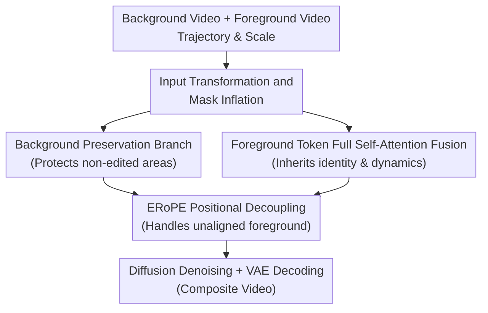

# GenCompositor: Generative Video Compositing with Diffusion Transformer

**Conference**: ICLR2026  
**OpenReview**: [https://openreview.net/forum?id=ynim5u2N4i](https://openreview.net/forum?id=ynim5u2N4i)  
**Paper**: [Project Page](https://gencompositor.github.io/)  
**Code**: To be released  
**Area**: Diffusion Models / Video Generation / Video Editing  
**Keywords**: Generative Video Compositing, Diffusion Transformer, Video Editing, ERoPE, Trajectory Control  

## TL;DR
GenCompositor introduces the task of "Generative Video Compositing," using a specially designed DiT pipeline to inject external foreground videos into background videos based on user-specified trajectories and scales. It maintains background consistency while inheriting foreground identity and dynamics, significantly outperforming alternative solutions in video harmonization, trajectory control, and ablation studies.

## Background & Motivation
**Background**: While video editing and generation can now handle text-driven editing, image-conditioned generation, trajectory control, and video inpainting, real-world video production frequently requires compositing dynamic assets from one shot into another. Traditional compositing relies on manual rotoscoping, masking, color grading, motion matching, and cooperation between VFX artists. If generative models could automate this step, "placing one asset into another video" would become an interactive video generation task.

**Limitations of Prior Work**: Existing methods only cover parts of the problem. Trajectory-controlled video generation typically relies on text or the first frame, often generating something merely "resembling" the object without precisely inheriting the identity, texture, and motion details of the external video. Video harmonization methods usually paste the foreground frame-by-frame before adjusting RGB styles, requiring highly accurate masks and lacking the ability to freely alter object size or motion trajectories. For real compositing, users expect a model to take a foreground video, a background video, and a path, then automatically generate results that fit the environment, cast shadows, or produce lighting effects—capabilities beyond simple color grading or trajectory generation.

**Key Challenge**: This task simultaneously requires "background stability" and "foreground variability." The background video and the final result are layout-aligned, meaning non-edited areas should be identical. However, the foreground video is typically a centered asset in a different coordinate system, not pixel-aligned with the target background. Merging them in the same spatial position would cause foreground shape leakage into wrong areas; using only cross-attention to inject high-level semantics would lose the low-level texture and motion of the source asset.

**Goal**: The authors define generative video compositing as taking background video $v_b$, foreground video $v_f$, and user control $c$ as input to produce a composite video $z_0$. User control includes target trajectory and scale. The model must generate foreground elements at specified locations, preserving their identity and motion, maintaining background consistency, and ensuring natural local lighting, shadows, boundaries, and occlusions.

**Key Insight**: Video compositing is distinct from standard text-to-video or simple paste-and-harmonize tasks. It requires distinguishing between two types of conditions: background, masks, and masked videos share coordinates with the result, whereas foreground videos provide unaligned dynamic conditions. Thus, the authors redesign condition injection around DiT token representations rather than simply concatenating all inputs or relying solely on semantic cross-attention.

**Core Idea**: Use a background preservation branch to protect non-edited areas, employ full self-attention fusion of foreground tokens to inherit external video details, and use ERoPE to provide independent positional labels for unaligned foreground tokens, allowing dynamic assets to be generatively integrated into background videos along user trajectories.

## Method

### Overall Architecture
GenCompositor takes a background video, a foreground video, and user-defined trajectory/scale as inputs. The system first converts user controls into a mask video and a masked background video: the mask specifies the spatio-temporal region where the foreground should appear, while the masked background retains the context by hollowing out the edit area. Subsequently, a lightweight background preservation branch injects non-edited area information into the backbone. The foreground generation backbone fuses noise tokens and foreground tokens within the same self-attention layer via DiT fusion blocks, finally decoding only the portion corresponding to the noise tokens to produce the composite video.

The key to this process is not simply "pasting the foreground," but allowing the model to re-generate the foreground and local environment within the masked region. Consequently, the model can inherit the foreground identity and dynamics while generating coordinated changes at boundaries, shadows, lighting, and impact areas (e.g., explosions).

### Key Designs
**1. Input Transformation and Mask Inflation: Converting interactive control into learnable generation constraints**

User-input trajectories and scales are not conditions that neural networks can use directly. GenCompositor converts the trajectory curve and scale factor into a per-frame binary mask $M_t$, then constructs a masked video $X_t=(1-M_t)\odot v_{b,t}$. If a user only clicks a point, the system tracks its motion via optical flow to approximate a trajectory; if scale is given, the target area size is adjusted based on a Grounded SAM2 mask of the foreground and placed on the trajectory. Thus, user control is ultimately encoded as $(M, X)$ rather than text prompts.

Crucially, rather than using hard-boundary masks, the authors apply mask inflation using Gaussian filtering and thresholding: $\tilde{M}_t=G_\sigma * M^{bin}_t$, $M_t=1[\tilde{M}_t>\tau]$. This inflated region provides an editable buffer zone, allowing the model to modify not just the object interior but also the background pixels near its edges. For video compositing, this buffer is critical: shadows, glows, motion blur, explosion impacts, and boundary errors from inaccurate masks occur near the object, not strictly within the original foreground contour.

**2. Background Preservation Branch: Injecting only non-edited background tokens**

The first priority in video compositing is that the background should not be pointlessly overwritten. The Background Preservation Branch (BPBranch) receives the mask video and masked video, concatenates them along the channel dimension, and processes them through standard DiT blocks to align them with the backbone latent space. Since the mask and masked video share coordinates with the target, the authors use the same RoPE for them, enabling the network to clearly distinguish which background positions to preserve and which to generate.

The injection method for BPBranch is restrained; it uses masked token injection: $z_t=z_t+(1-M)\odot z_{BPBranch}$. The background branch primarily influences non-edited regions, while the edit area is left to the foreground generation backbone and diffusion denoising. This avoids two extremes: without a background branch, the backbone must learn both background recovery and foreground synthesis (harder to train); if the background branch is injected without masking, it might suppress the generation freedom within the foreground region.

**3. Foreground Token Full Self-Attention Fusion: Avoiding cross-attention to prevent loss of low-level dynamic details**

The foreground video provides a dynamic asset with identity, texture, pose, and motion rhythm, not just a semantic label. Traditional cross-attention is good at injecting abstract conditions like text or camera pose but tends to learn only semantic concepts (e.g., "there is a fire") without faithfully inheriting specific appearance and motion. Ablations show that replacing DiT fusion blocks with cross-attention results in semantically related content that fails to faithfully inject the specific foreground element.

Therefore, GenCompositor concatenates the noisy latent tokens and foreground video tokens along the token dimension, feeding them into the DiT fusion block for full self-attention. This allows foreground tokens and target video tokens to interact directly; low-level texture and motion information can pass through Transformer layers to influence the generation area. The authors specifically avoid channel-wise concatenation because the foreground and target are not aligned; overlapping them in the same spatial cell would lead to severe content interference or training collapse. The model finally decodes only the part corresponding to the noisy tokens.

**4. ERoPE: Independent positional labels for layout-unaligned foreground videos**

RoPE assumes all tokens lie on the same spatio-temporal grid, with attention scores depending on relative positions $p-q$. This is valid for the background and masks but not for the foreground video, which is often centered and cropped—its coordinates do not correspond to the object's position in the target background. Sharing RoPE would lead the model to assume tokens at the same index represent the same physical location, causing shape leakage and positional interference.

ERoPE (Extended RoPE) is a lightweight solution: it adds a stream-specific shift to the standard RoPE position indices. For tokens from stream $s\in\{BG, FG\}$, the rotation angle changes from $\theta_{p,k}=\omega_kp$ to $\theta_{s,p,k}=\omega_k(p+\Delta_s)$. Consequently, the attention relationship depends on the effective position difference $(p+\Delta_s)-(q+\Delta_{s'})$, preventing foreground and background streams from colliding on the same positional labels. It introduces no extra parameters and does not block cross-stream attention; it simply informs the model that the two videos exist in different coordinate systems.

### Loss & Training
The model uses the standard latent diffusion noise prediction objective. Given a ground-truth composite video $z_0$, the model generates $z_t=\sqrt{\bar{\alpha}_t}z_0+\sqrt{1-\bar{\alpha}_t}\epsilon$ following a noise schedule and learns to predict the noise:

$$
\min_\theta \mathbb{E}_{z_0,\epsilon,t}\|\epsilon-\epsilon_\theta(z_t\mid v_b,v_f,M,X,t)\|_2^2.
$$

Implementation-wise, the model is based on the CogVideoX-I2V-5B architecture, reusing the VAE and text encoder weights but training a new Transformer. Training uses null text, meaning inference depends solely on input videos and user control. The Transformer has ~6B parameters (including 42 DiT fusion blocks) and a ~300M parameter BPBranch. It was trained from scratch on 8 H20 GPUs; generating a 49-frame $480\times720$ video takes ~65 seconds and 34GB VRAM.

To help the model adapt the foreground to background lighting differences, luminance augmentation is applied during training: the foreground brightness is randomly shifted via gamma correction ($\gamma$ sampled from $0.4$ to $1.9$). This prevents the model from memorizing original foreground brightness, forcing it to adjust appearance based on background context.

## Key Experimental Results

### Main Results
Since there is no direct precedent for this task, the authors compare against two adjacent fields: Video Harmonization (compositing foreground into background) and Trajectory-controlled Video Generation (generating along a path while maintaining identity/motion). Video Harmonization is evaluated on the HYouTube dataset against Harmonizer and VideoTripletTransformer (VTT); Trajectory Control is compared against Tora, Revideo, and VACE on 40 video groups using VBench metrics, FVD, and KVD.

| Task | Method | Representative Metrics | Results | Conclusion |
|------|------|----------|------|------|
| Video Harmonization | Harmonizer | PSNR / SSIM / CLIP / LPIPS | 39.7558 / 0.9402 / 0.9614 / 0.0412 | Significant boundary/style incongruity |
| Video Harmonization | VTT | PSNR / SSIM / CLIP / LPIPS | 40.0251 / 0.9297 / 0.9564 / 0.0455 | Effective spatiotemporal harmonization, but relies on accurate paste |
| Video Harmonization | GenCompositor | PSNR / SSIM / CLIP / LPIPS | **42.0010 / 0.9487 / 0.9713 / 0.0385** | Best across all four metrics |
| Trajectory Generation | Tora | FVD / KVD | 1402.82 / 94.94 | Follows trajectory, but weak identity/consistency |
| Trajectory Generation | Revideo | FVD / KVD | 1342.56 / 64.53 | Objects may disappear or become temporally unstable |
| Trajectory Generation | VACE | FVD / KVD | 942.52 / 120.92 | Relies on first frame; lacks dynamic detail |
| Trajectory Generation | GenCompositor | FVD / KVD | **535.71 / 45.91** | Superior generation quality and dynamic inheritance |

In VBench dimensions, GenCompositor achieves 89.75% in Subject Consistency, 93.43% in Background Consistency, 98.69% in Motion Smoothness, and 52.00% in Aesthetic Quality, all outperforming Tora, Revideo, and VACE.

### Ablation Study
The ablation study examines four components: replacing DiT fusion blocks with cross-attention, removing BPBranch, removing luminance augmentation, and removing mask inflation. Quantitative results show the full model performs best in both harmonization and trajectory control metrics.

| Configuration | PSNR ↑ | SSIM ↑ | LPIPS ↓ | Background Consistency ↑ | Motion Smoothness ↑ | Aesthetic Quality ↑ | Description |
|------|--------|--------|---------|--------------|----------|-------------|------|
| w/o fusion block | 19.8940 | 0.8015 | 0.1535 | 92.21% | 98.34% | 48.85% | Cross-attention cannot stably inherit foreground ID/motion |
| w/o BPBranch | 40.0099 | 0.9378 | 0.0432 | 89.62% | 97.25% | 51.51% | Background preservation significantly weakened |
| w/o augmentation | 39.8040 | 0.9295 | 0.0520 | 89.97% | 98.30% | 50.73% | Foreground brightness/boundaries prone to mismatch |
| w/o mask inflation | 41.8553 | 0.9422 | 0.0409 | 91.62% | 98.28% | 50.87% | Edits restricted to original mask, edge artifacts visible |
| **full model** | **42.0010** | **0.9487** | **0.0385** | **93.43%** | **98.69%** | **52.00%** | Optimal synergy of all components |

### Key Findings
- **DiT fusion block is the core component for foreground injection.** Replacing it with cross-attention causes PSNR to drop from 42.00 to 19.89, proving that low-level dynamic video conditions cannot be passed via semantic-level attention alone.
- **BPBranch primarily contributes to background consistency.** Removing it reduces Background Consistency from 93.43% to 89.62%, indicating that forcing the backbone to handle both background restoration and foreground synthesis increases learning difficulty.
- **Mask inflation and luminance augmentation** are crucial for "boundary editability" and "lighting adaptation," directly impacting the visual realism of the composite even if their impact on metrics is less extreme than the fusion block.
- **User studies** support the quantitative findings: GenCompositor was preferred by 71.58% of users in harmonization tasks and 77.37% in trajectory-controlled generation tasks.

## Highlights & Insights
- The most significant value of this paper is redefining "video compositing" from a traditional post-production workflow into a generative task. It’s not just low-level color grading or text-to-video; it allows dynamic assets to enter a video in a user-controlled manner.
- **ERoPE** is a clean, effective design. It introduces no new parameters but solves the fundamental problem of layout-unaligned condition fusion by adding stream-specific shifts to RoPE. This could potentially be applied to multi-view conditions or reference-driven editing.
- **Full self-attention fusion of foreground tokens** is a pragmatic choice. The value of video assets lies in low-level details and temporal dynamics, not semantic summaries; thus, allowing tokens to interact directly in the DiT block is more faithful to the task essence.
- **Mask inflation** highlights the difference between generative compositing and traditional pasting. Rather than fearing inaccurate masks, GenCompositor expands the editable area to let the model generate shadows, glows, and local environmental reactions.

## Limitations & Future Work
- **High inference cost**: Generating 49 frames at $480\times720$ requires ~65 seconds and 34GB VRAM on a 6B Transformer, which is still heavy for average creator workflows.
- **Lighting adaptation** mostly relies on luminance augmentation. While it succeeds in diverse lighting, complex extreme lighting still lacks robustness; future work could replace simple brightness perturbations with richer physical lighting priors.
- **Occlusion and 3D relationships** remain challenging. While GenCompositor can generate some occlusion, complex depth ordering, object intersections, and perspective changes might require depth-aware or 3D priors.
- **Multi-object compositing**: The paper focuses on single elements; although the appendix shows multi-object cases, the interactions (collisions, mutual occlusions) have not been systematically quantified.

## Related Work & Insights
- **vs. Video Harmonization**: Methods like Harmonizer or VTT adjust color for pre-pasted foregrounds. GenCompositor doesn't require precise pasting, instead generating the composite directly from the asset and trajectory, handling boundaries and local environment changes.
- **vs. Trajectory-controlled Generation**: Models like Tora or Revideo follow trajectories but rely on text or single frames, struggling to inherit the full identity and dynamics of an external video. GenCompositor's use of a dynamic video condition makes it better suited for asset-level compositing.
- **vs. Cross-attention injection**: IP-Adapter-style cross-attention is better for abstract semantic or image reference. This work proves that for low-level, dense, temporal foreground conditions, token-wise self-attention is more reliable.
- **Feature expansion**: Replacing the foreground condition with a blank video allows GenCompositor to naturally degrade into video inpainting or object removal, suggesting generative compositing could serve as a general video editing foundation.

## Rating
- Novelty: ⭐⭐⭐⭐⭐ (First systematic definition of generative video compositing with specialized layout-aligned/unaligned architecture.)
- Experimental Thoroughness: ⭐⭐⭐⭐☆ (Strong results and user studies, though lacks a dedicated task-specific benchmark.)
- Writing Quality: ⭐⭐⭐⭐☆ (Clear method and diagrams; some implementation details rely on the appendix.)
- Value: ⭐⭐⭐⭐⭐ (Highly relevant to real video production; designs like ERoPE and token fusion are highly reusable for controllable video editing.)

<!-- RELATED:START -->

## Related Papers

- [\[ICLR 2026\] CreatiDesign: A Unified Multi-Conditional Diffusion Transformer for Creative Graphic Design](creatidesign_a_unified_multi-conditional_diffusion_transformer_for_creative_grap.md)
- [\[CVPR 2026\] DDT: Decoupled Diffusion Transformer](../../CVPR2026/image_generation/ddt_decoupled_diffusion_transformer.md)
- [\[ICLR 2026\] QVGen: Pushing the Limit of Quantized Video Generative Models](qvgen_pushing_the_limit_of_quantized_video_generative_models.md)
- [\[CVPR 2026\] STCDiT: Spatio-Temporally Consistent Diffusion Transformer for High-Quality Video Super-Resolution](../../CVPR2026/image_generation/stcdit_spatio-temporally_consistent_diffusion_transformer_for_high-quality_video.md)
- [\[ICCV 2025\] SummDiff: Generative Modeling of Video Summarization with Diffusion](../../ICCV2025/image_generation/summdiff_generative_modeling_of_video_summarization_with_diffusion.md)

<!-- RELATED:END -->
