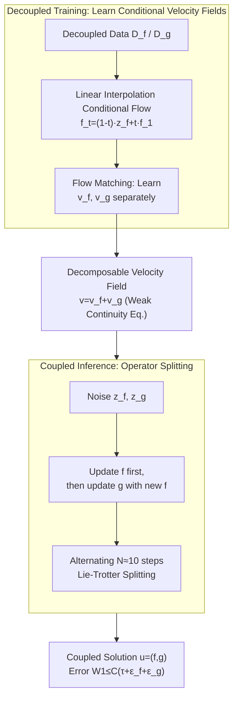

# GenCP: Towards Generative Modeling Paradigm of Coupled Physics

**Conference**: ICLR 2026  
**arXiv**: [2601.19541](https://arxiv.org/abs/2601.19541)  
**Code**: [GitHub](https://github.com/AI4Science-WestlakeU/GenCP)  
**Area**: Generative Physical Simulation / Flow Matching  
**Keywords**: coupled physics simulation, flow matching, operator splitting, multiphysics, decoupled training

## TL;DR

GenCP is proposed to model coupled multi-physics simulation as a probability density evolution problem. It utilizes flow matching to learn conditional velocity fields from decoupled data and synthesizes coupled solutions via Lie-Trotter operator splitting during inference. This achieves "decoupled training, coupled inference" with theoretically controllable error guarantees.

## Background & Motivation

**Background**: Coupled multi-physics simulation (e.g., fluid-structure interaction (FSI), nuclear-thermal coupling) is a core problem in engineering. Numerical methods are divided into tight coupling (high accuracy but extremely high computational cost) and loose coupling (practical but unstable convergence). While surrogate models and neural operators can accelerate simulations, most rely on coupled solutions as training data, which is extremely expensive to obtain (over 5x costlier than decoupled data).

**Limitations of Prior Work**: (1) Surrogate methods approximate coupled solutions via Gauss-Seidel/ADMM iterations during inference but perform poorly under complex spatio-temporal dynamics (struggling to capture high-frequency, high-dimensional, and stochastic behaviors); (2) Existing generative methods either handle only single physics or learn directly from coupled data, overlooking the challenge of learning coupled physics from decoupled data; (3) M2PDE attempts to embed coupled iterations in each diffusion step but lacks theoretical guarantees.

**Key Challenge**: The cost of obtaining coupled training data in engineering is extremely high, whereas decoupled data is easily accessible. How can one learn from decoupled data to generate high-precision coupled solutions during inference?

**Goal**: Develop a framework to learn coupled physics from decoupled training data while ensuring high fidelity, high efficiency, and high reliability ("3H").

**Key Insight**: Re-model coupled physical simulation as the evolution of probability density in function spaces. Utilize flow matching to learn conditional velocity fields (decoupled training) and operator splitting to synthesize coupled inference during flow steps. Establish a theoretical foundation through the weak form of the continuity equation and Lie-Trotter splitting.

**Core Idea**: Synthesize coupled inference by using operator splitting to combine decoupled velocity fields in the probability space, which is physically equivalent to iteratively solving coupled fields within the noisy latent space.

## Method

### Overall Architecture

GenCP re-conceptualizes "coupled physical simulation" as a transport problem of probability measures in function space from noise to the true solution, divided into training and inference stages: during training, conditional velocity fields $\hat{v}_f$ and $\hat{v}_g$ are learned separately on decoupled datasets $\mathcal{D}_f$ and $\mathcal{D}_g$ using flow matching; during inference, Lie-Trotter operator splitting is employed to alternately push the two fields within each flow step, evolving the coupled solution from noise. Interaction is handled during the sampling steps rather than through post-sampling iterative correction. This is supported by a theoretical pivot (decomposability of velocity fields via probability evolution) and error guarantees.

### Key Designs

**1. Probability Density Evolution Perspective: Coupled Simulation as a Decomposable Transport Problem**

To learn coupling from decoupled data, a mathematical framework is needed to "detach and reattach" the two fields. GenCP places the joint state $u=(f,g)$ in the product space $\mathcal{U}=\mathcal{F}\times\mathcal{G}$ and describes its evolution from initial noise to the target distribution using a family of probability measures $\mu_t$. Crucially, it employs the weak form of the continuity equation: $\int_0^1 \int_{\mathcal{U}} (\partial_t\varphi + \langle D\varphi, v\rangle)\, d\mu_t\, dt = 0$. This is well-posed in function spaces where densities or divergence operators may not exist. This linearity allows the decomposition $v = v^{(f)} + v^{(g)}$, forming the theoretical root for decoupled training.

**2. Time-Parameterized Linear Interpolation Training: Efficient Supervision from Decoupled Data**

With a decomposable velocity field, GenCP uses a linear interpolation conditional flow path. For field $f$, given $(f_1, \bar{g})$ from $\mathcal{D}_f$ and noise $z_f, z_g$, it constructs $f_t = (1-t)z_f + t f_1$. The instantaneous velocity is constant $v_f = f_1 - z_f$. The model $\hat{v}_f(f_t, g_t, t; \theta_f)$ takes current $f_t, g_t$ and $t$ as inputs. Even with decoupled training data, the network learns to "push $f$ given $g$", encoding the coupling relationship into conditional inputs. Field $g$ is treated symmetrically.

**3. Lie-Trotter Operator Splitting Inference: Synthesizing Coupling via Alternating Steps**

Inference reassembles the learned conditional velocity fields. GenCP borrows a classic numerical analysis technique: partitioning $[0,1]$ into $N$ steps of size $\tau = 1/N$. Within each step, it updates $f \leftarrow f + \tau\, \hat{v}_f(f,g,t)$ followed by $g \leftarrow g + \tau\, \hat{v}_g(f,g,t)$. This first-order Lie-Trotter splitting converges to the true joint flow as $\tau \to 0$. Physically, this embeds the "coupling" into the sampling steps, typically requiring only ~10 steps.

**4. Theoretical Error Guarantee: Linear Control of Global Error**

To address potential error accumulation from decoupling, Theorem 3.1 states: the Wasserstein distance between the approximate and true distributions satisfies $W_1(\mu_1^{(\tau,\text{learn})}, \mu_1) \leq C_{\text{stab}}(\tau + \varepsilon_f + \varepsilon_g)$. The total error is linearly bounded by the splitting step $\tau$ and the individual learning errors $\varepsilon_f, \varepsilon_g$. This provides a rigorous convergence guarantee that prior methods like M2PDE lack.

### Loss & Training

Each velocity field is trained independently using the standard flow matching MSE loss. For $f$:

$$\mathcal{L}_f(\theta_f) = \mathbb{E}_{t, (f_1,\bar{g}), z_f, z_g} \big[\|v_f - \hat{v}_f(f_t, g_t, t; \theta_f)\|^2_\mathcal{F}\big]$$

The term $\mathcal{L}_g(\theta_g)$ is defined symmetrically. Inference uses Lie-Trotter splitting, with 10 steps usually sufficient to generate coupled solutions.

## Key Experimental Results

### Main Results

**2D Synthetic Distribution Experiment**

| Paradigm | W1↓ | MMD↓ | Energy Distance↓ |
|----------|-----|------|-------------------|
| GenCP (Easy) | 0.4366 | 0.0095 | 0.0411 |
| M2PDE (Easy) | 0.5177 | 0.0141 | 0.0625 |
| GenCP (Complex) | **0.4928** | **0.0053** | **0.0061** |
| M2PDE (Complex) | 25450 | ∞ | 332.4 |

M2PDE collapses on complex distributions, while GenCP remains stable.

**Turek-Hron FSI Task (Relative L2 Error)**

| Method | u | v | p | SDF | Inference Time |
|--------|---|---|---|-----|----------------|
| Joint Training | 0.0088 | 0.0344 | 0.0544 | 0.0079 | — |
| M2PDE-FNO* | 0.0590 | 0.2415 | 0.2474 | 0.2482 | 277.2s |
| Surrogate-FNO* | 0.0550 | 0.2257 | 0.2553 | 0.0112 | 93.2s |
| **GenCP-FNO*** | **0.0396** | **0.1678** | **0.1897** | **0.0081** | **19.5s** |

GenCP reduces average error by ~26.77% on the FNO* backbone with 14x faster inference.

### Ablation Study

| Backbone | GenCP vs M2PDE Error Reduction | GenCP vs Surrogate Error Reduction | Efficiency Gain |
|----------|-------------------------------|----------------------------------|-----------------|
| FNO* | ~26.77% | Significant | ~14× |
| CNO | ~12.54% | Significant | ~18× |

### Key Findings

1.  **Decoupled Training to Coupled Inference is Feasible**: GenCP successfully recovers joint distributions from conditional training, significantly outperforming M2PDE on complex distributions.
2.  **Extreme Efficiency**: Requires only ~10 sampling steps for accurate coupled solutions, 14-18 times faster than M2PDE.
3.  **Proximity to Joint Training in SDF**: Error in the Signed Distance Function (SDF) field with the CNO backbone (0.0183) is close to joint training (0.0079), indicating effective coupling transfer through splitting.
4.  **Surrogates' deceptive performance**: While surrogate models may show low SDF error, they fail to capture the oscillatory bending dynamics of the beam; GenCP is the only method to capture these effects.
5.  **M2PDE instability**: Design choices in M2PDE (coupling iterations + error accumulation) lead to mode collapse in complex scenarios.

## Highlights & Insights

-   **Theoretical Elegance**: Naturally derives velocity field decomposition and Lie-Trotter splitting from the weak continuity equation.
-   **Controllable Error Guarantee**: Theorem 3.1 proves total error is linearly controlled by step size and learning error, a rarity in AI for Science.
-   **High Practical Value**: Decoupled data is over 5x cheaper than coupled data; GenCP enables large-scale multi-physics simulation.
-   **"Coupling in Flow"**: Embedding the coupling process into the flow matching sampling steps rather than post-sampling iteration provides a fundamental efficiency advantage.
-   **Open Dataset**: Released datasets for FSI and nuclear-thermal coupling to benefit the community.

## Limitations & Future Work

1.  **First-Order Splitting**: Lie-Trotter is first-order; Strang splitting (second-order) could be explored for higher precision.
2.  **Scale of Coupling**: Claims extendibility to $m$ fields, but experiments only verify two-field coupling.
3.  **Backbone Dependency**: Final accuracy is limited by the expressive power of FNO*/CNO.
4.  **Data Requirements**: Still requires decoupled simulation data; leveraging experimental data remains a hurdle.
5.  **Long-term Propagation**: Primarily verified short-term predictions (12 steps); long-term error accumulation requires further study.

## Related Work & Insights

-   **Comparison with M2PDE**: M2PDE embeds coupling in diffusion steps without theoretical grounding; GenCP provides rigor via operator splitting.
-   **Links to Numerical Analysis**: Introduces classical operator splitting (Trotter/Strang) into generative model inference.
-   **Inspiration for AI4S**: The probability density evolution perspective may generalize to broader multi-field problems.
-   **Distinction from Conditional Diffusion**: Not merely generating one field given another, but alternating updates in a joint flow evolution.

## Rating

-   **Novelty**: ⭐⭐⭐⭐⭐ — Elegantly combines operator splitting with flow matching.
-   **Experimental Thoroughness**: ⭐⭐⭐⭐ — Covers synthetic, FSI, and nuclear-thermal, but long-term evolution is untested.
-   **Writing Quality**: ⭐⭐⭐⭐ — Rigorous and clear, though high mathematical density may be challenging.
-   **Value**: ⭐⭐⭐⭐⭐ — Provides a new paradigm for multi-physics simulation with both theoretical and practical impact.

<!-- RELATED:START -->

## Related Papers

- [\[ICLR 2026\] Flow Along the $K$-Amplitude for Generative Modeling](flow_along_the_k-amplitude_for_generative_modeling.md)
- [\[ICLR 2026\] Partition Generative Modeling: Masked Modeling Without Masks](partition_generative_modeling_masked_modeling_without_masks.md)
- [\[ICLR 2026\] LapFlow: Laplacian Multi-scale Flow Matching for Generative Modeling](lapflow_laplacian_multi-scale_flow_matching_for_generative_modeling.md)
- [\[CVPR 2026\] Test-Time Instance-Specific Parameter Composition: A New Paradigm for Adaptive Generative Modeling](../../CVPR2026/image_generation/test-time_instance-specific_parameter_composition_a_new_paradigm_for_adaptive_ge.md)
- [\[ICLR 2026\] Gauge Flow Matching: Efficient Constrained Generative Modeling over General Convex Set and Beyond](gauge_flow_matching_efficient_constrained_generative_modeling_over_general_conve.md)

<!-- RELATED:END -->
