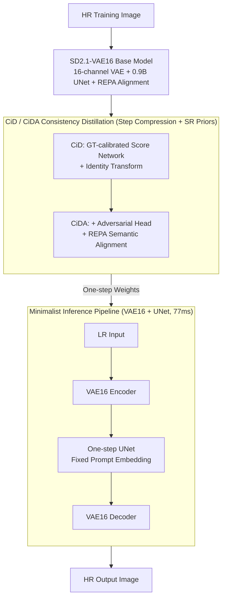

# GenDR: Lighten Generative Detail Restoration

**Conference**: ICLR 2026  
**arXiv**: [2503.06790](https://arxiv.org/abs/2503.06790)  
**Code**: None  
**Area**: Image Generation  
**Keywords**: One-step super-resolution, latent space expansion, score distillation, VAE 16-channel, consistency distillation

## TL;DR
GenDR is proposed as a lightweight one-step diffusion super-resolution (SR) model for generative detail restoration. It identifies a fundamental divergence between T2I and SR objectives (T2I requires multi-step + 4-channel latents, whereas SR needs fewer steps + 16-channel latents). The authors build a custom SD2.1-VAE16 base model (0.9B, using REPA for representation alignment to expand latent space without increasing model size) and propose CiD/CiDA consistency score identity distillation (integrating SR-specific priors into score distillation + adversarial learning + representation alignment). The minimalist pipeline, consisting only of UNet and VAE, achieves 77ms inference, outperforming existing SOTAs in both quality and efficiency.

## Background & Motivation

**Background**: Real-world SR based on diffusion models has achieved significant progress, surpassing GAN-based methods in quality. However, they suffer from slow inference speeds and bottlenecks in detail fidelity.

**Key Challenge**: There is a fundamental divergence between text-to-image (T2I) and SR tasks. T2I generates complete images from noise, requiring multi-step inference and low-dimensional latent spaces (4-channel VAE to reduce generation difficulty). Conversely, SR only needs to supplement high-frequency details, requiring fewer steps but larger latent spaces (16-channel VAE) to preserve input information.

**Limitations of Prior Work**: Accelerating inference (e.g., OSEDiff one-step distillation) leads to significant quality degradation. Improving quality (e.g., DreamClear using PixArt-α + ControlNet) introduces massive computational overhead, creating a dilemma between quality and efficiency.

**Model Scale**: Existing 16-channel VAE diffusion models (e.g., FLUX 12B, SD3.5) are oversized for SR tasks. Processing 4× SR with FLUX in a single step requires >40GB VRAM and 1.4s, which is 5.3×/11.4× that of SD2.1.

**Distillation Flaws**: Current score distillation methods (VSD/SiD) are designed for T2I. Direct application to SR causes quality or content inconsistency due to training distribution mismatches and over-reliance on imperfect score functions.

**Key Insight**: SR requires a customized base model (16-channel + appropriate 0.9B scale) + a tailored distillation method (CiD incorporating SR priors) + a minimalist inference pipeline.

## Method

### Overall Architecture

GenDR decomposes the "customized diffusion for SR" into three layers. First, the SD2.1 UNet is paired with a 16-channel VAE and trained into a 0.9B base model (SD2.1-VAE16) to ensure the latent space can accommodate required SR details. Second, CiD/CiDA consistency distillation compresses multi-step sampling into a single step while injecting SR image priors into the distillation process. Finally, the scheduler and text encoder are removed, leaving a minimalist pipeline (VAE + UNet) for 77ms inference. The four key designs follow the sequence: "Base Model → Distillation → Inference Pipeline."

### Key Designs

**1. SD2.1-VAE16: Restoring SR Details via 16-Channel Latent Space**

The essence of SR is supplementing high-frequency details rather than generation from noise; thus, the integrity of input information within the latent space is critical. 4-channel VAEs designed for T2I use irreversible compression that discards fine textures. While 16-channel DiTs like FLUX/SD3.5 have capacity, their 12B scale is excessive for 4× SR. The authors replace the VAE of SD2.1 with an open-source 16-channel version and perform full-parameter training for a 0.9B base model. Representation Alignment (REPA) provides semantic supervision: an MLP head $h$ after the first UNet downsampling block aligns intermediate features $\mathbf{h}_t = f_\theta(\mathbf{z}_t)$ to pretrained DINOv2 HR representations $\mathbf{h}_\mathcal{E} = \mathcal{E}(\mathbf{x}_h)$:

$$\mathcal{L}^{(\text{repa})} = -\mathbb{E}_{\mathbf{x}_h, t}\left[\frac{1}{N}\sum_{n=1}^{N}\text{sim}\left(\mathbf{h}_\mathcal{E}[n], h(\mathbf{h}_t[n])\right)\right]$$

This expands the channels without increasing model parameters, yielding significant detail gains in SR despite a minor T2I regression.

**2. CiD: Injecting SR Priors into Score Distillation for Stable One-step Output**

Score distillation methods like VSD/SiD, designed for T2I, align with text embedding distributions. Direct application to SR results in content drift and inconsistent quality. CiD modifies SiD in two ways: first, it trains the "real" score network $\phi$ using HR targets $\mathbf{z}_h$ to anchor the output distribution on the high-fidelity image manifold; second, it replaces fluctuating generation results $\mathbf{z}_g$ in the distillation target with stable HR targets $\mathbf{z}_h$ for identity transformation. The final loss adds a CFG-guided term $\mathcal{L}_\theta^{(3)}$ targeting $\mathbf{z}_h$ to the original SiD term $\mathcal{L}_\theta^{(1)}$:

$$\mathcal{L}_\theta^{(\text{cid})} = \mathcal{L}_\theta^{(3)} - \xi \mathcal{L}_\theta^{(1)}$$

CiD effectively integrates SR image priors, improving Q-Align from 4.391 to 4.428 over SiD.

**3. CiDA: Adversarial Learning for Realism and REPA for Stability**

Pure score distillation often produces over-smoothed "AI-looking" details. CiDA adds two components to CiD. An adversarial term uses the pretrained UNet $\phi$ as a feature extractor with a discriminant head $h$ to force results into the real texture distribution. REPA provides high-level semantic regularization to prevent structural distortion during adversarial training and speed up convergence:

$$\mathcal{L}_\theta^{(\text{cida})} = \lambda_1 \mathcal{L}_\theta^{(\text{cid})} + \lambda_2 \mathcal{L}_\theta^{(\text{adv})} + \lambda_3 \mathcal{L}_\theta^{(\text{repa})}$$

VRAM cost is controlled by using LoRA (rank=64) for the discriminator and sharing the base model for feature extraction. Q-Align further improves to 4.453.

**4. Minimalist Inference Pipeline: Eliminating Redundant Components**

For one-step inference, the multi-step scheduler is redundant and replaced by fixed $\bar{\alpha}_t = \bar{\beta}_t = 0.5$. The text encoder is replaced by pre-computed fixed prompt embeddings, as a general quality description suffices for SR. This reduces parameters from 1775M to 933M and inference time from over 113ms to 77ms (A100, 512²), with negligible quality loss compared to dynamic prompt generation.

## Key Experimental Results

### Table 1: Quantitative Comparison on Synthetic ImageNet-Test (×4 SR)

| Method | Steps | PSNR↑ | NIQE↓ | LIQE↑ | ClipIQA↑ | MUSIQ↑ | Q-Align↑ |
|------|------|-------|-------|-------|----------|--------|----------|
| Real-ESRGAN | GAN | 26.62 | 4.49 | 3.84 | 0.509 | 64.81 | 3.423 |
| DiffBIR-50 | 50 | 25.45 | 4.93 | 4.64 | 0.749 | 73.04 | 4.323 |
| DreamClear-50 | 50 | 24.76 | 5.38 | 4.43 | 0.765 | 70.08 | 4.092 |
| OSEDiff-1 | 1 | 24.82 | 4.28 | 4.56 | 0.678 | 71.74 | 4.067 |
| InvSR-1 | 1 | 23.81 | 4.39 | 4.56 | 0.711 | 72.38 | 3.987 |
| **Ours (GenDR-1)** | **1** | 24.14 | **4.13** | **4.81** | 0.740 | **74.68** | **4.361** |

### Table 2: Quantitative Comparison on RealSet80

| Method | Inference Time | NIQE↓ | LIQE↑ | ClipIQA↑ | MUSIQ↑ | Q-Align↑ |
|------|----------|-------|-------|----------|--------|----------|
| StableSR-50 | 3731ms | 3.40 | 3.85 | 0.740 | 67.58 | 4.087 |
| SeeSR-50 | 6359ms | 4.37 | 4.28 | 0.712 | 69.74 | 4.306 |
| DreamClear-50 | 6892ms | 3.73 | 3.96 | 0.724 | 67.22 | 4.121 |
| OSEDiff-1 | 103ms | 3.98 | 4.13 | 0.704 | 69.19 | 4.306 |
| InvSR-1 | 115ms | 4.03 | 4.29 | 0.727 | 69.79 | 4.301 |
| **Ours (GenDR-1)** | **77ms** | **3.98** | **4.52** | **0.742** | **71.57** | **4.453** |

### Ablation Study: Distillation Strategy (RealSet80)

| Base Model | Distillation Strategy | LIQE↑ | ClipIQA↑ | MUSIQ↑ | Q-Align↑ |
|----------|----------|-------|----------|--------|----------|
| SD2.1-VAE4 | VSD | 4.13 | 0.704 | 69.19 | 4.306 |
| SD2.1-VAE4 | CiDA | 4.32 | 0.723 | 70.13 | 4.386 |
| SD2.1-VAE16 | VSD | 4.12 | 0.691 | 68.82 | 4.373 |
| SD2.1-VAE16 | SiD | 4.25 | 0.702 | 69.33 | 4.391 |
| SD2.1-VAE16 | CiD | 4.44 | 0.715 | 70.61 | 4.428 |
| SD2.1-VAE16 | **CiDA** | **4.52** | **0.742** | **71.57** | **4.453** |

## Key Findings

1. **Target divergence is the root cause**: T2I needs multi-step + 4-channel latents to generate content from noise; SR only needs to supplement high-frequency details. Reusing T2I models for SR is sub-optimal.
2. **16-channel VAE is vital for SR**: Even on 0.9B models, VAE16 preserves significantly more detail and structure than VAE4.
3. **CiDA facilitates progressive gains**: The evolution from VSD → SiD → CiD → CiDA shows clear improvements, with CiD contributing ~0.05 and Adversarial ~0.03 to Q-Align.
4. **Fixed prompt embeddings maintain quality**: Compared to dynamic LLM-generated prompts, fixed embeddings only drop MUSIQ by 0.17 while reducing inference from 113ms to 77ms.
5. **Pareto optimal efficiency**: GenDR achieves the best NR-IQA scores with the fastest inference (77ms) and near-minimal parameter count (933M), accelerating by 89.5× relative to DreamClear.

## Highlights & Insights

- **Deep Insight**: Systematically analyzes the divergence between T2I and SR objectives, providing a theoretical foundation for custom diffusion SR models.
- **Systematic Solution**: Optimizes across the base model (VAE16), distillation method (CiDA), and pipeline efficiency.
- **Extreme Efficiency**: 77ms one-step inference, 25-33% faster than previous one-step methods like OSEDiff/InvSR.
- **Training Practicality**: Efficiently trains three UNet variants (score, generator, discriminator) using LoRA and model sharing.

## Limitations & Future Work

- **Latent Space Exploration**: The effectiveness of 16-channel VAE is verified, but larger spaces (32/64 channels) were not explored due to training costs.
- **CiDA VRAM Requirements**: Despite LoRA/DeepSpeed, CiDA requires significant VRAM, making it difficult to scale to large DiT models (e.g., FLUX).
- **PSNR Trade-off**: While leading in perceptual metrics (LIQE/MUSIQ), GenDR's PSNR is lower than GAN-based and some multi-step methods, indicating a trade-off in pixel-level fidelity.

## Related Work & Insights

| Dimension | OSEDiff (Wu et al., 2024b) | Ours (GenDR) |
|------|---------------------------|-------------|
| Base Model | SD2.1 (4-channel VAE, 0.9B) | SD2.1-VAE16 (16-channel VAE, 0.9B) |
| Mechanism | VSD + L1/MSE Regularization | CiDA: SR Priors + Adv + REPA |
| Inference Time | 103ms | 77ms |
| Q-Align | 4.306 | 4.453 |

| Dimension | DreamClear (Ai et al., 2025) | Ours (GenDR) |
|------|------------------------------|-------------|
| Base Model | PixArt-α (2.2B) | SD2.1-VAE16 (0.9B) |
| Steps | 50 | 1 |
| Function | 2 ControlNets + MLLM | Minimalist (Fixed Embedding) |
| Inference Time | 6892ms (3×A100) | 77ms (1×A100) |
| MUSIQ | 67.22 | 71.57 |

## Rating (1-5)

- **Novelty**: 4 — Insight into T2I/SR divergence is novel; CiD's integration of SR priors into score distillation is an original contribution.
- **Technical Depth**: 4 — Well-modeled evolution from VSD to CiDA with rigorous ablation of design decisions.
- **Experimental Thoroughness**: 4 — Comprehensive evaluation across 13 metrics and real/synthetic datasets, though downstream task evaluation is absent.
- **Writing Quality**: 4 — High-quality presentation with clear motivation and logical progression.

<!-- RELATED:START -->

## Related Papers

- [\[ICLR 2026\] Eliminating VAE for Fast and High-Resolution Generative Detail Restoration](eliminating_vae_for_fast_and_high-resolution_generative_detail_restoration.md)
- [\[ICLR 2026\] Massive Activations are the Key to Local Detail Synthesis in Diffusion Transformers](massive_activations_are_the_key_to_local_detail_synthesis_in_diffusion_transform.md)
- [\[ICLR 2026\] Bridging Degradation Discrimination and Generation for Universal Image Restoration](bridging_degradation_discrimination_and_generation_for_universal_image_restorati.md)
- [\[ICLR 2026\] LVTINO: LAtent Video consisTency INverse sOlver for High Definition Video Restoration](lvtino_latent_video_consistency_inverse_solver_for_high_definition_video_restora.md)
- [\[AAAI 2026\] Multi-Metric Preference Alignment for Generative Speech Restoration](../../AAAI2026/image_generation/multi-metric_preference_alignment_for_generative_speech_restoration.md)

<!-- RELATED:END -->
