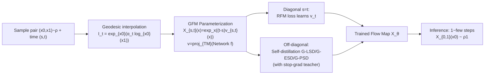

# Generalised Flow Maps for Few-Step Generative Modelling on Riemannian Manifolds

**Conference**: ICLR 2026  
**OpenReview**: [https://openreview.net/forum?id=1YHF7B8Yjk](https://openreview.net/forum?id=1YHF7B8Yjk)  
**Code**: To be confirmed  
**Area**: Generative Models / Geometric Deep Learning  
**Keywords**: Flow Map, Riemannian Manifold, Few-step Generation, Self-distillation, Consistency Models, Flow Matching  

## TL;DR
The "Flow Map" framework from Euclidean space is generalized to arbitrary Riemannian manifolds by proposing Generalised Flow Maps (GFM). Using three self-distillation losses, geometric generative models capable of "one-step/few-step" sampling on manifolds are trained from scratch, unifying and enhancing consistency models, shortcut models, and MeanFlow for manifold settings.

## Background & Motivation
- **Background**: The paradigm of "dynamical measure transport"—comprising diffusion, flow matching, and stochastic interpolants—dominates Euclidean data (images) and naturally extends to data with inherent geometry, such as protein backbones (SE(3)$^N$), molecular materials, geospatial data, and discrete data on probability simplexes, leading to numerous Riemannian generative models.
- **Limitations of Prior Work**: While these models utilize simple regression targets for fast, simulation-free training, **inference is extremely expensive**. They require numerical ODE solvers with dozens or hundreds of evaluations of large networks. On manifolds, this is exacerbated by the need to compute manifold constraint operators at each step (e.g., exponential/logarithmic maps for SO(3) requiring truncated infinite matrix power series), which is slow and introduces numerical errors.
- **Key Challenge**: Mature "few-step acceleration" solutions exist for Euclidean space, such as high-order samplers and distillation methods (Consistency Models/Shortcut/MeanFlow) that directly learn the flow map (the global solution operator of the ODE rather than the instantaneous vector field). However, these methods **assume data resides in $\mathbb{R}^d$**. Their flow map parameterization, $X_{s,t}(x_s)=x+(t-s)v_{s,t}(x_s)$, uses linear extrapolation, which does not remain on the manifold.
- **Goal**: To port the "Flow Map" principles to arbitrary Riemannian manifolds, resulting in a new class of generative models that preserve geometric inductive biases while enabling few-step inference.
- **Key Insight**: **Replace linear extrapolation with the exponential map**. The flow map is reparameterized as $X_{s,t}(x_s)=\exp_{x_s}\big((t-s)\,v_{s,t}(x_s)\big)$, which automatically satisfies boundary conditions and ensures points remain on the manifold. Furthermore, the three Euclidean self-distillation losses (Eulerian, Lagrangian, and Progressive) are "uplifted" to manifolds using Riemannian metrics to distill flow maps from scratch without requiring a pre-trained teacher.

## Method

### Overall Architecture
GFM seeks to learn the "jump operator" $X_{s,t}$ of an ODE. Given any trajectory $(x_t)$ of a probability flow ODE, it satisfies $X_{s,t}(x_s)=x_t$ for any time pair $(s,t)$. Thus, one-step sampling is achieved by sampling $x_0\sim\rho_0$ and directly computing $X_{0,1}(x_0)\sim\rho_1$. Training is split: on the diagonal ($s=t$), Riemannian Flow Matching (RFM) is used to learn the instantaneous vector field $v_{t,t}=v_t$; off the diagonal, self-distillation losses enforce global jump consistency. The total loss is $\mathcal{L}=\mathcal{L}_{\text{RFM}}+\mathcal{L}_{\text{GFM-SD}}$.

### Key Designs

**1. Exponential map parameterization + tangent space projection**: The Euclidean flow map $x+(t-s)v$ deviates from manifolds. The authors adapt this to $X_{s,t}(x_s)=\exp_{x_s}\big((t-s)v_{s,t}(x_s)\big)$. Since $\exp_{x_s}(\vec 0)=x_s$, the boundary condition $X_{s,s}=\mathrm{Id}$ is inherently satisfied. The interpolant is no longer a linear combination of $x_0, x_1$ but a **geodesic** $I_t=\exp_{x_0}(\alpha_t\log_{x_0}(x_1))$ connecting the two points. The output of the underlying neural network $f^\theta:[0,1]^2\times M\to\mathbb{R}^d$ is projected onto the tangent plane $v^\theta_{s,t}(p):=\mathrm{proj}_{T_pM}\big(f^\theta_{s,t}(p)\big)$, ensuring all subsequent operations are well-defined. The authors prove that when $M=\mathbb{R}^d$, the framework reduces to the Euclidean case of Albergo & Vanden-Eijnden.

**2. Three equivalents ⇒ Three Riemannian self-distillation losses**: Proposition 1 proves the above parameterization is the unique GFM if and only if it satisfies one of three conditions: Lagrangian ($\partial_t X_{s,t}=v_t(X_{s,t})$), Eulerian ($\partial_s X_{s,t}+d(X_{s,t})_{x_s}[v_s]=0$), or Semigroup ($X_{u,t}(X_{s,u}(x_s))=X_{s,t}(x_s)$). Each corresponds to a loss: **G-LSD** (Lagrangian) penalizes $\big\|\partial_t X^\theta_{s,t}(I_s)-v^\theta_{t,t}(X^\theta_{s,t}(I_s))\big\|_g^2$; **G-ESD** (Eulerian) penalizes $\big\|\partial_s X^\theta_{s,t}(x_s)+d(X^\theta_{s,t})_{I_s}[v^\theta_{s,s}(I_s)]\big\|_g^2$; and **G-PSD** (Progressive) uses geodesic distance $d_g$ to enforce semigroup consistency $d_g^2\big(X^\theta_{s,t}(I_s),\,X^\theta_{u,t}(X^\theta_{s,u}(I_s))\big)$. Norms are replaced by the Riemannian metric $\|\cdot\|_g$ to keep scales comparable to flow matching losses.

**3. Stop-gradient bootstrapping**: To stabilize training, the authors apply stop-gradients to the "teacher" terms in each loss. For G-LSD, $v^\theta_{t,t}(\cdot)$ is stopped (gradients for $\partial_t X^\theta_{s,t}$ utilize forward-mode JVP). For G-ESD, the term $d(X^\theta_{s,t})_{I_s}[\cdot]$ containing spatial derivatives is stopped to avoid second-order derivatives. For G-PSD, the composition of two small steps $X^\theta_{u,t}(X^\theta_{s,u}(I_s))$ acts as the teacher for the large step, with $u=\tfrac12 s+\tfrac12 t$.

**4. Unification of Euclidean few-step models**: The authors demonstrate that these Riemannian losses recover existing methods under specific designs: G-ESD is closely related to a Riemannian version of MeanFlow (implemented as **G-MF**), G-PSD generalizes the shortcut model of Frans et al. to manifolds, and the diagonal case aligns with Consistency Models. Thus, GFM serves as a unified Riemannian framework for these approaches.

## Key Experimental Results
The study covers five types of manifold data: protein side-chain torsion angles ($T^2\cong S^1\times S^1$), RNA backbones ($T^7$), Earth geographic hazard data ($S^2$), synthetic 3D rotations SO(3), and the Poincaré hyperbolic disk. Metrics include MMD (sampling quality) and NLL (model likelihood). The primary baseline is the state-of-the-art RFM (Chen & Lipman 2024).

### Main Results: 1-NFE Sample Quality (MMD, Protein/RNA Torsion)

| Method | General(2D) | Glycine(2D) | Proline(2D) | Pre-Pro(2D) | RNA(7D) |
|------|------|------|------|------|------|
| RFM | 0.45 | 0.27 | 0.52 | 0.47 | 0.68 |
| **G-LSD (ours)** | **0.02** | **0.03** | **0.04** | **0.05** | **0.08** |
| G-PSD (ours) | 0.11 | 0.05 | 0.07 | 0.08 | 0.14 |
| G-ESD (ours) | 0.29 | 0.13 | 0.44 | 0.26 | 0.45 |
| G-MF (ours) | 0.11 | 0.04 | 0.09 | 0.09 | 0.20 |

Under 1-step evaluation, G-LSD reduces MMD on "General" from 0.45 to 0.02, an approximately **22×** improvement—a capability beyond RFM, which only learns instantaneous fields.

### Main Results: Earth Geographic Data NLL ($S^2$, Lower is Better)

| Method | Volcano | Earthquake | Flood | Fire |
|------|------|------|------|------|
| RDM | −6.61 | −0.40 | 0.43 | −1.38 |
| RFM | **−7.93** | −0.28 | 0.42 | −1.86 |
| G-LSD (ours) | −4.96 | −0.93 | −0.38 | −2.14 |
| G-PSD (ours) | −3.50 | −0.63 | −0.76 | −2.48 |
| G-ESD (ours) | −4.49 | −0.67 | −0.88 | −2.29 |
| G-MF (ours) | −3.73 | **−1.08** | −0.72 | −2.24 |

The implicit flow $v^\theta_{t,t}$ of GFM outperforms RFM and all baselines in NLL across three of four datasets (Earthquake/Flood/Fire), with RFM performing better only on Volcano (827 samples).

### Ablation Study: MMD vs. Inference Steps (NFE) and SO(3)

| SO(3) | 1 NFE | 2 NFE | 100 NFE | NLL |
|------|------|------|------|------|
| RFM | 0.147 | 0.083 | 0.042 | −7.15 |
| G-LSD (ours) | **0.064** | **0.059** | 0.044 | −7.11 |
| G-PSD (ours) | 0.121 | 0.073 | **0.039** | −7.15 |

The MMD-vs-NFE curves indicate that GFM substantially leads RFM at low NFE (1~2 steps) and converges to similar high quality at high NFE. NLL performance on SO(3) remains consistent across methods.

### Key Findings
- **G-LSD is the strongest few-step variant**, leading in 1-NFE MMD across nearly all datasets.
- **Implicit flow likelihood is competitive**: Few-step sampling capability is achieved without sacrificing distribution fit.
- **Robustness across manifolds**: Effectiveness is demonstrated on tori, spheres, SO(3), and hyperbolic disks, proving the method is not dependent on specific manifold structures.

## Highlights & Insights
- **Parameterization replaces a category of problems**: Replacing "$x+(t-s)v$" with "$\exp_x((t-s)v)$" seamlessly transitions the Euclidean flow map theory to manifolds while strictly degenerating back to the Euclidean case when $M=\mathbb{R}^d$.
- **Valuable Unified Perspective**: Explicitly proving that Consistency Models, Shortcuts, and MeanFlow are special cases of this framework provides a unified coordinate system for "few-step generation" on manifolds.
- **Engineering Practicality**: The three losses offer a range of implementation complexities (requiring time derivatives, spatial derivatives, or no derivatives), with G-PSD being the most portable for practitioners.

## Limitations & Future Work
- **Lack of Large-Scale Validation**: Experiments are confined to low-dimensional manifolds (2D~7D tori, $S^2$, SO(3), hyperbolic disk) and scientific datasets. Application to protein backbones (SE(3)$^N$) or molecular materials remains to be tested.
- **NLL Degradation on Small Datasets**: Occasional regression in NLL on datasets like Volcano suggests a trade-off in few-step distillation when data is sparse.
- **Manifold Operator Costs**: While step counts are reduced, each step still requires $\exp/\log$ and differential operators. Numerical stability and overhead for complex manifolds (e.g., SO(3) series truncation) remain concerns.
- **Weakness of G-ESD**: The Eulerian variant significantly lags behind G-LSD/G-PSD in MMD, warranting further investigation into its sub-optimal performance.

## Related Work & Insights
- **Flow Map Origins**: This work is a Riemannian extension of the Euclidean flow map framework defined by Boffi et al. (2024, 2025).
- **Few-Step Generation Family**: Consistency Models (Song et al. 2023), Shortcut Models (Frans et al. 2025), and MeanFlow (Geng et al. 2025) are unified under this framework.
- **Riemannian Generative Models**: RFM (Chen & Lipman 2024), RDM/RSGM (Huang/De Bortoli 2022), and stochastic interpolants (Albergo et al. 2023) serve as baselines and theoretical foundations.
- **Inspiration**: Combining Euclidean acceleration techniques with manifold geometric constraints offers a compelling path for scientific generation tasks (proteins, molecules) requiring fast sampling on non-Euclidean domains.

## Rating
- **Novelty**: ⭐⭐⭐⭐⭐ Systematically generalizes the Flow Map framework to arbitrary Riemannian manifolds and theoretically unifies three major Euclidean few-step methods.
- **Experimental Thoroughness**: ⭐⭐⭐⭐ Solid coverage across five manifold types with multiple metrics and variant comparisons, though limited to low-dimensional scientific datasets.
- **Writing Quality**: ⭐⭐⭐⭐ Rigorous theoretical derivations and clear illustrations, although high formula density poses a barrier for readers without a geometry background.
- **Value**: ⭐⭐⭐⭐ Provides a "plug-and-play" few-step acceleration paradigm and unified theory for geometric generative modeling with significant potential for scientific applications.

<!-- RELATED:START -->

## Related Papers

- [\[ICML 2026\] Riemannian MeanFlow for One-Step Generation on Manifolds](../../ICML2026/image_generation/riemannian_meanflow_for_one-step_generation_on_manifolds.md)
- [\[NeurIPS 2025\] Riemannian Consistency Model](../../NeurIPS2025/image_generation/riemannian_consistency_model.md)
- [\[ICLR 2026\] FALCON: Few-step Accurate Likelihoods for Continuous Flows](falcon_few-step_accurate_likelihoods_for_continuous_flows.md)
- [\[ICLR 2026\] PairFlow: Closed-Form Source-Target Coupling for Few-Step Generation in Discrete Flow Models](pairflow_closed-form_source-target_coupling_for_few-step_generation_in_discrete_.md)
- [\[ICLR 2026\] DistillKac: Few-Step Image Generation via Damped Wave Equations](distillkac_few-step_image_generation_via_damped_wave_equations.md)

<!-- RELATED:END -->
