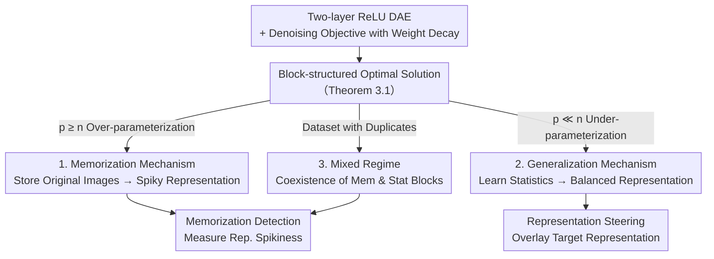

# Generalization of Diffusion Models Arises with a Balanced Representation Space

**Conference**: ICLR 2026  
**arXiv**: [2512.20963](https://arxiv.org/abs/2512.20963)  
**Area**: Image Generation / Diffusion Model Theory  

## TL;DR
This paper represents a significant breakthrough in the generalization theory of diffusion models. By analyzing the optimal solutions of a two-layer nonlinear ReLU DAE, the authors provide a unified characterization of both memorization and generalization behaviors. They creatively propose a representation-centric understanding from the perspective of representation space. The theoretical conclusions are consistently validated across EDM, DiT, and Stable Diffusion v1.4, leading to two practical applications: memorization detection and controllable editing. The work balances theoretical depth with practical utility.

## Rating

⭐⭐⭐⭐⭐

This paper is a major breakthrough in the field of diffusion model generalization theory. By analyzing the optimal solutions of a two-layer nonlinear ReLU DAE, it provides a unified description of memorization and generalization patterns and creatively offers a representation-centric understanding of generalization. The theoretical findings are consistently validated through experiments on EDM, DiT, and Stable Diffusion v1.4, and have led to two practical applications: memorization detection and controllable editing. The paper possesses both theoretical depth and practical value.

---

## Background & Motivation

**Background**: Diffusion models have become the mainstream generative models, with representative systems like Stable Diffusion, Flux, and Veo achieving unprecedented scalability, controllability, and fidelity through iterative denoising. Recent research has also found that diffusion models do not just learn distributions but also acquire meaningful representations—suggesting a deep dual relationship between distribution learning and representation learning.

**Limitations of Prior Work**: The analytical solution of the standard training objective (denoising score matching) is theoretically **just the memorization of training samples**. However, in practice, models stably generate novel and diverse outputs. This massive gap between "theoretical expectation of memorization" and "practical generalization" remains a core open problem in understanding diffusion models, directly impacting privacy, interpretability, and trustworthy deployment.

**Key Challenge**: Existing theories have significant flaws—random feature models oversimplify the architecture; linear model analyses can characterize generalization but fail to capture memorization; and handcrafted closed-form solutions only simulate specific behaviors, leading to fragmented conclusions at a phenomenological level. A unified mathematical framework that can **simultaneously** explain memorization and generalization has been missing.

**Core Idea**: The authors analyze the optimal solution of a two-layer nonlinear ReLU denoising autoencoder (DAE) to establish a unified framework. When data is locally sparse, weights store individual samples (memorization); when data is locally rich, weights capture data statistics (generalization). A criterion is provided from the **representation perspective**: representations of memorized samples are spiky, while those of generalized samples are balanced.

---

## Method

### Overall Architecture

The entire work revolves around an analytically tractable minimal object: a two-layer nonlinear ReLU denoising autoencoder $\boldsymbol{f}_{\boldsymbol{W}_2, \boldsymbol{W}_1}(\boldsymbol{x}) = \boldsymbol{W}_2 [\boldsymbol{W}_1^\top \boldsymbol{x}]_+$, solved under a denoising objective with weight decay: $\min_{\boldsymbol{W}_2, \boldsymbol{W}_1} \frac{1}{n} \sum_{i=1}^{n} \mathbb{E}_{\boldsymbol{\epsilon}} [\| \boldsymbol{f}(\boldsymbol{x}_i + \sigma \boldsymbol{\epsilon}) - \boldsymbol{x}_i \|_2^2] + \lambda \sum_{l=1}^{2} \| \boldsymbol{W}_l \|_F^2$. The authors first prove a unified conclusion (Theorem 3.1): under $(\alpha, \beta)$-separability conditions, every local minimum of the loss is "block-structured"—each data cluster occupies a weight block, and the inner structure is determined by the eigen-decomposition of that cluster's Gram matrix. This unified block optimal solution serves as the skeleton for everything else: **one knob**, the relative size of the number of hidden units $p$ vs. the number of samples $n$, continuously switches the model from "per-sample memorization" to "statistical generalization," leaving observable fingerprints in the representation space (spiky vs. balanced); these fingerprints then support two practical tools—memorization detection and representation-guided editing.

### Key Designs

**1. Memorization Mechanism: Weights store images directly under over-parameterization**

When hidden units are sufficient ($p \geq n$), the block structure degenerates to the extreme—each training sample forms its own block. Consequently, the columns of the weight matrix are the scaled original data points themselves: $\boldsymbol{W}_\text{mem} = (r_1 \boldsymbol{x}_1 \cdots r_n \boldsymbol{x}_n \boldsymbol{0} \cdots \boldsymbol{0})$, where the scaling factor $r_i = \sqrt{(\| \boldsymbol{x}_i \|_2^2 - n\lambda) / (\| \boldsymbol{x}_i \|_4^4 + \sigma^2 \| \boldsymbol{x}_i \|_2^2)}$ (Corollary 3.2). This is the exact form of "analytical solutions are just training samples" predicted by standard theory. The key lies in its trace in the representation space: the hidden activation of input $\boldsymbol{x}_i + \sigma\boldsymbol{\epsilon}$ is approximately one-hot, $\boldsymbol{h}_\text{mem}(\boldsymbol{x}_i + \sigma \boldsymbol{\epsilon}) \approx (0, \ldots, r_i \boldsymbol{x}_i^\top(\boldsymbol{x}_i + \sigma \boldsymbol{\epsilon}), \ldots, 0)$. Because the stored samples are nearly negatively correlated, only the corresponding single neuron is strongly activated, manifesting highly concentrated energy—what the authors call a **spiky representation**.

**2. Generalization Mechanism: Under-parameterization forces the model to learn statistics rather than individuals**

When hidden units are far fewer than samples ($p \ll n$), a weight block can no longer fit a single image and must instead fit the low-dimensional principal structure of the data cluster. Each weight block converges to the principal component subspace of the corresponding Gaussian mode, $\boldsymbol{W}_{\boldsymbol{X}_k} \boldsymbol{W}_{\boldsymbol{X}_k}^\top \to [(\boldsymbol{S}_k - \frac{\lambda}{\rho_k} \boldsymbol{I})(\boldsymbol{S}_k + \sigma^2 \boldsymbol{I})^{-1}]_{\text{rank-}p_k}$, where $\boldsymbol{S}_k = \boldsymbol{\mu}_k \boldsymbol{\mu}_k^\top + \boldsymbol{\Sigma}_k$ is the mean-covariance second-order statistic of that mode (Corollary 3.3). The model no longer stores a specific face but rather the "statistics of faces," allowing it to synthesize novel samples not seen in the training set. The corresponding representation also changes: energy is spread across $p_k$ coordinates of the active block, with multiple neurons jointly encoding distribution information, forming a **balanced representation**—the opposite of spiky. Thus, memorization and generalization are unified by the same block solution, differing only in whether the representation is concentrated or flattened.

**3. Mixed Regime and Two Practical Tools: Turning fingerprints into usable detection and editing**

Real-world data often contains duplicates. The model will simultaneously memorize the degenerate duplicate subsets and generalize on the non-degenerate ones, resulting in a hybrid weight structure of memorization and statistical blocks (Corollary 3.4). Since memorization corresponds to spikiness and generalization to balance, the authors quantify "representation energy concentration" as a probe: using the standard deviation of hidden representations as a proxy for spikiness. High variance indicates memorization, while low variance indicates generalization. This yields a prompt-free memorization detector based solely on representations. The same view supports **representation steering**—overlaying the average representation of a target style or concept in the representation space. Balanced representations can be edited continuously and smoothly due to their dispersed energy, whereas spiky representations exhibit brittle, threshold-like jumps because their energy is locked into single neurons. Detection and editing thus become direct corollaries of the same representation theory.

---

## Key Experimental Results

### Main Results: Memorization Detection

Memorization detection performance evaluated across three dataset-model pairs:

| Method | Prompt-free | LAION AUC↑ | LAION TPR↑ | ImageNet AUC↑ | CIFAR10 AUC↑ | Avg. Time↓ |
|------|----------|-----------|-----------|-------------|-------------|---------|
| Carlini et al. | ✗ | 0.498 | 0.020 | N/A | N/A | 3.724s |
| Wen et al. | ✗ | 0.986 | 0.961 | N/A | N/A | 0.134s |
| Hintersdorf et al. | ✗ | 0.957 | 0.500 | N/A | N/A | 0.009s |
| Ross et al. | ✓ | 0.956 | 0.915 | 0.971 | 0.713 | 0.545s |
| **Ours** | **✓** | **0.987** | **0.961** | **0.995** | **0.998** | **0.067s** |

This method is the first to be both prompt-free and representation-based, achieving the highest AUC across all three datasets with efficiency significantly exceeding geometry-based methods.

### Ablation Study: Theoretical Verification

| Verification Dimension | Condition | Conclusion |
|---------|------|------|
| Mem. Weight Structure | Train on 5 CelebA images | Weight columns store scaled original images (matches Corollary 3.2) |
| Gen. Weight Structure | Train on 10,000 CelebA images | Weights capture data principal components (matches Corollary 3.3) |
| Noise Robustness | $\sigma = 0.2, 1, 5$ | Block structure remains valid under high noise |
| Optimizer Robustness | Adam, AdamW, RMSProp | Different optimizers converge to the same sparse structure |
| Real Model Jacobian | EDM, SD1.4, DiT | Jacobian of mem. samples is low-rank; gen. samples reflect statistics |
| Representation Steering | SD1.4 | Gen. samples show smooth editing; mem. samples show brittle response |

---

## Highlights & Insights
- **Unity via One Knob**: The paper unifies "memorization" and "generalization"—two seemingly opposing behaviors—as a continuous transition in the same block-structured solution governed by $p$ vs. $n$, rather than two independent mechanisms. This is a brilliant conceptual integration.
- **Novel Representation Perspective**: By moving from "what weights store" to "what activations look like," the authors translate memorization/generalization into observable spiky/balanced fingerprints, establishing a rigorous correspondence between representation structure and generative behavior.
- **Direct Theory-to-Tool Path**: The spikiness probe detects memorization without prompts (AUC > 0.98 and faster). The same fingerprint explains why generalized samples are easy to edit while memorized ones are not. The theory goes beyond explaining phenomena to guiding privacy detection and controllable generation.
- **Transferable Criterion**: Using "representation energy concentration" as a proxy for memorization can, in principle, be generalized to privacy auditing and content attribution in other generative models.

## Limitations & Future Work
- The theoretical analysis is limited to a two-layer ReLU DAE, which still has a gap compared to actual deep architectures (U-Net, DiT), bridged by local Jacobian SVD approximations.
- The separability assumption ($\beta < 0$) and Gaussian mixture assumption are coarse approximations of real high-dimensional data manifolds.
- The representation steering method is relatively basic and hasn't been systematically compared with existing image editing methods.
- Future work could extend block-solution analysis to multi-layer or attention-based architectures, or use spikiness metrics to build stronger privacy auditing and de-memorization training.

## Related Work & Insights
- **vs. Random Feature Models**: While insightful, random feature analyses oversimplify architectures. This paper directly analyzes optimal solutions of nonlinear ReLU DAEs, reaching specific weight and activation structures.
- **vs. Linear Models / GMM Analysis**: Linear analysis explains generalization but fails at memorization. This work unifies both in one framework using the relative scale of $p$ and $n$.
- **vs. Handcrafted Closed-form Solutions**: Prior works using handcrafted solutions to approximate U-Nets resulted in fragmented, phenomenological conclusions. This paper provides a provable unified block solution and adds a representation perspective.
- **Insight**: The "Distribution Learning ↔ Representation Learning" duality suggests that the geometry of internal representations (concentrated vs. spread) can be used to diagnose and control the behavior of generative models.

<!-- RELATED:START -->

## Related Papers

- [\[ICLR 2026\] Bridging Generalization Gap of Heterogeneous Federated Clients Using Generative Models](bridging_generalization_gap_of_heterogeneous_federated_clients_using_generative_.md)
- [\[ICML 2026\] Evaluating the Representation Space of Diffusion Models via Self-Supervised Principles](../../ICML2026/image_generation/evaluating_the_representation_space_of_diffusion_models_via_self-supervised_prin.md)
- [\[ICLR 2026\] Localized Concept Erasure in Text-to-Image Diffusion Models via High-Level Representation Misdirection](localized_concept_erasure_in_text-to-image_diffusion_models_via_high-level_repre.md)
- [\[ICLR 2026\] Intention-Conditioned Flow Occupancy Models](intention-conditioned_flow_occupancy_models.md)
- [\[ICCV 2025\] MotionStreamer: Streaming Motion Generation via Diffusion-based Autoregressive Model in Causal Latent Space](../../ICCV2025/image_generation/motionstreamer_streaming_motion_generation_via_diffusion-based_autoregressive_mo.md)

<!-- RELATED:END -->
