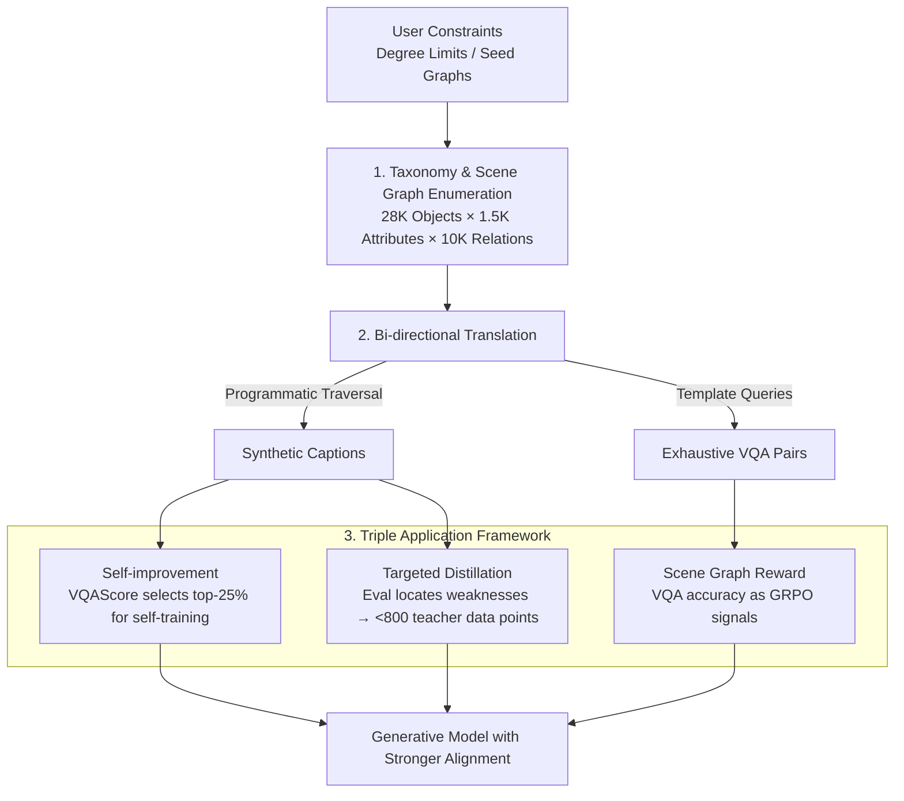

# Generate Any Scene: Scene Graph Driven Data Synthesis for Visual Generation Training

**Conference**: ICLR 2026  
**arXiv**: [2412.08221](https://arxiv.org/abs/2412.08221)  
**Code**: [GitHub](https://github.com/RAIVNLab/GenerateAnyScene)  
**Area**: Image Generation / Data Synthesis  
**Keywords**: Scene Graph, Compositional Generation, Data Engine, Self-improvement, Targeted Distillation, Reward Model

## TL;DR
The Generate Any Scene data engine is proposed, which systematically enumerates scene graphs based on a visual element taxonomy of 28K objects × 1.5K attributes × 10K relations and translates them into caption-VQA pairs. It supports four applications: self-improvement (SD1.5 +4%), targeted distillation (TIFA +10% with <800 data points), scene graph reward models (DPG-Bench +5% vs CLIP), and content moderation enhancement.

## Background & Motivation

**Background**: Text-to-image (T2I) generation models (e.g., DALL-E 3, SD, Flux) have achieved high levels of visual fidelity but still suffer significantly from poor compositional generalization and semantic alignment. Typical failure cases occur when models omit objects or confuse styles, such as when processing the prompt "a black dog chasing a rabbit in Van Gogh style."

**Limitations of Prior Work**: The root cause lies in the training data. Mainstream datasets like LAION and CC3M are web-crawled image-caption pairs that are naturally noisy, compositionally weak, and biased toward coarse-grained descriptions of single objects. These datasets lack explicit annotations for object-attribute relationships and multi-object interactions, limiting the model's ability to generalize to complex scenes. Manual dense compositional annotation is not scalable, while VLM auto-labeling suffers from hallucinations and semantic noise.

**Key Challenge**: There is a need for large-scale, high-quality, and compositionally rich training data, yet no systematic method exists to cover the visual composition space for data production. Existing evaluation tools (DSG, DPG) already use scene graphs to assess generation quality, but scene graphs have never been systematically utilized at the production end for training data.

**Goal**: How to build a scalable data engine that systematically generates compositionally rich training data (captions + evaluations + reward signals) to improve the compositional generalization and semantic alignment of generative models?

**Key Insight**: Scene graphs, grounded in cognitive science as structured representations of visual space—where objects are nodes, labels are node attributes, and relationships are edges—can generate nearly infinite compositional scene descriptions by systematically enumerating scene graph topologies and filling them with metadata. Simultaneously, these can automatically derive VQA pairs for evaluation and reward modeling.

**Core Idea**: Use scene graphs as intermediate representations to systematically enumerate the visual composition space, building a data engine that produces both training captions and fine-grained evaluation signals to drive the self-improvement, distillation, and RLHF training of generative models.

## Method

### Overall Architecture
This paper addresses the root cause of poor compositional generalization in T2I models: the lack of dense compositional annotations for multiple objects and their attribute-relationship links in the training data. The approach does not modify the model but focuses on data synthesis. It abstracts "visual scenes" into scene graphs and uses an engine to systematically enumerate these graphs, translating each into both a natural language training caption and a set of VQA pairs for evaluation. This enables the mass production of rare combinations seldom found in natural datasets.

The framework consists of two engine components and one application layer: first, **Visual Element Taxonomy and Scene Graph Enumeration**, which enumerates scene graph topologies under user constraints and fills them using a taxonomy of 28K objects / 1.5K attributes / 10K relations; second, **Bi-directional Scene Graph Translation**, which programmatically converts graphs into captions and template-based VQA pairs; finally, the **Triple Application Framework** (Self-improvement / Targeted Distillation / Scene Graph Reward), which uses the same data to drive three complementary training paradigms.

### Key Designs

**1. Visual Element Taxonomy and Scene Graph Enumeration: Turning Compositional Space into Systematic Discrete Structures**

The compositional diversity of natural datasets is restricted by real-world distributions, favoring common scenes and leaving long-tail combinations nearly absent. To fill this gap, a knowledge base capable of exhausting visual concepts is required. The authors collected 28,787 objects, 1,494 attributes, 10,492 relations, and 2,193 scene types from sources like WordNet, Wikipedia, Visual Genome, and Places365, organizing them into a hierarchical taxonomy (e.g., flower → daisy → white daisy). When enumerating graphs, the engine samples the number of nodes and systematically generates edge sets and attribute assignments satisfying degree-sequence constraints. Three types of constraints are provided: degree limits, seed graph preservation, and commonsense filtering.

**2. Bi-directional Translation from Scene Graph to Caption + VQA: Driving Both Training and Evaluation**

Scene graphs must be converted into both text captions for model consumption and fine-grained evaluation signals. Caption translation uses a deterministic programmatic algorithm that performs a topological traversal, converting scene elements into descriptive text and using grammatical rules (e.g., "the first / second") to disambiguate identical objects. This avoids the hallucinations associated with LLM rewriting. Simultaneously, exhaustive VQA pairs are generated via templates querying object attributes ("What color is the sphere?") and spatial relations ("What is to the left of the cube?"). Each answer maps back to a specific node or edge, ensuring full coverage at zero additional cost.

**3. Triple Application Framework: One Engine for Self-improvement, Distillation, and RLHF**

The engine powers three strategies. **Self-improvement** generates 8 images per synthetic caption and selects the top 25% by VQAScore as fine-tuning data for the next round (iterating over 3 epochs); it requires no external data but is capped by the model's own potential. **Targeted Distillation** uses the engine to evaluate and locate specific weaknesses in open-source models (e.g., poor multi-object composition in SD1.5) and then performs LoRA fine-tuning using fewer than 800 DALL-E 3 pairs targeting those specific capabilities. The **Scene Graph Reward Model** treats VQA accuracy (answered by Qwen2.5-VL-3B) as the reward signal for GRPO training of SimpleAR-0.5B, providing the most granular alignment signal.

### Loss & Training
Self-improvement and distillation are implemented via LoRA for parameter-efficient fine-tuning. Self-improvement uses 10K captions per round, generating 8 images per caption and selecting the top 2.5K pairs. Distillation uses only 778 captions. RLHF utilizes the GRPO algorithm with 10K captions for 1 epoch, using VQA accuracy as the reward.

## Key Experimental Results

### Main Results

Self-improvement (SDv1.5 Baseline, evaluated on GenAI-Bench + 1K Generate Any Scene set):

| Method | CLIPScore | ImageReward | LPIPS | VQAScore |
|------|-----------|-------------|-------|----------|
| SDv1.5 Original | 0.3167 | 0.2056 | 0.7297 | 0.5823 |
| CC3M Fine-tuned | 0.3196 | 0.3842 | 0.7356 | 0.6044 |
| **GAS Self-improvement (Ours)** | **0.3206** | **0.3927** | **0.7329** | **0.6109** |

RLHF Reward Model Comparison (SimpleAR-0.5B):

| Method | DPG-Bench Global | DPG Relation | GenEval Overall | GenAI All |
|------|-----------------|-------------|-----------------|-----------|
| SFT Baseline | 85.02 | 86.59 | 0.53 | 0.66 |
| CLIP-RL | 86.64 | 88.51 | 0.59 | 0.67 |
| **GAS Reward (Ours)** | **88.46** | **90.13** | **0.61** | **0.68** |

### Ablation Study

Targeted Distillation (SDv1.5, TIFA Score vs. Caption Complexity):

| Configuration | TIFA (Multi-object Captions) | Gain | Note |
|------|-----------------|------|------|
| SDv1.5 Original | ~0.50 | - | Poor composition |
| Random Caption Distillation | ~0.55 | +5% | Non-targeted data |
| **Targeted Multi-object Distillation** | **~0.60** | **+10%** | Only 778 captions |

Compositional Generalization Test (400 unseen compositional captions):

| Method | VQAScore | CLIPScore |
|------|----------|-----------|
| SDv1.5 | 0.5823 | 0.2876 |
| CC3M-FT | 0.6044 | 0.2927 |
| **GAS-FT (Ours)** | **0.6109** | **0.2938** |

### Key Findings
- Synthetic data fine-tuning consistently outperforms real-world CC3M data of the same scale, proving that structured compositional data is more valuable than natural data.
- Targeted distillation achieves a +10% TIFA gain with only 778 captions, nearly doubling the effectiveness of random distillation (+5%), proving "locating weaknesses" is more important than "data volume."
- GRPO with GAS rewards outperforms CLIP rewards by +1.8% on DPG-Bench, showing particular strength in multi-object tasks on GenEval.
- Generation diversity (LPIPS) remains stable after fine-tuning, indicating that semantic alignment can be improved without sacrificing diversity.

## Highlights & Insights
- The "data engine over model modification" paradigm systematically improves capabilities through better training data, aligning with the data-centric AI trend.
- The dual role of scene graphs is ingenious: acting as structured templates for generation (input) and as a guarantee of completeness for evaluation and rewards (output). This forms a self-consistent "generation-evaluation loop."
- The efficiency of using 778 targeted distillation data points is impressive. Identifying weaknesses through systematic evaluation before filling them with high-quality teacher data is a highly practical "precision-patching" strategy.
- VQA pairs as reward signals provide much finer granularity than standard CLIP image-text matching, as they can distinguish which specific object, attribute, or relation is incorrect.

## Limitations & Future Work
- Self-improvement depends on VQAScore for selection, which may have blind spots for specific combinations.
- Targeted distillation relies on a closed-source teacher model (DALL-E 3), making it difficult to improve in areas where the teacher is also weak.
- While systematic, the scene graph compositions are limited by the 28K object taxonomy, which cannot cover every possible visual concept.
- The content moderation experiments were small-scale (5K images); larger validation is required.
- The use of scene graph engines for video generation data augmentation remains unexplored.

## Related Work & Insights
- **vs DreamSync**: DreamSync performs self-improvement without structured scene graphs; GAS offers more diverse compositional coverage.
- **vs DSG/DPG**: While these use scene graphs for evaluation, GAS extends them to the data production end to close the loop.
- **vs DALL-E 3 Recaptioning**: DALL-E 3 uses VLMs for relabeling to improve caption quality; GAS uses programmatic generation to avoid VLM hallucinations.
- The scene graph engine concept is generalizable to any task requiring structured coverage of compositional spaces, such as video generation, 3D generation, or robotic instruction following.

## Rating
- Novelty: ⭐⭐⭐⭐ 
- Experimental Thoroughness: ⭐⭐⭐⭐ 
- Writing Quality: ⭐⭐⭐⭐ 
- Value: ⭐⭐⭐⭐⭐ 

<!-- RELATED:START -->

## Related Papers

- [\[ICLR 2026\] EchoGen: Generating Visual Echoes in Any Scene via Feed-Forward Subject-Driven Auto-Regressive Model](echogen_generating_visual_echoes_in_any_scene_via_feed-forward_subject-driven_au.md)
- [\[ICLR 2026\] Consistent Text-to-Image Generation via Scene De-Contextualization](consistent_text-to-image_generation_via_scene_de-contextualization.md)
- [\[ECCV 2024\] EchoScene: Indoor Scene Generation via Information Echo over Scene Graph Diffusion](../../ECCV2024/image_generation/echoscene_indoor_scene_generation_via_information_echo_over_scene_graph_diffusio.md)
- [\[ICLR 2026\] Generating Metamers of Human Scene Understanding](generating_metamers_of_human_scene_understanding.md)
- [\[ICLR 2026\] SketchingReality: From Hand-Drawn Scene Sketches to Photo-Realistic Images](sketchingreality_from_freehand_scene_sketches_to_photorealistic_images.md)

<!-- RELATED:END -->
## Related Papers

- [\[ICLR 2026\] EchoGen: Generating Visual Echoes in Any Scene via Feed-Forward Subject-Driven Auto-Regressive Model](echogen_generating_visual_echoes_in_any_scene_via_feed-forward_subject-driven_au.md)
- [\[ICLR 2026\] Consistent Text-to-Image Generation via Scene De-Contextualization](consistent_text-to-image_generation_via_scene_de-contextualization.md)
- [\[ECCV 2024\] EchoScene: Indoor Scene Generation via Information Echo over Scene Graph Diffusion](../../ECCV2024/image_generation/echoscene_indoor_scene_generation_via_information_echo_over_scene_graph_diffusio.md)
- [\[ICLR 2026\] Generating Metamers of Human Scene Understanding](generating_metamers_of_human_scene_understanding.md)
- [\[ECCV 2024\] Mutual Learning for Acoustic Matching and Dereverberation via Visual Scene-driven Diffusion](../../ECCV2024/image_generation/mutual_learning_for_acoustic_matching_and_dereverberation_via_visual_scene-drive.md)

<!-- RELATED:END -->
