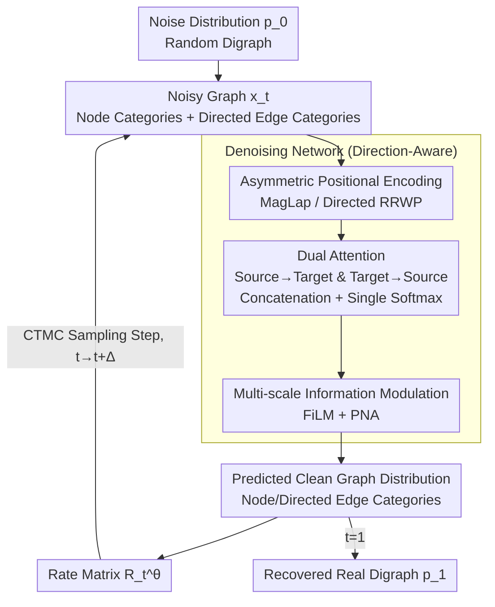

# Generating Directed Graphs with Dual Attention and Asymmetric Encoding

**Conference**: ICLR 2026  
**arXiv**: [2506.16404](https://arxiv.org/abs/2506.16404)  
**Code**: [GitHub](https://github.com/acarballocastro/DIRECTO)  
**Area**: Graph Generation  
**Keywords**: Directed Graph Generation, Discrete Flow Matching, Dual Attention Mechanism, Asymmetric Positional Encoding, Graph Generation Benchmark  

## TL;DR

Directo is proposed as the first directed graph generation model based on Discrete Flow Matching. It captures the directional dependencies of directed edges through a direction-aware dual attention mechanism and asymmetric positional encoding, while establishing a standardized evaluation framework for directed graph generation.

## Background & Motivation

- **Background**: Graph generation models have achieved significant progress in fields such as drug discovery and social network modeling. However, the vast majority of methods focus on undirected graph generation, leaving directed graph generation severely understudied.
- **Limitations of Prior Work**: Directed graphs (digraphs) present two major bottlenecks: (1) At the modeling level, edge directionality causes the learnable space to expand rapidly (for $n=4$, there are 218 digraphs vs. only 11 undirected graphs); simple extensions of undirected architectures cannot handle this combinatorial explosion. (2) At the evaluation level, there is a lack of standardized benchmarks and metrics for directed graph generation.
- **Key Challenge**: Existing DAG generation methods (e.g., D-VAE, LayerDAG) require topological sorting preprocessing and are limited to acyclic graphs, while general directed graph generation remains largely unexplored.
- **Goal**: Construct a general directed graph generation framework that covers both DAGs and general digraphs.
- **Key Insight**: Synergistically enhance directed graph modeling capabilities through three dimensions: architecture (direction-aware attention), generation framework (discrete flow matching), and input features (asymmetric positional encoding).
- **Core Idea**: Use dual attention to distinguish information flows of in-edges and out-edges, combined with directed positional encoding and the discrete flow matching framework, to achieve precise generation of directed graph structures.

## Method

### Overall Architecture

Directo addresses the challenge of "how to generate a directed graph." The difficulty lies in the fact that edges $(i,j)$ and $(j,i)$ in a digraph are independent and can belong to entirely different categories. Naively adopting undirected models loses directional information due to forced symmetrization. The generation process is built on Discrete Flow Matching (DFM). During training, noise is added to the real graph to obtain intermediate states $\bm{p}_t$. During sampling, the process starts from a noise distribution $\bm{p}_0$ and moves along a Continuous-Time Markov Chain (CTMC) to gradually denoise and recover the real graph distribution $\bm{p}_1$. The entire chain is driven by a denoising network that inputs a noisy graph and predicts clean node and directed edge categories. This prediction is converted into a rate matrix $\bm{R}_t^\theta$ to control transitions. The denoising network incorporates three direction-specific modifications: direction-aware dual attention, asymmetric positional encoding, and multi-scale modulation.

### Key Designs

**1. Discrete Flow Matching for Digraphs: Independent Noising/Denoising for Each Directed Edge**

DFM for undirected graphs treats an edge as a symmetric variable. However, in digraphs, $(i,j)$ and $(j,i)$ must be modeled as two independent categorical variables. Directo applies the noise process to each node $x^{(n)}$ and each directed edge $e^{(i,j)}$ via linear interpolation, mixing "real" and "noise" categories over time $t$:

$$p_{t|1}^X(x_t^{(n)} | x_1^{(n)}) = t \cdot \delta(x_t^{(n)}, x_1^{(n)}) + (1-t) \cdot p_{\text{noise}}^X(x_t^{(n)})$$

The training objective is the cross-entropy loss for predicting the clean graph, with node and edge terms calculated separately and balanced by a weight $\lambda$:

$$\mathcal{L} = \mathbb{E}\Big[-\sum_n \log p_{1|t}^{\theta,(n)} - \lambda \sum_{i \neq j} \log p_{1|t}^{\theta,(i,j)}\Big]$$

The advantage of DFM over diffusion is the decoupling of training and sampling, allowing for post-training optimization during sampling (e.g., adaptive time scheduling), which helps absorb the added complexity of digraphs.

**2. Asymmetric Positional Encoding: Injecting Global Structural Signals for In/Out Role Differentiation**

Standard Laplacian PE is based on symmetric adjacency matrices and cannot distinguish whether a node is "pointed to" or "pointing at" others. Directo uses direction-aware encodings to inject structural information beyond local neighborhoods. Three schemes are compared: Magnetic Laplacian (MagLap) uses complex-valued phase shifts to encode edge directions; Multi-$q$ MagLap stacks multiple MagLaps with different potential functions for multi-view representation; Directed RRWP combines forward and backward random walk transition probabilities to directly characterize asymmetric flows in both directions. These ensure that the subsequent attention mechanism receives "direction-aware" node features from the start.

**3. Dual Attention: Splitting Source→Target and Target→Source Flows for Joint Competition**

Standard attention treats the relationship between $i$ and $j$ symmetrically, failing to distinguish between "$i$ as source" and "$i$ as target." Dual attention explicitly computes two sets of direction-specific attention maps:

$$\bm{Y}_{\text{ST}}[i,j] = \frac{\bm{Q}_S[i] \cdot \bm{K}_T[j]}{\sqrt{d_q}}, \qquad \bm{Y}_{\text{TS}}[i,j] = \frac{\bm{Q}_T[i] \cdot \bm{K}_S[j]}{\sqrt{d_q}}$$

After modulation by edge features via FiLM layers, these maps are not normalized independently. Instead, they are concatenated for a single joint softmax before aggregating to update node features:

$$\bm{A}_{\text{aggr}} = \text{softmax}(\text{concat}(\bm{Y}'_{\text{ST}}, \bm{Y}'_{\text{TS}})), \qquad \bm{X}' = \bm{A}_{\text{aggr}} \bm{V}_{\text{aggr}}$$

Placing both directions in a single softmax competition allows the model to adaptively decide whether to focus more on the in-direction or out-direction for each specific edge, which is more flexible than independent normalization.

**4. Multi-scale Information Modulation: Interaction Between Node, Edge, and Graph Features**

Node and edge representations must exchange information continuously. FiLM layers modulate the attention output $\bm{E}_{\text{attn}}$ with edge features $\bm{E}$ to fuse node-edge-graph features:

$$\text{FiLM}(\bm{E}, \bm{E}_{\text{attn}}) = \bm{E} \bm{W}_1 + (\bm{E} \bm{W}_2) \odot \bm{E}_{\text{attn}} + \bm{E}_{\text{attn}}$$

PNA layers use max/min/mean/std pooling to aggregate local neighborhood information into global graph features, which are then fed back to each node. These layers integrate the local signals produced by the direction-aware modifications into a global perspective.

### Loss & Training

The training objective is the node-edge cross-entropy loss described above. Node and edge terms are calculated independently, with the hyperparameter $\lambda$ controlling the weight of the edge reconstruction loss relative to the node loss.

## Key Experimental Results

### Main Results

| Model | ER-DAG Ratio↓ | ER-DAG V.U.N.↑ | SBM Ratio↓ | SBM V.U.N.↑ | TPU V.U.N.↑ | VG RBF↓ |
|---|---|---|---|---|---|---|
| MLE | 15.1 | 0.0 | 11.6 | 0.0 | 24.7 | 0.618 |
| LayerDAG | 4.2 | 21.5 | - | - | 98.5 | - |
| DeFoG | 1.6 | 75.0 | 4.3 | 37.0 | 72.0 | 0.085 |
| Directo RRWP | **1.7** | **94.0** | 1.8 | **99.5** | 77.0 | **0.038** |
| Directo MagLap | **1.3** | 92.0 | **2.0** | 96.5 | **80.5** | 0.051 |

### Ablation Study

| Configuration | ER-DAG V.U.N.↑ | SBM V.U.N.↑ |
|---|---|---|
| RRWP + Double depth (Parameters added without dual attention) | 72.0 | 0.0 |
| RRWP + Dual attention | **94.0** | **99.5** |
| MagLap + Double depth | 80.0 | 8.0 |
| MagLap + Dual attention | **91.0** | **77.0** |

### Key Findings

1. **Dual Attention is Central**: Even without positional encoding (No PE), dual attention achieves non-zero V.U.N., whereas simply increasing network depth fails to compensate for its absence.
2. **Direction-Aware PE Superior to Generic PE**: Directed RRWP and MagLap significantly outperform symmetric Laplacian encoding.
3. **Implicit Learning of Structural Constraints**: Directo generates high-quality DAGs on DAG datasets without explicit acyclicity constraints.
4. While LayerDAG enforces acyclicity, it is significantly outperformed by Directo in distribution matching metrics (Ratio).

## Highlights & Insights

1. **Systematic Solution**: Addresses both modeling difficulties and evaluation gaps in directed graph generation, serving as foundational work in this direction.
2. **Precise Architecture Design**: Dual attention allows the model to adaptively allocate attention weights between in/out directions by concatenating them before a single softmax, proving more effective than independent processing.
3. **Good Scalability**: Can be directly extended to conditional generation via classifier-free guidance.
4. **Convincing Ablations**: Table 2 clearly demonstrates the massive gap between dual attention and simple network deepening.

## Limitations & Future Work

1. **Limited Scalability**: Currently tested on medium-scale graphs (~200 nodes); large-scale graphs require acceleration strategies like sparse attention.
2. **No Explicit Structural Constraints**: Properties like acyclicity are learned implicitly; scenarios requiring hard constraints might need integration with methods like PRODIGY.
3. **PE Computational Cost**: Multi-$q$ MagLap incurs significant computational overhead on large graphs.
4. **Verification Limited to Generation**: The dual attention architecture could be extended to discriminative tasks (link prediction, node classification), but this has not yet been verified.

## Related Work & Insights

- **Undirected Graph Generation**: DiGress (Vignac et al., 2023) and DeFoG (Qin et al., 2025) are strong baselines, but their performance drops significantly when naively extended by removing symmetrization.
- **DAG Generation**: D-VAE and LayerDAG require topological sorting, which limits generalizability.
- **Directed GNNs**: Positional encoding ideas from MagNet (Zhang et al., 2021) and Dir-GNN were adapted for the generation task in this work.
- **Insight**: The successful application of flow matching in discrete spaces is noteworthy; its training-sampling decoupling is advantageous for complex structure generation.

## Rating

⭐⭐⭐⭐ (4/5)

- **Novelty**: ⭐⭐⭐⭐ First flow matching-based directed graph generation model with a clear problem definition.
- **Experimental Thoroughness**: ⭐⭐⭐⭐⭐ Comprehensive evaluation on synthetic and real datasets with extensive ablations.
- **Writing Quality**: ⭐⭐⭐⭐ Clear structure and well-designed benchmarks.
- **Value**: ⭐⭐⭐⭐ Provides a complete evaluation framework and code.

<!-- RELATED:START -->

## Related Papers

- [\[ICLR 2026\] Dual-Solver: A Generalized ODE Solver for Diffusion Models with Dual Prediction](dual-solver_a_generalized_ode_solver_for_diffusion_models_with_dual_prediction.md)
- [\[ICLR 2026\] Generating Metamers of Human Scene Understanding](generating_metamers_of_human_scene_understanding.md)
- [\[ICCV 2025\] Video Motion Graphs](../../ICCV2025/image_generation/video_motion_graphs.md)
- [\[ICML 2025\] Directed Graph Grammars for Sequence-based Learning](../../ICML2025/image_generation/directed_graph_grammars_for_sequence-based_learning.md)
- [\[ICLR 2026\] EchoGen: Generating Visual Echoes in Any Scene via Feed-Forward Subject-Driven Auto-Regressive Model](echogen_generating_visual_echoes_in_any_scene_via_feed-forward_subject-driven_au.md)

<!-- RELATED:END -->
