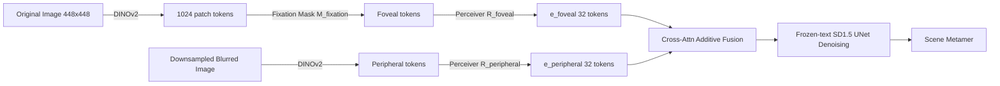

# Generating Metamers of Human Scene Understanding

**Conference**: ICLR 2026  
**OpenReview**: [https://openreview.net/forum?id=cSDXx8V6K9](https://openreview.net/forum?id=cSDXx8V6K9)  
**Code**: [https://rainarit.github.io/metamergen/](https://rainarit.github.io/metamergen/)  
**Area**: Image Generation / Computational Cognitive Science  
**Keywords**: Scene Metamer, Gaze-guided Generation, Latent Diffusion, DINOv2, Foveal-peripheral Vision, Behavioral Experiment  

## TL;DR
MetamerGen utilizes a dual-stream (foveal + peripheral) conditioned latent diffusion model to synthesize "scenes as understood by the human brain" from a small number of fixation points during free viewing. Through "same/different" behavioral experiments, the authors identify **scene metamers**—images judged as "identical" by human observers—to decompose which levels of visual features determine human scene understanding.

## Background & Motivation
- **Background**: Cognitive science aims to understand "what remains in the brain after a person views a scene." The established view is that humans construct a coherent understanding by combining a low-resolution "gist" from peripheral vision with high-resolution information collected from a few fixation points. Previous "metamer" research (Freeman & Simoncelli, Rosenholtz, etc.) demonstrated that stimuli which are physically different but indistinguishable to humans can be synthesized to reverse-engineer what the visual system encodes.
- **Limitations of Prior Work**: Earlier metamer studies only used simple generative models to synthesize textures or shapes and **fixed** the eye position, thus only investigating the low-level statistics of peripheral vision. They could not address **post-gist, scene-level understanding** questions, such as what objects a person believes exist in the blurred periphery after changing fixations.
- **Key Challenge**: While modern diffusion models can generate realistic scenes, they typically generate from text or complete images rather than "foveated" inputs (high-resolution center + blurred periphery). Injecting such variable-resolution human sampling signals into a pre-trained diffusion model remains an unsolved image-to-image synthesis problem.
- **Goal**: To build a tool capable of "generating a scene based on an individual's actual fixation trajectory as they understand it," verify through behavioral experiments that the generated results are indeed scene metamers for that observer, and analyze the visual features that determine the success of a metamer.
- **Key Insight**: **[Dual-stream Foveated Conditioning]** Use DINOv2 to decompose an image into "foveal tokens" from fixated regions and "peripheral tokens" from the blurred full image. These are compressed into conditions via respective Perceiver resamplers and additively injected into the cross-attention of Stable Diffusion, allowing the model to "hallucinate" scene content in non-fixated blurred pixels that aligns with human understanding.

## Method

### Overall Architecture
Given an image and a set of fixations, MetamerGen uses DINOv2-Base (with registers) to extract two streams of features: **foveal features** are obtained by applying a binary fixation mask to the high-resolution original image (retaining only fixated patches), and **peripheral features** are obtained by retaining all patches of a downsampled-then-upsampled blurred image. Each stream passes through a Perceiver-based resampling network to be compressed into 32 condition tokens, which are then additively fused into a frozen-text Stable Diffusion 1.5 UNet via independent cross-attention to generate a "scene in human understanding." The generation is then evaluated in a same/different behavioral paradigm to determine if it is a metamer.

### Key Designs

**1. Dual-stream Foveal-Peripheral Representation: Using a self-supervised encoder to simultaneously capture "what is seen clearly" and "what is glimpsed."** Instead of creating a new visual front-end, the authors leverage two uses of a single DINOv2 encoder to correspond to the two types of human sampling. DINOv2 divides a $448\times448$ image into $32\times32=1024$ patch tokens (768-D). For the original image, a binary mask $M_\text{fixation}$ zeros out all non-fixated patches; the retained tokens encode high-resolution details and local context, analogous to foveal and para-foveal sampling. For the periphery, the image is downsampled to $\{0.0625\times,\dots,1\times\}$ and scaled back to $448 \times 448$ to create a blurred image $I_\text{peripheral}$. All tokens from this image are retained to encode the global "uncertain" peripheral information. This naturally aligns with the high/low-resolution dual structure of human vision without stacking independent networks.

**2. Adapter-style Dual-condition Injection and Additive Cross-attention: Injecting two visual conditions without retraining SD.** Following IP-Adapter, DINOv2 patch embeddings (not CLIP global embeddings) are compressed into condition tokens via Perceiver resamplers: $e_\text{foveal}=R_\text{foveal}(\text{DINOv2}(I_\text{original})\odot M_\text{fixation})$ and $e_\text{peripheral}=R_\text{peripheral}(\text{DINOv2}(I_\text{downsample}))$. The text, foveal, and peripheral streams each project their own $K_c, V_c$, which are then **additively** merged during denoising:
$$\text{Attn}=\text{softmax}\!\Big(\frac{QK_\text{text}^T}{\sqrt{d_k}}\Big)V_\text{text}+\lambda_\text{foveal}\,\text{softmax}\!\Big(\frac{QK_\text{foveal}^T}{\sqrt{d_k}}\Big)V_\text{foveal}+\lambda_\text{peripheral}\,\text{softmax}\!\Big(\frac{QK_\text{peripheral}^T}{\sqrt{d_k}}\Big)V_\text{peripheral}$$
where $\lambda_\text{foveal}=1.2$ and $\lambda_\text{peripheral}=0.7$ control the contributions. During inference, text captions are set to empty strings to "freeze" the text path. Only the two resamplers and their $K/V$ projection matrices are trainable; other SD weights remain frozen, making training lightweight.

**3. Behavior-oriented Training Sampling Strategy: Generalizing random training to real human fixations.** During training on 118k MS-COCO images, the foveal mask **randomly** retains $\{1,2,3,5,10\}$ DINOv2 patches (matching the maximum of 10 fixations in behavioral experiments). The periphery uses a random blur level from $\{0.0625\times,\dots,1\times\}$. While training uses random sampling, inference uses real human fixation trajectories. Conditions are randomly dropped with $p_\text{foveal}=0.05$ and $p_\text{peripheral}=0.10$; the higher dropout for the periphery prevents the model from over-relying on the blurred background and ignoring sparse foveal data. Inference uses DDIM with 50 steps and CFG++.

**4. Behavioral Metamerism Paradigm: Anchoring generated outputs to brain representations via "Same/Different" judgments.** The method itself is just a generator; whether it is a "metamer" must be defined by humans. The authors established a real-time gaze-contingent paradigm: subjects freely view a scene until a preset number of fixations $\{1,2,3,5,10\}$ is reached $\rightarrow$ image is removed $\rightarrow$ MetamerGen generates a new scene based on fixations during a 5s blank screen $\rightarrow$ a second image is presented for only 200 ms (short enough to prevent new eye movements but long enough for perceptual judgment) $\rightarrow$ subjects judge "same/different." Generations judged as "same" are defined as **scene metamers**. A "random fixation" control group is also included.

## Key Experimental Results

### Main Results: Generation Quality and Metamer Rate

| Evaluation | Setting | Result |
|---|---|---|
| FID (vs COCO-10k-test) | Peripheral Scale ↑ | FID decreases continuously; more context improves realism |
| FID | Across all blur levels | Stable generation of plausible scenes at all blur levels |
| FID baseline | SD-1.5 Text-to-Image (10k random captions) | MetamerGen consistently outperforms the pure T2I baseline |
| Metamer Rate (own fixations) | n=45, 300 trials | 29.4% |
| Metamer Rate (random fixations) | n=12 (control) | 27.7% (p=0.24 vs own, no significant difference) |

### Ablation Study: Foveal vs. Peripheral Conditions (10 new subjects)

| Condition | Metamer Rate |
|---|---|
| Full Model (foveal+peripheral) | **54.5%** |
| Peripheral-only | 45.8% |
| Foveal-only | 8.4% |

### Key Findings
- **Metamers Span the Visual Hierarchy**: Using features from AlexNet (aligned with V1 $\rightarrow$ IT neural responses), it was found that higher feature similarity between the original and generated image correlated with higher "same" judgments across **all layers**. Metamerism requires broad representation alignment from low to high levels.
- **High-level Semantics Strongly Predict Metamers**: Smaller DreamSim distances made images more likely to be judged as "same." CLIP similarity also predicted metamers, but **only when using the observer's own fixations**, suggesting that generations derived from own attention align better with internal semantic representations.
- **Mid-level Depth and Proto-objects**: Depth differences (measured by Depth Anything SiLog) were inversely related to metamer rates; depth is a critical factor for scene layout. Higher mIoU for proto-object segmentation also increased "same" judgments, though the effect was weaker than depth.
- **Counter-intuitive Low-level Textures**: Generated images with **stronger** Gabor/Sobel edge responses than the original actually led to more "same" judgments—enhanced textures increased perceived photorealism.
- **Periphery More Important than Fovea**: Peripheral-only (45.8%) significantly outperformed foveal-only (8.4%) because the periphery captures global scene structure. However, the combination (54.5%) was best, showing that foveal details provide additive value.
- **Random Fixation Anomaly**: In the random fixation group, higher similarity sometimes led to lower metamer rates—realistic details in non-fixated areas can expose inconsistencies with the observer's internal representation.

## Highlights & Insights
- **Generative Models as "Hypothesis Generators" for Cognitive Science**: Treating diffusion outputs as testable hypotheses of "what the human brain believes is in the periphery" is a sophisticated methodological loop that goes beyond simple image synthesis.
- **Unified Foveal/Peripheral Encoding via DINOv2**: Leveraging the fact that DINOv2 patch tokens contain both detail and local context provides a neuroscientifically grounded and engineering-elegant solution.
- **"Gist-first" Scene Cognition**: The finding that metamers depend more on the global gist than local details provides quantitative support for the theory that scene understanding is dominated by the periphery.
- **Systemic Interpretability**: Rather than just reporting generation quality, the authors systematically regress low, mid, and high-level features to pinpoint the visual causes of metamerism.

## Limitations & Future Work
- **Inherited SD Weaknesses**: Difficulty generating fine-grained faces or limbs; text remains unreadable even if fixated. Consequently, the experiment **excluded** images containing faces, text, or clocks, limiting ecological validity.
- **Low Absolute Metamer Rate**: The rate was ~29% in the main experiment and 54.5% in the ablation, and the "own vs. random" difference was not statistically significant in the total rate, only in feature interactions.
- **Scale of Behavioral Data**: Sample sizes (n=45, 10, 12) and high-level regression $R^2$ (0.039) are relatively small; conclusions are more indicative of trends.
- **Future Work**: Scaling to scenes with humans/text (pending better models), introducing temporal eye-movement modeling, and using this paradigm to diagnose scene understanding deficits in specific brain regions or individuals.

## Related Work & Insights
- **Scene/Texture Metamers**: Extends the work of Freeman & Simoncelli (2011) and Rosenholtz (2012) from fixed textures/shapes to free-viewing, post-gist scene understanding.
- **Latent Diffusion & Adapters**: Building on IP-Adapter (Ye 2023) and T2I-Adapter (Mou 2023) to provide the technical foundation for dual-stream foveated conditioning.
- **Self-supervised Representations and Brain Alignment**: DINOv2 (Oquab 2024) and AlexNet alignment with V1-IT (Jang & Tong 2024) validate the use of these models as proxies for the visual hierarchy.

## Rating
- **Novelty**: ⭐⭐⭐⭐⭐ Integrates diffusion generation, dual-stream foveated conditioning, and behavioral metamerism into a novel framework for probing human scene understanding.
- **Experimental Thoroughness**: ⭐⭐⭐⭐ Combines FID quality metrics with three layers of quantitative analysis (neural alignment, interpretability, and ablation), though subject numbers are modest.
- **Writing Quality**: ⭐⭐⭐⭐ Clear motivation, complete formulas, and logically structured analysis with a strong cognitive science background.
- **Value**: ⭐⭐⭐⭐⭐ Provides a powerful probe for cognitive science and a new human-centric metric for evaluating generative models.

<!-- RELATED:START -->

## Related Papers

- [\[ICLR 2026\] EchoGen: Generating Visual Echoes in Any Scene via Feed-Forward Subject-Driven Auto-Regressive Model](echogen_generating_visual_echoes_in_any_scene_via_feed-forward_subject-driven_au.md)
- [\[ICLR 2026\] Generate Any Scene: Scene Graph Driven Data Synthesis for Visual Generation Training](generate_any_scene_scene_graph_driven_data_synthesis_for_visual_generation_train.md)
- [\[CVPR 2025\] ShowHowTo: Generating Scene-Conditioned Step-by-Step Visual Instructions](../../CVPR2025/image_generation/showhowto_generating_scene-conditioned_step-by-step_visual_instructions.md)
- [\[ICML 2025\] Compositional Scene Understanding through Inverse Generative Modeling](../../ICML2025/image_generation/compositional_scene_understanding_through_inverse_generative_modeling.md)
- [\[ECCV 2024\] Generating Human Interaction Motions in Scenes with Text Control](../../ECCV2024/image_generation/generating_human_interaction_motions_in_scenes_with_text_control.md)

<!-- RELATED:END -->
