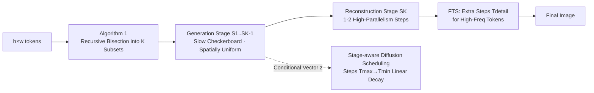

# Generation then Reconstruction: Accelerating Masked Autoregressive Models via Two-Stage Sampling

**Conference**: ICLR 2026  
**OpenReview**: [https://openreview.net/forum?id=qIujRzzWnd](https://openreview.net/forum?id=qIujRzzWnd)  
**Code**: [https://github.com/feihongyan1/GtR](https://github.com/feihongyan1/GtR)  
**Area**: Image Generation / Autoregressive Acceleration  
**Keywords**: Masked Autoregressive, Training-free Acceleration, Two-stage sampling, Checkerboard sampling, Frequency-weighting  

## TL;DR
Image generation in Masked Autoregressive (MAR) models is decomposed into a two-stage sampling process: "slow checkerboard skeleton generation" followed by "fast single-step detail reconstruction." Combined with extra diffusion steps allocated to high-frequency detail tokens, this achieves a 3.72× speedup for MAR-H without training and with almost no loss in FID/IS.

## Background & Motivation
**Background**: Since the introduction of the Autoregressive (AR) paradigm to visual generation, pixel-by-pixel or token-by-token causal modeling has been inherently difficult to parallelize, limiting speed. MAR (Masked Autoregressive) adopts "next-set prediction"—the encoder uses bidirectional attention to generate a conditional vector $z$ for each token, and a diffusion head then models the continuous token distribution. This allows for parallel prediction of multiple tokens in a single step, balancing quality and parallelism.

**Limitations of Prior Work**: The parallel potential of MAR is hindered by the difficulty of modeling the joint distribution of spatially correlated tokens within a single step. Predicting more tokens per step increases the complexity of estimating high-dimensional joint distributions, leading to quality degradation. The paper addresses this through two observations: (1) After a token is decoded, its **spatially adjacent tokens change significantly** (Figure 1, high feature difference between adjacent steps), suggesting that adjacent tokens should be decoded separately; (2) **Covering more spatial positions creates more information**—with "checkerboard" sampling (decoded tokens uniformly distributed), seven generated images are nearly identical even if different random seeds are used for the second half; whereas with "continuous block" sampling, the differences are huge. This indicates that once half the tokens are decoded uniformly, the main content of the image is essentially fixed.

**Key Challenge**: Random permutation sampling may predict adjacent tokens simultaneously (difficult to model) and violates the human "global structure first, local details later" coarse-to-fine paradigm, leaving information-deficient gaps in later stages and reducing quality. Furthermore, MAR allocates the same number of diffusion steps to every token, ignoring the fact that "tokens with complex details are harder to generate than those in flat regions."

**Goal**: To redesign the sampling order and computational allocation of MAR to approach extreme acceleration without quality loss, **without any retraining or modifications to model weights**.

**Core Idea** (**Training-free Hierarchical Sampling**): Generation is explicitly decomposed into two semantic stages: "generation" and "reconstruction"—slowly generating the main body and rapidly reconstructing details in a single step. Diffusion computational resources are then tilted towards high-frequency detail tokens based on frequency.

## Method

### Overall Architecture
GtR organizes the generation process into "two-stage checkerboard" sampling. Given $h \times w$ tokens (row and column indices $i, j$): The **generation stage** only decodes checkerboard positions satisfying $(i+j) \bmod 2=0$ and is intentionally slowed down (fewer tokens per step) to establish a global semantic skeleton. The **reconstruction stage** then decodes the remaining positions where $(i+j) \bmod 2=1$; at this point, each target token is surrounded by already generated tokens, forming strong causal constraints that allow for high parallelism (even a single step) to fill in the rest. To avoid clustering tokens locally early in the generation stage, the authors further use recursive bisection into $K-1$ sub-stages (Algorithm 1), ensuring the first sub-stage covers the entire image with spatially uniform tokens. On the computation side, two schedules are applied: diffusion steps decrease linearly across stages, and high-frequency tokens receive extra steps.

### Key Designs

**1. Two-stage Checkerboard Sampling (Generation-then-Reconstruction): Slow "Generation," Fast "Reconstruction."** The joint distribution is rewritten according to the checkerboard stages as $p(x_1, \dots, x_n) = \prod_{k=1}^{K} p(S_k \mid S_1, \dots, S_{k-1})$, where the generation stage first decodes half the tokens at $(i+j) \bmod 2=0$ to "create" the main content. This stage is slowed down as it determines the image information. When decoding the other half in the reconstruction stage, each token is surrounded by neighbors and its distribution is strongly constrained. "Reconstruction" is significantly easier than "generation," allowing for high-parallelism completion in 1–2 steps. Since MAR is trained on random permutations of all token sequences (which naturally includes the GtR order), this sampling can be applied to any MAR model **without retraining**.

**2. Recursive Bisection Scheduling (Algorithm 1): Establishing Global Structure Early.** If simply split into two segments, random sampling within the generation stage might cluster tokens locally, delaying the formation of global semantics. The algorithm bisects the unallocated set $R$ by $(i+j) \bmod 2^k$ in each round, sending half to a new sub-stage and keeping the other half as $R$ for the next round, eventually resulting in $K$ disjoint, spatially uniform subsets $\{S_1, \dots, S_K\}$. This way, the first sub-stage uses minimal MAR steps to lay out spatially uniform tokens; as more tokens are generated, constraints strengthen, allowing for higher generation rates $r_k$ in subsequent stages (e.g., $r_k=\{2.67, 10.67, 64\}$ for $K=3$ in MAR).

**3. Stage-aware Diffusion Scheduling: Spending Computation Where it Matters.** The computational cost of MAR lies not just in the encoder/decoder but also in the diffusion head modeling each token's distribution. Traditional methods use the same number of diffusion steps for every MAR step, ignoring that complexity decreases across stages. GtR allows the diffusion steps in the generation stage to **linearly decrease** from $T_{max}=50$ to $T_{min}=20$ (more steps for early structure formation; fewer steps later due to accumulated conditions). The reconstruction stage uniformly uses $T_{rec}=20$, saving significant computation without sacrificing quality.

**4. Frequency-weighted Token Selection (FTS): Special Treatment for Detail Tokens.** In the reconstruction stage, tokens vary in difficulty. Detail regions with complex textures are poorly modeled using only $T_{rec}$ steps. FTS performs a Discrete Fourier Transform on each token's conditional vector $z_i \in \mathbb{R}^D$ and extracts the magnitude spectrum $A(z_i)(n)$, then calculates importance $s_i = \sum_{n=1}^{\lfloor D/2 \rfloor} A(z_i)(n) \cdot \left(1 + \frac{n}{\lfloor D/2 \rfloor}\right)$ with higher weights for high-frequency components. The authors found (Figure 2) that high-frequency tokens in feature space are **spatially aligned** with fine textures/high-frequency detail regions in pixel space. Thus, extra diffusion steps $T_{detail}=50$ are allocated only to the top $\beta=10\%$ of tokens to accurately depict complex textures without increasing steps for all tokens.

## Key Experimental Results

### Main Results (ImageNet 256×256 Class-Conditional Generation, MAR-H)

| Method | GPU Latency (s) ↓ | FLOPs (T) ↓ | Speedup ↑ | FID ↓ | IS ↑ |
|--------|-------------------|-------------|-----------|-------|-------|
| MAR-H (64 steps, original) | 0.81 | 64.52 | 1.00× | 1.59 | 299.1 |
| +Halton | 0.33 | 27.11 | 2.38× | 3.18 | 261.7 |
| +DiSA | 0.27 | 21.59 | 2.99× | 2.11 | 283.1 |
| +LazyMAR | 0.27 | 18.85 | 3.42× | 1.94 | 284.1 |
| **+GtR (Ours)** | **0.22** | **17.34** | **3.72×** | **1.59** | **304.4** |

GtR achieves parity in FID with the original at a higher speedup, with a higher IS (+5.3), outperforming Halton/DiSA/LazyMAR. MAR-H+GtR and MAR-L+GtR also surpass smaller original MAR variants in both quality and efficiency simultaneously.

### Text-to-Image (LightGen 7B, 512×512, GenEval)

| Method | GPU Latency (s) ↓ | Speedup ↑ | Overall ↑ |
|--------|-------------------|-----------|-----------|
| LightGen-32 (original) | 1.03 | 1.00× | 0.55 |
| +LazyMAR | 0.43 | 2.40× | 0.53 |
| **+GtR (Ours)** | **0.27** | **3.82×** | **0.55** |

### Ablation Study

| GtR*(enc-dec) | GtR†(diffusion) | FTS | Speedup ↑ | FID ↓ | IS ↑ |
|:---:|:---:|:---:|:---:|:---:|:---:|
| ✗ | ✗ | ✗ | 1.43× | 1.64 | 297.3 |
| ✓ | ✗ | ✗ | 2.90× | 1.70 | 300.1 |
| ✗ | ✓ | ✗ | 1.90× | 1.59 | 300.4 |
| ✓ | ✓ | ✗ | 3.73× | 1.65 | 303.4 |
| ✓ | ✓ | ✓ | 3.72× | **1.59** | **304.4** |

Comparison of FTS token selection strategies: High-Freq. (Ours) FID 1.59 / IS 304.4, superior to Random, Low-Freq., and Full-Enhanced (all FID ≈ 1.64–1.65). Comparison of sampling orders (MAR-H): Raster 24.61 → Subsample 5.19 → Random 1.82 → **GtR 1.59**.

### Key Findings
- **Checkerboard > Random > Subsample > Raster**: Spatially uniform sampling enables early determination of global structure, which is key to achieving both quality and acceleration.
- **Combined gains from GtR on both encoder-decoder and diffusion head** (3.73× speed, FID only +0.06); FTS pulls quality back to or beyond original levels.
- **Only high-frequency tokens deserve extra diffusion steps**: Adding steps to low-frequency or all tokens is less effective than random, indicating that computation must be precisely tilted toward detail regions.

## Highlights & Insights
- **"Generation is hard, reconstruction is easy" intuition verified**: Figure 3 uses "consistency across different random seeds" to cleverly measure "whether information is determined," providing clean evidence for the two-stage split rather than relying purely on engineering intuition.
- **Completely training-free and plug-and-play**: Since MAR is trained to handle various token orders, GtR only requires changing the sampling sequence, allowing for zero-cost application to any MAR/LightGen model.
- **Frequency perspective unifies "modeling difficulty" and "resource allocation"**: Quantifying "which tokens are difficult" as high-frequency energy in condition vectors and verifying its spatial alignment with pixel-space textures provides an interpretable basis for computational tilting.

## Limitations & Future Work
- The method is specifically designed for MAR/next-set paradigms; whether the checkerboard + frequency assumptions transfer to pure next-token AR or multi-scale paradigms like VAR remains to be verified.
- There are several hyperparameters such as the number of stages $K$, generation rate $r_k$, $T_{max}/T_{min}/T_{rec}$, and $\beta$. The paper provides manual configurations but lacks adaptive strategies for different resolutions or model scales.
- The strong hypothesis that "reconstruction requires only a single step" relies on checkerboard neighborhood constraints; its validity for extremely high resolutions or non-natural images (e.g., sparse/structured content) has not been fully discussed.

## Related Work & Insights
- **MAR / MaskGIT Lineage**: MaskGIT pioneered next-set parallel prediction, and MAR extended this to continuous space using diffusion loss; GtR builds on this by only modifying the sampling sequence.
- **MAR Acceleration Baselines**: LazyMAR (token/condition caching), DiSA (diffusion step annealing), and Halton-MaskGIT (fixed Halton order) each have drawbacks—either failing to change sampling strategies, ignoring regional modeling difficulty, or losing diversity via fixed sequences. GtR optimizes both sampling order and computation allocation.
- **Inspiration**: Treating "sampling order" as a training-free optimization variable, combined with "measuring token difficulty via frequency/energy for differential resource allocation," can be extended to acceleration designs for other iterative generative models (e.g., diffusion sampling scheduling, parallel decoding).

## Rating
- **Novelty**: ⭐⭐⭐⭐ —— The combination of "slow generation/fast reconstruction" two-stage checkerboard and frequency-weighted token selection is novel and backed by clean evidence from seed-consistency experiments.
- **Experimental Thoroughness**: ⭐⭐⭐⭐ —— Covers MAR-B/L/H scales + LightGen T2I, compares against multiple acceleration baselines, and clearly deconvolutes the contributions of GtR, FTS, and sampling order.
- **Writing Quality**: ⭐⭐⭐⭐ —— Logical flow (motivation-observation-method) is clear, with intuitive figures and complete algorithms/formulas.
- **Value**: ⭐⭐⭐⭐ —— Training-free, plug-and-play, 3.72× measured acceleration without quality loss; provides direct value for the engineering deployment of MAR-style generative models.

<!-- RELATED:START -->

## Related Papers

- [\[ICCV 2025\] LazyMAR: Accelerating Masked Autoregressive Models via Feature Caching](../../ICCV2025/image_generation/lazymar_accelerating_masked_autoregressive_models_via_feature_caching.md)
- [\[ICLR 2026\] Stage-wise Dynamics of Classifier-Free Guidance in Diffusion Models](stage-wise_dynamics_of_classifier-free_guidance_in_diffusion_models.md)
- [\[ICLR 2026\] Uni-X: Mitigating Modality Conflict with a Two-End-Separated Architecture for Unified Multimodal Models](uni-x_mitigating_modality_conflict_with_a_two-end-separated_architecture_for_uni.md)
- [\[ICLR 2026\] What Exactly Does Guidance Do in Masked Discrete Diffusion Models](what_exactly_does_guidance_do_in_masked_discrete_diffusion_models.md)
- [\[ICLR 2026\] Autoregressive Image Generation with Randomized Parallel Decoding](autoregressive_image_generation_with_randomized_parallel_decoding.md)

<!-- RELATED:END -->
