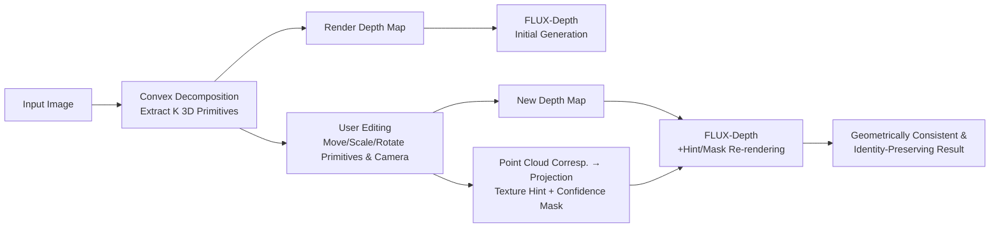

# Generative Blocks World: Moving Things Around in Pictures

**Conference**: ICLR 2026  
**OpenReview**: [https://openreview.net/forum?id=ypFvQSXFNC](https://openreview.net/forum?id=ypFvQSXFNC)  
**Code**: TBD  
**Area**: Image Generation / 3D-aware Image Editing  
**Keywords**: Convex Primitive Decomposition, 3D Editable Representation, Rectified Flow, Depth-conditioned Generation, Texture Hint, Camera Movement  

## TL;DR
The proposed method decomposes an image scene into a set of draggable 3D convex polytopes (blocks world). Users can directly move, scale, or rotate these primitives in 3D or move the camera. Real-time rendering is performed via a FLUX flow model conditioned on depth and texture hints, achieving geometrically consistent and identity-preserving 3D-aware image editing.

## Background & Motivation
- **Background**: The dominant interaction paradigm for image editing is "2D image-centric," involving point dragging (DragGAN/DragDiffusion), text instructions, or key-value style injection. These methods operate at the pixel or feature level, lacking an explicit 3D representation.
- **Limitations of Prior Work**: 2D dragging is inherently ambiguous (e.g., dragging a point could mean translation or scaling), leading to incorrect sizing, shape distortion, or loss of detail when objects are moved away. Pure text is insufficient for describing complex spatial edits, while key-value style transfer often fails to preserve object identity and fine-grained texture details after editing.
- **Key Challenge**: Any editing that supports "camera movement" inherently requires some form of 3D representation. However, constructing a representation that is both **precise enough** (for realistic re-rendering) and **compact enough** (for real-time interaction) is difficult. Direct mesh reconstruction (Image Sculpting/OMG3D) is precise but limited by reconstruction quality; box primitives (LooseControl/Build-A-Scene) are compact but too coarse, requiring LoRA fine-tuning to bridge the domain gap.
- **Goal**: To create a "fully 3D interactive" image editor with a representation that is both compact and precise, supporting multi-scale editing (object and part level) and camera movement while preserving object identity and texture.
- **Key Insight**: **Assembling scenes with convex polytopes**—leveraging the classic "Blocks World" / geons idea but using modern convex decomposition (CVXNet/CDIS) to split an image into sparse convex primitives. These primitives are selectable, aligned with object boundaries, and precise enough to render depth maps nearly identical to the original image. **Conditioning a pre-trained FLUX model on depth and projected texture hints** enables re-rendering without fine-tuning, where 3D correspondences are used to "carry the texture with the primitives."  
The authors highlight three implicit benefits of explicit 3D representations that are hard to guarantee in 2D: **Shape Constancy** (handling perspective changes during translation), **Contact Consistency** (maintaining object-surface contact), and **Shape Completion** (managing occlusions and invisible surfaces).

## Method

### Overall Architecture
Generative Blocks World is a four-stage, training-free inference pipeline: (i) extracts multi-scale 3D convex primitives from an input image using a decomposition model; (ii) renders primitives to obtain a depth map for conditioning FLUX to generate an initial image; (iii) allows the user to edit primitives and/or the camera in 3D; (iv) renders a new depth map and projects texture hints using 3D correspondences to condition the generation of the final edited image. The primitive prediction model requires training, while the generation part utilizes a pre-trained FLUX-Depth without fine-tuning.

### Key Designs

**1. Convex Polytope Primitives as an Editable Geometry Layer.** The primitive vocabulary uses CVXNet-style hybrid convex polytopes. Each convex body is defined by a set of half-planes $H_h(x)=n_h\cdot x+d_h$, using LogSumExp for a differentiable approximation of the SDF: $\Phi(x)=\mathrm{LogSumExp}\{\sigma H_h(x)\}$, then converted to an indicator function $C(x|\theta)=\mathrm{Sigmoid}(-\delta\Phi(x))$. The model uses a ResNet-18 encoder and a 3-layer MLP decoder. The representation is **selectable**, **object-aligned**, **multi-scale** (adjustable $K$), and **accurate** enough for texture projection. Training uses a classification loss on points near depth boundaries rather than direct parameter regression. To scale to real scenes, 1.8M images from LAION were used with DepthAnythingv2 for supervision.

**2. Depth Conditioning + Hint/Mask Inpainting.** Instead of editing difficult pixel-based depth maps, the system edits 3D primitives and renders a depth map via ray-marching the SDF to condition FLUX. Depth conditioning filters out "chatter" noise from primitive over-segmentation while leaving room for high-frequency details. Identity is maintained via a hint image $x_{hint}$ and a confidence mask $m$. The hint is encoded by the VAE; during denoising, it is fused within a time window $t_{end}\le t\le t_{start}$ using $x_t=(1-m)\cdot x_{hint,t}+m\cdot x_t$, where $x_{hint,t}=\mathrm{SchedulerScaleNoise}(x_{hint},t,\epsilon)$. This allows the model to fill in low-confidence regions (e.g., holes exposed by movement).

**3. Texture Hints via 3D Point Cloud Correspondences.** This is the core of identity preservation. Unlike copying keys/values (StableFlow), which fails under camera/primitive movement, this method uses geometric projection. Given the point cloud of ray-primitive intersections, a `convex_map` (mapping pixels to primitives), and primitive transformations, it establishes correspondences between the new and original views. Pixels from the source are projected into the target view to generate $x_{hint}$. Because the correspondence is per-primitive, the **texture moves with the primitive**, and the underlying 3D representation **robusteously handles camera movement**.

## Key Experimental Results

### Main Results (Comparison with LooseControl, 48 random camera movement test cases, K=10)

| Method | AbsRel_src ↓ | AbsRel_dst ↓ | PSNR ↑ | SSIM ↑ |
|------|------|------|------|------|
| **Ours** | **0.072** | **0.076** | **18.7** | **0.874** |
| LooseControl | 0.143 | 0.146 | 6.65 | 0.670 |

- AbsRel_src/dst measures geometric fitting error. PSNR/SSIM measures texture consistency via back-projection. Ours significantly outperforms the baseline in both geometry and texture preservation.

### Ablation Study / Qualitative Comparison

| Comparison | Findings |
|------|------|
| vs Drag Diffusion | 2D dragging is ambiguous (e.g., clock distorts, cans lose detail); Ours keeps geometry/scale/texture correct via explicit 3D control. |
| vs LooseControl Camera | LooseControl changes object counts (e.g., apples) or adds artifacts; Ours maintains "the same scene from a different view." |
| Texture Hint Ablation | No hint → correct geometry, wrong texture; StableFlow (KV) → inconsistent identity; Projected hint → high fidelity. |
| Multi-scale $K$ | Small $K$ for coarse, large-scale edits; Large $K$ for fine-grained part-level editing. |

### Key Findings
- The domain gap between primitive-rendered depth and SOTA depth estimation networks is minimal, allowing the use of pre-trained FLUX-Depth without fine-tuning.
- Geometric projection hints are crucial for identity preservation; key-value injection is insufficient for geometric transformations like camera or object movement.
- A confidence mask automatically identifies unreliable regions (e.g., depth discontinuities at boundaries), letting the diffusion model clean up projection artifacts.
- The `loraweight` in the LoRA version of FLUX-Depth provides a knob to balance primitive adherence vs. generative detail.

## Highlights & Insights
- **Modernizing Blocks World**: Revives the 1963 "Blocks World" concept using differentiable convex decomposition, making 3D interactive editing intuitive and precise.
- **Training-free Generation**: High primitive precision eliminates the need for LoRA fine-tuning required by previous methods like LooseControl.
- **Geometry > Pixels**: Solving the texture-following problem via 3D point cloud correspondence is more robust than feature-level injection.
- **Multi-resolution Control**: Supporting different $K$ values allows a continuous range of control from global movement to part-level adjustment.

## Limitations & Future Work
- **Non-convex Shapes**: Difficulty representing structures like chair legs or cup handles; requires more primitives or different types.
- **Lighting Consistency**: Static texture hints do not model view-dependent lighting like reflections or shadows.
- **Decomposition Failure**: Cluttered scenes or sparse depth can lead to incorrect merging of adjacent objects.
- **Large Rotations**: Large angular changes (~50°) могут break consistency or cause hallucinations.
- **Reliance on Source Noise/Prompt**: Edits perform best when starting from the same noise and prompt as the source image.

## Related Work & Insights
- **Primitive Lineage**: From Roberts' Blocks World (1963) and Biederman's geons to modern BSP-Net/CVXNet. This work builds on CDIS for RGB-D scene fitting.
- **Conditional Synthesis**: Evolves from GAN-based layouts to ControlNet and FLUX-Depth.
- **Editing Interaction**: Replaces ambiguous 2D dragging with explicit 3D manipulation.
- **Insight**: When editing involves 3D properties (camera, occlusion, perspective), an explicit geometric intermediate layer—where geometry guides and the generative model beautifies—is superior to 2D feature manipulation.

## Rating
- Novelty: ⭐⭐⭐⭐
- Experimental Thoroughness: ⭐⭐⭐
- Writing Quality: ⭐⭐⭐⭐
- Value: ⭐⭐⭐⭐

<!-- RELATED:START -->

## Related Papers

- [\[ICLR 2026\] Verification of the Implicit World Model in a Generative Model via Adversarial Sequences](verification_of_the_implicit_world_model_in_a_generative_model_via_adversarial_s.md)
- [\[ICML 2026\] Generative Visual Code Mobile World Models](../../ICML2026/image_generation/generative_visual_code_mobile_world_models.md)
- [\[ICLR 2026\] WorldEdit: Towards Open-World Image Editing with a Knowledge-Informed Benchmark](worldedit_towards_open-world_image_editing_with_a_knowledge-informed_benchmark.md)
- [\[ICLR 2026\] ChronoEdit: Towards Temporal Reasoning for In-Context Image Editing and World Simulation](chronoedit_towards_temporal_reasoning_for_in-context_image_editing_and_world_sim.md)
- [\[ICLR 2026\] ImagenWorld: Stress-Testing Image Generation Models with Explainable Human Evaluation on Open-ended Real-World Tasks](imagenworld_stress-testing_image_generation_models_with_explainable_human_evalua.md)

<!-- RELATED:END -->
