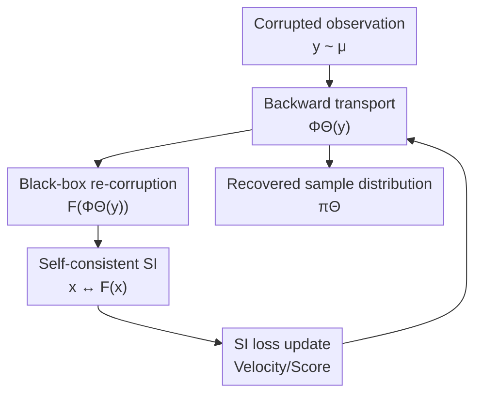

# Generative Modeling from Black-Box Corruptions via Self-Consistent Stochastic Interpolants

**Conference**: ICLR2026  
**OpenReview**: [https://openreview.net/forum?id=RJHHbXhokV](https://openreview.net/forum?id=RJHHbXhokV)  
**Code**: https://github.com/modichirag/SCSI  
**Area**: Generative Modeling / Stochastic Interpolants / Image Inverse Problems  
**Keywords**: Black-box corruption, Stochastic Interpolants, Inverse Generative Modeling, Self-consistent training, Image restoration  

## TL;DR
This paper introduces Self-Consistent Stochastic Interpolants (SCSI), which recovers clean data distributions and enables training of generative models by iteratively learning a self-consistent transport of "observation distribution $\to$ latent clean distribution $\to$ re-corruption back to observation distribution," requiring only corrupted samples and a black-box simulator without clean samples or explicit likelihoods.

## Background & Motivation
**Background**: Transport-based generative models such as diffusion models, flow matching, and stochastic interpolants typically assume that clean samples $x \sim \pi$ are accessible during training. While natural in standard image generation, many scientific, medical, and astronomical applications only provide indirect observations through a degradation process, where the training set consists of $y = F(x)$ instead of $x$.

**Limitations of Prior Work**: Learning the clean distribution from corrupted observations usually follows Empirical Bayes or EM approaches: estimating the posterior with the current prior and updating the prior with posterior samples. However, this path typically requires knowledge of the likelihood $P(dy|x)$ and the ability to perform posterior sampling. Having a simulator that maps $x$ to $y$ is not equivalent to evaluating the likelihood, and posterior sampling for high-dimensional data is computationally expensive and prone to error accumulation.

**Key Challenge**: While inverse problems may be ill-posed at the individual sample level (e.g., noise, occlusion, or blurring causing information loss), they can remain solvable at the distributional level. The objective is expressed as $K\pi = \mu$, where $\pi$ is the unknown clean distribution, $\mu$ is the observation distribution, and $K$ is the distributional operator induced by the black-box corruption channel. If $K$ is identifiable at the distributional level, the prior $\pi$ can be recovered without requiring an exact posterior for every $y$.

**Goal**: The authors aim to solve "inverse generative modeling" rather than just single-image restoration: given a corrupted observation dataset $\{y_i\}$ and a black-box forward channel $F$, the goal is to learn a transport map from the observation distribution back to the clean data distribution. The recovered samples can then be treated as clean data to train standard generative models or perform conditional inference.

**Key Insight**: Stochastic Interpolants (SI) provide a framework for training velocity or score fields between two distributions. The key observation is that although clean samples $x \sim \pi$ are unavailable, if a model can map observation $y$ to a candidate clean sample $x^{(k)}$, the black-box $F$ can map it back to the observation space as $\tilde y^{(k)} = F(x^{(k)})$. The training objective thus relies on self-consistency: the samples recovered by the model, when re-corrupted, should match the real observation distribution.

**Core Idea**: Utilize stochastic interpolants to represent the backward transport from corrupted observations to clean samples, employing a self-consistent fixed-point iteration where the black-box channel $F$ itself serves as the training signal.

## Method
### Overall Architecture
SCSI takes corrupted samples $y$ from the observation distribution $\mu$ and a black-box forward corruption channel $F$ (accessible only via execution, without requiring likelihood or differentiability) as inputs. The model maintains a backward transport map $\Phi_\Theta$ parameterized by $\Theta$. It starts from $y$ and follows an ODE or SDE trajectory to reach a candidate clean sample $x = \Phi_\Theta(y)$. During training, this candidate sample is passed back through the black-box channel to obtain $\tilde y = F(x)$, and a stochastic interpolant is constructed between $x$ and $\tilde y$ to update the velocity/denoising field using standard SI square loss.

In essence, rather than using paired $(x,y)$ to supervise restoration, the model closes the loop at the distributional level: the current recovered distribution $\pi^{(k)} = (\Phi_{\Theta^{(k)}})_\#\mu$ must match $\mu$ after passing through the corruption channel. If a fixed point exists and the forward channel is identifiable at the distributional level, the recovered distribution at the fixed point corresponds to the target clean distribution $\pi$.

After training, SCSI provides a set of recovered samples $\Phi_\Theta(y_i)$. These can be used directly for restoration or as a training set for a conventional diffusion model to enable generation of new samples.

### Key Designs
**1. Self-Consistent Fixed Point: Turning Latent Distributions into Verifiable Loop Conditions**
Standard SI requires sampling $x_0 \sim \pi$ and $x_1 \sim \mu$ to construct $I_t = \alpha_t x_0 + \beta_t x_1 + \gamma_t z$. Since $x_0$ is invisible, SCSI generates candidate clean samples $x^{(k)} = \Phi_{\Theta^{(k)}}(y)$ from $y \sim \mu$ and obtains $\tilde y^{(k)} = F(x^{(k)})$. The new interpolant becomes:
$$
I_t^{(k+1)} = \alpha_t \Phi_{\Theta^{(k)}}(y) + \beta_t F(\Phi_{\Theta^{(k)}}(y)) + \gamma_t z.
$$
This replaces real clean samples with the current model's recovered samples. If the recovered distribution is correct, its re-corruption should yield the real observation distribution $\mu$. Otherwise, the SI training updates the backward transport along the $x^{(k)} \leftrightarrow F(x^{(k)})$ trajectories.

**2. Two-level Truncated SI Training: Retaining EM Intuition while Avoiding Posterior Sampling**
The algorithm can be viewed as an EM-like two-level iteration. The outer loop generates the recovered distribution $\pi^{(k)}$ using $\Theta^{(k)}$, while the inner loop fixes these samples and their re-corruptions to train a new field $\Theta^{(k+1)}$. Unlike EB-EM, which requires posterior sampling $P^{(k)}(dx|y)$ and explicit likelihoods, SCSI's "E-step" only involves calling $\Phi_{\Theta^{(k)}}$ and $F$, requiring neither differentiability nor likelihood evaluation. In practice, a single SGD step ($T_{tr}=1$) for the inner loop is sufficient.

**3. Distributional Identifiability: Distinguished from Sample-level Irreversibility**
The paper emphasizes that sample-level and distribution-level inverse problems are distinct. For instance, in AWGN, the optimal restoration of a single $y=x+\sigma\xi$ has irreducible MSE, but the observation distribution $\mu = \pi * \gamma_\sigma$ can be deconvolutionally resolved at the distribution level. SCSI learns a transport that maps $\mu$ to some $\hat\pi$ such that $K\hat\pi = \mu$. Theoretical analysis shows that if $K$ is injective and the condition number is controlled, the iteration converges to the correct distribution.

**4. Compatibility with Black-Box Forward Channels**
Unlike models limited to linear operators or Gaussian noise, SCSI only requires sampling from $F(x)$. This naturally covers non-linear motion blur, JPEG compression, and Poisson noise. Parameters such as random masks or blur kernels can be concatenated as conditions, allowing the velocity field to adapt to varying corruption strengths within the same framework.

### Loss & Training
SCSI utilizes the regression loss from stochastic interpolants. For an interpolant $I_t$, the velocity field $b$ is learned by minimizing $\mathbb{E}[\|\hat b(t,I_t)-\dot I_t\|^2]$. The SDE version can additionally learn $g(t,x)=\mathbb{E}[z|I_t=x]$ or the combined drift.

Image experiments utilize a Dhariwal & Nichol style U-Net with approximately 32M parameters for the SI model. ODE inference with 64 steps and a linear schedule ($\alpha_t=1-t, \beta_t=t, \gamma_t=0$) is the default. To stabilize training, the model uses re-corrupted samples $F(\Phi_\Theta(y))$ with probability $p=0.9$ and original observations $y$ with probability $1-p$ to mitigate early-stage drift.

## Key Experimental Results

### Main Results
SCSI was validated on two-moon AWGN, CIFAR-10/CelebA image corruption, and quasar spectrum reconstruction. In image tasks without clean training samples or forward gradients, SCSI outperformed DPS (which uses clean-data pre-trained priors and forward gradients) in LPIPS for random masking and high-noise Gaussian blur.

| Task / Forward Model | Metric | SCSI | DPS | SI-Oracle | Conclusion |
|--------|------|------|-----|-----------|------|
| Random Mask, $\sigma_n=10^{-6}$ | LPIPS↓ | 0.0051 | 0.0049 | 0.0044 | SCSI approaches DPS with clean prior |
| Random Mask, $\sigma_n=0.1$ | LPIPS↓ | 0.0064 | 0.0072 | 0.0055 | SCSI outperforms DPS at higher noise |
| Gaussian Blur, $\sigma_n=0.1$ | LPIPS↓ | 0.005 | 0.009 | 0.0051 | Comparable to Oracle SI |
| Gaussian Blur, $\sigma_n=0.25$ | LPIPS↓ | 0.015 | 0.025 | 0.0011 | Significantly outperforms DPS |

For generative modeling, training a diffusion model on SCSI-recovered samples achieved FID scores comparable to EM Posterior and significantly better than Ambient Diffusion, while requiring much lower computational cost.

| Method | Mask Prob $\rho$ | FID↓ | Note |
|------|------------------|------|----------------|
| Ambient Diffusion | 0.40 | 18.85 | Baseline for corrupted-data generation |
| EM Posterior | 0.50 | 6.76 | ~512 GPU hours |
| SCSI + diffusion | 0.50 | 6.74 | ~86 GPU hours total |

### Ablation Study
- **Dynamics**: ODE and SDE perform similarly at low noise, but SDE is more stable for recovering thin structures in high-noise low-dimensional tasks.
- **Inner Steps**: $T_{tr}=1$ is sufficient for stability; significant increases in $T_{tr}$ provide marginal gains or can even degrade performance if outer iterations are limited.
- **Network Size**: Increasing SI channels from 48 to 96 improves recovered sample quality (FID improved by ~30%) at the cost of computation time.

### Key Findings
- SCSI's primary advantage is maintaining performance near oracle levels in settings where information is weak (no clean pre-training, no forward gradients, no explicit likelihood).
- The black-box compatibility allows SCSI to handle JPEG compression and motion blur where differentiability is absent.
- Recovered samples are high-quality enough to serve as a surrogate clean dataset for subsequent generative model training.

## Highlights & Insights
- Reformulating the inverse problem as a self-consistent distributional transport bypasses the need for likelihood evaluation, allowing interaction with simulators.
- SCSI uses stochastic interpolants as fixed-point operators that naturally accommodate both ODE and SDE formulations.
- The framework distinguishes between restoration, generation, and posterior inference, clearly defining SCSI's role in recovering the marginal prior $\pi$.

## Limitations & Future Work
- Theoretical convergence proofs rely on Lipschitz stability and condition numbers that are difficult to verify for high-dimensional U-Nets and complex corruptions.
- The method recovers the marginal prior, not the full posterior $P(dx|y)$. Applications requiring multi-modal posterior uncertainty need additional conditional models.
- Dependency on black-box simulators implies that if the simulator is misspecified, the fixed point will converge to an incorrect distribution.
- Computational costs for training SI models on images (approx. 54 GPU hours) remain non-trivial compared to off-the-shelf restoration.

## Related Work & Insights
- **vs Ambient Diffusion**: Ambient Diffusion relies on linear corruption structures; SCSI extends this to black-box non-linear and non-Gaussian channels through iterative transport.
- **vs EM Posterior / DiffEM**: While EM methods perform explicit posterior sampling, SCSI learns marginal transport without requiring likelihoods or posterior samplers.
- **vs DPS**: Unlike DPS, SCSI does not require a pre-trained clean prior or gradients of the forward operator, making it more applicable to the "corrupted-data only" regime.

## Rating
- **Novelty**: ⭐⭐⭐⭐⭐ Self-consistent SI provides a clear alternative to EM/posterior sampling for black-box inverse problems.
- **Experimental Thoroughness**: ⭐⭐⭐⭐ Covers low-dim, image, and scientific tasks; however, real-world field-captured degradation datasets are limited.
- **Writing Quality**: ⭐⭐⭐⭐ Theoretically sound with clear problem formulation, though some mathematical assumptions are abstract.
- **Value**: ⭐⭐⭐⭐⭐ Highly impactful for scientific ML where accurate simulators exist but clean ground-truth samples are unattainable.

## Related Papers

- [\[ICLR 2026\] Latent Stochastic Interpolants](latent_stochastic_interpolants.md)
- [\[ICLR 2026\] Stochastic Self-Guidance for Training-Free Enhancement of Diffusion Models](stochastic_self-guidance_for_training-free_enhancement_of_diffusion_models.md)
- [\[ICLR 2026\] BézierFlow: Learning Bézier Stochastic Interpolant Schedulers for Few-Step Generation](bézierflow_learning_bézier_stochastic_interpolant_schedulers_for_few-step_genera.md)
- [\[NeurIPS 2025\] BoltzNCE: Learning Likelihoods for Boltzmann Generation with Stochastic Interpolants](../../NeurIPS2025/image_generation/boltznce_learning_likelihoods_for_boltzmann_generation_with_stochastic_interpola.md)
- [\[ICML 2026\] Support-Proximity Augmented Diffusion Estimation for Offline Black-Box Optimization](../../ICML2026/image_generation/support-proximity_augmented_diffusion_estimation_for_offline_black-box_optimizat.md)

<!-- RELATED:END -->

<!-- RELATED:START -->

## Related Papers

- [\[ICLR 2026\] Latent Stochastic Interpolants](latent_stochastic_interpolants.md)
- [\[ICLR 2026\] Stochastic Self-Guidance for Training-Free Enhancement of Diffusion Models](stochastic_self-guidance_for_training-free_enhancement_of_diffusion_models.md)
- [\[ICLR 2026\] Score Distillation Beyond Acceleration: Generative Modeling from Corrupted Data](score_distillation_beyond_acceleration_generative_modeling_from_corrupted_data.md)
- [\[NeurIPS 2025\] BoltzNCE: Learning Likelihoods for Boltzmann Generation with Stochastic Interpolants](../../NeurIPS2025/image_generation/boltznce_learning_likelihoods_for_boltzmann_generation_with_stochastic_interpola.md)
- [\[ICML 2026\] Support-Proximity Augmented Diffusion Estimation for Offline Black-Box Optimization](../../ICML2026/image_generation/support-proximity_augmented_diffusion_estimation_for_offline_black-box_optimizat.md)

<!-- RELATED:END -->
