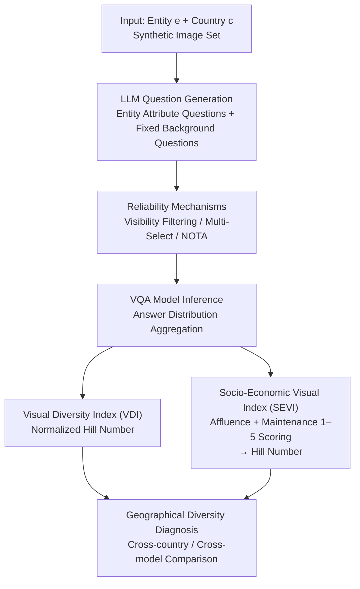

# GeoDiv: Framework for Measuring Geographical Diversity in Text-to-Image Models

**Conference**: ICLR 2026  
**arXiv**: [2602.22120](https://arxiv.org/abs/2602.22120)  
**Code**: [GitHub](https://github.com/moha23/geodiv)  
**Area**: Text-to-Image Generation / Fairness Evaluation  
**Keywords**: Geographical diversity, Text-to-Image models, Socio-economic bias, VLM evaluation, Explainable metrics

## TL;DR
The GeoDiv framework is proposed to utilize the world knowledge of LLMs and VLMs to systematically evaluate the geographical diversity of T2I models across two dimensions: the Socio-Economic Visual Index (SEVI) and the Visual Diversity Index (VDI). It reveals systematic impoverishment biases in models against countries such as India and Nigeria.

## Background & Motivation
- **Background**: T2I models (e.g., Stable Diffusion, FLUX.1) are widely used in commercial applications, yet their generated outputs often lack geographical diversity and exhibit stereotypes when depicting different regions.
- **Limitations of Prior Work**: Existing diversity metrics either rely on annotated datasets (e.g., GeoDE) or focus solely on low-level visual similarity (e.g., Vendi-Score), failing to interpretably capture the multi-dimensional characteristics of geographical diversity.
- **Key Challenge**: Geographical diversity encompasses variations across economic, environmental, and cultural dimensions. A single metric cannot provide a comprehensive measurement, and existing methods have limited capacity for fine-grained bias detection at the country level.
- **Key Insight**: Leverage the implicit world knowledge within LLMs/VLMs to design an explainable automated evaluation framework.
- **Core Idea**: Decompose geographical diversity into four explainable dimensions—SEVI (Affluence + Maintenance) and VDI (Entity Appearance + Background Appearance)—and quantify diversity using Hill Numbers.

## Method

### Overall Architecture
GeoDiv addresses a seemingly simple yet difficult-to-quantify question: how diverse is a T2I model when generating "a specific entity in a specific country" (e.g., "a kitchen in India," "a house in Nigeria"), and does it systematically depict certain regions as impoverished? The pipeline centers on a set of synthetic images—given an entity $e$ and a country $c$, an LLM first generates two types of questions: those highly relevant to the entity $e$ (e.g., stove type, cabinet material for a kitchen) and fixed background questions (e.g., terrain, vegetation). Next, a reliability constraint filters out "invisible attributes," and the VQA process is secured using multi-select and NOTA (None of the Above) options. The VQA model answers per image, and answers are aggregated into a distribution. This distribution is then fed into two complementary indices: VDI quantifies diversity by measuring "whether visual variation is sufficient," while SEVI characterizes whether the model systematically depicts countries as poor. Both indices unify "diversity" as calculating the Hill Number of a discrete distribution, allowing for direct comparisons across questions and countries.

### Key Designs

**1. Visual Diversity Index (VDI): Converting "Visual Richness" into Comparable Distribution Entropy**

Directly measuring image pixel similarity (e.g., Vendi-Score) only captures low-level visual changes and cannot explain "why" diversity is lacking. VDI uses an LLM ensemble to decompose each entity into several semantic attribute questions (Entity Appearance axis) plus fixed background questions (Background Appearance axis). A VQA model answers these for the image set to obtain an answer distribution $\hat{P_k}$ for each question $k$. Diversity is measured by the normalized Hill Number of this distribution:

$$\text{Diversity-Score} = \frac{\exp(H(\hat{P_k})) - 1}{|\hat{\mathcal{A}_k}| - 1}$$

Where $H(\cdot)$ is the Shannon entropy and $|\hat{\mathcal{A}_k}|$ is the number of possible answers for that question. The numerator $\exp(H)-1$ converts entropy into the "effective number of answer types" minus 1. The denominator $|\hat{\mathcal{A}_k}|-1$ is the theoretical upper bound of this effective number. Since the number of choices varies significantly (e.g., 5 terrains vs. 12 cabinet materials), this normalization enables direct comparison across different questions. The score falls within $[0, 1]$, where 1 indicates answers are uniformly spread across all possibilities and 0 indicates the model only generates one type.

**2. Socio-Economic Visual Index (SEVI): Quantifying Systemic Impoverishment Bias**

Visual diversity alone is insufficient; a model can be "diverse" while exclusively generating dilapidated scenes. SEVI targets this bias by having a VLM score each image on two 1–5 subjective axes: Affluence and Maintenance. The average scores characterize how wealthy or "new" a model depicts a country. By treating these scores as a distribution and calculating the Hill Number again, one can determine if the model only depicts one state (low diversity) or covers a continuous spectrum from poor to wealthy. The challenge of subjectivity is addressed through reliability mechanisms and large-scale validation with local annotators from 14 countries (achieving correlation coefficients $\rho$ of 0.76/0.69), proving that VLM scoring aligns with local intuition rather than arbitrary outputs.

**3. Reliability Mechanisms: Mitigating Hallucination and Bias in VQA**

The framework's credibility depends on the reliability of VQA/VLM outputs. Multiple constraints are layered for this purpose. The **Visibility Step** filters out images where the attribute in question is not visible (e.g., asking about "stove type" when the stove is not in frame), reducing hallucinations. **Multi-Select** allows multiple answers per image to prevent forcing a single choice when multiple attributes coexist. The **NOTA** option provides an "None of the above" exit to prevent random guessing when the model is uncertain (only 2.6% of answers fell into this option). Finally, large-scale manual validation by local annotators from 14 countries confirmed that SEVI scores align with local perceptions of affluence and maintenance.

## Key Experimental Results

### Main Results

GeoDiv was evaluated on 160,000 synthetic images generated by 4 open-source T2I models across 10 entities and 16 countries. Gemini-1.5-flash was identified as the most suitable evaluator (86% accuracy):

| VQA Model | VDI Entity Acc. | VDI Background Acc. | SEVI-Affluence $\rho$ | SEVI-Maintenance $\rho$ |
|----------|-------------|-------------|-------------------|---------------------|
| Gemini-1.5-flash | 0.87 | 0.85 | 0.76 | 0.69 |
| GPT-4o | 0.85 | 0.81 | 0.76 | 0.76 |
| Qwen2.5-VL | 0.85 | 0.77 | 0.69 | 0.71 |
| LLaVA-v1.6 | 0.70 | 0.66 | 0.65 | 0.68 |

### Key Findings: Country-level Bias

| Country Group | Avg. Affluence | Avg. Maintenance | Diversity Score |
|---------|---------------|------------------|-----------|
| India/Nigeria/Colombia | 2.31 | 3.34 | Low |
| Japan/UAE/UK | 3.53 | 4.30 | Low |
| FLUX.1 Global | 3.82 | 4.73 | Extremely Low (0.15) |

### Key Findings
- FLUX.1 generates the most refined images but has the lowest diversity, revealing a trade-off between "aesthetic quality" and "diversity."
- Overall geographical diversity tends to decrease in newer model versions.
- Background diversity (0.31) is significantly lower than entity diversity (0.44); for instance, mountains appear in only 12% of images.
- Comparison with Vendi-Score: Only entity diversity shows moderate correlation ($\rho=0.56$), while other dimensions show low correlation.

## Highlights & Insights
- The first systematic and explainable evaluation framework for T2I geographical diversity, supporting expansion to any entity or country.
- Identifies the "high-quality, low-diversity" trade-off in FLUX.1, providing direct guidance for model development.
- Open-sources all data, annotations, and code.

## Limitations & Future Work
- Coverage is currently limited to 16 countries and 10 entities; expansion to more regions may reveal new bias patterns.
- Dependence on LLM/VLM world knowledge, which may inherently contain biases.
- Limitations in cultural representation persist, with occasional inconsistencies between annotators and VQA models in certain countries.

## Related Work & Insights
- **vs. Vendi-Score**: Vendi-Score only measures visual variation and cannot capture socio-economic dimensions.
- **vs. GRADE**: GRADE only evaluates the diversity of everyday objects and does not address the complexity of geographical dimensions.

## Rating
- Novelty: ⭐⭐⭐⭐ First to decompose geographical diversity into SEVI+VDI four-dimensional evaluation.
- Experimental Thoroughness: ⭐⭐⭐⭐⭐ 160K images, large-scale human validation, multi-model and multi-country comparisons.
- Writing Quality: ⭐⭐⭐⭐ Clear structure with insightful findings.
- Value: ⭐⭐⭐⭐ High practical value for T2I fairness assessment.

<!-- RELATED:START -->

## Related Papers

- [\[ICLR 2026\] W-Edit: A Wavelet-based Frequency-aware Framework for Text-driven Image Editing](w-edit_a_wavelet-based_frequency-aware_framework_for_text-driven_image_editing.md)
- [\[AAAI 2026\] How Bias Binds: Measuring Hidden Associations for Bias Control in Text-to-Image Compositions](../../AAAI2026/image_generation/how_bias_binds_measuring_hidden_associations_for_bias_control_in_text-to-image_c.md)
- [\[ICLR 2026\] The Intricate Dance of Prompt Complexity, Quality, Diversity, and Consistency in T2I Models](the_intricate_dance_of_prompt_complexity_quality_diversity_and_consistency_in_t2.md)
- [\[ICLR 2026\] AttriCtrl: A Generalizable Framework for Controlling Semantic Attribute Intensity in Diffusion Models](attrictrl_a_generalizable_framework_for_controlling_semantic_attribute_intensity.md)
- [\[ICLR 2026\] LogiStory: A Logic-Aware Framework for Multi-Image Story Visualization](logistory_a_logic-aware_framework_for_multi-image_story_visualization.md)

<!-- RELATED:END -->
