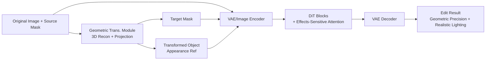

# Geometric Image Editing via Effects-Sensitive In-Context Inpainting with Diffusion Transformers

**Conference**: ICLR 2026  
**OpenReview**: [https://openreview.net/forum?id=0JfUjV1uIS](https://openreview.net/forum?id=0JfUjV1uIS)  
**Code**: TBD  
**Area**: Image Editing / Diffusion Models / Geometric Editing  
**Keywords**: Geometric Image Editing, In-Context Inpainting, Diffusion Transformer, Lighting Effects, Attention Modulation  

## TL;DR
GeoEdit utilizes 3D reconstruction-driven geometric transformations + DiT-based in-context inpainting, coupled with a soft-biased Effects-Sensitive Attention specifically for lighting and shadows. This enables object translation, rotation, and scaling that are both geometrically precise and physically realistic.

## Background & Motivation
**Background**: Diffusion models have elevated image editing to new heights. However, "geometric image editing"—translating, rotating, or scaling a specific object in a scene while maintaining background consistency—remains a significant challenge, especially under large transformations and in complex scenes.

**Limitations of Prior Work**: Existing methods follow two paths, neither of which is sufficient. Early "copy-paste + image blending" is simple but fails under large transformations and cannot generate realistic lighting. Subsequent diffusion methods invert images to noise space for affine transformations before decoding; while supporting broader transformations, their **lighting and shadows are physically inconsistent**. Another route uses large-scale video learning for ambient lighting priors; while they capture lighting well, they **cannot perform precise and complex geometric transformations**.

**Key Challenge**: High-fidelity object geometric transformation and photo-realistic lighting effects have yet to be achieved simultaneously—methods are either geometrically accurate but lighting-fake, or lighting-realistic but geometrically coarse.

**Goal**: To achieve precise geometric transformation and realistic lighting generation within a single framework.

**Key Insight**: ① Delegate geometric transformation to **3D reconstruction**—lifting the object to a 3D mesh space for parametric translation/rotation/scaling before projecting back to 2D, ensuring natural geometric control; ② Delegate lighting generation to **Effects-Sensitive Attention (ESA)**—a soft attention bias that strengthens the editing region's focus on object features while preserving cross-region interaction with surrounding areas (including lighting/shadows), with theoretical proof of its approximation to an "ideal attention distribution"; ③ Since existing datasets cannot balance precise geometry and high-quality lighting, the **RS-Objects** dataset (120,000 image pairs) was constructed to supplement training.

## Method

### Overall Architecture
GeoEdit is built upon FLUX.1 Fill (a DiT-based inpainting model) and is an "effects-sensitive in-context inpainting" pipeline. Given an original image and a source mask, the **geometric transformation module** first applies 3D reconstruction to the object for translation/rotation/scaling, producing a target mask and a transformed object appearance reference. These, along with the original image, are sent into the **Diffusion Transformer module**. Paired masks explicitly constrain the content generation area, while **ESA** adaptively captures lighting in the attention layers. Finally, the VAE decodes the edit results. Notably, the original T5 text encoder is replaced with a SigLIP image encoder, allowing "appearance reference images" to directly drive the redirection as visual prompts.

### Key Designs

**1. Geometric Transformation Module: Lifting 2D Editing to 3D for Projection**
Instead of forcing transformations on a 2D plane, this work separates three operations to balance "precise control" and "appearance preservation." Translation is the simplest: copying the source mask to the target position without changing shape or texture, providing a stable spatial reference. Scaling uses uniform scaling of images and masks to simulate depth changes from axial camera movement, providing simple depth cues. Rotation is the core difficulty where 3D reconstruction excels: Hunyuan3D-2.1 is used to reconstruct the object into a textured 3D mesh, which is then rotated and orthographically projected onto a white canvas. To avoid clipping, the mesh is rendered at $3 \times$ target resolution with depth buffering for occlusion, then cropped to the bounding box, scaled by a $0.7$ safety factor back to target resolution, and centered. This ensures texture consistency and geometric precision under large-angle rotations, which pure 2D/latent space methods cannot achieve.

**2. Effects-Sensitive Attention: Soft Bias instead of Hard Masking for Lighting**
This is the core of the paper. Standard attention spreads weights across the entire scene, which is good for global consistency but lacks focus on the editing region, making it hard to "insert" the object. A direct fix is **Hard Modulation**—setting the similarity of the editing region query to the object key to $+\infty$ while keeping other areas normal. This inserts the object but loses shadows and lighting because it completely severs the interaction between the editing region and its surroundings (including lighting zones). ESA adds a gentle bias term to the attention logits of the editing region query instead of infinity:

$$S_{ij}^{\text{ESA}} = \begin{cases} q_i k_j^\top/\sqrt{d} + \delta, & q_i \in \mathcal{T}(Q)_{\text{edit}} \\ q_i k_j^\top/\sqrt{d}, & q_i \in \mathcal{T}(Q)_{\text{aux}} \end{cases}$$

Where $\delta = \alpha \cdot \mathrm{std}(S_{ij})$ is a bias scaled by the standard deviation of the original logits, and $\alpha > 0$ controls the intensity. This "adding a bit rather than infinity" design allows the editing region to strengthen its focus on the object while maintaining cross-region interactions, naturally producing lighting and shadows. The same logic is applied to background restoration (strengthening focus on background features), with different $\alpha$ values for object insertion and background restoration (experiments use $\alpha_1=0.1, \alpha_2=1$).

**3. Theoretical Guarantee for ESA: Approximating Ideal Attention $A^\star$**
Beyond intuition, the paper provides Thm 3.1. Let $A^\star$ be the "ideal attention map" focusing on both the object and visual effect regions, and $\rho$ be the threshold for distinguishing key/non-key regions. When $\rho \ge 1/|\mathcal{T}(Q)_{\text{edit}}|$: ① ESA is closer to the ideal distribution than standard attention, $D_{\text{KL}}(A^\star\|A^{\text{ESA}}) \le D_{\text{KL}}(A^\star\|A)$, with a gap of at least $\delta(|\mathcal{T}(Q)_{\text{edit}}|\cdot\rho - 1)\ge 0$; ② The KL divergence of Hard Modulation diverges to $+\infty$, whereas ESA has a finite upper bound. Intuitively, the soft bias balances "focusing on the object" and "approximating an ideal distribution capable of generating lighting" in a way Hard Modulation cannot.

**4. RS-Objects: Two-Stage Rendering + Synthesis Data Generation**
Paired data featuring both precise geometric transformation and realistic lighting is difficult to collect. This work uses a two-stage pipeline. The rendering stage uses Blender to render 24 scenes with 30 different objects, generating 20,000 image pairs under parametric transformations for initial LoRA training. The synthesis stage uses AnyInsertion-V1 and Hunyuan3D-2.1 meshes to generate preprocessed images and target masks, then uses the previous LoRA to mass-produce approximately 800,000 geometric/texture-aware object images. A 20-person labeling team then spent three weeks performing manual quality checks for spatial, feature, and lighting consistency, retaining 100,000+ high-quality pairs. In total, 120,000+ pairs constitute RS-Objects.

## Key Experimental Results

### Main Results
Evaluated on GeoBench (combining PIE-Bench and Subjects200K, 811 source images, 5,988 instructions) following FreeFine protocols. In the 2D-edits task, GeoEdit **won across all seven metrics**:

| Method | FID↓ | DINOv2↓ | SUBC↑ | BC↑ | WE↓ | MD↓ |
|---|---|---|---|---|---|---|
| DesignEdit | 32.55 | 142.45 | 0.874 | 0.962 | 0.098 | 10.15 |
| Magic Fixup | 27.32 | 114.08 | 0.889 | 0.966 | 0.075 | 10.39 |
| FreeFine | 27.48 | 109.23 | 0.906 | 0.971 | 0.056 | 9.42 |
| **GeoEdit (Ours)** | **25.07** | **90.66** | **0.910** | **0.977** | **0.054** | **9.23** |

For 3D-edits (rotation, more difficult): FID 64.30 vs Prev. SOTA (FreeFine) 65.94, DINOv2 350.69 vs 366.39, BC 0.977 vs 0.967, WE 0.051 vs 0.052.

### Ablation Study
Ablation of attention modulation and data composition (2D-edits):

| Dimension | Variant | FID↓ | DINOv2↓ | SUBC↑ | BC↑ | WE↓ | MD↓ |
|---|---|---|---|---|---|---|---|
| Attention | Standard | 29.11 | 115.04 | 0.891 | 0.969 | 0.097 | 15.75 |
| Attention | Hard Modulation | 27.09 | 107.83 | 0.899 | 0.964 | 0.063 | 11.11 |
| Attention | **ESA (Ours)** | **25.28** | **94.79** | **0.908** | **0.977** | **0.057** | **9.32** |
| Data | Rendered only | 26.14 | 110.82 | 0.889 | 0.969 | 0.076 | 10.55 |
| Data | AIGC only | 25.82 | 106.03 | 0.898 | 0.972 | 0.066 | 9.96 |
| Data | **Both** | **25.28** | **94.79** | **0.908** | **0.977** | **0.057** | **9.32** |

### Key Findings
- **Soft > Hard > Standard**: ESA is optimal for FID and Warp Error. Qualitative results show it significantly improves lighting/shadow generation, confirming the core argument that "Hard modulation severs interaction and loses lighting" and validating Thm 3.1.
- **Rendered + Synthetic data are both essential**: Using only rendered data is weakest; adding AIGC data improves results across the board, and combining both is best, indicating that data diversity strengthens geometric priors.
- **User research sweep**: Across Quality, Consistency, and Effectiveness, GeoEdit achieved the highest preference rates. For 3D-edits, it is the only method capable of producing "perceptually convincing" results.
- Hyperparameters $\alpha_1=0.1$ (object insertion) and $\alpha_2=1$ (background restoration) offer the best balance between edit fidelity and context consistency.

## Highlights & Insights
- **Outsource geometric control to 3D, outsource realism to attention**: Geometric precision is guaranteed by the nature of 3D reconstruction, while physical realism comes from the ESA soft bias. This "divide and conquer" strategy uses the right tools for the right problems instead of forcing everything into a latent space.
- **"Soft vs. Hard" ESA comparison is highly convincing**: While Hard Modulation seems more focused, it loses lighting, proving that "cross-region interaction" is the source of lighting generation. Preserving this via soft bias is a key insight backed by KL divergence theory.
- **In-context paradigm + SigLIP replacing T5**: Treating the "transformed appearance image" as a visual prompt bypasses the difficulty of describing geometric changes via text, aligning with the essence of geometric editing.

## Limitations & Future Work
- **Heavy reliance on 3D reconstruction quality**: Rotation is entirely dependent on Hunyuan3D-2.1 mesh reconstruction. For objects with complex textures, non-rigid bodies, or transparency/reflection, reconstruction errors propagate as editing artifacts.
- **High data construction cost**: 800,000 synthetic items + three weeks of manual quality check by 20 people for 100,000 pairs indicates a heavy and costly pipeline.
- **Realism of theoretical assumptions**: Thm 3.1 relies on several "necessary conditions" and threshold assumptions for $A^\star$. Whether ideal attention holds in real-world scenarios or if $\alpha$ needs scene-adaptive tuning remains to be verified.
- Scaling only uses uniform scaling for depth, which may provide insufficient depth cues for strong perspective or occlusion changes.

## Related Work & Insights
- **Training-free Geometric Editing** (DiffusionHandles, GeoDiffuser, FreeFine) applies geometric constraints on latent space/attention without per-instance training. They struggle with artifacts under large pose changes and inconsistent lighting—GeoEdit answers this with 3D reconstruction + a training-based paradigm.
- **Video/3D Prior Distillation** (Magic Fixup, etc.) learns ambient lighting priors but has limited geometric precision—Ours feeds both "precise geometry + realistic lighting" to the model via RS-Objects.
- **Visual In-context Learning / Paint-by-example** (AnyInsertion, etc.) treats reference/examples as unified visual prompts in a single forward pass. GeoEdit adopts this paradigm with task-specific modifications like ESA.
- **Insight**: When "structural correctness" and "visual realism" compete, it is better to handle the parameterizable part (geometry) with explicit 3D representations and the difficult-to-model part (lighting) with theoretically-grounded soft attention biases.

## Rating
- **Novelty**: ⭐⭐⭐⭐ The combination of "3D reconstruction for geometry + soft bias attention for lighting + custom dataset" is clear. The Soft vs. Hard ESA comparison and KL theory are highlights. Most components are clever combinations of existing tech, hence not a full score.
- **Experimental Thoroughness**: ⭐⭐⭐⭐ Evaluated on GeoBench across 7 metrics for both 2D/3D, compared with 8 baselines, dual ablations for attention and data, and 3-dimensional user studies. Lacks a systematic analysis of 3D reconstruction failure cases.
- **Writing Quality**: ⭐⭐⭐⭐ Clear chain from motivation to method, theory, and experiments. Effective diagrams for architecture and attention comparisons. Theory and intuition support each other well.
- **Value**: ⭐⭐⭐⭐ Simultaneously addresses two long-term pain points: geometric precision and lighting realism. The RS-Objects dataset is valuable for the community. High potential for image editing applications.

<!-- RELATED:START -->

## Related Papers

- [\[ICLR 2026\] ChronoEdit: Towards Temporal Reasoning for In-Context Image Editing and World Simulation](chronoedit_towards_temporal_reasoning_for_in-context_image_editing_and_world_sim.md)
- [\[ICLR 2026\] Follow-Your-Preference: Towards Preference-Aligned Image Inpainting](follow-your-preference_towards_preference-aligned_image_inpainting.md)
- [\[ICLR 2026\] Scaling Laws for Diffusion Transformers](scaling_laws_for_diffusion_transformers.md)
- [\[ICLR 2026\] MADFormer: Mixed Autoregressive and Diffusion Transformers for Continuous Image Generation](textitmadformer_mixed_autoregressive_and_diffusion_transformers_for_continuous_i.md)
- [\[CVPR 2026\] SpotEdit: Selective Region Editing in Diffusion Transformers](../../CVPR2026/image_generation/spotedit_selective_region_editing_in_diffusion_transformers.md)

<!-- RELATED:END -->
