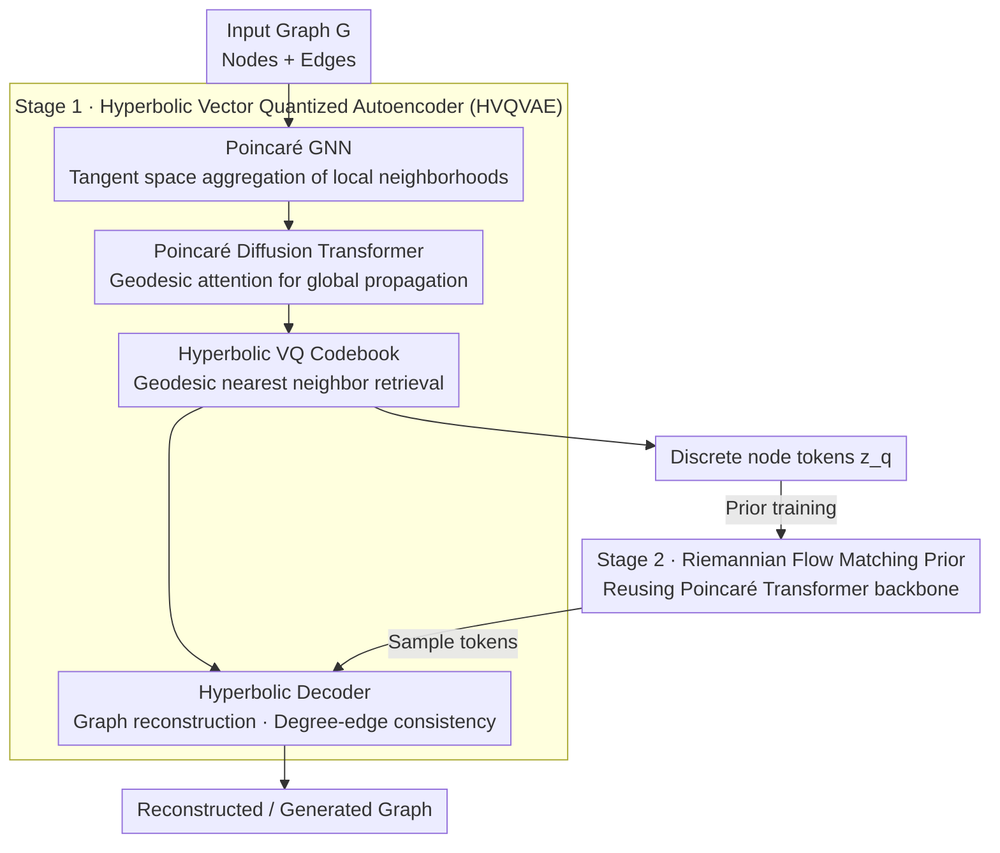

# GGBall: Graph Generative Model on Poincaré Ball

**Conference**: ICLR 2026  
**arXiv**: [2506.07198](https://arxiv.org/abs/2506.07198)  
**Code**: [GitHub](https://github.com/AI4Science-WestlakeU/GGBall)  
**Area**: Graph Generation / Hyperbolic Geometry  
**Keywords**: Hyperbolic space, graph generation, Poincaré ball model, vector quantization, Flow Matching

## TL;DR
The authors propose GGBall, the first graph generative framework entirely based on the Poincaré ball model. By utilizing a Hyperbolic Vector Quantized Autoencoder (HVQVAE) and a Riemannian Flow Matching prior, it achieves SOTA performance in hierarchical and molecular graph generation, reducing the average generation error on hierarchical datasets by 18%.

## Background & Motivation
- **Background**: Graph generation is a core task in fields such as molecular design and material discovery. Existing methods (e.g., DiGress, GDSS) primarily operate in Euclidean space or discrete graph spaces.
- **Limitations of Prior Work**: Euclidean latent spaces are inherently unsuitable for capturing the hierarchical structures and power-law degree distributions of graph data, leading to the distortion of community structures and parent-child relationships.
- **Key Challenge**: There is a geometric mismatch between the compositional, hierarchical nature of graphs and the linear volume growth of Euclidean space.
- **Key Insight**: The exponential volume growth of hyperbolic space is naturally suited for representing hierarchical structures (Gromov's theorem).
- **Core Idea**: Transform the standard Euclidean latent space generation pipeline entirely into hyperbolic space, using node-level latent variables to uniformly represent graph topology.

## Method

### Overall Architecture
GGBall aims to migrate the entire "encoding → quantization → prior → decoding" generation pipeline to the Poincaré ball, allowing the inherent exponential volume growth of hyperbolic geometry to accommodate the hierarchical structures and power-law degree distributions of graphs. The framework follows a two-stage process: The first stage is the Hyperbolic Vector Quantized Autoencoder (HVQVAE), which encodes a graph into a set of discrete node-level tokens on the Poincaré ball—a Poincaré Graph Neural Network first aggregates local neighborhood structures in hyperbolic space, followed by a Poincaré Diffusion Transformer to propagate global dependencies; finally, embeddings are quantized into a learnable hyperbolic codebook and reconstructed by the decoder. The second stage freezes the autoencoder and learns a prior over this discrete latent space using Riemannian Flow Matching, with a backbone that reuses the same Poincaré Transformer. During generation, latent tokens are first sampled from the flow matching prior and then decoded into a graph. The key aspect is staying within the hyperbolic manifold throughout the process, treating edge connectivity as an emergent property of the latent space geometry rather than a separately modeled discrete object.

### Key Designs

**1. Poincaré Graph Neural Network: Migrating message passing entirely to hyperbolic space**

Euclidean GNNs directly perform weighted sums in vector space, but hyperbolic manifolds lack a native addition operation. GGBall utilizes the tangent space as a transition: it first uses the logarithmic map $\log_0^c(\cdot)$ to pull node representations into the tangent space of the origin (a local Euclidean approximation), performs neighborhood aggregation there, and then returns to the manifold via the exponential map $\exp_0^c(\cdot)$. This ensures every operation remains within the Poincaré ball. More crucially, the message function includes a curvature-aware distance modulation $\text{M}(\mathbf{m}_{ij}) = \gamma_{ij} \cdot \mathbf{m}_{ij} + \beta_{ij}$, where the scaling term $\gamma_{ij}$ and bias term $\beta_{ij}$ are functions of the hyperbolic distance $d_c(\mathbf{h}_i, \mathbf{h}_j)$. This means the further apart two nodes are hierarchically, the differently their messages are modulated, allowing the model to encode the strength of hierarchical relationships directly into the representation.

**2. Poincaré Diffusion Transformer: Propagating global structure via geodesic distance**

GNNs are limited to local neighborhoods; global topology relies on Transformers. However, standard dot-product attention uses Euclidean inner products, which breaks geometric consistency in hyperbolic space. GGBall replaces attention scores with a geodesic distance form $\alpha_{ij} \propto \exp(-\tau d_c(\mathbf{q}_i, \mathbf{k}_j))$—the closer the query and key are on the manifold, the higher the score, with temperature $\tau$ controlling sharpness. Aggregation of attended values uses the Möbius gyromidpoint (a hyperbolic version of a weighted midpoint) to ensure results remain on the manifold. This Transformer also serves as the backbone for the Flow Matching prior, incorporating time-step embeddings for temporal modulation.

**3. Hyperbolic Vector Quantized Autoencoder (HVQVAE): Discretizing continuous hyperbolic embeddings**

Continuous latent spaces are difficult to pair with highly expressive priors, so GGBall introduces vector quantization to map node embeddings to a learnable Poincaré codebook $\mathcal{C}$. The quantization rule is modified to a hyperbolic version of nearest neighbor—retrieving the closest codeword based on geodesic distance $\mathbf{z}_q = \arg\min_{\mathbf{c}_j} d_c(\mathbf{z}, \mathbf{c}_j)$. The codebook is initialized via hyperbolic k-means and updated using a Riemannian optimizer. To avoid codebook collapse, it employs a stability mechanism: an expiry threshold detects infrequently hit codewords for replacement, while codewords themselves are updated using the weighted Einstein midpoint (hyperbolic mean) to ensure geometric stability.

### Loss & Training
The first stage jointly trains the autoencoder and the codebook. The total loss $\mathcal{L}_{\text{HVQVAE}} = \lambda_1 \mathcal{L}_{\text{AE}} + \lambda_2 \mathbb{E}[d_c^2(\text{sg}(\mathbf{z}_q), \mathbf{z})] + \lambda_3 \mathbb{E}[d_c^2(\mathbf{z}_q, \text{sg}(\mathbf{z}))]$ consists of three components: the autoencoding term $\mathcal{L}_{\text{AE}}$ (combining reconstruction loss, degree-edge consistency loss, and L2 regularization) and two VQ commitment losses, where L2 distances are replaced by geodesic distances $d_c$ using the stop-gradient operator $\text{sg}(\cdot)$. The second stage freezes the autoencoder and trains the prior using Riemannian Conditional Flow Matching on the discrete latent space, regressing the vector field along geodesic interpolation paths to learn the continuous transport from noise to latent variables on the hyperbolic manifold.

## Key Experimental Results

### Main Results: Abstract Graph Generation

| Method | Community-small Avg↓ | Ego-small Avg↓ | Space |
|------|---------------------|----------------|------|
| GraphVAE | 0.6233 | 0.1167 | Euclidean |
| GDSS | 0.0460 | 0.0173 | Graph Space |
| DiGress | 0.0380 | - | Graph Space |
| HGDM | 0.0240 | 0.0137 | Mixed |
| **GGBall** | **0.0197** | **0.0117** | Hyperbolic |

### Molecular Graph Generation (QM9)

| Method | Validity↑ | Uniqueness↑ | Novelty↑ | V.U.N↑ |
|------|-----------|-------------|----------|--------|
| DiGress | 99.00 | 96.34 | 32.51 | 31.04 |
| CatFlow | 98.47 | 97.58 | 65.62 | 63.02 |
| **GGBall** | **98.33** | **96.38** | **93.77** | **88.45** |

### Key Findings
- HVQVAE significantly improves chemical validity (95.18% → 99.14%) and edge accuracy compared to Hyperbolic Autoencoders (HAE).
- The hyperbolic encoder achieves 4× lower MMD error in degree distribution maintenance compared to Euclidean baselines.
- The novelty of 93.77% far exceeds DiGress's 32.51%, indicating the superior expressive power of hyperbolic space.

## Highlights & Insights
- First graph generative framework entirely on the Poincaré ball, unifying the full pipeline of encoding, quantization, prior, and decoding.
- Uses node-level latent variables to uniformly represent graph topology, treating edge connectivity as an emergent property of latent geometry.
- Achieves the highest V.U.N score (a comprehensive metric of Validity, Uniqueness, and Novelty) on the QM9 dataset.

## Limitations & Future Work
- Autoregressive priors performed worse than Flow Matching in initial experiments and require further exploration.
- Validity on molecular graphs is slightly lower than DiGress (98.33 vs 99.00); the integration of fine-grained chemical constraints needs to be strengthened.
- Computational overhead: Hyperbolic operations are more complex than standard Euclidean ones.

## Related Work & Insights
- **vs HGDM**: HGDM only performs edge denoising on Poincaré embeddings and still operates in discrete graph space; GGBall resides entirely in the hyperbolic latent space.
- **vs DiGress**: DiGress performs iterative denoising in graph space and is limited by Euclidean geometry; GGBall leverages hyperbolic variables to decouple hierarchical structures.

## Rating
- Novelty: ⭐⭐⭐⭐⭐ First fully hyperbolic graph generative framework, hyperbolizing everything from GNNs and Transformers to VQ and FM.
- Experimental Thoroughness: ⭐⭐⭐⭐ Covers abstract and molecular graphs with thorough ablation, though lacks large-scale graph data.
- Writing Quality: ⭐⭐⭐⭐ Mathematically rigorous and clear in process.
- Value: ⭐⭐⭐⭐ Opens new directions for non-Euclidean geometry in generative models.

<!-- RELATED:START -->

**Conference**: ICLR 2026  
**Related Papers**:
- [2506.07198] GGBall: Graph Generative Model on Poincaré Ball (Ours)
- [2302.00761] DiGress: Discrete Denoising diffusion for graph generation
- [2402.14321] Hyperbolic Graph Diffusion Models (HGDM)

<!-- RELATED:END -->

## Related Papers

- [\[ICLR 2026\] PolyGraph Discrepancy: a classifier-based metric for graph generation](polygraph_discrepancy_a_classifier-based_metric_for_graph_generation.md)
- [\[ICLR 2026\] Verification of the Implicit World Model in a Generative Model via Adversarial Sequences](verification_of_the_implicit_world_model_in_a_generative_model_via_adversarial_s.md)
- [\[ICLR 2026\] HOG-Diff: Higher-Order Guided Diffusion for Graph Generation](hog-diff_higher-order_guided_diffusion_for_graph_generation.md)
- [\[ICLR 2026\] Continuously Augmented Discrete Diffusion model for Categorical Generative Modeling](continuously_augmented_discrete_diffusion_model_for_categorical_generative_model.md)
- [\[ICLR 2026\] GenCP: Towards Generative Modeling Paradigm of Coupled Physics](gencp_towards_generative_modeling_paradigm_of_coupled_physics.md)

<!-- RELATED:END -->
